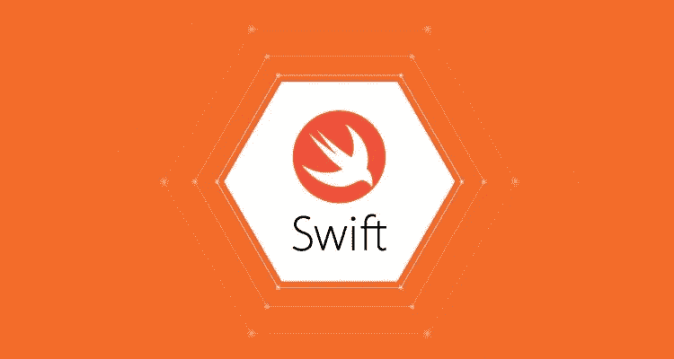
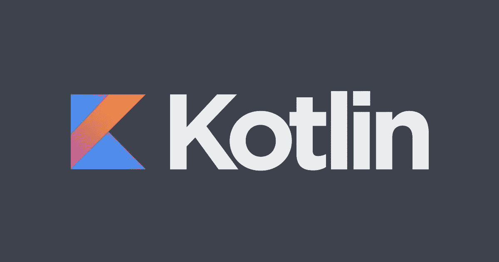
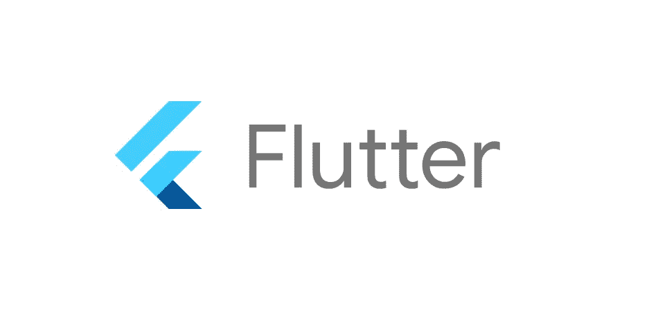
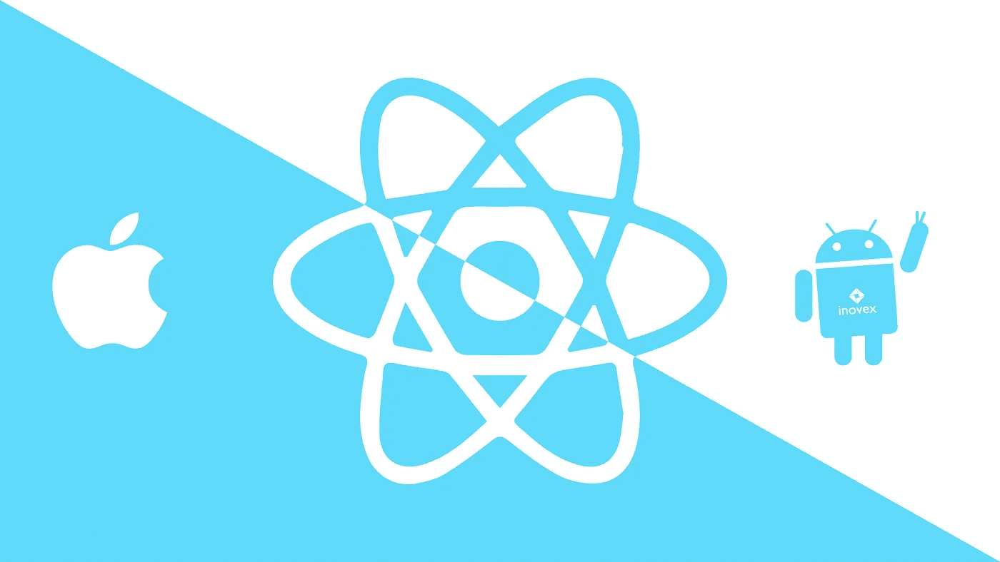

# 2021 年移动应用的 4 大编程语言和框架

> 原文：<https://medium.com/analytics-vidhya/top-4-programming-languages-and-frameworks-for-mobile-apps-in-2021-e181a78e8ac4?source=collection_archive---------5----------------------->

拉胡尔·查克拉博蒂在 Unsplash 上的照片

> 大家都想要的！

本文将带你了解 2021 年主导移动应用开发领域的前四大编程语言和框架。

这些**主导的 4 种移动应用程序编程语言和框架**将按照 **2 个因素**进行排名；

1.即使你是一个完全的初学者，你也需要花费时间来学习这门语言。2
2。2021 年，这些编程语言和框架的**需求和平均工资**是多少。

> 如果你想知道列表和最后的重要建议，请继续阅读。

说了这么多，让我们直接开始吧！

**这是清单**

# 第四个

# 迅速发生的

作者图片

这种**开源编程语言**用于开发大量服务于**苹果软件生态系统的移动应用。**

这种**初学者友好编程语言**是由苹果公司开发的，苹果商店(iOS 和 Mac OS)中超过一半的应用程序都是使用 **Swift** 开发的。

鉴于上述原因，苹果公司的支持显而易见。

像苹果、Slack 这样的公司利用 Swift 作为他们开发移动应用程序的编程语言。

然而，这限制了它在某些领域的应用。

最终，Swift 是 2021 年移动应用开发需要学习的一门令人惊叹的编程语言。

在美国，一名 Swift 开发人员的平均年薪约为 107000 美元。

# 第三个

# 科特林

作者图片

虽然， **Java 8** 可以用来开发 **Android 应用**，但大多数开发者更喜欢用 **Kotlin** 来开发 **Android 原生应用**，可能是因为它对初学者非常友好。

这种基于 JVM 的语言，最初由 **Jet brains** 开发，现在由 **Google** 认可，支持所有的 **Java 库。**

因此，使用 Kotlin 开发**后端服务**也将成为趋势。

使用 Kotlin 的组织有:
#**Pinterest
# Cousera 等等。**

更有甚者，大多数谷歌应用程序，如 YouTube、Google drive 等都是使用 Kotlin 开发的。

因此，一个只有几年经验的 Kotlin 开发人员在美国的平均年薪约为 14 万美元。

相关搜索

 [## 2021 年最值得学习的 7 项技术

### 随着我们进入新的十年，令人惊叹的技术正在开发，并积极融入我们的日常生活…

medium.com](/analytics-vidhya/top-7-technologies-to-learn-in-2021-9c122b631672)  [## 2021 年你需要学习的 5 大编程语言

### 2021 年你需要学习的 5 大编程语言！！！

medium.com](/analytics-vidhya/top-5-programming-languages-you-need-to-learn-in-2021-66cb4efa6de1)  [## 2021 年薪酬最高的五大技术工作| 2021 年薪酬最高的 IT 工作

### 你想知道 2021 年最性感、最受欢迎、薪酬最高的技术工作吗？

medium.com](/analytics-vidhya/top-5-highest-paying-tech-jobs-in-2021-highest-paying-it-jobs-in-2021-518462d04bd4)  [## 2021 年 7 大认证| 2021 年薪酬最高的 IT 认证

### 2021 年 7 大认证！拥有这些中的任何一个，你在任何地方都会受到欢迎。

medium.com](/analytics-vidhya/top-7-certifications-in-2021-highest-paying-it-certifications-in-2021-9c7f40f40f57)  [## 我从来不明白反应组件

### 直到有人这样解释

medium.com](/analytics-vidhya/i-never-understood-react-components-f7916a24e549) 

下一个！

# 第二个

# 摆动

作者图片

Flutter 是**发展最快的**移动应用开发**框架**，用于从单一代码库构建**跨**移动、网络和桌面的原生编译应用**。**

它由 **Dart** 驱动，Dart 是一种**客户端优化的、面向对象的**编程语言，用于在多个平台上构建应用。

它是**开源**，由**谷歌**于 2018 年开发。

Flutter 非常容易学习和快速开发。

它有一个**自定义用户界面**和热重装功能。

它是游戏化友好的，而 flutter 应用程序表现出的高性能是非常出色的。

它的本机性能非常流畅，即使它不是本机开发的。

像**谷歌广告应用，阿里巴巴**的仙寓应用等等，都是用 Flutter 开发的。

一个拥有丰富经验的 flutter 开发者在美国的平均年薪是 13 万美元。

最后，**2021 年移动应用开发最热门的编程语言或框架是**.....🥁🥁🥁

*等着吧！*

# 第一名

# 反应自然

作者图片

**React Native** 是一个用 **JavaScript** 编写的编程框架，开发者用它来为 iOS**和 Android**平台构建完整的原生移动应用。

它是由**脸书**在 2013 年开发的。
它对初学者非常友好，**开源**，并且有一个非常庞大的**活跃的**社区。

用 React native 开发减少了花费在构建项目上的时间，同时 T2 也节省了资金。

React native apps 在其自动化中使用了**图形处理单元(GPC)而不是中央处理单元(CPU)** ，使其**非常**快。

它的**灵活性**几乎是无限的，使得升级和更新移动应用程序更加容易。

它的表现几乎和本地移动应用**一样，并且拥有令人敬畏的热重新加载功能。**

这些是 React native 被大公司使用的一些主要原因，比如:
**# Instagram
#沃尔玛
#脸书
# Skype
#特斯拉
# Airbnb
#阿迪达斯 Glitch，等等。**

一个拥有丰富经验的 React 本地开发人员在美国的平均年薪是 172800 美元

# 对开发人员(主要是年轻开发人员)的建议

## 我们所面临的。

多库坎·沙欣在 Unsplash 上拍摄的照片

进入**学习过程**，有如此多的资源和工具可供选择和学习，我们不可避免地变得不知所措。
要么是因为我们**不知道**选择什么，要么是我们选择了，结果**失去兴趣**然后跳到下一个，使得**没有前进**或者犯了一个**的错误**可能学习了一个**过时的**或**逐渐减少或衰退的**资源。

## 选择最佳语言

照片由 Unsplash 上的 Clay Banks 拍摄

所以，为了从这些语言或框架中进行选择，你必须有一个**目标**。

如果你选择**而没有目标**，你可能最终会从一种语言跳到另一种语言而没有任何进步。

1.  如果你的目标是开发令人惊叹的苹果移动应用，你可以选择 Swift。

2.如果想进入 Android 原生 app 开发，可以选择 **Kotlin** 。

3.如果你想进入混合移动应用开发，你可以选择 **JavaScript (React native)或者 Dart (Flutter)**

# 结论

好了，我们知道了！
**那些是 2021 年移动 app 的 4 大编程语言和框架！**
希望这对你有帮助。感谢您的参与，祝您好运！

Agbejule Kehinde 赞成。