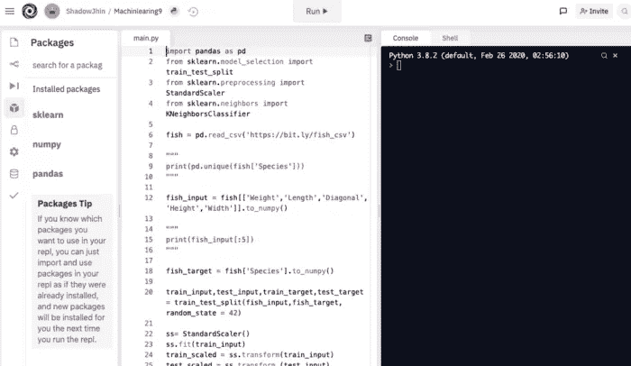

# 机器学习和深度学习的 4 大 Python IDEs

> 原文：<https://medium.com/analytics-vidhya/top-4-python-ides-89f41ca313cb?source=collection_archive---------1----------------------->

## 本文将为初学者介绍 4 种顶级的 Python 集成开发环境。

由 Kelly Seo 用 Adobe Photoshop 创建的照片

你知道 Python 非常有用，很容易快速开发一个程序。许多年轻人正在学习编程语言，以成为数据科学家和开发人员。如果你是 Python 初学者，第一次选择 IDE(集成开发环境)会很迷茫。很多开发环境很方便，有时候也不方便。我们来谈谈 4 大 Python IDEs。

# 1.Google Colab

Google Colab

我相信你知道 Google Colab。它是谷歌合作服务的简称。Google Colab 由 Google Support 提供，是基于 Google Cloud 的免费 Jupyter 笔记本开发环境。你可以使用 Python 并在浏览器中运行它。此外，您还可以通过平板电脑完成任务。如果你的电脑没有 GPU 或者规格不高，我建议你使用它。

## 赞成的意见

*   它不一定要下载 Tensorflow，Keras，熊猫。
*   这是一个很好的虚拟 IDE，适合学生学习数据科学和 AI。
*   你可以在 GitHub 上轻松上传你的项目。
*   Colab 对机器学习和深度学习很有用。
*   你不需要安装任何库。

## 骗局

*   上传一个文件需要时间(如果 CSV 很大的话)。
*   有必要用你处理过的张量流来调整版本。
*   应该连接互联网。

# 2.回复它

雷普利特

当我在寻找使用 Python 和 Galaxy tab 的最佳方式时，我发现了 Python IDE“repl . it ”,这是在一个外国开发者的 YouTube 频道上找到的。它提供了 50 种语言，如 Java、C++和各种编程语言。好处是可以在 Repl.it 中运行任何语言。

## 赞成的意见

*   它可以很容易地在平板电脑上使用。
*   用户能够练习任何编程语言。
*   提供运行和托管服务。
*   GitHub 已链接。

## 骗局

*   应该连接互联网。
*   执行有点慢。
*   有时，库无法下载。
*   Scikit-learn、Tensorflow 和 Pandas 库必须一直从新文件下载。

# 3.Jupyter 笔记本

Jupyter 笔记本

Jupyter Notebook 是一个允许用户在 web 浏览器上运行 Python 解释器的环境。此外，它还是将代码和文档作为单个文件编写的有效环境。我经常用它来做机器学习项目。

## 赞成的意见

*   它很容易用来分析数据。
*   用户可以很容易地检查他们写的代码。
*   是继 Google Colab 之后的一个不错的 IDE。
*   它适用于 iPad 和 Galaxy Tab。

## 骗局

*   Jupyter 笔记本的安装有点复杂。最好的方法是安装在 Anaconda 上。
*   它必须连接到主机。
*   GitHub 没有链接。
*   Tensorflow 可以单独下载。
*   应该安装 IDE。

## 4.皮查姆

皮查姆

最后，PyCharm 是帮助用户轻松开发程序的集成开发环境。它比数据分析更接近开发，因为它对开发 GUI(游戏或实用程序)很有用。你可以使用 Jupyter Notebook 或者 Colab 来创建一个可视化项目，但是这个开发环境是为了创建一个平台。如果你想成为一名开发人员，那么你应该使用 Python IDE。

## 赞成的意见

*   这对开发一个 GUI 很有帮助。
*   免费使用社区版就够了。
*   使用 PyCharm 也可以进行 Web 开发。
*   用户可以轻松下载软件包。
*   方便管理 Python 文件和三元管理。

## 骗局

*   PyCharm 不适用于平板电脑。
*   应该安装了。
*   专业版有些贵。
*   社区版本仅用于 python 开发，不允许使用其他编程语言。
*   对于初学者来说，设置虚拟环境变量可能很复杂。

## 收场白

在集成开发环境中，Google Colab 和 Jupyter Notebook 对我分析数据和开发 GUI 很有用。此外，对我来说，检查脚本语言并不复杂。

你最喜欢的 Python IDE 是什么？如果你想分享你最喜欢的 IDE 或者关注我，请点击下面的两个链接。我期待着收到您的积极回应。

中:[https://medium.com/@annsyj94](/@annsyj94)

GitHub:【https://github.com/annsyj94 