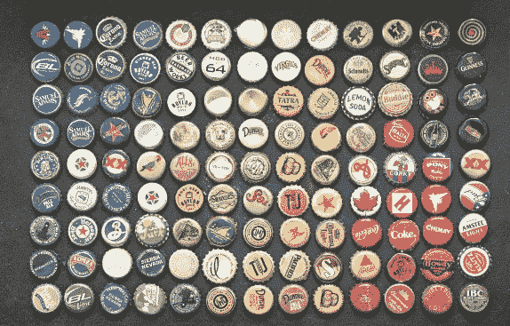
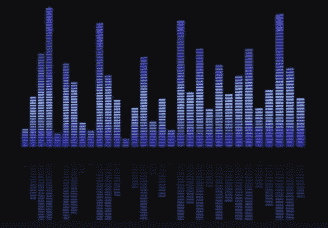

# 值得尝试的 5 大数据科学项目—第 1 部分

> 原文：<https://medium.com/analytics-vidhya/top-5-data-science-projects-to-attempt-part-1-793529bdcd3c?source=collection_archive---------23----------------------->

*熟能生巧*

这篇文章是基于我在过去 12 个月中完成的有趣的项目，这些项目也极大地帮助了我的发展。

当读回来的时候，我意识到我要说的比我最初打算的要多，所以这将被分成 5 个部分。

# 1.预测建模

在有趣的 DS 项目上测试您的智慧的一个好地方是建立一个预测模型。

原因是这将考虑模型构建周期的全部范围:

> **数据采集**

DS 项目倾向于 80%的数据收集，20%的建模。根据你决定在哪里关注你的项目，从网上下载一个数据集(kaggle.com 总是一个很好的起点)可以让你跳过 20%的建模阶段。

> **数据清理**

任何 DS 项目的一个极其重要的部分是清理数据。

一定要检查缺失的数据，问问自己怎么处理？

是否有任何数据看起来像噪音？

是否需要删除任何功能？

> **探索性数据分析**

你有目标变量吗？这是有人监督还是无人监督的问题？也许两者都有？

你有分类的或连续的数据吗？

您需要对分类数据使用一次性编码吗？

我的数值变量的度量尺度是什么。它们有什么不同？

每个变量与目标变量的关系是什么？

这种相关性说明了什么有趣的事情吗？

检查特征变量中的异常值。它们会如何影响你的模型的性能？它们需要被移除吗？

> **特征工程**

需要添加或创建功能吗？

试着考虑最小/最大/平均比率，以构建你的特征。如果您有一些零售公司的客户帐户数据，并且有两个输入变量:

注册日期&购买日期

可以基于这些变量构建的特性如下

—自第一次购买以来的天数

—自上次购买以来的天数

—自帐户创建以来的天数

—每天最大购买量

—每日最小采购量等。

这只是让果汁流动的开始。

潜在特征的列表是无穷无尽的，但是对于在模型中获得强大的性能是极其重要的

> **数据标准化**

不同的特征具有相同的比例或单位是很少见的。例如，考虑每个学校的学生人数。可能在 50-2000 之间。

现在考虑另一个特性，即每个学生每年的出勤分钟数，以秒为单位。第二个要素的值可能在 500，000 左右。

这两个都是数字特征，可以为我们的目标变量提供见解，但设置在完全不同的尺度上。较大的规模往往会占主导地位，超过较小的规模，并可能扭曲结果。

尤其是如果离群值没有得到很好的处理。

使用 standardscaler/minmaxscaler 等缩放器将数据从原始范围重新缩放到 0 到 1 之间的范围，同时保持相同的基本趋势。

这是预处理步骤中经常被忽略的一步，实际上对模型性能有着巨大的影响。

> **阶层失衡**

如果你正在处理一个监督学习的问题，你应该能够在你喜欢的编程语言的一行中查看你的数据的分割。

你甚至可能倾向于从对问题的一般理解中知道分割会是什么样的。诸如欺诈检测和异常检测之类的问题通常具有主要的类别不平衡。

如果您对数据中的不均匀分割视图进行建模，它通常只会预测数据量较大的类。你的模型会泛化得很厉害，实际上毫无用处。

由于班级失衡，你所有的努力都付之东流了。

有两种主要的方法来解决这个问题，Python/R 提供了一些包来解决这个问题，所以这可以用一两行代码来解决。

**—过采样/欠采样**

通过过采样或欠采样，可以将训练数据恢复到 1:1 或 50/50 的比例。

以 100，000 次观察的 99:1 的类不平衡为例:

这里，我将选择对 1000 个异常进行过采样，得到 99，000/99，000 的分割。

现在，我的模型有一个均匀的比率，将了解数据的真实趋势，而不会因为不平衡的数据集而偏向某一类

**—过重/欠重**

另一种常见的方法是添加一个与其类别频率成反比的权重。

该模型将有效地对较小类上的分类错误进行更大的惩罚。

想象一下你正在手工给液体贴标签。

一个是毒药，一个是药。

你知道虽然有更少的毒药，但不正确的标签会是一个严重的错误。你不想忽略这门课。

然后你做了。

现在因为你知道你真的不想犯那个错误，但是你还是犯了，所以你加倍惩罚自己，这样你就不会再犯同样的错误了！

人们会争论采样过多/过少还是过重/过轻，但是如果你有阶级不平衡，确保你至少做其中一个。

如果可以的话，尝试两种方法，看看哪种效果最好

> **培训/测试/验证分割**

这是流程中显而易见的一部分，但还是让我们来分解一下。

**训练数据**是构建模型的基础。这是模型学习所有趋势的来源。

数据集用于训练数据的良好比例是 70%，但这并不是一成不变的。

**测试数据**是我们了解我们的模型是否表现良好的地方。它能很好地概括以前从未见过的数据吗？

在这里，您将获得所有的特征变量减去它们的目标变量，并通过模型进行预测。

当预测结果通过模型输出时，您可以将它们与实际结果进行对比，以查看模型的执行情况。

其他推荐的测试是在你的模型中放入一个“超出时间&超出范围”的数据集，看看它的表现如何。

也许数据集运行到 2020 年底。考虑为 2020 年 1 月 1 日之前的时间线建立模型。

一旦模型建立起来，你现在就可以从 2020 年开始进行所有的观察，看看它们是如何表现的，以便了解你的模型如何推广到一个“过时”的样本。

这是验证集的另一种形式。

> **决定使用哪种型号**

事实上，这一部分值得单独写一篇文章，所以我就不赘述了，但是不同的问题需要不同的解决方案。

了解哪种类型的模型更适合您的问题很重要，但更重要的是对回答您的问题的数据持开放态度。

随机森林可以很好地处理大量的特征变量，但是简单的决策树对用户非常友好。

神经网络表现出色，但很难解码，计算量也很大。

当试图确定使用哪个模型时，问问自己:

谁需要查看我的结果？

我需要解释我的模型的决策吗？

是否需要培训其他人了解我的模型是如何工作的？

我只需要性能吗？

我的计算能力有限制吗？

不管这些答案，我强烈推荐你的主模型，但也有一个挑战者模型。

你可能认为一个模型是完美的解决方案，直到你运行另一个模型，看到它优于。

接受不正确的观点，并愿意接受数据告诉你的东西。但最重要的是，考虑生产模型的所有权衡。

重要的不仅仅是表现。

> **结果分析**

那么我们有什么？

为了了解模型在监督学习问题中的表现，构建一个混淆矩阵，使预测值与实际值发生冲突。

在这里，重要的是不要专注于准确性。同样，关于欺诈分析，如果我预测每笔在线交易都是无欺诈的，我将拥有一个准确率为 99.99%的模型，但实际上预测欺诈非常糟糕。

关注精确度、召回率和 F1 分数。

精确度是正确的正面预测的百分比。

**精度** **= *(真阳性)/(真阳性+假阳性)***

假设你最喜欢的流媒体平台为你推荐了 10 部电影，你想看其中的 9 部。精确度是 90%。

召回是您的模型捕获的实际阳性案例的百分比。

**回忆** **= *(真阳性)/(真阳性+假阴性)***

考虑预测诊断。抓住真正的阳性病例非常重要，因为一个错误的诊断可能会影响一生。

重要的是权衡您的个人问题，以确定精度或回忆是否对您的模型性能具有更大的权重。

对于流媒体问题，可能有 1000 部你想看的电影，所以模型不需要回忆所有的电影来满足你，只需要在它向你建议的电影中非常精确。

如果两者对您的解决方案同等重要，F1 分数将采用综合方法。

> **迭代**

建模过程是非常循环的，并且不断发展。把你从第一次跑步中学到的东西带回去，回到第一步。

也许需要添加更多的功能。

也许丢失的数据需要更好地处理。

也许模型的类型需要改变或者参数需要调整。

全部做。

对于这样的技术过程，反复试验有时仍然是最好的方法。

祝你好运！

