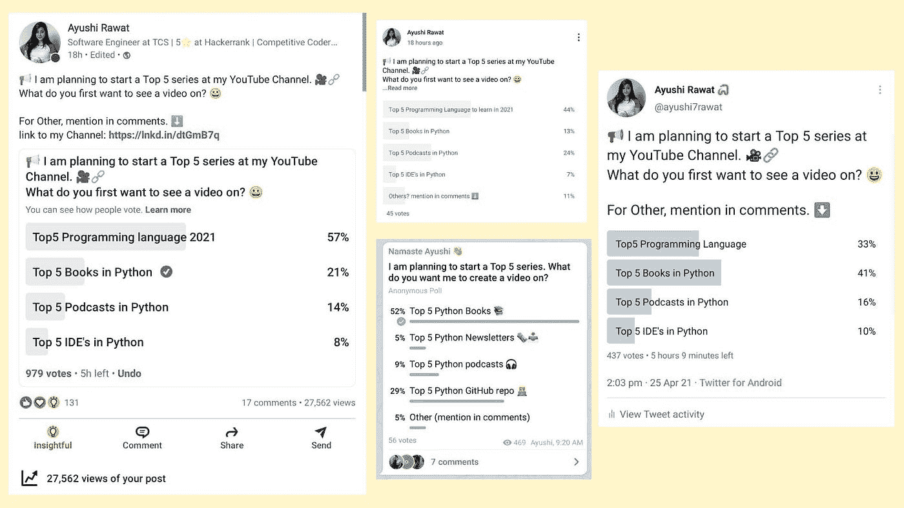

# 2021 年找工作要学的前 5 种语言

> 原文：<https://medium.com/analytics-vidhya/top-5-languages-to-learn-to-get-a-job-in-2021-8003fcba1cf5?source=collection_archive---------10----------------------->

你好啊。

我最近进行了一项民意调查，问你们大家希望在 LinkedIn、Twitter、my Telegram Channel 等各种平台上看到我的前 5 个视频系列中的哪个视频。根据民意调查，一天之内我就收到了将近 1500 份回复。2021 年要学习的前 5 本 python 书籍和语言拥有最高的投票数。经过编译，如果大家对我的 Top 5 视频系列有什么视频建议。放下你的评论。

你正在寻找校园安置或想换工作，或想在 IT 行业取得成功，那么你知道如何编码，以加强你的职业阶梯。不是计算机专业出身的？没问题，你仍然可以学习如何编码，如何在简历中展示项目，如何被录用。

市场上有如此多的编程语言，你可能会有点不知所措，难以决定哪一种适合你。因此，在这篇排名前 5 的系列文章中，我通过收集来自 GitHub、stack overflow 开发者调查和各种在线调查的数据，为您整理了 2021 年排名前 5 的编程语言

*   就业市场，
*   自由职业机会
*   易于学习和资源可用
*   也是应用最广泛的，所以请从头到尾阅读这篇文章。

[查看 python 的终极资源库](https://github.com/ayushi7rawat/Ultimate-Python-Resource-Hub)。发现有用就掉颗星！有什么要补充的吗？开个 PR 就一样了！

可以参考我的 YouTube 视频教程更好的理解。

话虽如此，*让我们开始吧！*

# 5.C++

*   第五，我们有 C++，它是 C 的超集，开发它是为了支持面向对象的编程
*   它是一种非常古老和低级的编程语言，但由于它的性能和可靠性，它在列表中名列前茅。
*   多年来，它一直很受欢迎。
*   C++功能强大，用 C++开发的应用程序

I)土坯

ii)甲骨文

iii)用于后端的 Microsoft office

*   对于打算在印度市场就业的学生来说，它仍然是重中之重，许多 It 行业的开发人员都是从学习 C++开始的。
*   它可用于开发:

I)操作系统

ii)浏览器

iii)和游戏

# 4.C#:

*   *C#* (C-Sharp)是微软开发的一种编程语言。
*   它运行在。NET 框架。
*   *C#* 用于开发

I)网络应用程序，

ii)桌面应用程序，

iii)移动应用程序，

*   iv)实用程序和虚拟现实游戏等等。
*   与 c#一起使用的流行框架有

我)。网

ii) Xamarin

# 3.Java:

*   Java 是一种开源的、基于类的、面向对象的编程语言，它被设计成具有尽可能少的实现依赖性
*   Java 是

I)坚固，

ii)安全，

iii)分布式和

iv)高性能。

*   它广泛应用于服务型和产品型公司，增加了被雇佣的机会。
*   它支持如下框架

一)春天

ii)冬眠

iii) Guice(谷歌 Guice)

*   它很容易学习，并且有强大的社区支持。

# 2.JavaScript:

*   Js 是 web 开发中最流行和最常用的语言。
*   JavaScript 被广泛用于为网页创建响应性的交互式元素，增强用户体验。
*   世界上有超过数十亿个网站，其中 95%都使用 JavaScript
*   最流行的基于 JavaScriptare 的框架有:

I)节点 js

ii)角度 js

iii)反应 js

iv) Vue js

*   Js 有一个巨大的市场，为自由职业者打开了大门。

# 1.Python:

*   Python 是一种高级语言，非常容易学习。
*   它是发展最快的语言，并得到了开发者社区的大力支持
*   它界面友好，用途广泛

I)网站开发。一些最著名的框架是 Django、Flask

ii)它也用于交互式游戏的开发

iii)机器学习和人工智能

iv)数据科学和数据可视化

v)桌面图形用户界面

vi)和网页抓取应用程序

*   它有一个你想做的任何事情的库，使它成为最受欢迎的语言。

就这样，结束了！我希望这篇文章对你有用！我写关于职业、博客、编程和生产力的文章，如果你对此感兴趣，请与你的朋友和关系分享这篇文章。你也可以订阅我的时事通讯，在我每次写东西的时候得到更新！

谢谢你的阅读，如果你已经到目前为止，请喜欢这篇文章，它会鼓励我写更多这样的文章。请分享您的宝贵建议，感谢您的真诚反馈！

我强烈建议你去看看 YouTube 上的视频，别忘了订阅我的频道。我很乐意在 [Twitter](https://twitter.com/ayushi7rawat) | [LinkedIn](https://www.linkedin.com/in/ayushi7rawat/) 与你联系。

你绝对应该看看我的其他博客:

*   [Python 3.9:你需要知道的一切](https://ayushirawat.com/python-39-all-you-need-to-know)
*   [终极 Python 资源中心](https://ayushirawat.com/the-ultimate-python-resource-hub)
*   [GitHub CLI 1.0:你需要知道的一切](https://ayushirawat.com/github-cli-10-all-you-need-to-know)
*   [成为更好的程序员](https://ayushirawat.com/become-a-better-programmer)
*   [如何制作自己的谷歌 Chrome 扩展](https://ayushirawat.com/how-to-make-your-own-google-chrome-extension-1)
*   [使用 Python 从任何 pdf 创建您自己的有声读物](https://ayushirawat.com/create-your-own-audiobook-from-any-pdf-with-python)
*   [你很重要&你的心理健康也很重要！](https://ayushirawat.com/you-are-important-and-so-is-your-mental-health)

在我的下一篇博客文章中再见，保重！！