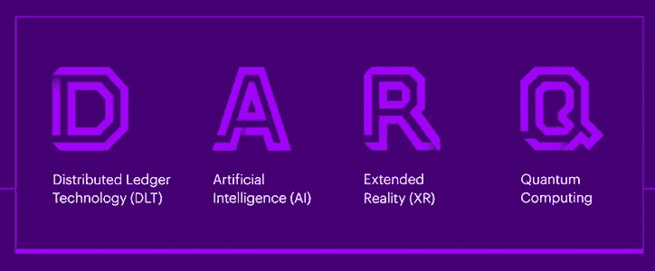

# 2021 年最值得学习的 7 项技术

> 原文：<https://medium.com/analytics-vidhya/top-7-technologies-to-learn-in-2021-9c122b631672?source=collection_archive---------20----------------------->

拉蒙·萨利内罗在 [Unsplash](https://unsplash.com?utm_source=medium&utm_medium=referral) 上的照片

随着我们进入新的十年，令人惊叹的技术正在开发，并积极融入我们的日常生活。
这篇文章将为你提供 2021 年需要学习的 7 项最强大的革命性技术。

这些技术将根据它们的**用途**、**技能集**以及可能的一些**统计报告**来描述。

敬请期待第一名！🔥🔥🔥

我很高兴

你感到兴奋和准备好了吗？
太好了！
事不宜迟，让我们开始吧！

**这是清单**

# **数字 7**

# 量子计算

迈克尔·泽兹奇在 [Unsplash](https://unsplash.com?utm_source=medium&utm_medium=referral) 上拍摄的照片

这种形式的计算利用了量子现象，如叠加和量子纠缠。
它还与防止冠状病毒的传播和创造潜在的疫苗有关，因为它能够轻松地监控、**查询、**分析和**处理数据**而不管其来源。

对于欺诈检测和高频交易，量子计算机现在比普通计算机快几千倍

像**微软**、 **AWS** 、**霍尼韦尔**、**谷歌**和许多其他组织现在都参与了**量子计算**领域的创新。

要开始从事量子计算，你需要有以下方面的经验:
#机器学习
#量子力学
#概率
#线性代数和
#信息理论

到 2029 年，全球量子计算市场的收入预计将超过 25 亿美元。

# **第六号**

# 达尔克

作者图片

该技术由**分布式账本技术、人工智能、扩展现实和量子计算融合而成。**

介绍 darq 的埃森哲认为，这些技术的结合将对整个技术产生巨大的影响。

这是一项新兴技术，几个主要行业都在关注它

它现在主要面向医疗保健行业，降低护理成本、提高劳动生产率以及为消费者和合作伙伴提供更好的体验是**的积极目标。**

由于这项技术目前还处于发展阶段，只有少数组织开始利用它。
要进入 **Darq** ，你需要与它的每一项贡献技术相关的技能，比如:
#量子计算、
#人工智能、
#DLT 和
# XR。

# **数字 5**

# 网络安全

作者图片

据**网络犯罪杂志**报道，预计到 2021 年，全球将花费**6 万亿美元**用于名为网络安全的技术。

该统计报告显示，对适当的网络安全的需求如此之高，主要是因为它将在很长一段时间内成为许多组织的主要关注点。

原因是:
**#保护小型组织免受网络攻击将会越来越受到重视
#防止访问机密病历的需求将会非常大
#保护远程员工的身份和设备是另一个重要原因。**

这个行业的一些主要参与者有:
**#思科
# Fortinet
#微软**

网络安全入门，需要的技能有:
**#恶意软件分析
#编码技能
# IT 与网络基础知识
#云安全技能**

# 第四个

# 增强、虚拟和扩展现实

照片由[乌列尔·索伯兰斯](https://unsplash.com/@soberanes?utm_source=medium&utm_medium=referral)在 [Unsplash](https://unsplash.com?utm_source=medium&utm_medium=referral) 拍摄

这项令人惊叹的技术使帮助医疗专业人员和眼镜商进行视力测试的模拟训练成为可能，在医疗保健领域发挥了重要作用。
交互性在很大程度上得到了改善，在教育领域发挥着巨大的作用。

**到 2021 年，虚拟现实视频市场预计将达到 29 亿美元。
此外，VR 游戏市场预计在 2021 年达到 20 亿美元。**

微软、Snap 和许多其他公司都是致力于 AR 和 VR 技术的大公司。

需要的**技能**有:
**# AR 和 VR 维护支持
#软件开发
#设计/图形和硬件工程** *这些技能是在这个部门工作所需要的。*

# 第三个

# 即服务

作者图片

人们对云服务有很高的期望，云服务可以提供更多的服务，使创新或技术，如人工智能和机器人技术，可以为每个企业所用。

**无服务器计算**备受关注，因为它让用户有机会专注于主要项目，而无需承受管理服务器的全部压力

**混合云**由于其**易于控制、安全选项和速度，也被认为会显示出巨大的增长。**

这种**前沿创新**让每个人都可以用**很少或没有投资**所有这些都要感谢**像微软、谷歌、亚马逊和其他组织这样的公司。**

云计算所需的**技能**包括:
**#使用不同的云计算平台
#使用数据库领域
#使用编程语言
#使用存储等。**

**相关搜索**

 [## 2021 年薪酬最高的五大技术工作| 2021 年薪酬最高的 IT 工作

### 你想知道 2021 年最性感、最受欢迎、薪酬最高的技术工作吗？

favouragbejule.medium.com](https://favouragbejule.medium.com/top-5-highest-paying-tech-jobs-in-2021-highest-paying-it-jobs-in-2021-518462d04bd4)  [## 2021 年你需要学习的 5 大编程语言

### 2021 年你需要学习的 5 大编程语言！！！

medium.com](/analytics-vidhya/top-5-programming-languages-you-need-to-learn-in-2021-66cb4efa6de1) 

下一个！

# 第二个

# 自动化

作者图片

自动化确保了人力成本的降低。机器人设备有望为老年人提供友好的关系或陪伴。

人们对无人机被纳入食品杂货、药物等商品的交付抱有很高的期望。

从事这项创新的一些组织有:
# **霍尼韦尔**
# **西门子**
# **ABB** 等

**要进入自动化领域:** #需要对**配置管理软件**的相关概念有广泛的了解。
#你必须拥有**编程和脚本技能。**
#你得了解**测试工具概念**等等。

**最后 2021 年最热门的技术是......**。🥁🥁🥁

# 第一名

# 人工智能

作者图片

这项技术在过去几年里发展迅速，并且每天都在发展。

人工智能将被企业用来发现客户习惯的变化模式，以及发现他们可以满意的各种方式。

**人工智能**正在帮助解释和理解产生的大量内容或数据。

它还分析互动，以建立潜在的联系和观点

由于人工智能，**机器学习算法**将变得更加明智，并执行更加智能和复杂的操作

**人工智能**将有助于预测医院等服务的需求，并允许当局在资源利用方面做出更好的选择。

**到 2021 年，全球人工智能支出预计将达到 576 亿美元**

这个领域需要的技能有:
**#编程语言
#机器学习算法
#概率
#线性代数
#大数据等**

给你更多

 [## 2021 年 7 大认证| 2021 年薪酬最高的 IT 认证

### 2021 年 7 大认证！拥有这些中的任何一个，你在任何地方都会受到欢迎。

medium.com](/analytics-vidhya/top-7-certifications-in-2021-highest-paying-it-certifications-in-2021-9c7f40f40f57)  [## 2021 年移动应用的 4 大编程语言和框架

### 大家都想要的！

medium.com](/analytics-vidhya/top-4-programming-languages-and-frameworks-for-mobile-apps-in-2021-e181a78e8ac4)  [## 我从来不明白反应组件

### 直到有人这样解释

medium.com](/analytics-vidhya/i-never-understood-react-components-f7916a24e549) 

# 结论

这些是 2021 年最需要学习的 7 项技术

你认为这份名单充满了惊人的事实吗？

关于这个话题，你的首选列表是什么？

**请在回复部分留下您的答案！感谢您的宝贵时间！
祝好运！**

别忘了留下一些…👏👏👏