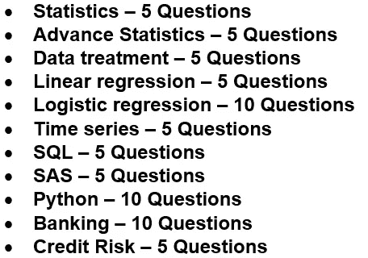

# 关于机器学习、编程和银行业的 70 个面试问题

> 原文：<https://medium.com/analytics-vidhya/top-70-interview-questions-on-machine-learning-programming-and-banking-1b86212636fc?source=collection_archive---------3----------------------->

# **统计数据**

**1。** **描述统计和推断统计的区别？**

> **描述性统计:**提供准确无误的信息。
> 
> **推断统计:**提供样本的信息，我们需要推断统计来得出关于总体的结论。

**2。** **什么时候用 t 检验，什么时候用 z 检验？**

> 要使用 Z 分布，必须满足以下条件
> 
> o 我们知道总体标准差吗？
> 
> o 样本量是否> 30？
> 
> o CI = x(巴)— Z*σ/√n 至 x(巴)+ Z*σ/√n
> 
> 否则我们应该使用 t 分布
> 
> o CI = x(巴)— t*s/√n 至 x(巴)+ t*s/√n

**3。** **什么是高斯分布、均匀分布、泊松分布？**

> **正态或高斯:**当我们有连续的测量值时，如身高或体重，其分布是对称的，并围绕某个平均值聚集
> 
> **二项式:**当一个样本中的每一个人都可以被识别为具有或不具有某一种性格时。
> 
> **泊松:**当事件相当罕见，但对几个要观察的案例检查了足够数量的实例时。

**4。** **单尾或双尾检验中的临界值是多少？**

> **双尾检验:**临界区域是分布的两侧
> 
> H0: x =
> 
> H1: x <>
> 
> **1-尾部检验:**临界区在分布的一侧
> 
> H1: x <= µ
> 
> o H1: x >

**5。** **什么是 1 型和 2 型错误？**

> **第 1 类错误:**通常与假阳性相似，发生在假设检验中，当零假设为真但被拒绝时。
> 
> **第二类错误:**通常与假阴性相似，发生在假设检验中，当原假设为假但被接受时。

# **提前统计**

**6。** **什么是方差分析，混合方差分析和安协方差分析？**

> **方差分析(ANOVA)** 是一种适当的统计分析，用于评估连续测量中各组之间的差异。根据研究的目标，有几种类型的肛肠吻合术可以使用。
> 
> **混合模型方差分析，有时称为组内方差分析**，适用于按组和时间检查连续水平变量的差异。如果研究的目的是检查治疗组和对照组之间的连续水平变量随时间的潜在差异，则这种分析是适用的。
> 
> **协方差分析(ANCOVA)** 适用于检查组间连续因变量的差异，同时控制额外变量的影响。当研究人员希望说明控制变量的影响时，ANCOVAs 经常用于实验研究。

**7。** **什么是弗里德曼试验？**

> 弗里德曼检验是重复测量的单向方差分析的非参数替代方法。当被测量的因变量是序数时，它用于测试组间的差异

**8。** **层次聚类和 K 均值聚类有什么区别？**

> 等级方法可以是分裂的，也可以是凝聚的。凝聚方法从“n”个聚类开始，然后依次组合相似的聚类，直到只获得一个聚类。等级聚类的效果不太好，k 表示聚类的形状是超球形的。
> 
> K-means，使用预先指定数量的聚类，该方法将记录分配给每个聚类，以基于距离找到互斥的球形聚类。可以使用中间值或平均值作为聚类中心来代表每个聚类。在 K 均值聚类中，由于从随机选择的聚类开始，多次运行该算法产生的结果可能不同。

**9。** **二项式回归、多项式回归、序数回归有什么区别？**

> **多项逻辑回归**模型是二项式逻辑回归模型的简单扩展。当因变量有两个以上的名义(无序)类别时，使用它们。
> 
> 当响应类别被排序时，然后运行一个**有序逻辑回归**模型以包含关于排序的信息。

10。 **什么是因素分析？**

> 因素分析是一种技术，用于将大量的变量减少为较少的因素。这种技术从所有变量中提取最大公共方差，并将它们放入一个公共分数中。
> 
> 因子分析是一般线性模型(GLM)的一部分，这种方法也假设了几个假设。存在线性关系，不存在多重共线性，它将相关变量纳入分析，变量与因素之间存在真实的相关性。

# **数据处理**

**11。** **如何识别离群值？**

> 异常值是一个异常值(它与其余数据点的距离异常)。
> 
> 广泛使用的是 IRQ 技术——位于 1.5 * IQR 之外的任何数据点
> 
> o 下限= Q1-(1.5 * IQR)
> 
> o 上限= Q3 + (1.5 * IQR)

12。 **如何对待离群值？**

> 移除异常值
> 
> o 当我们知道数据点是错误的(一个人的负年龄)
> 
> o 当我们有大量数据时
> 
> o 我们应该提供两个分析。一个有异常值，另一个没有异常值。
> 
> 保留异常值
> 
> o 当有大量异常值(偏斜数据)时
> 
> o 当结果至关重要时
> 
> o 异常值何时有意义(欺诈数据)

**13。** **如何看待缺失值？**

> 删除
> 
> 均值/众数/中位数插补
> 
> 预测模型

**14。** **什么是粗分类(分箱变量)？**

> **精细分类:**根据内部标准将变量分成大致相等的类别，如变量的值或每个类别中的事例数。
> 
> **粗分类:**根据外部标准将一个变量分成不同的类别，这些标准显示了这些类别在多大程度上解释了另一个变量，如 WOE

15。 **如何标准化一个变量？**

> X(标准化)=(X-平均值)/标准差

# **线性回归**

16。**R-Sq 和 Adj R-Sq 有什么区别？**

> 每次向模型中添加自变量，R 平方都会增加，即使自变量微不足道。它从不衰退。而调整后的 R 平方仅在自变量显著且影响因变量时增加。
> 
> 当 r 平方接近零时，调整后的 r 平方可能为负。
> 
> 调整后的 r 平方值始终小于或等于 r 平方值。
> 
> adj R-Sq = 1-(1-RSQ)*((n-1)/(n-p-1))

17。 **系数表中的 p 值是什么意思(假设— H0 & H1)？**

> **H0:** 贝塔系数等于零
> 
> **H1:** 贝塔系数不等于零
> 
> 如果 p 为 0.05，那么我们无法拒绝 H0

**18。** **系数表中 t-统计量的含义是什么？**

> t 检验评估β系数是否显著不同于零

**19。** **线性回归的假设有哪些？**

> **线性:**X 和 y 的线性关系，补救措施包括:
> 
> o 运行非线性模型
> 
> o 对数变换
> 
> o 指数变换
> 
> **内生性:**X 和ε之间没有相关性
> 
> **误差的正态性和同方差:**补救措施包括:
> 
> o 对数变换
> 
> o 尝试识别并移除异常值
> 
> o 通过考虑省略的变量来减少偏差
> 
> **无自相关:**Y(t)和 Y(t-1)之间无相关性
> 
> **无多重共线性:**Xi 与新疆之间无完美相关性。补救措施包括:
> 
> o 丢弃其中一个变量
> 
> o 转换成一个变量

**20。****OLS 和 MLE 有什么区别？**

> **“OLS”代表“普通最小二乘法”。**这是一种近似确定线性回归模型中未知参数的方法。
> 
> **“MLE”代表“最大似然估计”。**这是一种用于估计统计模型参数和将统计模型与数据拟合的方法。

# **逻辑回归**

21。 **什么是精确和回忆？**

> **精度:**被正确识别的预测阳性病例的比例。
> 
> **召回:**被正确识别的实际阳性病例的比例。

22。 **什么是和谐与不和谐？**

> **一致:**如果 1(具有期望结果的观察，即事件)具有比 0(没有结果的观察，即非事件)更高的预测概率，则一对是一致的。
> 
> **不一致:**如果 0(没有预期结果的观察，即非事件)的预测概率高于 1(有结果的观察，即事件)，则配对不一致。

**23。** **什么是 log 比值比？**

> LN(prob Good(Y = 1)/prob Bad(Y = 0))= B0+b1x 1+B2 x2+…+BnXn
> 
> LN(概率好(Y=1) /概率坏(Y=0))称为对数优势比

**24。** **你如何解释逻辑回归的系数？**

> **线性回归:**系数显示了因变量的变化，这种变化是各个自变量单位变化的结果。
> 
> **逻辑回归:**系数显示了因变量的对数概率的变化，这种变化将因相应自变量的单位变化而发生。

**25。** **什么是 AUROC 和 Gini？**

> **AUROC 曲线:**它是诊断测试评估的基本工具。它被绘制成灵敏度和 1-特异性之间的图表，我们可以从混淆矩阵中得到。
> 
> o 50%-60% ->差，60%-70% ->差，
> 
> o 70%-80% ->一般，80%-90% ->良好，
> 
> o 90%-100% ->优秀
> 
> AUROC 上的每个点代表一个不同的混淆矩阵
> 
> **基尼系数:**是 ROC 曲线与对角线之间的面积与上述三角形面积之比。基尼= 2 x AUC-1

**26。** **什么是 KS 统计和 Hosmer-le meshow 检验？**

> **KS 或 Kolmogorov-Smirnov 图:**它衡量分类模型的性能。KS 统计给出了模型的分离能力。它被计算为累积非事件和累积事件之差的绝对值的最大值。一个好的模型会有一个 KS > 30。高 KS 值将描述模型中的过度预测。
> 
> **HL:**HL 检验是逻辑回归的拟合优度检验，尤其是对于风险预测模型。拟合优度测试告诉您数据与模型的拟合程度。具体来说，HL 测试计算人群亚组中观察到的事件发生率是否与预期的事件发生率相匹配。

**27。** **什么是 WOE？**

> 分类自变量解释分类结果差异的程度。
> 
> **WOE = ln(%好的/%坏的)**

**28。** **什么是 IV？**

> IV 对于模型开发过程中的变量选择是一个非常有用的概念。IV 越大，变量的解释力越强
> 
> **IV =σ[(好的分布—坏的分布)x WoE**
> 
> o 四< 0.02 ->没有预测能力
> 
> o 0.02 < IV < 0.1 ->预测能力弱
> 
> o 0.1 < IV < 0.3 ->中等预测能力
> 
> o 0.3 < IV < 0.5 ->强大的预测能力
> 
> o IV > 0.5 ->可疑地高(好得难以置信)

29。 **您如何评价 PD 模型对新数据的处理效果？**

> **PSI:** 使用特征的离散类别，显示两个总体在特征方面是否不同
> 
> PSI =(%实际值—%实际值)* ln(%实际值/%实际值)
> 
> o PSI = 0 ->无差异
> 
> o PSI < 0.1 ->略有不同(无动作)
> 
> o 0.10 到 0.25 ->不同(无动作)
> 
> o PSI > 0.25 ->差异较大(需要采取措施)

三十。 **如何评价 logistic 回归模型？**

> 混淆矩阵
> 
> 接收操作曲线下的面积(AUROC)
> 
> 基尼
> 
> 洛伦兹曲线
> 
> 科尔莫戈罗夫·斯米尔诺夫(KS)

# **时间序列**

**31。** **什么是平稳过程？**

> 如果平均值和方差在一段时间内保持不变，则两个时间段之间的协方差值仅取决于间隙，而不是实际时间段。
> 
> 如果时间序列是平稳的，它将趋向于回归均值

32。 **什么是单位根检验？**

> 这是对平稳性的测试。我们需要估计ρ = 1 的话。
> 
> 其中，Yt = ρ Yt-1 + Ut

**33。** **什么是综合随机过程？**

> **I(d):**d 阶积分，即 d 次差

**34。如何从序列中去除季节性？**

> 季节性模型可以从时间序列中去除。这个过程被称为季节性调整，或去季节性。
> 
> SAS: proc X12
> 
> **Python:**stats models . TSA . seasonal . seasonal _ decompose

**35。** **如何识别 AR 和 MA 术语？**

> 对于 AR 过程，PACF 曲线急剧下降，而 ACF 曲线逐渐下降
> 
> 对于 MA 过程，ACF 曲线急剧下降，而 PACF 曲线逐渐下降

# **SQL**

36。**SQL 中有哪些不同类型的联接？**

> 内部连接
> 
> 左连接
> 
> 右连接
> 
> 完全连接

37。 **删除和截断命令有什么区别？**

> 删除命令用于删除表格中的一行。使用 delete 语句后，可以回滚数据。
> 
> Truncate 用于删除表中的所有行。您不能回滚数据。

38。 **编写一个 SQL 查询来查找以“S”开头的雇员姓名？**

> SELECT * FROM Table _ name WHERE EmpName like ' S % '

39。**and IN 条件运算符的主要区别是什么？**

> BETWEEN 运算符用于根据行中的值范围显示行，而 in 条件运算符用于检查特定值集中包含的值。
> 
> SELECT * FROM Table_name 其中 Emp_NO 介于 EN 10 和 50 之间
> 
> SELECT * FROM Table _ name where Emp _ NO IN(8，15，25)

**40。****HAVING 从句和 WHERE 从句有什么区别？**

> HAVING 子句仅与查询中的 GROUP BY 函数一起使用，而 WHERE 子句在每行成为查询中 GROUP BY 函数的一部分之前应用于每行。

# **SAS**

**41。****SQL 合并和数据合并的区别？**

> 数据合并要求数据按 ID 排序
> 
> 数据合并不适用于多对多联接

42。**proc 手段和 proc 总结的区别？**

> 默认情况下，Proc 意味着生成打印输出，而 Proc SUMMARY 则不会。
> 
> 当数据集中的某些变量是数值型时，Proc 意味着分析所有数值型变量，而 Proc SUMMARY 不分析。

**43。** **如何从字符串中删除数字和特殊字符？**

> 使用压缩功能
> 
> **ak:** 只保留字符串中的字母。
> 
> **kd:** 只保留数值。

**44。** **定义宏变量的不同方式？**

> %LET
> 
> 宏参数
> 
> PROC SQL 中的 INTO 子句
> 
> 呼叫符号例程

**45。****%设 a = 5；%设 b = 10 我们如何对宏观变量(a 和 b)求和？**

> % let c = % eval(& a+& b)；

# **Python**

**46。** **Python —全局变量和局部变量的区别？**

> 定义函数():
> 
> X
> 
> 全局 Y
> 
> 全局变量可以在程序的任何地方使用，因为它的作用域是整个程序。y 是一个全局变量
> 
> 局部变量只能在它们的作用域内到达，就像上面的 func()

47。**Python—Python 中什么是类型转换？**

> 转换一种数据类型(整数、字符串、浮点等)的值的过程。)转换为另一种数据类型称为类型转换。

48。**Python——如何在 Python 中定义函数？**

> def 我的函数():
> 
> print("来自函数的 Hello ")

49。 **列表—元组和列表的区别？**

> Python 中的链表和元组是数据结构的类。列表是动态的，而元组具有静态特征。

50。 **列表—数组和列表的区别？**

> Python 中的列表是包含多种数据类型元素的项目集合，这些数据类型可以是数字、字符逻辑值等。
> 
> 数组是包含同类元素的向量，即属于相同数据类型的元素。

51。 **列表—如何从列表中得到-7[-1，-2，[-3，-4，[-5，-6]，-7，-8]，-9，-10]？**

> L[2][3]

**52。** **List —请问[: : -1]是做什么的？**

> 颠倒列表

**53。** **熊猫——如何从列表和字典创建数据框？**

> DF = pd。DataFrame(List，columns =[' NAME '])
> 
> DF = pd。数据框架(字典)

54。**Pandas-如何使用 Pandas 数据框进行左连接？**

> DF = pd.merge(left，right，how='left '，on=ID)

**55。** **Pandas —给定一个学生表，包含学生 id、科目(英语、数学和科学)和分数(每门科目)。如何获得每个学生 id 的平均分数，如何获得前 3 名学生的学生 id？**

> GB = DF.groupby(' student_id ')。agg(“平均”)
> 
> GB = GB.sort_values('marks '，轴=0，升序=False)
> 
> GB.head(3)

# **银行业**

56。 **一级资本和二级资本的区别？**

> **一级资本:**也叫核心资本。最低一级资本为 RWA 的 6%。它等于股东权益+留存收益
> 
> **二级资本:**也叫补充资本。由重估准备金+混合资本工具+次级定期债务+一般贷款损失准备金+未披露准备金等组成

**57。** **预期损失和意外损失的区别？**

> **预期损失(拨备)**:预期损失是所有可能损失的值之和，每个值乘以该损失发生的概率。EL = PD x EAD x LGD
> 
> **意外的损失(资本):**凌驾于埃尔之上。计算为特定置信区间平均值的标准偏差。银行被要求持有资本以应对不可预见的财务损失。UL = EAD x SQRT[(PD2 xσ2 lgd)+(LG D2 xσ2PD)]

58。 **标准法和高级内部评级法对减值准备的处理有何区别？**

> **标准化方法**:监管者规定风险权重。如果发生了损失，那么它会影响一级资本
> 
> **高级内部评级法:**银行自己对违约概率、LGD 和违约风险暴露的估计

59。 **为什么需要转到国际财务报告准则第 9 号来确认减值？**

> 在 IFRS 9 之前的标准中,“已发生损失”框架要求银行只有在损失证据明显时才确认信贷损失。根据 IFRS 9 的 ECL 减值框架，银行必须随时确认 ECL，并在每个报告日更新确认的 ECL 金额，以反映资产信用风险的变化。
> 
> 损失的早期确认。区分已经显示恶化的暴露。需要预测损失

60。**IFRS 9 减值阶段第 1 阶段与第 3 阶段的区别？**

> **第一阶段:**贷款是信用风险没有显著增加的原始或现有贷款。未来 12 个月内违约事件导致的 ECL。
> 
> **第三阶段:**信用风险增加到被视为信用受损的程度。ECL 一生都是公认的。

**61。** **算 LGD。资助金额= $10K，偿还本金= $6K，收回本金= $ 32k**

> EAD = $4K
> 
> 回收率= 3.2K / 4K = 0.8
> 
> LGD = 0.2

62。 **计算 CCF。资助金额= $10K，偿还的本金= $6K，收回的本金= $ 32k**

> CCF = (10K — 6K) / 10K = 0.4

**63。** **计算资本。零售风险= 1000 亿美元，SA 下的风险权重为 75%**

> 银行被要求持有足够的资本，以吸收违约损失。
> 
> SA 下的 RWA = 1000 亿美元的 75% = 750 亿美元
> 
> 资本= 750 亿美元的 8% = 60 亿美元

**64。** **计算 LGD。假设房价= 500，000 美元，银行给出= 400，000 美元，EAD = 360，000 美元，银行以 342，000 美元出售房屋**

> LGD = (360K — 342K) / 360K = 5%

65。 **计算 EL。假设房价= 500，000 美元，银行贷款= 400，000 美元，EAD = 360，000 美元，银行以 342，000 美元出售房屋，四分之一的借款人违约(违约概率= 25%)**

> EL = 25% x 5% x 360，000 美元= 4，500 美元

# **信用风险**

66。**TtC 和 PiT PD 的区别？**

> 违约概率被定义为借款人无力全额或按时偿还债务
> 
> **通过周期(TtC) PD** :考虑更长的周期，因此更稳定。
> 
> **时点(PiT) PD:** 符合近期宏观经济情景。

**67。** **担保贷款和无担保贷款的 LGD 计算方法的区别？**

> LGD 是借款人违约后损失的风险敞口的百分比
> 
> **担保 LGD:** 计算 LGD 时考虑违约后付款和抵押品
> 
> **无担保 LGD:** 仅考虑违约后付款。回收率:贷款人可收回的总风险敞口的比例
> 
> o 回收率=回收率/注资金额
> 
> o LGD = 1 —回收率

**68。** **循环贷款和非循环贷款的 EAD 建模区别？**

> EAD 是借款人违约时的敞口金额
> 
> **循环贷款:** EAD 使用 CCF 计算。信用转换系数(CCF)是违约时总风险敞口的比例
> 
> o CCF =(注资金额-总建议本金)/注资金额
> 
> o CCF = 0 à全部支付
> 
> o CCF = 1à无需支付任何费用
> 
> **非循环贷款:** EAD 使用摊销曲线计算

69。 **银行为什么要做 CCAR /压力测试？**

> 美联储的目标是确保具有系统重要性的大型银行机构拥有前瞻性、机构特定、风险定制的资本规划流程。
> 
> 确保银行在经济和金融危机时期有足够的资金保持偿付能力。

**70。****CCAR 有哪些不同的场景？**

> **有 3 种 FED 情景:**基本、不利和严重不利。预测持续了 9 个季度。有一种叫做美联储(监管情景)。
> 
> **有两种 BHC 情景:**基础和不利。预测持续了 9 个季度。这些被称为银行控股公司(内部场景)