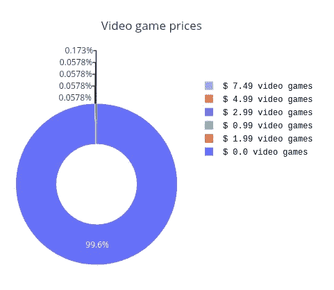
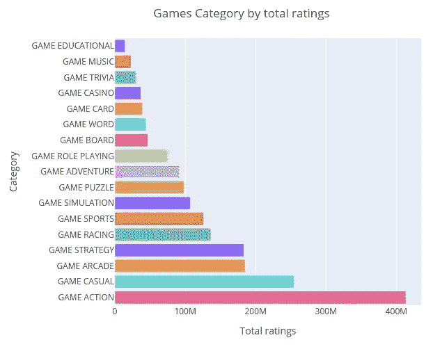
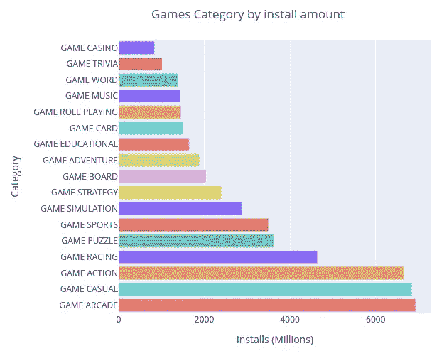
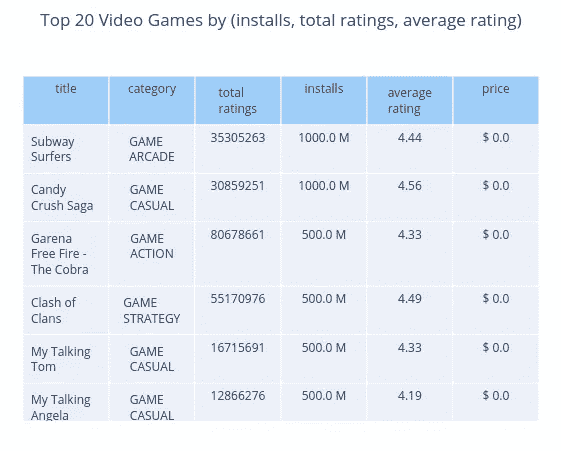
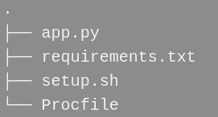
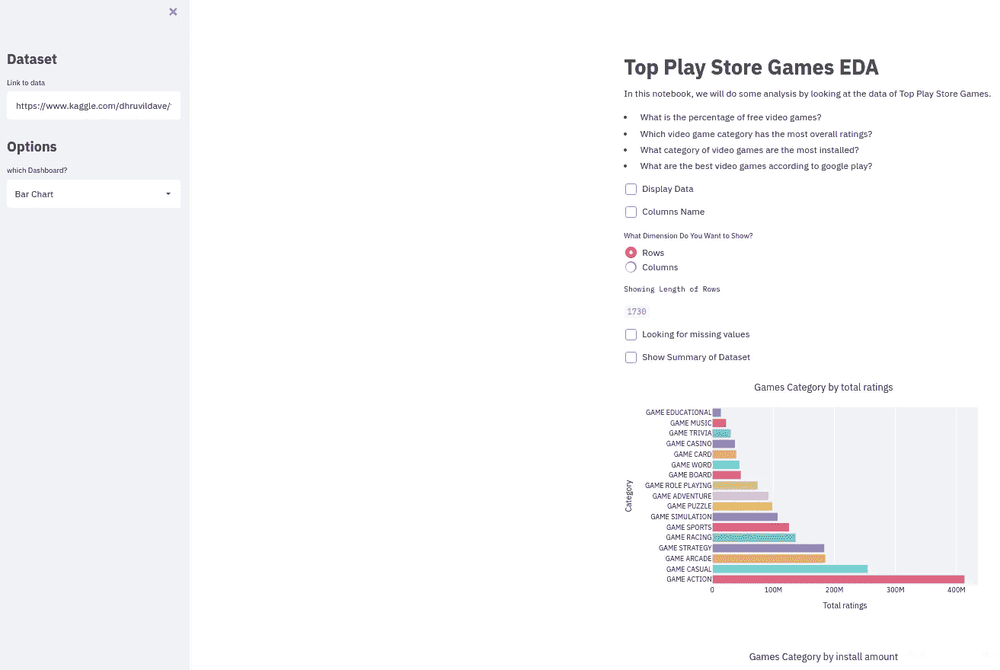

# 具有 Plotly 和 Streamlit 的仪表板

> 原文：<https://medium.com/analytics-vidhya/top-games-google-play-store-dashboard-with-plotly-and-streamlit-5cae418fd915?source=collection_archive---------1----------------------->


欢迎，在下一篇文章中，我们将使用 plotly 进行 EDA 和数据可视化(您可以在此处下载数据集)，我们还将使用 Streamlit 创建一个仪表板，最后，我们将通过 Heroku 部署它。

开始之前，我们打算回答以下问题。

*   免费电子游戏的比例是多少？
*   哪个电子游戏类别的总体评分最高？
*   哪一类电子游戏安装得最多？
*   根据 google play，最好的视频游戏是什么？

## [创建虚拟环境](https://avyllesca.medium.com/python-virtual-environment-linux-9bab86bae567)

Linux (Pop！_OS 20.10)我在这里

```
# Install
sudo apt install python3-venv# Active environment
. venv/bin/activate
```

Windows 10

```
py -m venv venv# Active environment
venv\scripts\activate
```

您必须安装您需要的库:

```
pip install streamlit
pip install pandas
pip install plotly
```

# 导入库和数据

我将使用 visual studio 代码

```
import streamlit as st
import pandas as pd
import plotly.express as px
import plotly.graph_objects as go
from plotly.subplots import make_subplotsdata = pd.read_csv('android-games.csv')
```

# Streamlit 的一些命令

*   st.title("这将是一个标题")
*   st.markdown("这是** text ** using * Markdown * ")
*   圣复选框()
*   ST . write()-->该命令作为通配符工作，允许您编写许多内容，并且根据我们使用的内容，它将以某种方式工作。
*   st.text("这将是文本")

# 了解数据

在这里，我们必须了解数据集的不同方面，从简单的行数和列数、缺失值、每列中唯一值的数量到统计方面。这里我们将只看到其中的一部分，因为目标是在 web 上部署一个仪表板。

```
*# Size*
data.shape
*# Unique elements* data['price'].unique()
# Statistics
data.describe()
```

# 形象化

为了回答提出的问题，我们将使用 Plotly 构建 4 个图。



# 开源代码库

建议将项目上传到 github，但是如果这不是你的情况，你也可以跳过它。



这些是必要的文件

*   app.py ->这是 python 语言的脚本。
*   要求。txt-->

```
pandas==1.2.4
plotly==4.14.3
streamlit==0.80.0
```

*   setup.sh(您可以复制并粘贴它)->

```
mkdir -p ~/.streamlit/echo "\
[general]\n\
email = \"[your-email@domain.com](mailto:your-email@domain.com)\"\n\
" > ~/.streamlit/credentials.tomlecho "\
[server]\n\
headless = true\n\
enableCORS=false\n\
port = $PORT\n\
" > ~/.streamlit/config.toml
```

*   Procfile(您可以复制并粘贴这个)->

```
web: sh setup.sh && streamlit run app.py
```

# 使用 HEROKU 部署

你需要在这里创建一个账户[。](https://signup.heroku.com/)

**开启 HEROKU**

→创建新应用程序→创建应用程序

→GitHub(连接到 GitHub) →搜索 repo-name →连接

→手动部署(选择分支)→部署分支

[就这些，现在您可以在这里看到它的运行](https://top-games-google-play-store.herokuapp.com/):

 [## 细流

### 编辑描述

top-games-google-play-store.herokuapp.com](https://top-games-google-play-store.herokuapp.com/) 

# 密码

如果你想看完整的代码，你可以访问我的库( [GitHub](https://github.com/anthoguille/sreamlit_top_games_google_play_store/tree/master) )。



现在我们有了。希望这对你有所帮助。感谢您的阅读。🐼