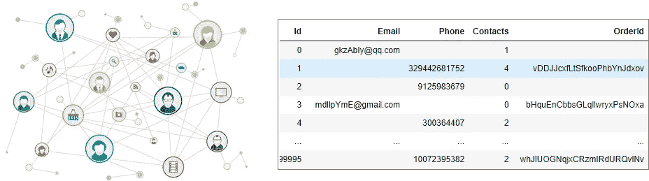
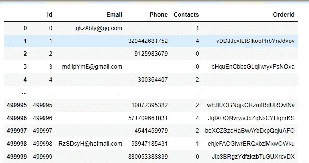
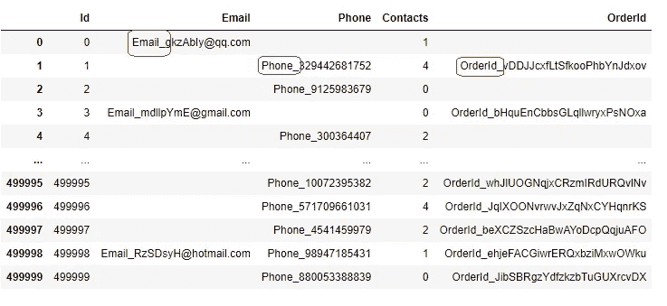
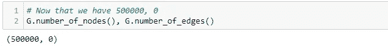
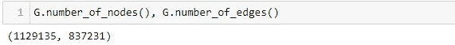
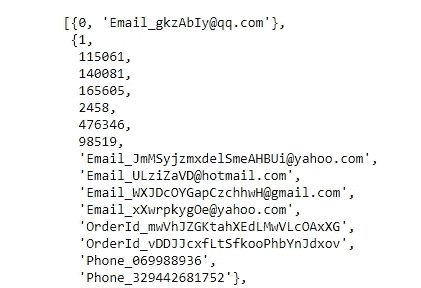
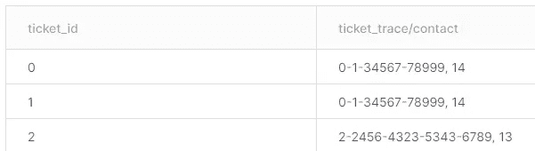
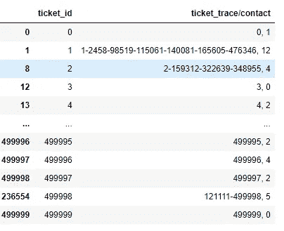

# 最佳得分者-通过网络和图论进行网络分析

> 原文：<https://medium.com/analytics-vidhya/top-scorer-network-analysis-via-networks-and-graph-theory-40731c20dca0?source=collection_archive---------7----------------------->



这是我的团队(我自己& [林俊·高](https://medium.com/u/9b1a784c0058?source=post_page-----40731c20dca0--------------------------------))为应对 Shopee Code League 2021 的竞争而精心设计的解决方案——多渠道联系。

**总结:**我们使用网络和图论来了解提交的每张票之间的关系。这样，我们就可以通过电话号码、电子邮件地址或订单 id 100%地找到没有关联的客户。

> **问题陈述:** 客户可以通过 livechat 功能、填写某些表格或打电话求助等多种渠道联系客服。每次客户用新的联系方式联系我们时，都会自动生成一张新的票据。当同一个客户使用不同的电话号码或电子邮件地址联系我们，导致同一问题的多个标签时，情况就变得复杂了。因此，我们在这里面临的挑战是确定如何将相关票据合并在一起，以创建客户问题的完整画面，并最终确定 RCR

**数据集:** 你可以从[https://www.kaggle.com/c/scl-2021-da/data](https://www.kaggle.com/c/scl-2021-da/data)下载数据集

**解决方案:** 该解决方案简单而温馨，只需进行少量清理，并使用基本网络来规划每张票之间的关系，我们设法制定了解决方案，并在时限内 100%规划出客户网络。

# 首先，我们加载数据集

```
import pandas as pd
import networkx as nxdf = pd.read_json('dataset/contacts.json')
df
```



*   每个**订单 ID** 代表 Shopee 中的一笔交易。
*   每个 **Id** 代表向 Shopee 客户服务制作的票证 Id。
*   所有**电话号码**在存储时没有国家代码，国家代码可以忽略。
*   **联系人**代表用户在特定票证中联系我们的次数(电子邮件、电话、实时聊天等)。)
*   如果**值为 NA** 表示系统或代理没有该值的记录。

# 数据清理

数据清理是任何建模之前的强制性步骤。我们附加了“Email_”、“Phone_”和“OrderId_”来帮助我们稍后识别数据类型。

```
df.Email = df.Email.apply(lambda x: "Email_"+x if x !='' else '')df.Phone = df.Phone.apply(lambda x: "Phone_"+x if x !='' else '')df.OrderId = df.OrderId.apply(lambda x: "OrderId_"+x if x !='' else '')
```



# 创建图形网络

1.  创建 Id 为、属性为联系人的节点

```
**# Create the nodes with Id and with attributes as Contacts**nodes = []for _,Id,_,_,Contacts,_ in df.itertuples():
    nodes.append((Id,{"Contacts": Contacts}))

**# Add the nodes into the new graph G**G = nx.Graph()
G.add_nodes_from(nodes)**# Now that we have 500000 nodes, 0 edges** G.number_of_nodes(), G.number_of_edges()
```



2.创建边缘间:*id****↔****邮箱，id****↔****电话，id****↔****订单 Id*

并且 Email、Phone & OrderId 节点是在这个过程中自动创建的。

```
**# Create the edges between: Id ↔ Email, Id ↔ Phone, Id ↔ OrderId**G.add_edges_from(df[df.Email != ''][['Id', 'Email']].to_records(index=False))G.add_edges_from(df[df.Phone != ''][['Id', 'Phone']].to_records(index=False))G.add_edges_from(df[df.OrderId != ''][['Id', 'OrderId']].to_records(index=False))**# Now that we have 1129135 nodes, 837231 edges** G.number_of_nodes(), G.number_of_edges()
```



3.列出连接的组件。每个列表包含 1 个连通分量

```
**# List down the connected component**conn_comp = list(nx.connected_components(G))
conn_comp
```



# 提取图形网络

这个想法是一个 ticket_id 一行，与他们连接的 ticket id 连接，联系点的数量进行汇总。



**对于每个连接的组件** t，也就是每个列表，我们**将其中的 ticket_id** 连接起来，**汇总出联系方式**(之前存储在节点属性下)

```
output = []**# for each connected component, i.e. each list, we apended the ticket_id within (to concat in the later part)**for each_connected_component in conn_comp:

    id_list = []for each_node in each_connected_component:

 **# check if the node is a number, append to the id_list**        
        if str(each_node).isnumeric():id_list.append(each_node)sum_of_contacts = 0

    for order_id in id_list:

 **# summed up the attributes ie. contact made that belongs to the node**

        sum_of_contacts += G.nodes[order_id]['Contacts']output_str = '-'.join([str(each_node) for each_node in sorted(id_list)]) + ', '  + str(sum_of_contacts)
    for order_id in id_list:output.append([order_id, output_str])
```

将输出转换为数据帧，并根据比赛要求进行排序，导出为 csv 文件。

```
output_final = pd.DataFrame(output)output_final= output_final.rename(columns={0:'ticket_id', 1:'ticket_trace/contact'})output_final.sort_values('ticket_id').to_csv('output.csv', index=False)
```



瞧，我们完成了！希望你喜欢我写的文章/教程。

如果你有任何问题，或者喜欢这篇文章，请留下你的评论。

Github 知识库:[https://github.com/angelawongsw/Top-Scorer 网络分析网络图论](https://github.com/angelawongsw/Top-Scorer---Network-Analysis-Networks-and-Graph-theory)

完整代码: