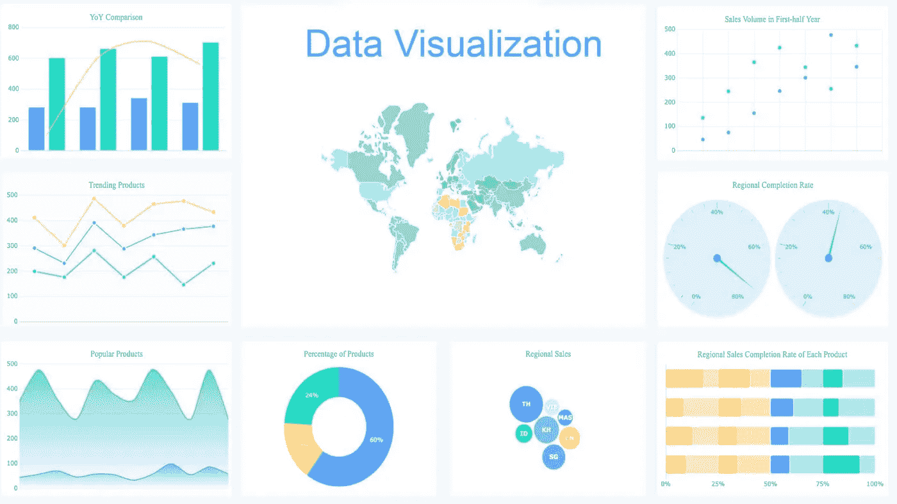

# 十大商业智能工具

> 原文：<https://medium.com/analytics-vidhya/top-ten-business-intelligence-tools-6eb4abf5934c?source=collection_archive---------11----------------------->

随着时间的推移，商业智能软件的出现，正确利用数据来获得洞察力和发现趋势对于企业的扩展和适应至关重要。BI 工具的潜在用途实际上是无限的。

你能用你的数据和商业智能系统做什么受到一个简单的障碍的限制:你的创造力。您可以确定绩效 KPI，找到公司收入高峰期的投资回报率等等。

因此，在这份详细的指南中，我将向您展示市场上每一款拥有适当数量用户和客户群的商务智能工具。

您需要了解不同类型的商业智能(BI)工具，并决定哪一种更适合您。

数据可视化仪表板

# **微软 Power BI**

【www.powerbi.microsoft.com】网站:

Microsoft Power BI 在我们的多个领域获得了最高分，包括交互式可视化、预测分析、移动访问、分析报告导出、大数据集成和故事板，确保该解决方案是一个强大的数据可视化工具。

**什么是动力 BI？**

*   将数据转换成令人惊叹的视觉效果，并在任何设备上与同事分享。
*   协作并共享定制的仪表板和交互式报告。
*   在一个视图中直观地浏览和分析本地和云中的数据。
*   借助内置的治理和安全性在整个组织中扩展。

**有什么独特之处可以认为权力 BI 过他人？**

*   Power BI 是商业分析服务和行业领导者。
*   它提供了洞察力，能够在数据可视化方面做出快速、明智的决策。
*   Power Bi 是基于网络的，几乎可以从任何地方访问。
*   该软件还允许用户集成他们的应用程序，并提供报告和实时仪表板。
*   Power BI 是微软的产品，因此很容易与微软产品集成。
*   Power BI 是可视化 BI 工具的市场领导者。

## **微软 Power BI 桌面:**

**网址:**[https://powerbi.microsoft.com/en-us/desktop/](https://powerbi.microsoft.com/en-us/desktop/)

Microsoft Power BI Desktop 是一款免费的商业桌面应用程序，可让您连接、转换和可视化数据。

该工具允许用户连接到多个不同的数据源，并将它们组合到一个数据模型中，以便构建可视化集合。您可以与组织内的其他人共享报告。

大多数从事商业智能项目的用户使用 Power BI Desktop 创建报告，然后使用 Power BI 服务与其他人共享他们的报告。

# （舞台上由人扮的）静态画面

**网址:**【www.tableau.com 

Tableau 是最受欢迎的 BI 工具之一，可以帮助企业可视化和理解数据。它的用户友好，您可以轻松创建定制的仪表板和其他报告，以找到有价值的见解。

**Tableau 还提供三款独立产品:**

*   Tableau 桌面(个人使用免费)
*   Tableau 服务器(面向组织的分析)，在本地环境中运行，并且
*   Tableau Online(面向组织的云托管分析)。

它使组织能够通过 PC 或 iPad 连接、可视化和共享数据。创建仪表板、发布甚至与同事和客户共享它们非常容易，不需要编程知识。

【Tableau 有什么独特之处？

Tableau 是 BI 工具中的大牌。Tableau 也是市场上最具创新性的产品之一，不断推出新功能、好产品和新特性。以下是使其成为行业中有价值的参与者的一些因素。

*   Tableau 免费供个人使用。
*   Tableau 支持 MS Excel、Oracle、MS SQL、Google Analytics、Salesforce 等多种数据源。
*   它也给出了拖放分析。
*   SAML 身份验证使 Tableau 可以连接到任何第三方应用程序/系统。

# **思感:**

**网址:**[https://www.sisense.com/](https://www.sisense.com/)

如果你不精通技术，Sisense 商业智能工具非常适合你。这款用户友好的工具允许您组织中的任何人管理大型复杂数据集以及分析和可视化这些数据，而无需您的 IT 部门参与。

BI software Sisense 使企业能够整理、分析和查看数据，这些数据可用于制定合理的业务决策和战略计划。该工具通过拖放功能将所有需要的信息聚合到一个仪表板中，并为您提供数据的精细视图。

它可以让你汇集来自各种来源的数据，包括 Adwords、Google Analytics 和 Salesforce。更不用说，因为它使用了片内技术，与其他工具相比，数据处理速度相当快。

除了这些功能之外，Sisense 还为初学者提供直观的数据处理，这对于那些不熟悉使用 BI 解决方案的人来说是一个很好的选择。

【Sisense 与其他相比有什么独特之处？

就 Sisense 而言，有许多东西是最好的，如片内引擎和专有技术、单栈架构、计算资源的最佳使用、来自多个来源的图表的整合。

# **QlikView:**

**网址:**【https://www.qlik.com 

QlikView 是一款强大且易于使用的 BI 工具，可自动生成个性化报告和定制仪表板。QlikView 还提供系统记忆功能，显示分析过程中发生的每一个动作。

这款软件适用于任何规模的企业，甚至是自由职业者。借助 QlikView，用户可以收集有价值的见解，并与相关人员分享。

除了这些。该平台提供了相同的交互式分析工具、直观的关联搜索和出色的可视化、颜色渐变使用和响应式设计。

【QlikView 的独特之处是什么？

QlikView 在主要 BI 工具总结中脱颖而出。以下是关于 QlikView 的一些基本事实。它提供了

*   简单的拖放界面创建灵活的交互式数据可视化。
*   易于成长中的企业使用的集中部署的分析。
*   支持多种数据源和文件类型
*   它的设计完全响应移动设备。
*   使用自然搜索导航复杂信息
*   它支持所有设备上的数据和内容的安全性

# **邓达斯毕:**

**网址:**[https://www.dundas.com](https://www.dundas.com/)

Dundas BI 解决方案是一个企业级商业智能平台。您可以将数据导入任何设备，并连接关系数据库、web 服务、Excel 和其他格式，以构建和查看交互式仪表盘、报告、记分卡等。

当我们谈论 Dundas BI 的功能时，最新版本的数据生成器、数据转换工具、缩放模式和快速过滤器现在都可用。

将 Dundas BI 作为组织的中央数据门户，或者将其作为定制 BI 解决方案集成到现有网站中。

**有什么独特之处让邓达斯毕优于他人？**

*   允许使用样本或 Excel 数据或任何其他数据格式。
*   每个人都可以通过网络浏览器轻松访问。
*   集成是安全，可以访问所有类型的数据源。
*   您可以在 Dundas BI 中看到专门的报告工具。
*   Dundas BI 还提供一些常规功能，如拖放工具、通过地图可视化数据以及预测和高级数据分析。

# Oracle BI

**网址:**[https://www.oracle.com/index.html](https://www.oracle.com/index.html)

Oracle BI 是另一个提供端到端企业绩效管理系统的顶级解决方案。它以强大的地理特定的可视化能力、集成的查询、报告、警报、管理工具、高级映射控制、仪表板集成而闻名，并提供了导出分析报告的平稳流程。

与其他产品相比，Oracle BI 的独特之处是什么？

Oracle BI 能够让用户快速自发地进行交互，并可以在线查看、发布、发送和安排报告。

*   直接连接到更多 Oracle 产品源，进行更高效的分析。
*   集中业务的数据模型和指标
*   帮助企业领导者安全地访问和浏览数据。
*   处理所有类型的本地和公司数据。
*   通过在一个集成平台上实现标准化来简化分析策略
*   Oracle BI 以批处理模式混合数据集，具有更快的查询性能。
*   启用带有 R 脚本的预建函数。
*   在云中或内部查看、分析和修改数据

# **旁观者**

【https://looker.com/】网站:

Looker 有一个基于网络的界面。它允许用户使用单一代码构建他们的分析模块和设计可视化。它支持 ML 代码和查询优化。

Looker 是一款工具，可用于开发公司分析团队的专业知识。使用该系统，团队可以即时构建和共享报告，帮助他们的组织使用数据来推动业务决策和行动。

它适用于电子商务业务，其网站流量转换为电子商务数据。它可以分析 web 托管和 SQL 数据以及 25 种数据变体，如 Vertica、Hive、Google Big Query 等。

**长相比其他人独特的地方是什么？**

*   Looker 支持 SQL 窗口函数。
*   数据分析很容易为新用户与 looker 数据库查询语言调用 LookML。
*   Looker 可以连接任何关系数据库，如大查询或红移等。它会根据您的模式自动生成一个数据模型。

# Zoho 分析

网址:[https://www.zoho.com/analytics/](https://www.zoho.com/analytics/)

下一个是 Zoho Analytics。Zoho Analytics 是 Zoho 生产力套件的一部分。Zoho Analytics 是一款优秀的商业智能工具，具有可扩展的界面，适用于各种规模的公司。

因为，这个软件包有几个强大的工具，易于使用，高度可配置，易于扩展。它允许您简化来自多个来源的数据的聚合，并简化用于演示的数据的可视化。

与此同时，它还配备了一个人工智能助手，允许你提出问题，并以有意义的报告形式获得智能答案。无论数据集有多宽或多窄，处理数据都更容易。

**Zoho Analytics 的独特之处是什么？**

*   100 多个连接器，适用于流行的业务应用、云驱动器和数据库。这使您可以轻松地将系统与现有应用程序集成，并为您收集和同步数据。
*   它可以访问各种内部数据库、云存储平台和其他应用程序，并自动删除副本。
*   只需使用拖放导航，无需电子表格即可创建图表和图形。
*   统一的业务分析，可分析跨业务应用程序的数据。
*   Zoho Analytics Tools 附带协作工作区，使共享变得容易，并在安全的环境中讨论您的数据。
*   使用人工智能和 ML 驱动的智能助理进行增强分析。

# 黄鳍金枪鱼

网址:[https://www.yellowfinbi.com](https://www.yellowfinbi.com/)

Yellowfin 是一个提供端到端商业智能工具的分析解决方案。它是为不同行业的公司开发的单一集成解决方案。

您可以轻松连接来自不同数据源的关键信息，并获得实时见解，从而更好地了解您的业务表现。它还提供机器学习(带 AI 的 ML)和自动化洞察，因此找到洞察形式，您的数据会快得多。

它带有灵活的仪表板，有助于轻松访问所有信息，并在检测到预测中的相关变化时发送通知，因此您可以提前调整您的计划。

**黄鳍金枪鱼有什么独特之处？**

*   Omnichannel 仪表板:您可以从网页、公司内部网、wiki 或移动设备访问仪表板。
*   Yellowfin BI 工具还支持业务决策过程的无障碍化。
*   实时提醒和通知，了解销售趋势和预测的重大变化。
*   yellow fin Collaborative business intelligence 让您和您的团队成员在整个组织内共享见解。
*   Yellowfin 自定义仪表板允许您从不同的仪表板类型中进行选择，因此您可以访问您需要的各种数据。
*   交互式报告和数据丰富的演示让用户洞察变得有用。

# SAP 商业智能

最后但同样重要的是，SAP 商务智能工具在我们的列表中占有一席之地。

SAP Business Intelligence suite 通过对客户行为的数据洞察，帮助用户消除决策过程中的猜测。

SAP Business Intelligence 为用户提供了各种预制的可视化工具，因此您不必从头开始设计。

它配备了大量的业务分析工具，如开放 API 功能、即席查询、数据可视化、数据监控和数据整合，使其成为一个高度可配置的平台，可以适应任何业务的特定需求，只需点击几下按钮即可生成报告。

**SAP 商业智能的独特之处是什么？**

*   SAP 商业智能平台利用即席报告和智能查询为您提供更高级的分析
*   基于角色的仪表板可帮助用户根据每个用户的角色创建不同格式的仪表板，从而提高数据隐私性。
*   SAP Business Intelligence 与 Microsoft Office 无缝集成，因此如果您正在使用 Microsoft 产品，它将简化您的工作。
*   在一个安全的平台上，在您的组织内轻松实现报告共享。
*   这个平台是尚未扩大业务范围的成长型企业的理想选择。

# 结论

因此，这是我们为小型和大型企业提供的 10 大最佳商业智能工具的完整列表，以及选择工具的简短指南。有大量不同类型的 BI 工具可供探索和试验。现在你知道了，我们强烈推荐 PowerBI，因为它有可伸缩的架构和强大而易用的工具。

我们建议您注册 Power BI 演示。你可以自己试试。BI 是一种多用途的强大资源，几乎对每个行业都有用。你觉得你会把不同的 BI 工具放在这个最佳列表中吗？我们有没有漏掉什么重要的东西？请在评论中告诉我们你的想法！