# 主题建模技术

> 原文：<https://medium.com/analytics-vidhya/topic-modelling-techniques-37826fbab549?source=collection_archive---------4----------------------->

## NLP 中用于主题建模的不同技术的简要概述以及抽象代码示例

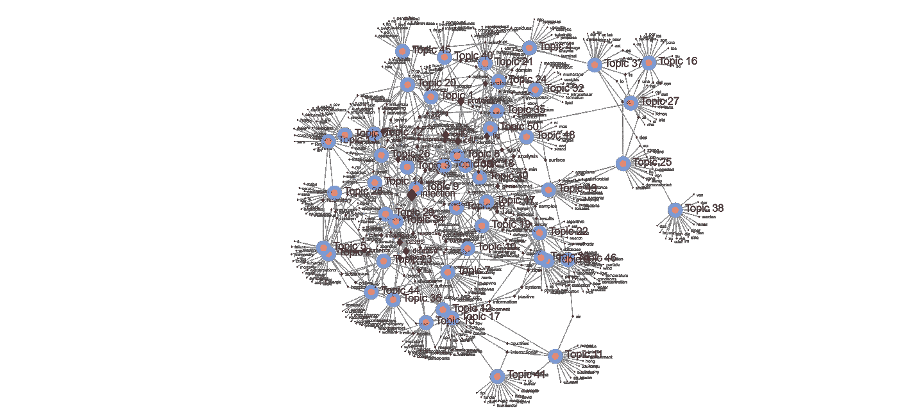

作者图片

你是否曾经拥有大量来自各种来源的文本，并希望分析人们谈论的广泛主题/话题，并将它们分成特定的群组，那么主题建模就是为你准备的。那么什么是主题建模。主题建模是一个统计过程，通过它您可以从给定的文档集合中识别、提取和分析主题。

在本文中，我们将通过一些著名的技术来探索主题建模。

有一个细微的区别，人们可能会感到困惑。和话题分类是不同的还是一样的？首先，主题分类属于有监督的 ML 算法，主题建模属于无监督的 ML 算法。期望你已经知道其中的区别，万一你不知道，把它放在一行程序中主题建模不需要任何预先的训练，不像主题分类。

因为对文本建模不需要任何训练，所以分析数据很容易。但是，谁也不能保证会得到精确的结果。

# 那么它是如何工作的:

主题建模的基本假设是

*   每个文档由主题的[统计混合](https://www.statisticshowto.datasciencecentral.com/mixture-distribution/)(即所有主题的统计分布，可以通过“总结”语料库中覆盖的所有主题的所有分布来获得)

主题建模技术的作用是找出语料库中的文档中存在哪些主题，以及每个主题的优势是什么。

让我们从最著名的 LSA 开始，跳到我们上面讨论过的几个这样的技术。

# 潜在狄利克雷分配(LDA):

潜在狄利克雷分配是一个生成统计模型，它允许通过[未观察到的](https://en.wikipedia.org/wiki/Latent_variable)组来解释观察结果，这解释了为什么数据的某些部分是相似的。它假设任何文档都是主题和短语的组合。它使用优化的 VEM(变分例外最大化)技术来评估整个文本语料库。这可以通过单词排名来克服。然而，这种断言在句子中缺乏语义。我们真的可以更好地了解主题之间的关系。

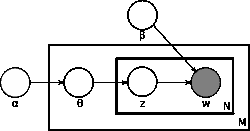

[https://en.wikipedia.org/wiki/Latent_Dirichlet_allocation](https://en.wikipedia.org/wiki/Latent_Dirichlet_allocation)

考虑到车牌符号。盒子是代表“重复实体”或“重复者”的板块外表面/板代表文档，而内表面/板代表给定文档中重复的单词位置。

从出现在特定文档的主题中的狄利克雷分布中，我们抽取随机样本，其中α是表示文档分布的参数。这个话题分布是θ，我们根据这个谓语的分布从中选择一个具体的话题 Z。

接下来，从另一个狄利克雷分布𝛽，像字数分布 Dir(α)，我们挑一个随机样本代表题目 z 的字分布，这个字分布是φ。由此我们选择我们的单词 w。

从文本中产生每个单词的方法包括以下步骤:

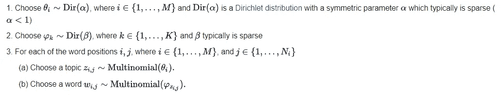

[https://en.wikipedia.org/wiki/Latent_Dirichlet_allocation](https://en.wikipedia.org/wiki/Latent_Dirichlet_allocation)

这里的多项式分布是指只有一个尾迹的多项式，也称为[分类分布](https://en.wikipedia.org/wiki/Categorical_distribution)。

## 代码片段:

你可以使用 [genism](https://radimrehurek.com/gensim/models/ldamodel.html) 软件包，它有一个预定义的 LDA 模型

```
**from** **gensim.test.utils** **import** common_texts
**from** **gensim.corpora.dictionary** **import** Dictionary

*# Create a corpus from a list of texts*
dictionary = Dictionary(common_texts)
corpus = [common_dictionary.doc2bow(text) **for** text **in** common_texts]

*# Train the model on the corpus.*
lda = LdaModel(corpus, num_topics=10)
```

# 潜在语义分析(LSA):

LSA 是一个发现文本及其相关术语之间关系的过程。它意味着具有相似含义的术语也将一起使用(分布假设)。从语料库中构建术语-文档矩阵(行代表单词，列代表每个特定文档)。该矩阵升级为 [tf-idf](https://en.wikipedia.org/wiki/Tf%E2%80%93idf) 矩阵，其中每个单元格确定当前文档中单词的词频/该单词在所有文档中的词频。

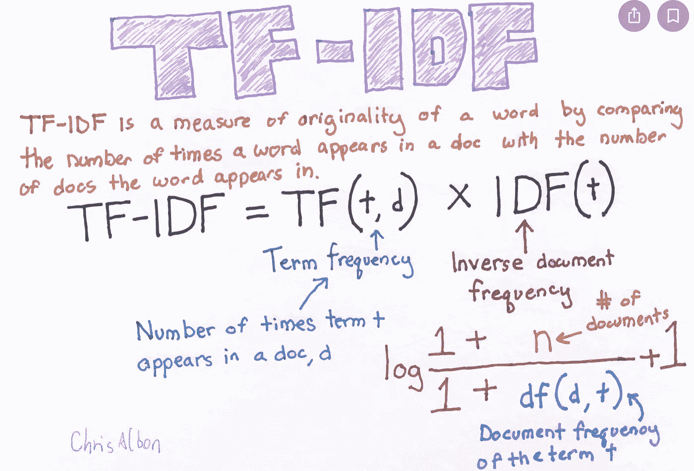

Pic 鸣谢:Chris Albon，[https://towards data science . com/TF-term-frequency-IDF-inverse-document-frequency-from-scratch-in-python-6c2b 61 b 78558](https://towardsdatascience.com/tf-term-frequency-idf-inverse-document-frequency-from-scratch-in-python-6c2b61b78558)

直观地说，如果单词在特定文档中的出现频率高于所有其他文档的出现频率，则该单词可以唯一地在特定主题识别中加权。

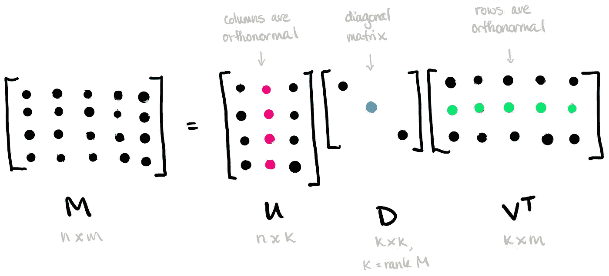

奇异值分解，[https://read01.com/gRK7gJ2.html#.X_17g9gzZEY](https://read01.com/gRK7gJ2.html#.X_17g9gzZEY)

作为锦上添花，我们使用[奇异值分解](https://en.wikipedia.org/wiki/Singular_value_decomposition) (SVD)来最小化矩阵的维数，同时保持列间的相似性。

然后，通过取它们之间角度的余弦(或它们的归一化值之间的点积)来比较文档对。当值接近 1 时，文档非常相似；值接近 0，文档非常不同。

## 代码片段:

你可以使用 [genism](https://radimrehurek.com/gensim/models/ldamodel.html) 软件包，它有一个预定义的 LSA 模型，也就是 LSI(我指的是索引)

```
**from** **gensim.test.utils** **import** common_dictionary, common_corpus
**from** **gensim.models** **import** LsiModel

model = LsiModel(common_corpus, id2word=common_dictionary)
vectorized_corpus = model[common_corpus] 
```

# 概率潜在语义分析(PLSA):

PLSA 是 LSA 的进步。这是一种用于双模式和共现数据分析的[统计技术](https://en.wikipedia.org/wiki/Statistical_technique)。它试图通过用概率模型代替 LSA 中的奇异值分解来发现潜在主题以填充术语-文档矩阵。

考虑到单词和文档之间共现的可能性，PLS 将这些单词和文档共现的概率建模为条件独立的[多项式分布](https://en.wikipedia.org/wiki/Multinomial_distribution)的混合:

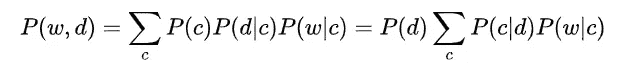

[https://en . Wikipedia . org/wiki/probability _ latent _ semantic _ analysis](https://en.wikipedia.org/wiki/Probabilistic_latent_semantic_analysis)

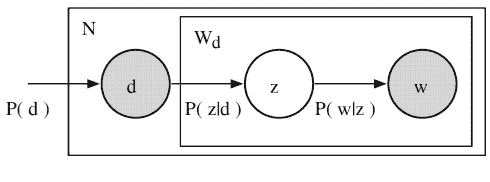

[https://en . Wikipedia . org/wiki/probability _ latent _ semantic _ analysis](https://en.wikipedia.org/wiki/Probabilistic_latent_semantic_analysis)

代表 PLSA 模型的图版符号。(“不对称”提法)。d 是文档向量，z 是单词的主题，w 是从单词的主题分布中抽取的单词，c 是从单词的主题分布中抽取的单词。变量 d 和 W 是可测的，但潜变量的主语是 c/z，这三个值就是我们模型中的参数。P(D)直接从我们的数据库中解析。可以使用[期望最大化](https://en.wikipedia.org/wiki/Expectation%E2%80%93maximization_algorithm)算法(EM)来训练参数 P(Z|D)和 P(W|Z)。EM 是一种为依赖于潜在变量的模型寻找最可能的参数估计的方法。EM 有两个步骤:(I)期望(E)步骤，计算潜在变量的后验概率，(ii)最大化(M)步骤，更新参数。

😂没问题，我并没有钻研太多的数学，现在请查看数学部分的维基链接😂

## 代码片段:

您可以直接使用 PyPI [plsa](https://pypi.org/project/plsa/) 包中的 plsa 模型

```
**from** **plsa** **import** Corpus, Pipeline, Visualize
**from** **plsa.pipeline** **import** DEFAULT_PIPELINE
**from** **plsa.algorithms** **import** PLSAcorpus = Corpus.from_csv(csv_file, pipeline)
n_topics = 5plsa = PLSA(corpus, n_topics, **True**)
result = plsa.fit()
```

# 非负矩阵分解(NMF):

NMF 属于无监督机器学习的范畴。NMF 是一个线性代数算法家族，用于定义结果中的潜在结构。NMF 的工作原理是将高维数组分解成低维数组。分解成两个矩阵 W 和 H，前提是这三个矩阵都由非负元素组成。这里 V 指的是术语文档矩阵，通常是 TF-IDF 标准化。你已经在上面看到了。w 表示找到的主题，H 表示该主题的系数。换句话说，V 按词代表文章(原始文档)，H 按主题代表文章，W 按词代表主题。

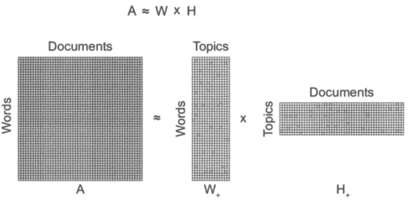

[https://www . researchgate . net/publication/312157184 _ Crime _ Topic _ Modeling/figures？lo=1](https://www.researchgate.net/publication/312157184_Crime_Topic_Modeling/figures?lo=1)

## 代码片段:

参考代码示例链接[https://sci kit-learn . org/stable/auto _ examples/applications/plot _ topics _ extraction _ with _ NMF _ LDA . html](https://scikit-learn.org/stable/auto_examples/applications/plot_topics_extraction_with_nmf_lda.html)

```
**import** **numpy** **as** **np**
X = np.array([[1, 1], [2, 1], [3, 1.2], [4, 1], [5, 0.8], [6, 1]])**from** **sklearn.decomposition** **import** NMFmodel = NMF(n_components=2, init='random', random_state=0)
W = model.fit_transform(X)
H = model.components_
```

# lda2vec:

这个模型可以被认为是 word2vec 模型的扩展，包含了我们上面讨论的 LDA 算法[凭直觉，你已经知道什么是 word2vec。(注:如果你不知道我在说什么，参考这个[word2veclick](https://towardsdatascience.com/introduction-to-word-embedding-and-word2vec-652d0c2060fa))我不会过多讨论 word 2 vec 部分。Word2vec 捕获了清晰的词与词之间的关系，但是产生的向量基本上是不可解释的，并且不代表记录。另一方面，LDA 是非常容易理解的，但是不模拟本地单词关系，比如 word2vec。Lda2vec 是作为一个模型构建的，它创建单词和文档主题，使它们可解释，创建主题，并使它们成为客户机、时间和文档的监督主题。

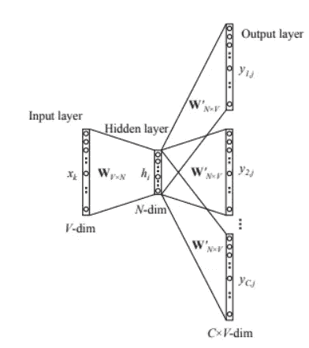

跳格模型，作者图片，

LDA2Vec 是 skip-gram word2vec 算法的修改版本。该模型被学习以基于原始跳格过程中的中枢词来预测背景词。在 lda2vec 中，为了获得背景向量，插入了中枢单词向量和文档向量。为了预测上下文表达式，然后使用这个上下文向量。

像线性判别分析模型一样，将文档向量【参考 [Gidi Shperber](/@gidishperber?source=post_page-----db3e8c0cce5e--------------------------------) 的 [doc2vec](/@amarbudhiraja/understanding-document-embeddings-of-doc2vec-bfe7237a26da) 分解为文档权重向量和主题矩阵。文档权重向量指示讨论了多少不同的主题，而主题矩阵以分类的方式对主题进行分类。因此，通过组合文档出现的不同上下文来构建上下文向量。

简言之

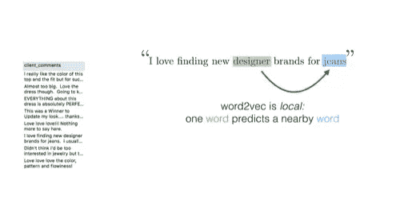

【https://github.com/cemoody/lda2vec 

Word2vec 试图对词与词之间的关系进行建模。

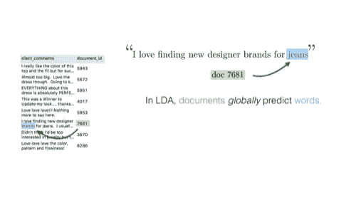

[https://github.com/cemoody/lda2vec](https://github.com/cemoody/lda2vec)

LDA 对文档到单词的关系进行建模。

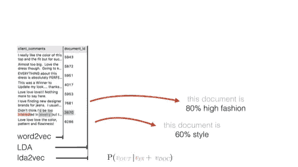

[https://github.com/cemoody/lda2vec](https://github.com/cemoody/lda2vec)

LDA 在每个文档上创建主题。

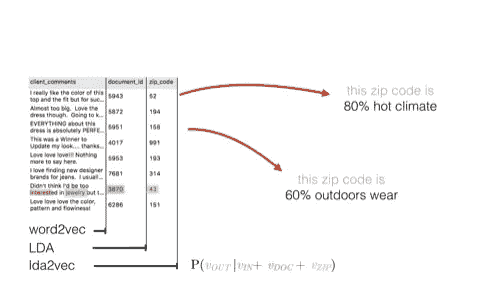

[https://github.com/cemoody/lda2vec](https://github.com/cemoody/lda2vec)

lda2vec 不仅创建文档主题，还创建区域主题。

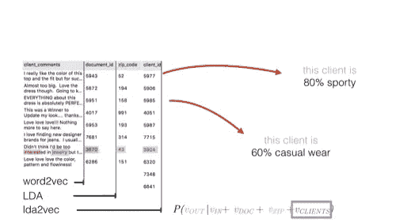

[https://github.com/cemoody/lda2vec](https://github.com/cemoody/lda2vec)

lda2vec 还在客户机上创建主题


[https://github.com/cemoody/lda2vec](https://github.com/cemoody/lda2vec)

在 lda2vec 中，主题可以被“监督”,并被迫预测另一个目标。

GitHub 代码和解释的确认和引用[https://github.com/cemoody/lda2vec](https://github.com/cemoody/lda2vec)。你可能会像我一样喜欢它。

参考 lda2vec 官方文件[https://lda2vec.readthedocs.io/en/latest/?badge=latest](https://lda2vec.readthedocs.io/en/latest/?badge=latest)

```
model = LDA2Vec(n_words, max_length, n_hidden, counts)
model.add_component(n_docs, n_topics, name='document id')
model.fit(clean, components=[doc_ids])
topics = model.prepare_topics('document_id', vocab)
prepared = pyLDAvis.prepare(topics)
pyLDAvis.display(prepared)
```

# 指标:

既然我们已经学习了主题建模的各种技术。我们也需要一些依据来衡量他们的表现。虽然我们很少有方法来衡量主题建模的性能，如目测法，内在评价指标，人工判断，外在评价指标。我想集中讨论两种方法，特别是抽象层次上的困惑和主题连贯性，不要深入探讨。

## 困惑:

困惑是用来衡量一个词的意思的计算方法之一。它捕捉了这个模型对它以前没有见过的新数据有多惊讶，并被计算为拒不接受的测试集的可能性。

困惑度量用于衡量新的、看不见的数据如何影响先前建立的模型的概率。举个例子，这个模型与数据的吻合程度如何？

然而，最近的研究发现，人类的判断并不总是与预测的可能性密切相关。一个例子是优化并不总是产生人类可以解释的主题。

有了话题连贯，我们就有可能模拟人类的决策，这就克服了困惑的局限性，从而产生了话题连贯理论。

## 话题连贯性:

主题连贯的框架包含了从主题连贯和文章整体连贯中得出的各种考虑。它测试样本段落中的术语在上下文中的一致程度。度量允许我们区分语义上可解释的主题和统计推断的对象。它可以被描述为一般的利用或者成对的单词相似性分数的标准。一个成功的模型能够产生连贯的材料。请阅读下面的单词，以获得对这些主题的更详细的描述。

# 致谢和参考:

[](https://en.wikipedia.org/wiki/Expectation%E2%80%93maximization_algorithm) [## 期望值最大化算法

### 在统计学中，期望最大化(EM)算法是一种寻找(局部)最大似然或…

en.wikipedia.org](https://en.wikipedia.org/wiki/Expectation%E2%80%93maximization_algorithm) [](https://en.wikipedia.org/wiki/Probabilistic_latent_semantic_analysis) [## 概率潜在语义分析

### 概率潜在语义分析(PLSA)，也称为概率潜在语义索引(PLSI，尤其是…

en.wikipedia.org](https://en.wikipedia.org/wiki/Probabilistic_latent_semantic_analysis) 

[https://pypi.org/project/plsa/](https://pypi.org/project/plsa/)https://arxiv.org/abs/1301.6705T2

[](https://scikit-learn.org/stable/modules/generated/sklearn.decomposition.NMF.html) [## sk learn . decomposition . NMF-sci kit-learn 0 . 24 . 0 文档

### 非负矩阵分解(NMF)。找出两个非负矩阵(W，H ),它们的乘积逼近非负矩阵的乘积

scikit-learn.org](https://scikit-learn.org/stable/modules/generated/sklearn.decomposition.NMF.html) [](https://en.wikipedia.org/wiki/Non-negative_matrix_factorization#:~:text=Non%2Dnegative%20matrix%20factorization%20%28NMF,matrices%20have%20no%20negative%20elements.) [## 非负矩阵分解

### 非负矩阵分解(NMF 或 NNMF)，也非负矩阵近似是一组算法在…

en.wikipedia.org](https://en.wikipedia.org/wiki/Non-negative_matrix_factorization#:~:text=Non%2Dnegative%20matrix%20factorization%20%28NMF,matrices%20have%20no%20negative%20elements.) [](https://towardsdatascience.com/evaluate-topic-model-in-python-latent-dirichlet-allocation-lda-7d57484bb5d0) [## 评估主题模型:潜在狄利克雷分配(LDA)

### 构建可解释主题模型的分步指南

towardsdatascience.com](https://towardsdatascience.com/evaluate-topic-model-in-python-latent-dirichlet-allocation-lda-7d57484bb5d0) [](http://www.aclweb.org/anthology/N10-1012) [## 话题连贯性的自动评估

### 戴维·纽曼，刘济汉，卡尔·格里泽，蒂莫西·鲍德温。人类语言技术:2010 年年度会议…

www.aclweb.org](http://www.aclweb.org/anthology/N10-1012) [](https://github.com/cemoody/lda2vec) [## cemoody/lda2vec

### lda2vec 模型试图将 word2vec 和 lda 的最佳部分混合到一个框架中。word2vec 捕捉强大的…

github.com](https://github.com/cemoody/lda2vec) [](https://towardsdatascience.com/lda2vec-word-embeddings-in-topic-models-4ee3fc4b2843) [## LDA2vec:主题模型中的词嵌入

### 了解有关 LDA2vec 的更多信息，LDA 2 vec 是一种与狄利克雷分布潜在向量联合学习密集词向量的模型…

towardsdatascience.com](https://towardsdatascience.com/lda2vec-word-embeddings-in-topic-models-4ee3fc4b2843) [](https://towardsdatascience.com/tf-term-frequency-idf-inverse-document-frequency-from-scratch-in-python-6c2b61b78558) [## python 中从头开始的 TF(词频)-IDF(逆文档频)。

### 从头开始创建 TF-IDF 模型

towardsdatascience.com](https://towardsdatascience.com/tf-term-frequency-idf-inverse-document-frequency-from-scratch-in-python-6c2b61b78558)