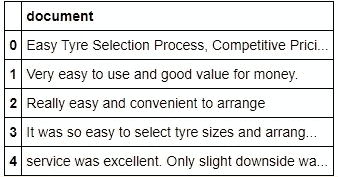

# 使用 LDA 的主题建模

> 原文：<https://medium.com/analytics-vidhya/topic-modelling-using-lda-aa11ec9bec13?source=collection_archive---------0----------------------->

照片由[edu·格兰德](https://unsplash.com/@edgr?utm_source=medium&utm_medium=referral)在 [Unsplash](https://unsplash.com?utm_source=medium&utm_medium=referral) 上拍摄

自然语言处理中的主题建模是一种基于出现的词将主题分配给给定语料库的技术。主题建模很重要，因为在这个充满数据的世界里，对文档进行分类变得越来越重要。例如，一家公司收到数百条评论，那么对该公司来说，知道哪些类别的评论更重要是很重要的，反之亦然。

在本文中，我们将看到以下内容:

1.  皱胃向左移
2.  LDA 中的超参数
3.  Python 中的 LDA
4.  LDA 的缺点
5.  供选择的

主题可以被认为是描述文档的*关键词*，例如，对于一个主题，我们脑海中浮现的单词是排球、篮球、网球、板球等。一个**主题模型**是一个模型，它可以根据文档中出现的单词自动检测主题。

值得注意的是，主题建模不同于主题分类。主题分类是一种监督学习，而主题建模是一种非监督学习算法。

一些众所周知的主题建模技术有

1.  潜在语义分析(LSA)
2.  概率潜在语义分析(PLSA)
3.  潜在狄利克雷分配
4.  相关主题模型(CTM)

在本文中，我们将重点讨论 LDA

主题建模。图片来自 [pyGotham](http://chdoig.github.io/pygotham-topic-modeling/#/)

# 潜在狄利克雷分配

LDA 是潜在狄利克雷分配的缩写，是一种用于主题建模的技术。首先，让我们把这个词分解一下，理解 LDA 是什么意思。潜在的意思是隐藏的，尚未被发现的东西。狄利克雷指出模型*假设*文档中的主题和那些主题中的单词遵循狄利克雷分布。分配意味着给予一些东西，在这种情况下是话题。

艾达。图片由[金等人](https://www.researchgate.net/publication/336065245_Insider_Threat_Detection_Based_on_User_Behavior_Modeling_and_Anomaly_Detection_Algorithms)拍摄。

LDA 假设使用统计生成过程生成文档，使得每个文档是主题的混合，并且每个主题是单词的混合。

在下图中，文档由 10 个单词组成，可以分为 3 个不同的主题，这三个主题都有自己的描述词。

文档生成假设。图片来自[我的大学](https://www.mygreatlearning.com/blog/understanding-latent-dirichlet-allocation/)。

LDA 中的一般步骤如下

图片来自我伟大的学识

# LDA 中的超参数

LDA 中有三个超参数

1.  α →文件密度系数
2.  β →主题词密度因子
3.  K →所选主题的数量

**α** 超参数控制文档中期望的主题*的数量*。 **β** 超参数控制文档中每个主题的单词分布， **K** 定义我们需要抽取多少个主题。

# Python 中的 LDA

让我们来看一个 LDA 的实现。我们将尝试从一组评论中提取主题。

我们将要处理的数据集是一组评论，如下所示:

资料组

## 特征提取:

这一步与 LDA 无关，请直接跳到矢量化。

首先，我们将进行特征提取，以获得一些对数据有意义的见解。

我们提取了以下特征

1.  文件中的字数
2.  文档中的字符数
3.  文档的平均单词长度
4.  存在的停用词数量
5.  数字字符的数量
6.  上限字符数
7.  两极情绪

## 数据清理和预处理:

在数据清理和预处理中，我们做了以下工作

1.  使所有字符都变成小写
2.  扩展了简短形式，如*我会→我会*
3.  删除了特殊字符
4.  删除了多余的空格和尾随空格
5.  删除了重音字符并用它们的替代字符替换它们
6.  将单词词条化
7.  删除了停用词

## 矢量化:

由于 LDA 有一个内置的 TF-IDF 矢量器，我们将不得不使用计数矢量器。

## 潜在狄利克雷分配；

在这个例子中，我们已经知道了主题的数量，所以我们不需要调整超参数 **k** ，但是当我们不知道主题的数量时，我们可以使用网格搜索。

这可以按如下方式完成

网格搜索如下所示

我们模型的动机如下:

*   由于我们知道主题的数量，我们将使用主题数量为 12 的潜在狄利克雷分配。
*   我们也不需要比较不同的模型来获得最佳数量的主题
*   我们将使用 *random_state* ，以便可以重现结果
*   我们将把模型拟合到矢量化数据中，并对其进行转换
*   拟合模型后，我们将打印每个主题的前 10 个单词
*   获得主题后，我们将创建一个新的列并分配主题

## 主题作业:

要分配主题，我们可以执行以下操作:

1.  查看每个主题的单词云
2.  查看前 10 个单词
3.  寻找 KERA →报道和文章的关键词提取

要做词云，我们可以简单的导入词云库。

要了解更多关于 KERA 的情况，可以参考 Maiya 等人的论文“高度异构的文献集合的探索性分析”这个[链接](https://arxiv.org/abs/1308.2359)，它在 arXiv 上。

摘要如下

> 我们提出了一个有效的多方面系统，用于高度异构的文档集合的探索性分析。我们的系统是基于以完全自动化的方式智能地标记单个文档，并在强大的多面浏览框架中利用这些标记。所采用的标记策略包括基于机器学习和自然语言处理的无监督和有监督方法。作为我们的关键标记策略之一，我们引入了 KERA 算法(为报告和文章提取关键词)。KERA 以一种完全无监督的方式从单个文档中提取主题代表术语，并且被证明比最先进的方法有效得多。最后，我们评估了我们的系统在帮助用户定位深埋在大量异构信息海洋中的军事关键技术相关文档方面的能力。

## 模型中的问题:

*   我们必须用提供的主题手动分配主题，这可能会导致错误
*   无法检查分配的主题是否正确
*   只分配一个主题，而理想情况下，它应该取决于什么最匹配。
*   在一些文档中，所有的主题都有可能导致问题，因为我们只选择了最大值
*   有些词与主题无关，如*折扣*、*日期变更*

# LDA 的缺点:

1.  LDA 在小文本上表现不佳；我们的大部分数据都很短。
2.  由于评论不连贯，LDA 发现确定主题更加困难
3.  由于评论主要是基于上下文的，因此基于单词共现
    的模型失败了。

# 备选方案:

我们可以使用 BERT 来做更好的主题建模，这将在以后讨论:)

# 资源:

*   [为 scikit 选择正确的主题数量-学习主题建模|新闻数据科学(investigate.ai)](https://investigate.ai/text-analysis/choosing-the-right-number-of-topics-for-a-scikit-learn-topic-model/)
*   [上下文主题识别。为…确定有意义的主题|作者:Steve Shao | Insight(insightdatascience.com)](https://blog.insightdatascience.com/contextual-topic-identification-4291d256a032)
*   [sk learn . decomposition . latentdirichletallocation—sci kit-learn 0 . 24 . 2 文档](https://scikit-learn.org/stable/modules/generated/sklearn.decomposition.LatentDirichletAllocation.html)
*   [https://www.youtube.com/watch?v=T05t-SqKArY](https://www.youtube.com/watch?v=T05t-SqKArY&t=13s)
*   [使用 Python 和 NLTK p.1 对单词和句子进行标记的自然语言处理— YouTube](https://www.youtube.com/watch?v=FLZvOKSCkxY&t=21s)
*   [NLP 教程 13 —完整文本处理|端到端 NLP 教程|面向所有人的 NLP | KGP 有声— YouTube](https://www.youtube.com/watch?v=VyDmQggfsZ0)
*   [组织机器学习项目:项目管理指南|作者 Gideon Mendels | comet . ml | Medium](/comet-ml/organizing-machine-learning-projects-project-management-guidelines-2d2b85651bbd)
*   和许多堆栈溢出问题。

感谢您的阅读:)

由 [Kelly Sikkema](https://unsplash.com/@kellysikkema?utm_source=medium&utm_medium=referral) 在 [Unsplash](https://unsplash.com?utm_source=medium&utm_medium=referral) 上拍摄的照片