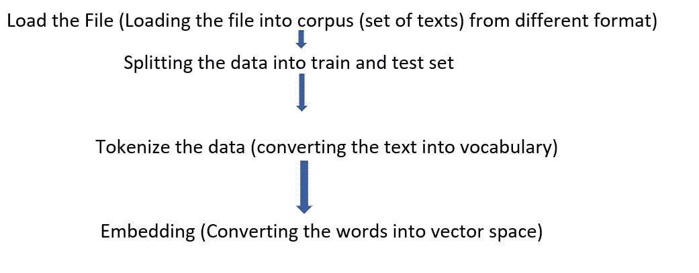
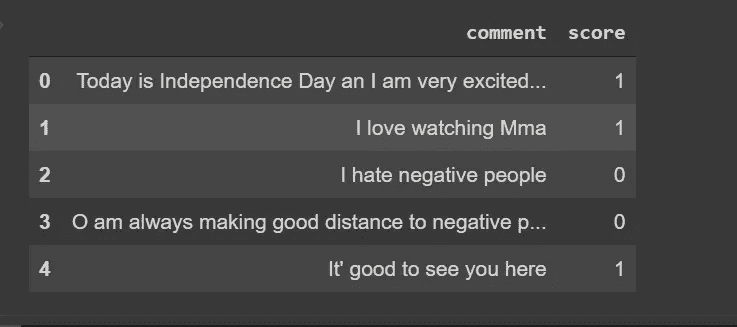
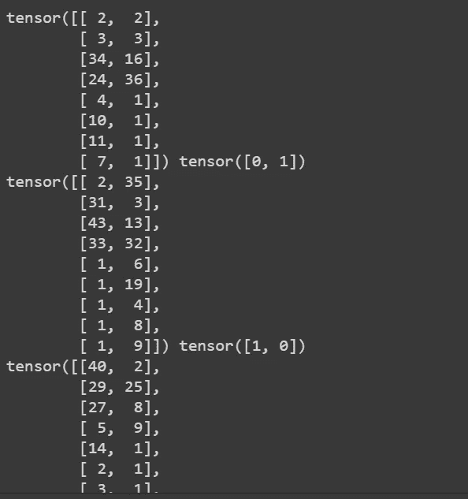

# 火炬文:不那么受欢迎的图书馆

> 原文：<https://medium.com/analytics-vidhya/torch-text-not-so-popular-library-8cf2dbaba956?source=collection_archive---------4----------------------->


基本介绍

> **什么是火炬文字？**

如果你已经在 NLP 中完成了一些基本的预处理任务，那么你可能知道 NLTK，Spacy，Textblob，Stanford NLP，这些都是强大的文本预处理库。但是在 pytorch 的情况下，我们有专门的库来处理从加载数据到嵌入文本的所有文本预处理步骤。



图:火炬文本使用的步骤

```
from torchtext.legacy.data import Field , TabularDataset
from torchtext.legacy.data import BucketIterator
```

`Field`将指定如何进行准备。`TabularDataset`用于从不同的文件格式如`json,csv,tsv,text`等加载数据集， `BucketIterator`帮助在给定的数据集中进行批处理和填充。让我们举个例子来理解给定的库。让我们开始吧……

```
#overview of data
import pandas as pd
data=pd.read_csv('train.csv')
data.head()
```



图 1

```
tokens=lambda x:x.split()
comment=Field(sequential=True,use_vocab=True,tokenize=tokens,  
                                              lower=True)
score=Field(sequential=False,use_vocab=False)
fields={'comments':('c',comment),'score':('s',score)}
```

`Sequential`如果这为真，那么它将对文本进行分词，否则不会执行分词。变量`fields`中的列将采用与数据集中相同的格式。

```
train_set,test_set=TabularDataset.splits(path='/content',
                                          format='csv',
                                          train='train.csv',
                                          test='test.csv',
                                          fields=fields)
```

在`TabularDataset`的帮助下，我加载了数据集，并分成训练集和测试集。

```
comment.build_vocab(train_set,
                    max_size=100,
                    min_frequency=1)
```

这里`max_size`允许我们选择有限的词汇量。意味着我们将只为前 100 个出现的单词构建词汇表，而`min_freq=2`提供了只为那些在给定数据集中至少出现两次的单词构建词汇表的灵活性。

```
train_iter,test_iter=BucketIterator.splits((train_set,test_set),
                                            batch_size=2)
for i in train_iter:
    print(i.c,i.s)
```



结果

结论:-

这都是我这边的。请在评论框中给你宝贵的建议。这个博客的全部功劳归于**阿拉丁·佩尔森。**