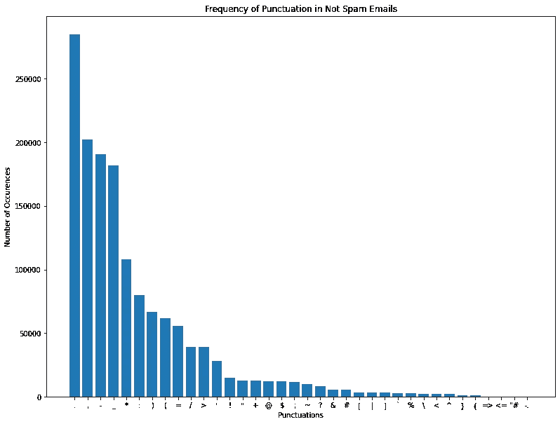
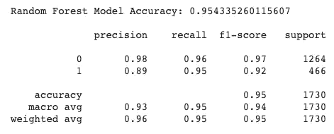

# 迈向没有垃圾的收件箱:一种机器学习方法

> 原文：<https://medium.com/analytics-vidhya/towards-an-inbox-without-junk-a-machine-learning-approach-af32a5ed3abd?source=collection_archive---------18----------------------->

## 使用监督和深度机器学习算法从头开始设计垃圾邮件过滤系统


来源:如何极客

在每天发送的 3000 多亿封电子邮件中，至少有一半是垃圾邮件。作为一名 Gmail 用户，我有时会想当然地认为自己节省了多少时间，因为谷歌完成了过滤收件箱中所有垃圾邮件的巨大任务，只留下真正重要的邮件。

这让我想到:*谷歌用什么算法来自动检测垃圾邮件？*从赢得国家彩票的机会，到获得当地诊所的免费面部护理，垃圾邮件的形式多种多样。这使得垃圾邮件和非垃圾邮件之间的界限变得模糊，更不用说由于不断发展的趋势，这些标准必须随着时间的推移而改变。在这一点上，说垃圾邮件检测困难是轻描淡写的。

应对这一挑战的最佳方式之一是通过机器学习。我已经训练了**八个**有监督的机器学习模型，它们将在准确度、精确度、时间和误差方面进行评估和相互比较。

参考我用来建立我的模型的数据集[这里](https://www.kaggle.com/nitishabharathi/email-spam-dataset)。该数据集汇编了来自两个不同来源的**垃圾邮件与“ham”**(或非垃圾邮件)电子邮件:LingSpam 和垃圾邮件刺客数据集。通过这种方式，我们可以接触到各种各样的例子，这些例子可以用来训练我们的模型。所有代码和数据集的副本也可以在我的 [GitHub 库](https://github.com/maytanti/Email-Spam-Classification)中找到。

# **探索性数据分析**

## 为了更好的理解数据，我们先来探究一下。


**图 1:** 垃圾邮件和非垃圾邮件的分布

查看垃圾邮件到业余电子邮件的分布，我们发现垃圾邮件比业余电子邮件少。事实上，垃圾邮件仅占整个数据集的四分之一左右。在将数据分成训练集和测试集时，以及在评估模型时，我们必须记住这一点。


**图 2:** 非垃圾邮件中常见的停用词**(左)**。**图 3:** 垃圾邮件中常见的停用词**(右)**。

接下来，我们必须考虑垃圾邮件中**停用词**出现的模式，与垃圾邮件进行比较。停用词通常指的是一种语言中最常见的词，如{t *he，of，*或*and【T5 }。从*图 2* 和 *3* 中，我注意到垃圾邮件和垃圾邮件都有最常见的关键词。这验证了停用词在确定电子邮件是垃圾邮件还是垃圾邮件时没有权重，因此可以被删除。*

理论上，在处理数据时，应该过滤掉停用词，以便潜在地帮助提高性能，因为剩下的词越来越少，而且只有有意义的词。这有助于提高我们模型的准确性。虽然没有所有自然语言处理工具都使用的单一通用停用词列表，但有许多工具可以帮助识别常用停用词。我使用了来自 **NLTK 的*停用词库*。**



**图 4:** 非垃圾邮件中标点符号出现的频率**(左)**。**图 5:** 垃圾邮件中标点符号出现频率**(右)**。

标点符号表现出类似的趋势，这意味着它们也可以在数据预处理中被去除。

# **数据预处理**

为了将数据准备到训练集和测试集中，我必须:

1.  删除所有 URL。
2.  移除所有符号。
3.  将所有字符转换成小写。
4.  **分词**单词。
5.  **将**的单词进行词条整理。
6.  删除停用词。

听起来有点奇怪的两个步骤是**标记化**和**词汇化**。

单词标记化(tokenization)是将大样本文本分割成单个单词的过程。**词汇化**是利用特定语言的词典，将单词转换回其基本形式。在 **NLTK** 库的帮助下，简化了术语化的实现。

## 想象我们目前所拥有的。


**图 6:** 非垃圾邮件中最常见的单词、数字或字符序列


**图 7:** 垃圾邮件中最常见的单词、数字或字符序列

即使当我们的数据集由 **90，000+** 个独特的单词组成时，垃圾邮件中最常见的单词通常也是垃圾邮件“触发”单词本身。这些都是像{ *免费*、*地址*、*金钱*、*订单*或者*点击*这样的话。虽然*图 6* 和 *7* 只显示了这些词的出现频率，但在对垃圾邮件检测系统进行分类时，有了这种意识可能会改善我们的决策。


**图 8:** 垃圾邮件词云

垃圾邮件中提到的更多种类的常用词在这个词云中表示。

# 列车测试分离

尽管近年来自然语言处理取得了许多进步，**人工智能算法仍然不像我们一样理解语言。**因此，在我们开发任何模型之前，我们必须将我们的数据转换为我们的机器学习算法可以理解的格式。

为了将每封电子邮件组织成与建模兼容的格式，我们需要一些特征提取层来将单词转换成整数或浮点数。这可以通过矢量化来实现，也就是将一组文本转化为数字特征向量的过程。我使用**计数矢量器**将每个条目表示为一个向量，该向量基于在数据集中找到的 **20，000 个最常见单词**的词频(忽略单词的相对位置信息)形成。

为了公平地评估我们的模型，我们必须分离一部分数据，以便可以根据我们训练的模型对其进行测试。我已经将 **80%** 的数据分配到**训练**数据集，剩下 **20%** 给**测试**数据集。我还使用了**随机状态**的 **42** 来确保我生成的分割是可重复的。

正如之前在讨论图 1 时所述，确保训练集和测试集之间的数据分布相似非常重要，尤其是当数据集只有四分之一是垃圾邮件时。这可以通过使用我已经实现的**分层参数**来实现。

## 现在，让我们训练一系列模型来找到最有效的垃圾邮件与火腿分类器。

# **一、虚拟分类器……又名基准。**

## 让我们从基线模型开始。

我使用**最频繁**策略构建了虚拟分类器，其中模型每次都采用最频繁出现的事件(即 ham)并预测结果。


**图 9:** 虚拟分类器的混淆矩阵

请注意，测试准确率约为 73%,这一数据与垃圾邮件占电子邮件总数的比例非常接近。

## 关键数据。

**测试精度:73.06**

# 二。朴素贝叶斯

朴素贝叶斯分类器是一个简单的“概率分类器”家族，基于应用贝叶斯定理，具有特征之间的强独立性假设。有关该理论的更清晰的解释，请参考本文。


**图 10:** 朴素贝叶斯模型分类报告


**图 11:** 朴素贝叶斯模型的混淆矩阵

关于该模型的一些关键见解是，它的运行速度非常快，只有 1.9 秒。然而，该模型的准确性仍有待提高。我们看到，该模型有 255 个误报预测(预测为垃圾邮件，但实际上是垃圾邮件)，这不应该被轻视，因为如果分类不正确，用户可能会完全错过一封重要的电子邮件，并将其发送到很少检查的垃圾邮件文件夹。

## 关键数据。

**生成模型所用时间:** 1.9 秒

**测试精度:** 82.49%

**精度得分:** 0.62

**测试 RMSE:** 0.4185

# 三。逻辑回归

逻辑回归是二元分类问题的首选方法。它使用 sigmoid 函数，这是一条 S 形曲线，其值介于 0 和 1 之间。这对我们的数据来说是完美的，因为这个范围之间的数字反映了数据点被分类为垃圾邮件的概率。点击了解更多信息[。](https://machinelearningmastery.com/logistic-regression-for-machine-learning/#:~:text=Logistic%20regression%20is%20another%20technique,problems%20with%20two%20class%20values).&text=The%20many%20names%20and%20terms,like%20log%20odds%20and%20logit).)


**图 12:** 逻辑回归模型分类报告


**图 13:** 逻辑回归模型的混淆矩阵

逻辑回归似乎是最适合我们数据集的模型之一。该模型的测试准确率为 96.13%，生成时间仅为 15 秒左右。我们的精度分数 0.90 似乎也比朴素贝叶斯高得多。

## 关键数据。

**生成模型所用时间:** 15.07 秒

**检测准确率:** 96.13%

**精度得分:** 0.90

**测试 RMSE:** 0.1968

# 四。决策图表

决策树以树结构的形式建立分类或回归模型。它将一个数据集分解成越来越小的子集，与此同时，一个相关的决策树被增量开发。更多信息请参考本文。

## 基本估计量。

首先，我使用默认参数构建模型。


**图 14:** 决策树(基础估计器)模型分类报告


**图 15:** 决策树(基础估计器)模型的混淆矩阵

## 修剪过的树:通过阿尔法正则化。

Alpha 是一种用于修剪决策树的机制。为了降低树的复杂性并避免过度拟合，我通过减少节点层来正则化基本估计器模型，这由 Alpha 控制。


**图 16:** 训练集和测试集的精度与 Alpha 的关系**(左)**。放大版确定峰值测试精度**(右)**。

为了确定树的精度峰值在哪里，我绘制了一个阶跃函数，表示基于给定 Alpha 的精度变化，范围从 *1e-6* 到 *2e-2* ，包括 0。从图 16*，*中可以明显看出，测试精度有了初步提高。放大那个区域后，我确定理想的 Alpha 值应该是 ***9.04e-4*** 。


**图 17:** 细化决策树模型分类报告


**图 18:** 细化决策树模型的混淆矩阵

尽管生成模型所需的时间保持不变，但改进后的模型似乎比其基本估计值更精确一些。我发现值得注意的是，由于减少了 10 个以上的假阳性预测，精确度分数增加了 2%，这是一个非常重要的指标。无论如何，模型的准确度和精确度分数都没有打败逻辑回归。

## 关键数据。

**生成模型所用时间:** 18.25 秒

**测试准确率:** 92.43%

**精度得分:** 0.82

测试 RMSE: 0.2752

# 动词 （verb 的缩写）随机森林

随机森林是一种用于分类的集成学习方法，它通过在训练期间构建许多决策树并输出各个树的模式类或平均预测来进行操作。除了对来自引导的数据进行采样，随机森林还对用于构建每棵树的特征进行采样。点击了解更多信息[。](https://towardsdatascience.com/understanding-random-forest-58381e0602d2)

## 基线模型。


**图 19:** 基线随机森林模型分类报告


**图 20:** 基线随机森林模型的混淆矩阵

## 改进的模型:用外袋评分来调整。

为了测量我们的基线模型的预测误差，并使其规则化，我使用了**出袋(OOB)误差**。Bagging 使用带替换的子采样来创建模型学习的训练样本。简单地说，OOB 是在任何二次抽样中都没有选择的数据点。


**图 21:** 不同取样数量的随机森林出袋误差最大特征**(左)。图 22:** 基于树木数量的增加而变化的出袋误差率:n_estimators ϵ [10，600] **(右)**。

从*图 21* ，将 **max_features** 设置为**‘sqrt’**选项(特征总数的平方根)将产生最低的 OOB 错误率。我们还可以从图 22 中看到,‘sqrt’max _ features 的 OOB 错误率在大约 250 n_estimators 处开始达到平稳状态。当在进一步训练模型时考虑收益递减时，这将是一个合理的停止点。这些关键特征将用于改进我们的模型。



**图 23:** 细化随机森林模型分类报告


**图 24:** 细化随机森林模型的混淆矩阵

在优化模型后，我注意到在准确率和精度得分上有微小的改进，这两者最终都无法击败逻辑回归。除此之外，该模型的训练时间几乎增加了 3 倍，从仅 35 秒跃升至 99 秒。

## 关键数据。

**生成模型所用时间:** 99.62 秒

**测试准确率:** 95.43%

**精度得分:** 0.89

测试 RMSE: 0.2164

# 不及物动词 XGBoost

XGBoost，极限梯度提升，在梯度提升框架下实现机器学习算法。参考[这篇文章](https://machinelearningmastery.com/gentle-introduction-xgboost-applied-machine-learning/)获得完整的解释。

为了识别一封电子邮件是否是垃圾邮件，我决定使用带有逻辑回归目标**的 **XGB 分类器**作为最佳匹配。通过一系列试验，我确定理想的参数集是:最大特征的 30%，学习率为 0.1，Alpha 为 10，最大深度为 10，以及 159 次迭代的**n _ estimators**。**


**图 25:** XGBoost 模型分类报告


**图 26:**XGBoost 模型的混淆矩阵

## 通过 K-fold 交叉验证来验证模型。

XGBoost 模型使用内置的 [K 倍交叉验证](https://machinelearningmastery.com/k-fold-cross-validation/)进行评估，并启用早期停止。通过早期停止，XGBoost 模型被正则化为 159 次迭代。*图 27* 通过证明 RMSE 的训练和测试已经达到平稳状态，进一步证实了这一点。通过外推法，很明显，进一步的迭代对整体性能的改善可以忽略不计。


**图 27:** 随着模型迭代次数增加，变化的训练和测试意味着 RMSE。

令我惊讶的是，这个模型运行了相当长的时间，总计大约 8 分半钟。虽然它的测试准确度和精度分数超过了决策树和随机森林模型，但它仍然无法击败逻辑回归。更不用说光是训练 XGBoost 模型就要花费 **33 倍的时间**！

## 关键数据。

**生成模型所用时间:** 505.92 秒

**测试准确率:** 96.07%

**精度得分:** 0.89

**测试 RMSE:** 0.1983

# 七。基本序列神经网络模型

序列是神经网络模型的较简单形式之一。它允许我们一层一层地建立模型。每一层都有与其下一层相对应的权重。参见[本文](https://towardsdatascience.com/sequence-models-and-recurrent-neural-networks-rnns-62cadeb4f1e1#:~:text=Recurrent%20Neural%20Network%20(RNN)%20is%20a%20Deep%20learning%20algorithm%20and,Natural%20Language%20Processing%20(NLP).&text=In%20RNN%20loss%20function%20is,loss%20at%20each%20time%20step.)进一步了解。

我实现了一个由五层组成的序列神经网络模型。最后一层保存 sigmoid 激活函数，该函数在逻辑回归后建模。

```
model = Sequential()model.add(Dense(units=20000,activation='relu'))model.add(Dropout(0.5))model.add(Dense(units=10000,activation='relu'))model.add(Dropout(0.5))model.add(Dense(units=2500,activation='relu'))model.add(Dropout(0.5))model.add(Dense(units=1000,activation='relu'))model.add(Dropout(0.5))model.add(Dense(units=1,activation='sigmoid'))model.compile(loss='binary_crossentropy', optimizer='adam', metrics=['accuracy'])K.set_value(model.optimizer.learning_rate, 0.0001)early_stop = EarlyStopping(monitor='val_loss', mode='min', verbose=1, patience=10)history = model.fit(x=X_train,y=y_train,epochs=11,validation_data=(X_test, y_test), verbose=1,callbacks=[early_stop])
```

需要注意的一些重要特性是:

*   每层的 Drop out = 0.5(防止依赖任何单个节点)
*   损失=二元交叉熵(分类问题的理想损失函数)
*   优化器= Adam
*   学习率= 0.0001(默认学习率为训练和验证提供了相当低的准确度)
*   纪元= 11
*   启用提前停止


**图 28:** 基本序贯神经网络模型分类报告


**图 29:** 基本序列神经网络模型的混淆矩阵

到目前为止，这个模型在准确性方面表现最好，比逻辑回归模型高出不到一个百分点。然而，它的精度分数仍然低 0.01。考虑到生成这个模型花费了多长时间(将近**两个小时**相比之下仅仅**十五秒**，用神经网络模型处理这个问题可能是不可行的。


**图 30:** 模型迭代的精度和损失图(对于基本的顺序神经网络)

迭代过程中模型的训练和验证性能图描绘了验证准确性和损失的显著波动。这说明我们模型的训练过程还是有些不稳定。

## 关键数据。

**生成模型所用时间:** 5602.89 秒

**测试准确率:** 96.18%

**精度得分:** 0.89

**测试 RMSE:** 0.1953

## 既然神经网络表现最好，我们再进一步如何？

# 八。**递归神经网络(LSTM)**

## 或许，单词的顺序很重要。

所有先前模型的限制之一是单词的顺序如何不传播到训练过程。相反，每个模型完全依赖于每个单词的出现。

为了解决这个问题，我引入了一种新的数据结构化方法:**带预填充的单热点向量**。

在自然语言处理中，一个热点向量是一个 1 × N 矩阵，用于将词汇表中的每个单词与词汇表中的每个其他单词区分开。每个单词被分配一个特定的整数，整个邮件由一系列数字表示。

## 长短期记忆(LSTM)

长短期记忆(LSTM)是一种用于深度学习领域的人工**递归神经网络(RNN)** 架构。与标准的前馈神经网络不同，LSTM 有反馈连接。

一个普通的 LSTM 单元由一个**单元**、一个**输入门**、一个**输出门**和一个**遗忘门**组成。该单元记忆任意时间间隔内的值，三个*门*调节进出该单元的信息流。

与传统的分类器不同，LSTM 有能力学习手工制作的抽象特征，这使它们非常适合基于时间序列排序数据(如一次性向量)对预测进行分类。点击了解更多关于 LSTM [的信息。](https://towardsdatascience.com/illustrated-guide-to-lstms-and-gru-s-a-step-by-step-explanation-44e9eb85bf21)

下面是我实现的模型(使用与前面的神经网络模型相同的评估指标)。请注意，我指定了 100 个隐藏节点，以及层间 0.3 的丢失率。该模型的学习率比前一个模型(0.001)高一个数量级。指定了十五个纪元。

```
embedding_feature_vector = 40
model = Sequential()
model.add(Embedding(vocab_size,embedding_feature_vector,input_length=sent_length))
model.add(Dropout(0.3))
model.add(LSTM(100))
model.add(Dropout(0.3))
model.add(Dense(1,activation=’sigmoid’))model.compile(loss=’binary_crossentropy’,optimizer=’adam’,metrics=[‘accuracy’])history = model.fit(X_train, y_train, validation_data=(X_test,y_test), epochs=15, batch_size=64)
```


**图 31:** LSTM 神经网络模型分类报告


**图 32:**LSTM 神经网络模型的混淆矩阵

令人惊讶的是，LSTM 模型产生了与先前的神经网络模型相当的结果。但是，精确度分数有所提高。这是值得注意的，因为将非垃圾邮件归类为垃圾邮件的错误代价非常高。随着假阳性病例的减少，这种模式盛行。这种模式的一个局限是训练时间:七个半小时，这个数字惊人**。**(对，你没看错。*小时*！)

## 从长远来看，这比逻辑回归模型长 1745 倍。


**图 33:** 模型迭代的精度和损失图(针对 LSTM 神经网络)

将*图 33* 与之前模型的*图 30* 进行比较，验证损失函数大幅平滑，波动范围仅为 0.1-0.15，而之前为 0.1-0.35。这是支持更成功的神经网络训练程序的证据。

## 关键数据。

**生成模型所用时间:** 26309.92 秒

**测试准确率:** 96.18%

**精度得分:** 0.90

**测试 RMSE:** 0.1953

# 把这些放在一起。

## 那么，我们如何决定哪种模式效果最好呢？

毫无疑问，准确性是一个需要考虑的重要指标，但是它并不总是给出全部情况。

除了准确性之外，评估每个分类模型的一些最重要的指标是生成模型所花费的**时间**、**测试均方根误差(RMSE)** 和**精度分数**。

精确度分数使用以下公式计算:

*精度= TP / (TP + FP)*

对于这个特定的模型，我们希望最大化精度分数，因为将非垃圾邮件发送到垃圾邮箱对用户来说是非常昂贵的。就我个人而言，我很少检查我的垃圾邮件信箱——可能一个月最多一两次。如果一封非垃圾邮件被错误分类，普通用户可能看不到它。反过来，如果偶尔有一两封垃圾邮件出现在我们的收件箱里，成本也不会那么高。

正因为如此，我们必须更加重视降低假阳性率，因此强调精确评分。

## 每个模型的摘要和关键指标。


**图 34:** 带有关键指标的每个模型的摘要

最终，**的**在**精度、**和**精度**方面表现最好。但是，**它的致命缺陷是生成模型**的时间。神经网络模型有许多参数需要修改。也许，如果我们花更多的时间来微调这些参数，我们可能会得到一个更快、更准确、性能更好的模型。

除了虚拟分类器和朴素贝叶斯模型，RMSE 相对较低，具有可比性。我们看到，平均而言，我们预测的偏差在 15–30%之内。即使两个神经网络模型在 RMSE 方面表现最佳，这些数字也仅略低于其他模型，这表明这一指标的改善更难实现。

在构建机器学习模型时，定义一个明确的目标很重要。如果目标是实现最大潜力，那么 LSTM 可能是最好的解决方案。相比之下，**逻辑回归模型可能是一个更可行的选择**对于那些只是想复制一个垃圾邮件分类模型，以便在闲暇时构建的人来说。在精确度和 RMSE 只有轻微下降的情况下，该模型产生了相同的精确度分数，并且训练速度快得多。

## 最后一点。

通过比较每个模型的混淆矩阵，我得出了一个有趣的观察结果，当比较假阳性和假阴性时，这个比例高得令人不安。平均而言，每个模型预测三个假阳性到一个假阴性。

如前所述，我们都不介意收件箱中偶尔出现垃圾邮件，但不能冒险将重要的邮件放入我们很少查看的垃圾文件夹中。这将是有趣的看到这个项目的扩展，其中可以引入一个评分系统，给每个假阳性比假阴性更大的负权重。这将允许我们创建一个更实际的模型，更好地符合我们在现实中的偏好。