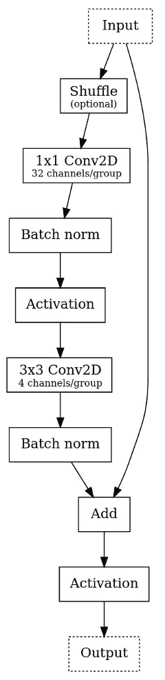
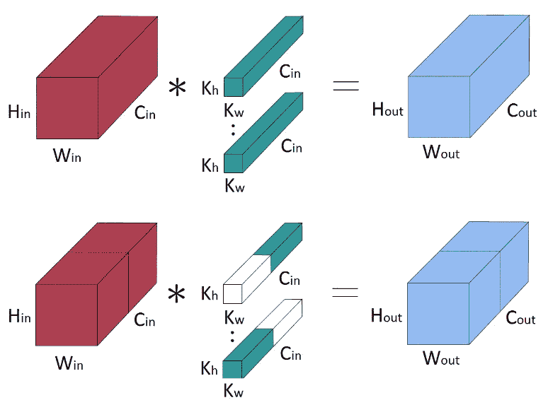
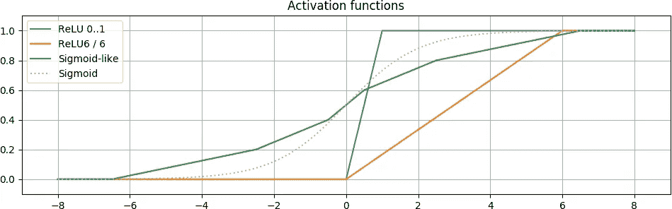
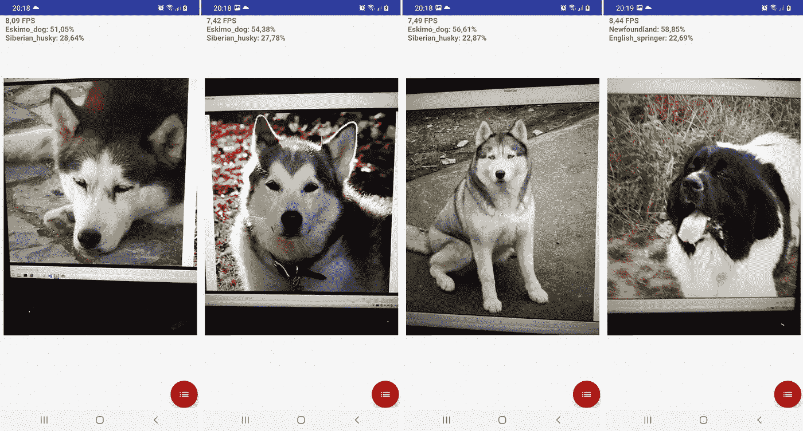
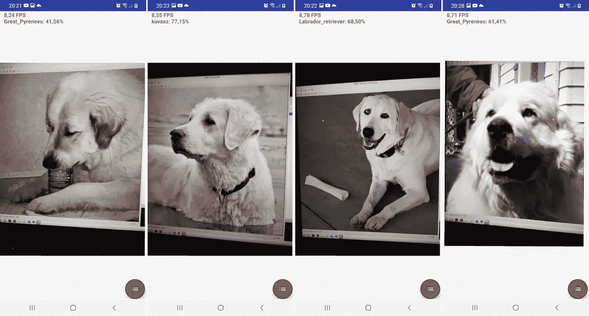
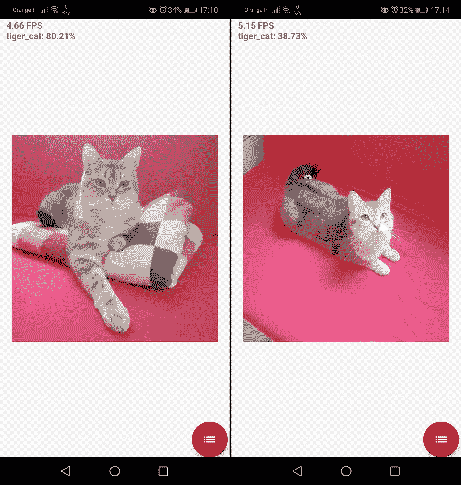

# 面向低端硬件的 GPU 加速图像分类

> 原文：<https://medium.com/analytics-vidhya/towards-gpu-accelerated-image-classification-on-low-end-hardware-ec592e125ad9?source=collection_archive---------7----------------------->


深度学习不再是强大的桌面 GPU 的专属特权。关于神经网络的推断，这是千真万确的:例如，移动 GPU 正在极大地处理这一点。但是，说到树莓派，它的 GPU 却莫名其妙地被忽略了。让它作为推理的硬件加速器的选择很少甚至没有。

拥有 *VideoCore VI* 图形的 Raspberry Pi 4 成为一个例外:它更强大，并被[认证支持 Vulkan](https://www.khronos.org/conformance/adopters/conformant-products#submission_530) ，这是计算机图形和 GPU 通用计算的最新标准，我们开始看到库使用它作为神经网络推理的计算后端，如 [ncnn](https://github.com/Tencent/ncnn) 。

但是之前的 Pi 机型配这个 GPU 的上一个版本( *VideoCore IV* )呢？由于一些技术原因(下面将讨论其中的一些)，没有框架可以在这个硬件上运行通用神经网络的推理。

在当前的文章中，我们通过**在 10 美元的 Raspberry Pi Zero W** 上启用图像分类器的 GPU 加速推理来挑战这一点。我们使用 GLSL 着色器对 GPU 进行编程，实现了在此硬件上无法实现的吞吐量，而无需借助外部加速器。

*   我们首先重用一些 MobileNet、ShuffleNet 和 ResNeXt 设计模式来构建一个网络架构，该架构符合在 Raspberry Pi 上使用着色器所施加的限制。
*   我们训练该模型，并由于 GLSL 的广泛采用，将其推理部署在各种硬件上，从 Raspberry Pi 开始，继续到桌面 GPU，最后到 Android 智能手机。

在包含狗和猫的图片的 ImageNet 的具有挑战性的 120 类子集上训练，我们的 225K 参数模型在 Pi Zero W 上达到了 **72%** 顶级单作物验证精度，并且由于使用了 GPU，吞吐量为每秒 670 millons 乘加。

# 构建模型

## 为什么？

图像分类可能是视觉中研究得最多的问题。那么，我们为什么不采用现有的训练分类模型，并将其部署在 Raspberry Pi 上呢？

很少有人尝试将 VideoCore IV GPU 用作计算设备的实际原因可能与其性能无关(它可能比 CPU 更强大，特别是在 Pi Zero W 上)。这是由它有限的可编程性造成的。例如，它没有官方的 OpenCL 支持。让我们看一下技术细节，因为我们需要从符合 *OpenGL ES* 标准的角度进行推理，OpenGL 似乎是在较老的树莓上编程 GPU 的唯一“官方”方式。

OpenGL 是一种被广泛采用的计算机图形标准。它的不同版本对兼容的 GPU 应该具备的能力提出了要求，并定义了一个通用接口来访问 GPU 功能，而不管供应商、平台等。今天，*任何* GPU 都兼容一个体面版本的 OpenGL。

也就是说，我们的 Pi Zero W GPU 仅符合 OpenGL ES 2.0，而其继任者 VideoCore VI 以及任何现代移动 GPU 都符合 OpenGL ES 3.1。这是什么意思？

OpenGL ES 标准通过定义*着色器*，小程序并行运行，实现了 GPU 的可编程性。3.1 版本引入了*计算着色器*，适用于 GPU 上的通用计算，并允许浮点输入和输出，而 OpenGL ES 2.0 仅限于计算机图形中常见的顶点和片段着色器，仅支持定点*纹理*。然后，使用计算着色器在每一层的基础上实现神经网络的推理是相当容易的(即使需要[细化实现](https://arxiv.org/pdf/1907.01989.pdf)以获得最高性能)。然而，当使用 OpenGL ES 2.0 时，事情变得困难得多。

在这项工作中，我们遵循我们在[上一篇文章](/analytics-vidhya/inferring-a-super-resolution-neural-network-on-raspberry-pi-gpu-89b5456d21ef)中建立的关于如何使用 GLSL 实现神经网络推理的指导方针。我们还详细讨论了 OpenGL ES 2.0 及其 Raspberry Pi 实现对神经网络构成的技术约束，以便在 Raspberry Pi 上运行。这些可以归结为以下几点:

*   激活信号存储在 RGBA 纹理中，颜色通道代表特征图。纹理只能使用每个值 8 位来存储 0…1 范围内的值，因此激活值被量化并限制在范围内。
*   从不同输入获取的样本数量有限，无法产生单一输出值。实际上，我们不能从一个 4 通道纹理中采样超过 25 个纹理元素，也不能将超过 8 个纹理绑定到一个着色器。这限制了 2D 卷积，卷积神经网络中的主要算子。

没有一个主流的分类架构符合这些约束，所以我们必须自己设计一个合适的架构。

## 怎么会？

可以说，基于梯度下降的优化最棒的事情之一是，可以以任意方式将计算工作流约束在一个模型中，它仍然会学习，希望不会执行得太差。

*   我们使用 3×3 和 1×1(逐点)*组卷积*为我们的模型设计了一个*主构建模块*，每个输出样本需要很少的输入样本。我们还使用混洗操作来确保激活值在各功能频道间有效共享。然后，构建块实例在模型中重复出现，并与缩减像素采样层相互连接。
*   当把激活信号存储到纹理中时，为了使它们在 0…1 范围内，我们在隐藏层中应用了一个合适的激活函数(拜拜！)此外，我们使用 16 位定点表示在线性(密集)层的两个纹理通道中对单个输出值进行编码。
*   我们实际上并没有对激活信号的 8 位量化做什么特别的事情，而正确的方式可能是求助于[量化感知训练技术](https://www.tensorflow.org/model_optimization/guide/quantization/training)。我们根据经验发现，当我们在目标 GPU 上部署经过训练的网络时，验证准确性不会下降太多。

让我们来分析一下。

## 模型概述

在一个 120 级问题中使用的模型的形状如下。

```
 ╔═══════╦═══════════════════════╦══════════════╦═════════╗
     ║ Stage ║ Layers                ║ Output shape ║ #Params ║
     ║       ║                       ║ (H,W,C)      ║         ║
     ╠═══════╬═══════════════════════╬══════════════╬═════════╣
     ║     1 ║ 5x5 conv + BN + act   ║ 191, 191, 32 ║    2528 ║
     ║       ║ Main block            ║ 191, 191, 32 ║    2432 ║
     ║       ║ Main block            ║ 191, 191, 32 ║    2432 ║
     ║───────║───────────────────────║──────────────║─────────║
     ║     2 ║ 3x3 conv + BN + act   ║   95, 95, 32 ║    2432 ║
     ║       ║ Main block w/ shuffle ║   95, 95, 32 ║    2432 ║
     ║       ║ Main block w/ shuffle ║   95, 95, 32 ║    2432 ║
     ║       ║ Main block w/ shuffle ║   95, 95, 32 ║    2432 ║
     ║───────║───────────────────────║──────────────║─────────║
     ║     3 ║ 3x3 conv + BN + act   ║   47, 47, 64 ║    4864 ║
     ║       ║ Main block w/ shuffle ║   47, 47, 64 ║    4864 ║
     ║       ║ Main block w/ shuffle ║   47, 47, 64 ║    4864 ║
     ║       ║ Main block w/ shuffle ║   47, 47, 64 ║    4864 ║
     ║───────║───────────────────────║──────────────║─────────║
     ║     4 ║ 3x3 conv + BN + act   ║  23, 23, 128 ║    9728 ║
     ║       ║ Main block w/ shuffle ║  23, 23, 128 ║    9728 ║
     ║       ║ Main block w/ shuffle ║  23, 23, 128 ║    9728 ║
     ║       ║ Main block w/ shuffle ║  23, 23, 128 ║    9728 ║
     ║       ║ Main block w/ shuffle ║  23, 23, 128 ║    9728 ║
     ║───────║───────────────────────║──────────────║─────────║
     ║     5 ║ 3x3 conv + BN + act   ║  11, 11, 192 ║   14592 ║
     ║       ║ Main block w/ shuffle ║  11, 11, 192 ║   14592 ║
     ║       ║ Main block w/ shuffle ║  11, 11, 192 ║   14592 ║
     ║       ║ Main block w/ shuffle ║  11, 11, 192 ║   14592 ║
     ║       ║ Main block w/ shuffle ║  11, 11, 192 ║   14592 ║
     ║       ║ Main block w/ shuffle ║  11, 11, 192 ║   14592 ║
     ║───────║───────────────────────║──────────────║─────────║
     ║ Final ║ 3x3 conv + BN + act   ║    5, 5, 192 ║   14592 ║
     ║       ║ 3x3 conv + BN + act   ║    3, 3, 192 ║   14592 ║
     ║       ║ Average pooling       ║    1, 1, 192 ║       0 ║
     ║       ║ Dense + softmax       ║          120 ║   23160 ║
     ╚═══════╩═══════════════════════╩══════════════║─────────║
                                                    ║  225112 ║
                                                    ╚═════════╝
```

前五个阶段由下采样块和下面详述的主块的若干次重复组成。下采样块是一个步长为 3×3 的卷积，后面是一个批处理归一化和一个激活函数，与最初的 MobileNet 论文[中的非常相似。最后阶段使分类器头增加几个卷积/批量范数/激活模块、平均池、密集和 softmax 层。](https://arxiv.org/pdf/1704.04861.pdf)

主构建模块是一个*剩余模块*变体，其特征是一个*可分离卷积*，类似于 MobileNet 第一版[中使用的主构建模块。尽管如此，还是有一些重要的区别。](https://arxiv.org/pdf/1704.04861.pdf)



我们的模型主要由受 MobileNet v1 块启发的这种模式的实例组成。

## 群组卷积和频道洗牌

当设计主块时，采样约束立即发挥作用:在*宽的*块中，即那些处理许多特征图的块中，我们不能使用常规的 1x1 卷积，因为它们要求每个输出样本有太多的输入样本，因此不能使用着色器有效地实现。一般来说，我们正在设计的计算后端不是点态卷积友好的。为此，我们不使用在 MobileNet v2 中执行的*反向剩余瓶颈阻塞模式*。

我们用*组卷积*代替:输入张量在特定数量的*组*中的通道维度上切片，每个组计算实际的卷积运算，结果沿着通道轴连接回来。



常规 2D 卷积(上图)与 2 组卷积(下图)的比较。图片来自[本文](https://arxiv.org/pdf/2006.09791.pdf)。

> 分组卷积可以追溯到 [AlexNet](https://papers.nips.cc/paper/2012/file/c399862d3b9d6b76c8436e924a68c45b-Paper.pdf) 。后来， [ResNeXt 论文](https://arxiv.org/pdf/1611.05431.pdf)表明，虽然 AlexNet 使用组卷积“作为一种工程折衷”，但与残差块中的常规卷积相比，它们表现出更强的表示能力。最后， [ShuffleNet 论文](https://arxiv.org/pdf/1707.01083.pdf)论证了分组可以用信道混洗操作来补充，以确保信息在网络内部的后续块中跨不同组传播。

这验证了我们构建模块的设计。特别是，在一个着色器中最多同时使用 8 个四通道纹理采样器，我们最多可以采样 32 个特征图。因此，在以超过 32 个特征映射通道操作的块中，我们以 4 个通道为一组来混洗特征映射。我们在推理中免费得到这种洗牌:没有内存副本，我们只是在着色器程序中将纹理绑定到采样器时改变了顺序。

我们使用的混洗模式是确定性的，并试图最大化 32 通道块的跨块互连。以下是 128 通道特征图在第 4 阶段如何洗牌的示例:

```
INPUT       ->> Shuffling ->>      OUTPUT
CHANNEL        (128 to 128)       CHANNEL
 0  ┐ ───────────────┬────────────── ┌  0
 1  │ Texture        │       Texture │  1
 2  │ #0             │            #0 │  2
 3  ┘                │               └  3       Textures order table
                     │                          for 3 iterations
 4  ┐                │               ┌ 32       of 128-chan. shuffle
 5  │ Texture        │       Texture │ 33       ────────────────────
 6  │ #1             │            #8 │ 34       In    #1    #2    #3
 7  ┘                │               └ 35        0     0     0     0
                     │                           1     8     2    16
 8  ┐                │               ┌ 64        2    16     4     1
 9  │ Texture        │       Texture │ 65        3    24     6    17
10  │ #2             │           #16 │ 66        4     1     8     2
11  ┘                │               └ 67        5     9    10    18
                     │                           6    17    12     3
12  ┐                │               ┌ 96        7    25    14    19
13  │ Texture        │       Texture │ 97        8     2    16     4
14  │ #3      ───────┴───────    #24 │ 98        9    10    18    20
15  ┘            accessed            └ 99       10    18    20     5
                in the same                     11    26    22    21
16  ┐         1x1 conv shader        ┌  4       12     3    24     6
17  │ Texture ───────┬─────── Texture│  5       13    11    26    22
18  │ #4             │            #1 │  6       14    19    28     7
19  ┘                │               └  7       15    27    30    23
                     │                          16     4     1     8
20  ┐                │               ┌ 36       17    12     3    24
21  │ Texture        │       Texture │ 37       18    20     5     9
22  │ #5             │            #9 │ 38       19    28     7    25
23  ┘                │               └ 39       20     5     9    10
                     │                          21    13    11    26
24  ┐                │               ┌ 68       22    21    13    11
25  │ Texture        │       Texture │ 69       23    29    15    27
26  │ #6             │           #17 │ 70       24     6    17    12
27  ┘                │               └ 71       25    14    19    28
                     │                          26    22    21    13
28  ┐                │               ┌100       27    30    23    29
29  │ Texture        │       Texture │101       28     7    25    14
30  │ #7             │           #25 │102       29    15    27    30
31  ┘ ───────────────┴────────────── └103       30    23    29    15
                                                31    31    31    31
32  ┐                                ┌  8
33  │ Texture                Texture │  9
34  │ #8                          #2 │ 10
35  ┘                                └ 11
 . . .                              . . .
```

此外，我们在下采样卷积和最后一级卷积中使用 8 个信道组(与使用深度方向卷积的 MobileNet 的另一个区别)。背后的基本原理是进一步改善跨渠道维度的信息共享。

## 激活功能

为了使用纹理来存储激活信号，我们求助于一个合适的激活函数，将值“压缩”到 0…1 的范围内。我们测试了几种选择。



一些经过测试的合适的激活功能具有 0…1 的输出范围。

最简单的是 ReLU 削波到 0…1 范围。这个[以前很好地服务于我们，](/analytics-vidhya/inferring-a-super-resolution-neural-network-on-raspberry-pi-gpu-89b5456d21ef)但是在足够深的分类网络中使用时失败了。该模型就是不学习，卡在相对较高的损失函数值。可能的原因是梯度没有很好地通过这个激活函数反向传播，只要它的梯度在 0…1 范围之外为零。

另一个选项是 MobileNet v2 非线性， *ReLU6* 。它的输出范围是 0…6，但我们可以很容易地将输出扩展到 0…1 范围，然后写出到纹理，并在读取时将其缩小。通过这种激活，模型学习得很好，但是在不太广泛的实验中，最终验证准确度达不到 70%的验证准确度。

就最终验证精度而言，性能最好的选项是 sigmoid 的分段线性近似。我们尝试了一些手动设计的近似器，保留了上图中最好的一个(更好的方法是以一种可学习的方式参数化它)。与原始的 sigmoid 相比，这种近似在前向和后向计算上都非常有效。此外，其梯度在相对较大的范围内(从-6.5 到 6.5)是分段恒定的，并且与原始 sigmoid 函数相比，向其边界“提升”，这消除了该范围内的梯度消失问题。

每次将张量写出到纹理时，即在每次卷积操作之后，批量归一化被融合到卷积核中，并且在可选残差连接被添加到卷积层输出之前，应用激活。

## 密集(线性)层实现

我们的分类器最终得到一个线性层。很常见。

在推论中，密集层只不过是惯用的矩阵与向量的乘积加上一个恒定的偏置向量， *Ax+b* 。我们在 GLSL 按照多级分块 GEMV 模式实现了这一点:

*   输入特征向量 ***x*** 被分割成 8 个值的块，这些值乘以权重矩阵*(在第一*乘法阶段着色器程序*中每个线程一个子矩阵)的 8*8 个子矩阵，*
*   *然后在随后的*缩减阶段着色器程序*中对部分结果求和。最后一个这样的程序也采样并相加以输出常量向量**。***

**如果我们没有定点 0…1 范围的存储(不幸的是，我们有),这种方法实现起来相对简单。**

**使用激活功能将输入信号压缩到 0…1 范围内实际上不是解决这个问题的唯一选择。另一种方法是使用多个颜色通道来存储单个数值(这甚至是一种常见的做法[e](http://marcodiiga.github.io/encoding-normalized-floats-to-rgba8-vectors)[或者](http://marcodiiga.github.io/encoding-normalized-floats-to-rgba8-vectors))。**

**为了实现密集层，我们采用了一种使用 2 个纹理通道来表示单一特征图的技术。也就是说，我们以定点格式覆盖[-128，128]范围，以便一个纹理通道存储小数部分，另一个通道获取整数部分。**

**定点表示的有限范围是它的主要缺点，如果中间算术运算产生的值超出这个范围，可能会导致失败。避免这种情况的替代方法是覆盖整个实轴的*浮点表示法*(例如 [bfloat16](https://en.wikipedia.org/wiki/Bfloat16_floating-point_format) )。**

**然而，在矩阵乘积计算期间，定点算术不会在加法/乘法中引入任何数值误差(如果一切都在有效范围内)，而在浮点情况下，加法是一个常见的误差源，在归约求和期间会产生严重影响。使用类似 bfloat16 的数据类型和 8 位指数的矩阵产品的测试实现变得不太精确。第二，如果密集层在推断中遭受超范围误差，我们可以通过在训练期间调整其输入和权重来减轻这种情况。幸运的是，我们不需要这样做:我们根据经验验证了 16 位定点表示是可以的，我们基于着色器的分类器达到了非常接近于在桌面 GPU 上使用普通单精度浮点演算的参考实现的精度。**

****这完成了神经网络设计**，考虑了在 Raspberry Pi GPU 上实现 GLSL 的可行性。网络消耗包含输入图像的 RGB 纹理，将其传递给一组执行不同层计算的着色器程序，并输出 120 长度的 logits 向量。除了在 logits 向量上应用的最后一个 softmax 映射之外，CPU 不计算任何东西(即，计算它们的指数、求和并归一化以获得类概率)。虽然 CPU 有一些管理工作要做:它负责设置着色器程序，绑定纹理和启动光栅化过程。**

# **训练模型**

**对于实验，我们在 ILSVRC 2012 数据集的 120 类子集上训练模型。我们这样做并不是因为更大的网络不适合 Raspberry Pi，而是因为用于训练和实验的 GPU 资源有限。一个完整的 1000 级模型很可能可以在 Pi 上运行:我们的 120 级模型推理需要不到 6 Mb 的纹理内存来存储激活信号(但可能需要更多的内存来存储编译后的着色器程序，这很难估计)。**

**我们选择了 120 个包含狗和猫的图像的类，作为与例如 120 个类的随机子集相比实际上有意义的事情。然而，这种选择使问题变得更加困难，因为不同类的实例看起来非常相似:对于一个人来说，区分西伯利亚哈士奇和雪橇犬可能比区分雪橇犬和浴缸要困难得多，因为这三者都是原始 ImageNet 集中的对象类。**

****

**ILSVRC 2012 验证集样本显示狗和为什么这个问题很难。最左边的三张图片不是一个档次的:西伯利亚哈士奇，雪橇犬，加拿大爱斯基摩犬。最右边的图片被误标为雪橇犬，偶然发现。这些图像是其各自版权所有者的财产。**

**该模型使用 TensorFlow 2.3 中的 Keras 进行训练。在多种训练方案中，表现最好的是在 400 个时期达到稳定时以 0.01 的学习率进行训练，然后每 50 个时期将学习率减半，直到 600 个时期。使用了 Adam 优化器。表现最好的批量标准化动量是 0.75(我们处理 64 个图像的批量)。使用特斯拉 T4 GPU 进行训练，花费约 30 分钟完成一个纪元。为了加速这个过程，类 sigmoid 激活函数已经以 TensorFlow 的 [C++扩展的形式实现。](https://github.com/lnstadrum/sigmoid_like_tf_op)[快速增强](https://github.com/lnstadrum/fastaugment)是提高速度和更好的泛化能力的另一个重要因素。训练脚本可在[这里](https://github.com/lnstadrum/imagenet_dogs_classifier)获得。**

**在该实验中，该模型实现了最高 71.98%的 top-1 验证准确度。我们发现，平均来自 3 个检查点的模型权重，在接近全局最大值时达到最高验证精度，会进一步提高 0.3%，因此，在被转换为 GLSL 着色器之前，训练模型获得的最大精度为 **72.28%** 。**

# **测试**

**推理实现是在 C++中完成的，并使用 OpenGL 来运行 GLSL 计算代码。源代码可在[这里](https://github.com/lnstadrum/beatmup)获得。**

## **单板计算机和桌面 GPU**

**我们首先在 Raspberry Pi Zero W、Pi 3 Model B+、Pi 4、Nvidia Jetson Nano 和各种桌面 GPU 上测试我们的模型。该测试是通过在 120 类验证集(6000 个图像)上运行推理来完成的，采用大小调整为 385*385 的目标输入分辨率的图像的正方形中心裁剪。**

**不同硬件/操作系统上的推理时间和前 1 名验证准确性。**

**在所有硬件上，最高验证精度与参考精度的匹配度高达 0.2%。精度上的微小差异可以用 OpenGL 实现的差异来解释，例如片段着色器中对高精度浮点计算的支持。此外，在支持浮点纹理的设备上，我们不在密集层中使用 16 位定点打包，这恰好是除了两个树莓之外的每个人。**

**运行时间从 Pi Zero W 上的 **595 ms** 到 NVidia GeForce RTX 2070 上的仅几毫秒不等。在测试的两个 Raspberry Pi 模型之间也有很大不同，即使它们有相同的 GPU: Pi 3 模型 B+每张图像只需要 **328 ms** 。这可以通过 GPU 时钟频率的差异(250 MHz 与 300 MHz)来解释，并且事实上，CPU 反应能力对于保持高效地为 GPU 提供着色器程序仍然很重要:Pi Zero W 运行 1 GHz 单核 ARM v6，其功率只有 Pi 3 Model B+板上 1.5 GHz 四核 ARM v8 的一小部分。**

## **安卓智能手机**

**我们使用相同的技术在 Android 智能手机上运行我们模型的推理。尽管我们在这里进行了一个更好的测试:我们将摄像机直接插入我们的模型的输入端，并实时预测它捕捉的图像的类别。Android 中的相机图像可以作为 OpenGL 纹理直接访问，这使得我们的实现非常简单。**

**我们通过拍摄计算机屏幕上显示的来自 ILSVRC 2012 验证集的一些图像，并将预测的类别标签与地面真实标签进行比较，来评估网络性能。我们很少用这种方式测试不同代的 Android 设备。下面分享了一些显示当前帧的相机预览和预测类别概率的截图。**

*   **配备 Mali-G72 MP3 GPU 的三星 Galaxy M31 每秒可分类约 8 幅图像。**
*   **采用 Mali-T830 MP2 GPU 的华为 P20 Lite 每秒运行约 5 张图像。**
*   **追溯到 2014 年的搭载 PowerVR G6430 GPU 的华硕 Fonepad 8 平板每秒处理~2.3 帧。**

****

**三星 Galaxy M31 每秒可分类约 8 张图像。不幸的是，神经网络无法明确区分哈士奇、雪橇犬和爱斯基摩犬，但最右边的图片可能会被正确分类。**

****

**三星 Galaxy M31 每秒可分类约 8 张图像。这些图片上的所有图像都被正确分类:预测的类别与地面事实相符。**

****

**华为 P20 Lite 每秒分类约 5 张图像。实验中使用的数据集实际上包含 119 类狗和一个“虎猫”类。只是因为手头有一只真猫的测试样本。**

# **包扎**

**我们描述了一种在低端设备上实现 GPU 加速图像分类的实验方法，这同样适用于更强大的硬件。**

**为了让它发挥作用，我们从主流分类神经网络中挑选了一些技巧来设计一种架构，以处理已确定的硬件约束。**

*   **这为我们提供了一个参数高效的架构，在仅具有约 225K 可训练参数的具有挑战性的 120 类 ILSVRC2012 子集上，达到了 72%的顶级单作物验证准确率。**
*   **该模型执行约 400M 乘加操作来对 385*385 像素的图像进行分类；GLSL 的实现产生了大约 2800 万个 RGBA 纹理元素。**

**允许 8 位定点信号存储的组卷积、混洗和激活函数的使用减少了存储器带宽，使得所设计的架构适合于嵌入式设备。此外，所描述的推理实现技术适用于各种 GPU，包括廉价的单板计算机、移动设备、来自不同厂商的集成和分立 GPU。**

**然而，GLSL 着色器和 OpenGL 带来了巨大的开销，其速度是高效的 CUDA 或 OpenCL 实现在相同设备上无法比拟的。例如，次优平铺限制了 2D 卷积的性能:为了计算每四个输出通道，从输入张量读取整个相应的输入通道组(因此在非组卷积的情况下是整个张量)。这增加了全局内存流量，使实现严重受限于内存 I/O，这可能是它的主要缺点。这可以通过计算着色器或多个 OpenGL 绘制缓冲区来解决，以便将更多的输出通道绑定到单个着色器，但在 4 Model B 之前的 Raspberry Pi 上不支持这些功能。由此产生的吞吐量相当适中:具有不错 CPU 的设备可能会在 CPU 上运行更大的网络，例如 MobileNet，速度更快。但对于 Pi Zero W 来说，情况肯定不是这样，在 Pi Zero W 中，有必要以某种方式对 GPU 进行编程，或者使用外部加速器来运行神经网络的推理。**