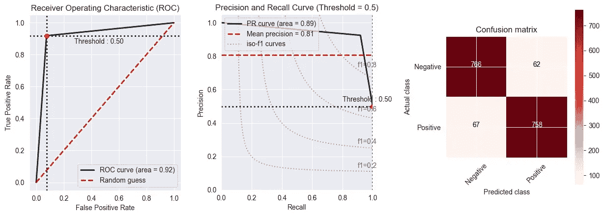

# 解决一类分类问题在人力资源领域的应用

> 原文：<https://medium.com/analytics-vidhya/towards-solving-the-application-of-one-class-classification-problem-in-the-hr-domain-1f6eccf5f91c?source=collection_archive---------6----------------------->

作为一名数据科学家，我参与了一个数据分析团队，为员工流失和绩效建立预测模型。这是一个二元分类，我们将员工(对象)分类为属于目标*A 类*或*B 类*。我们为每个对象类的每个客户端建立了一个训练数据集，并利用二元分类算法来预测新对象所属的类。到目前为止还不错，但是 ***我们如何解决我们的训练数据集只包含一个类*** ，其余都是未知类的对象的问题呢？

我所概述的场景，在机器学习中，被称为 ***一类分类(OCC)问题*** ，也被称为*一元分类*或*类建模*。这是为了在只有一组观测值的信息或属于其他类别的观测值很难或不可能获得时对数据进行分类。这不同于传统的分类问题，并且比传统的分类问题更困难，传统的分类问题试图用包含来自所有类别的对象的训练集来区分两个或更多类别。示例包括直升机齿轮箱监控、电机故障预测或核电厂的运行状态为“*正常*”。

一类分类法在生物医学研究中特别有用，因为在生物医学研究中，通常很难或不可能获得其他类别的数据。在研究生物医学数据时，从第二类中获得执行二元分类所必需的标记数据集可能是困难的和/或昂贵的。

在 OCC，训练数据集只包含一个类的观测值，而测试数据集可能包含两个类的观测值。正如在医学领域，正确的诊断是非常重要的，有必要评估 OCC 模型。这种诊断可以被认为是将一些病例错误分类为非病例，将一些非病例错误分类为病例。这两种类型的错误分类导致了诊断的两个重要方面的表现: ***敏感性和*** 。众所周知，*灵敏度*为真阳性率(TP)*特异性*为真阴性率(TN)。显示灵敏度和特异性值的一种非常常见的方式是通过 ROC 曲线(*受试者操作特征*)，AUC ( *曲线下面积*)，其位于 0 至 1 之间。

***单类分类也可视为离群点检测，*** 其中分类模型可用于检测明显偏离目标类的单元。阴性情况(类别 0)被视为“*正常*”，阳性情况(类别 1)被视为“*异常值或异常值*”。值得注意的是，在**中，单类分类器能够在存在噪声或错误的情况下学习数据**的真实特征。此外，应尽量减少数据科学家要估计的参数数量，必须考虑到计算和存储要求，因为有些方法的使用存在限制因素。最后，应该在训练阶段使用训练数据集来确定单类分类器。

**埃尔莫尼亚方法:**

我们应用 Keras 张量流来解决 OCC 问题。你也可以使用*一级 SVM、隔离森林、新奇和离群因子*。一开始，我们**执行数据集采样技术，并确定类别分布**。它告诉我们，数据集中的不平衡是 A 类的哪个对象不存在。

接下来，我们**绘制数据集，然后使用异常值检测**技术，我们识别异常。我们假设这些是 B 类。它显示了一些类属于 B 类(橙色)，而大多数是 A 类(蓝色)。然后，我们**应用采样技术**如 *SMOTE、梯度增强*来处理图 2 中的不平衡分类。这只是让我们创建一个平衡的数据集，理论上，不应该导致分类器偏向一个类或另一个类。然而，在实践中，这些取样方法有缺陷。

图 2 —不平衡数据集分类

对少数进行过采样会导致模型过拟合。类似地，对大多数进行欠采样可能会遗漏提供两个类之间重要差异的重要实例。在我的下一篇文章中，我很乐意解释如何处理不平衡的数据集。最后，我们**用类权重**训练模型，看看它如何影响预测。

我希望我已经提供了以上内容，让您能够更好地解决您的 OCC 问题。在某些时候，您的模型可能难以改进并产生您想要的结果，因此记住您的问题的背景以及不同类型的错误之间的权衡是很重要的。因此，尽最大努力收集尽可能多的样本，并充分考虑哪些特征可能与模型相关，从而最大限度地利用您的少数类。这是我们 TF Keras 模型的最终结果:

图 3 —预测模型(Keras)的最终结果

模型的 F1 评分为 93%，Kappa 评分为 94.20%。凉爽的..对！！！

> 人们必须记住，单类分类器的优势是以丢弃所有关于多数类的可用信息为代价的。因此，该解决方案应谨慎使用，可能不适合某些特定应用。

感谢您的阅读。请关注下一篇文章。