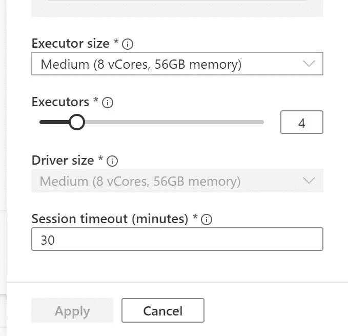
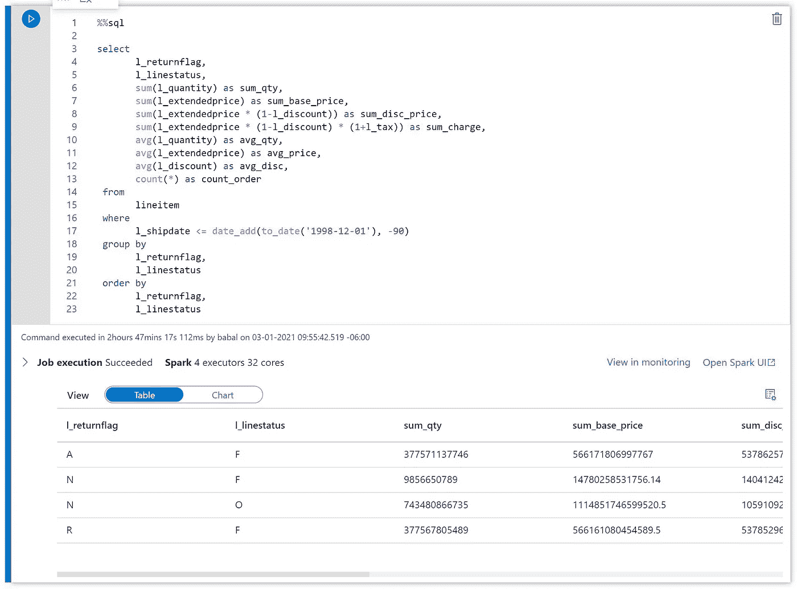

# 使用 Spark SQL 对 Azure Synapse workspace Spark 进行 TPC-H SF10000 测试

> 原文：<https://medium.com/analytics-vidhya/tpc-h-sf10000-test-with-azure-synapse-workspace-spark-using-spark-sql-8364051eae71?source=collection_archive---------11----------------------->

# 用例

*   使用 Spark SQL 运行 TPC-H 测试
*   使用设计火花标量数据框运行 TPC-H 测试
*   准备测试所需的数据
*   基于云的架构测试
*   存储和计算对比测试

# 先决条件

# 集群大小

*   Databricks 运行时 7.5 毫升
*   节点总数 4
*   每个节点 8 个内核和 28GB RAM
*   使用 Spark 3.01
*   使用 scala 2.12



*   立即创建笔记本
*   首先获取主密钥的 blob 存储密钥库机密

```
val keyVaultName = "keyvaultname"; 
val secretName = "keyname"; 
val blobsecret = "keyname" 
val accbbstorekey = mssparkutils.credentials.getSecret(keyVaultName, blobsecret)
```

*   配置 blob 存储以供 spark 访问

```
spark.conf.set(
  "fs.azure.account.key.accbbstore.blob.core.windows.net",
  accbbstorekey)
```

*   让我们读取客户数据

```
val customer = spark.read.parquet("wasbs://containername@storagename.blob.core.windows.net/CUSTOMER/*.parquet")
```

*   显示客户

```
display(customer)
```

*   现在创建临时视图来运行 sql 命令

```
%sql
CREATE TEMPORARY VIEW customer
USING org.apache.spark.sql.parquet
OPTIONS (
  path "wasbs://containername@storagename.blob.core.windows.net/CUSTOMER/*.parquet"
)
```

*   让我们加载行项目

```
val lineitem = spark.read.parquet("wasbs://containername@storagename.blob.core.windows.net/LINEITEM/*.parquet")
```

*   显示行项目

```
display(linetem)
```

*   创建临时视图以运行 sql

```
%sql
CREATE TEMPORARY VIEW lineitem
USING org.apache.spark.sql.parquet
OPTIONS (
  path "wasbs://containername@storagename.blob.core.windows.net/LINEITEM/*.parquet"
)
```

*   加载国家数据集

```
val nation = spark.read.parquet("wasbs://containername@storagename.blob.core.windows.net/NATION/*.parquet")
```

*   展示民族

```
display(nation)
```

*   现在创建临时视图

```
%sql
CREATE TEMPORARY VIEW nation
USING org.apache.spark.sql.parquet
OPTIONS (
  path "wasbs://containername@storagename.blob.core.windows.net/NATION/*.parquet"
)
```

*   将订单载入数据框

```
val orders = spark.read.parquet("wasbs://containername@storagename.blob.core.windows.net/ORDERS/*.parquet")
```

*   显示订单

```
display(orders)
```

*   现在创建临时视图来运行 Spark SQL

```
val part = spark.read.parquet("wasbs://containername@storagename.blob.core.windows.net/PART/*.parquet")
```

*   现在让我们加载零件数据集

```
val part = spark.read.parquet("wasbs://containername@storagename.blob.core.windows.net/PART/*.parquet")
```

*   显示零件数据集

```
display(part)
```

*   现在让我们为 spark SQL 创建临时视图

```
%sql
CREATE TEMPORARY VIEW part
USING org.apache.spark.sql.parquet
OPTIONS (
  path "wasbs://containername@storagename.blob.core.windows.net/PART/*.parquet"
)
```

*   让我们装载零件供应商

```
val partsupp = spark.read.parquet("wasbs://containername@storagename.blob.core.windows.net/PARTSUPP/*.parquet")
```

*   显示零件供应商

```
display(partsupp)
```

*   现在让我们为 spark SQL 创建临时视图

```
%sql
CREATE TEMPORARY VIEW partsupp
USING org.apache.spark.sql.parquet
OPTIONS (
  path "wasbs://containername@storagename.blob.core.windows.net/PARTSUPP/*.parquet"
)
```

*   让我们加载区域数据集

```
val region = spark.read.parquet("wasbs://containername@storagename.blob.core.windows.net/REGION/*.parquet")
```

*   显示区域数据集

```
display(region)
```

*   让我们为 Spark SQL 创建临时视图

```
%sql
CREATE TEMPORARY VIEW region
USING org.apache.spark.sql.parquet
OPTIONS (
  path "wasbs://containername@storagename.blob.core.windows.net/REGION/*.parquet"
)
```

*   现在让我们加载供应商数据集

```
val supplier = spark.read.parquet("wasbs://containername@storagename.blob.core.windows.net/SUPPLIER/*.parquet")
```

*   显示数据集

```
display(supplier)
```

*   让我们为 spark sql 创建临时视图

```
%sql
CREATE TEMPORARY VIEW supplier
USING org.apache.spark.sql.parquet
OPTIONS (
  path "wasbs://containername@storagename.blob.core.windows.net/SUPPLIER/*.parquet"
)
```

*   现在让我们运行一个 TPC-H 查询
*   找到表演

```
%sql

select
       l_returnflag,
       l_linestatus,
       sum(l_quantity) as sum_qty,
       sum(l_extendedprice) as sum_base_price,
       sum(l_extendedprice * (1-l_discount)) as sum_disc_price,
       sum(l_extendedprice * (1-l_discount) * (1+l_tax)) as sum_charge,
       avg(l_quantity) as avg_qty,
       avg(l_extendedprice) as avg_price,
       avg(l_discount) as avg_disc,
       count(*) as count_order
 from
       lineitem
 where
       l_shipdate <= date_add(to_date('1998-12-01'), -90)
 group by
       l_returnflag,
       l_linestatus
 order by
       l_returnflag,
       l_linestatus;
```



*最初发表于*[*【https://github.com】*](https://github.com/balakreshnan/tpchtest/blob/main/tpchtest/synapsespark.md)*。*