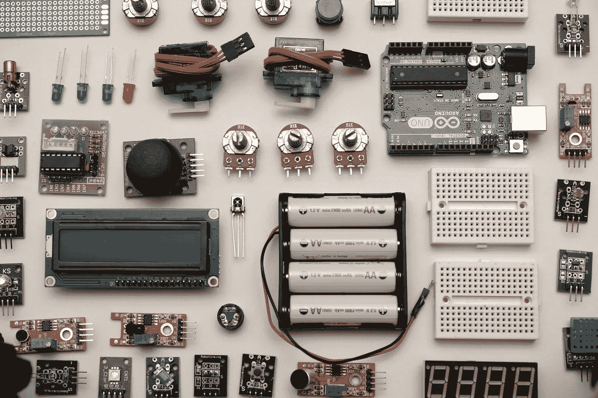
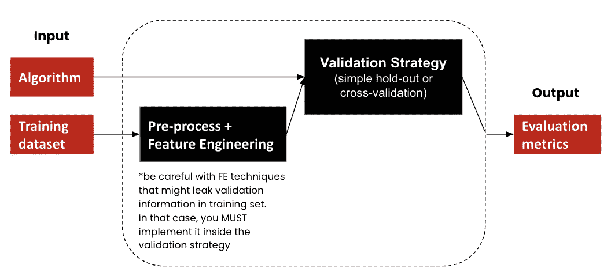

# 使用 MLflow 跟踪 ML 实验

> 原文：<https://medium.com/analytics-vidhya/track-ml-experiment-using-mlflow-64851381d629?source=collection_archive---------11----------------------->



罗宾·格劳泽在 [Unsplash](https://unsplash.com/s/photos/electronic?utm_source=unsplash&utm_medium=referral&utm_content=creditCopyText) 上的照片

# **问题**

> 在数据科学竞赛的背景下寻找高性能的机器学习模型可能会很糟糕。

获取知识的一种方式是应用它，我相信 [Kaggle](https://www.kaggle.com/) 是应用&提升你的建模技能的最佳场所之一。

**典型的 Kaggle 比赛设置**

在 Kaggle 中，典型的监督学习竞赛设置是参与者被给予:

1.  两个独立的数据集，即训练集和测试集，
2.  一个单一的评估标准，然后用于对模型性能进行分级，
3.  两个独立的排行榜，即公共和私人排行榜。测试集的一部分用于计算公共排行榜，其余部分用于计算私有排行榜。私人排行榜在比赛结束前是保密的，它将决定最终排名。

**很多可能的实验想法**

在数据科学竞赛的情况下，你可能会从一个简单的模型开始，然后随着你对问题有了更好的理解，你可能会想要建立更复杂的模型。在增加复杂性的过程中，你可能会迷失方向，不知道哪些想法比其他的更好。为什么会这样呢？因为**有很多组件**我们可以**用**进行试验，例如不同的学习算法，每个学习算法的独特和不同的超参数，更不用说我们可以应用于数据的预处理技术了！更重要的是，你可能还想尝试构建合奏和/或堆叠不同的模型，以获得排行榜上的最高排名！


可以试验的组件很少

在本文中，我们将看到如何在 ML 实验工作流中注入跟踪工具。

# ML 实验

为了在所有的实验中有标准化的性能指标，更容易的是把这个过程设计成一个独立的构件，如下图所示。它使您能够将重点放在管道中的几个组件上。您可能首先关注预处理和特征工程，然后继续在相同的预处理数据中应用不同的算法，等等。



瞄准高排行榜分数意味着，首先，你需要了解你的模型是否遭受**过拟合**和**欠拟合**，然后应用不同的技术来解决它。

如果模型过度拟合，您可以对模型应用正则化、减少/移除特征、实现提前停止或构建集合模型。

如果模型存在拟合不足的问题，您可以添加更多相关的特征和训练数据，如果可能的话，增加模型的复杂性，或者移除数据中的噪声。

# **MLflow**

**MLflow** 是机器学习生命周期*的开源平台，引自其网站。MLflow 提供了一系列功能，包括实验、再现性、部署和中央模型注册。如下所示，有 4 个物流组件，我们将只关注物流跟踪。


**物流跟踪**

有 3 个主要功能

*   **log_param :** 用于跟踪您更改了哪些组件
*   **log_metric :** 用于跟踪评估/绩效指标
*   **log_artifact :** 用于跟踪图像，以帮助您评估模型，甚至为以后构建集成/堆叠模型进行出叠预测

# **案例:求解 MNIST 数据集**

本实验的目的是展示如何在用几种算法接近著名的 [MNIST 数据集](http://yann.lecun.com/exdb/mnist/)时注入实验跟踪。
为简单起见，我们将为每个算法使用默认超参数，因此我们将只更改 1 个参数，即“模型”。由于评估和跟踪过程将对每个算法重复进行，如果我们将其实现为函数，将会更清晰。

**库**

**评估功能**

**跟踪功能**

**预处理&验证策略**

在将训练数据集输入不同的算法之前，我们需要执行预处理，将值从 0–255 归一化到 0–1，这样可以加快逻辑回归、MLP 和 CNN 的收敛时间。

**实验前**

我们需要在实验之前定义实验 id

```
*# create experiment id for tracking using mlflow*
exp_id = mlflow.create_experiment("solving-mnist1")
```

**拟合和预测功能**

**模型 1:逻辑回归— Sklearn**

**模型二:随机森林— Sklearn**

**模型 3:多层感知器— Keras**

**模型 4:卷积神经网络— Keras**

**MLflow 仪表盘**

我们现在可以在 MLflow UI 中比较几个实验。这比在电子表格甚至笔记中记录实验更加简洁和容易。

```
# run mlflow ui
!mlflow ui
```


比较不同模型的准确性

# 结论

MLflow 有助于我们减少 ML 实验跟踪中的混乱，并且易于融入典型的工作流程。在我的 [github](https://github.com/ajisamudra/ml-experiments-using-mlflow) 中有完整的笔记本。

有一个很好的跟踪工具，你也可以试试！[砝码&偏差](https://wandb.ai/site)。