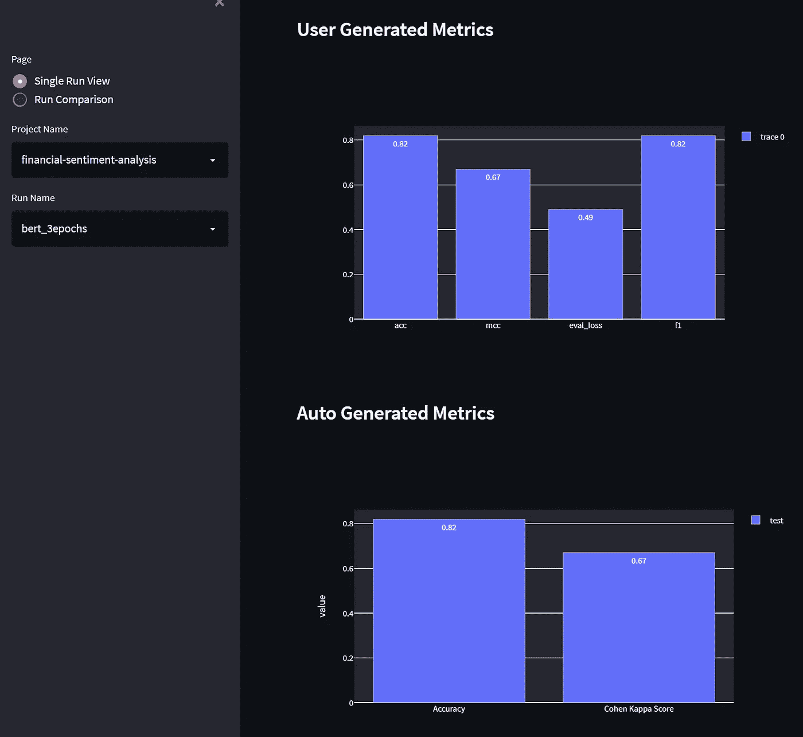
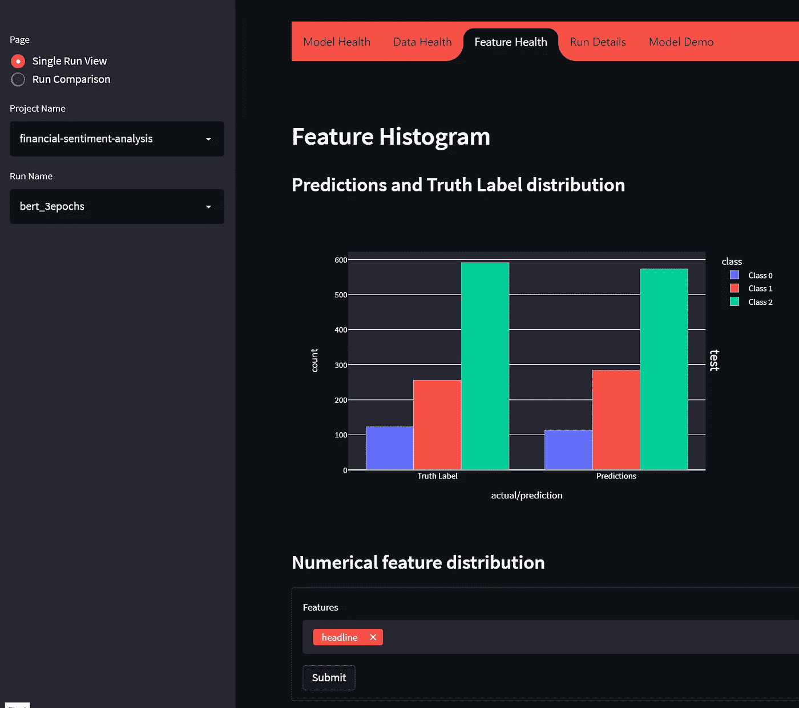
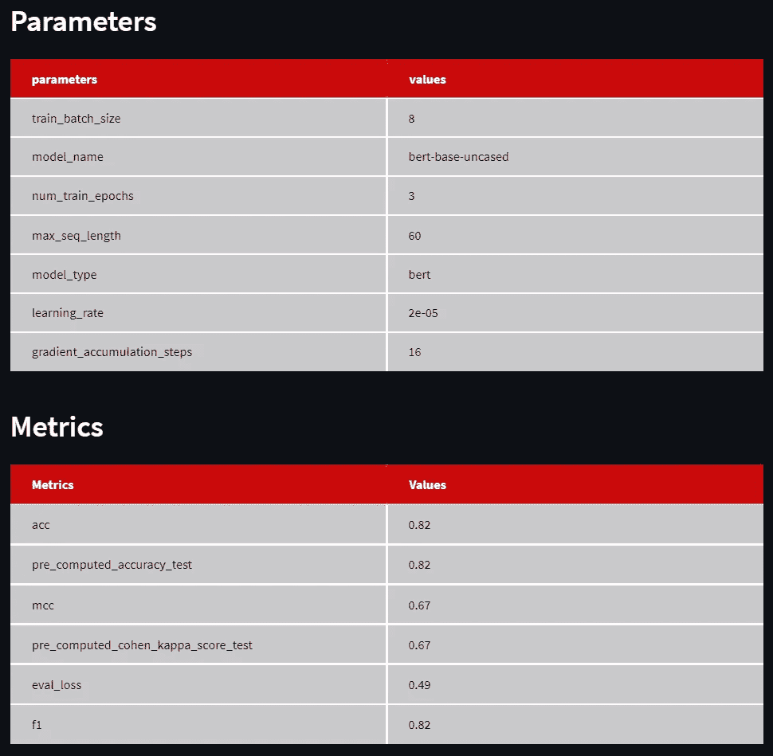
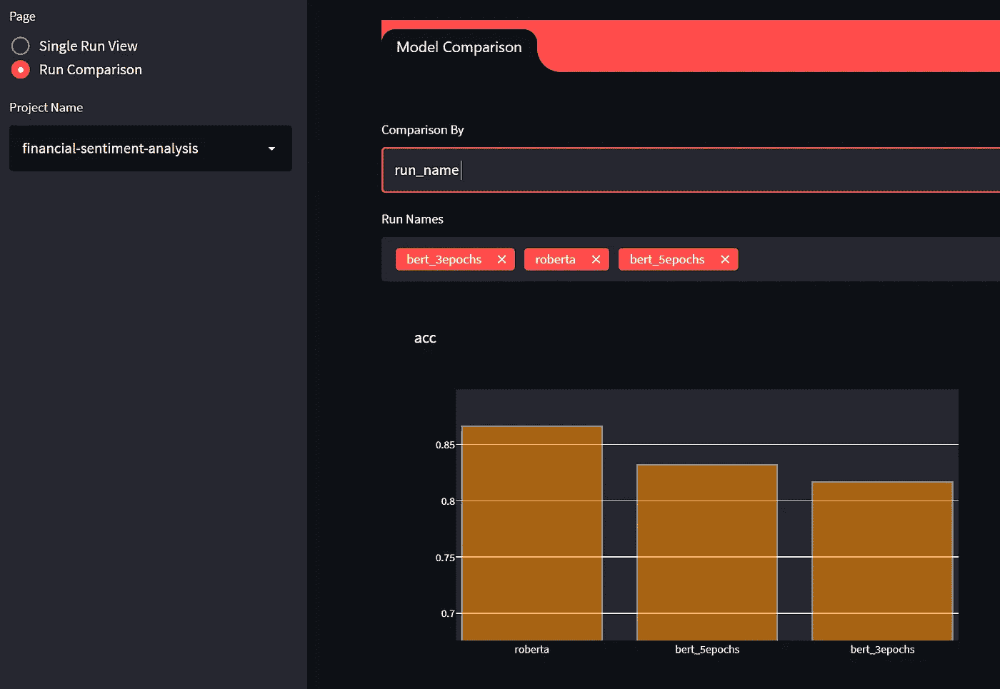
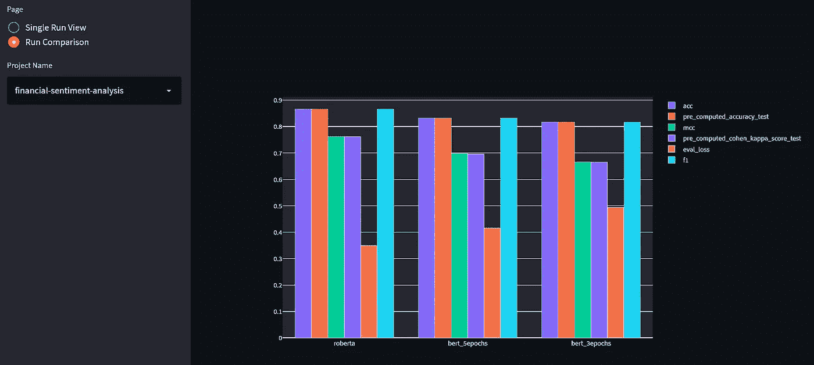
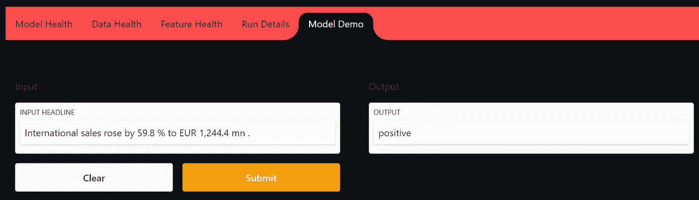

# 使用 MLFoundry 跟踪和监控变压器

> 原文：<https://medium.com/analytics-vidhya/tracking-and-monitoring-transformers-with-mlfoundry-460a3b860600?source=collection_archive---------1----------------------->

## TrueFoundry 使用 MLFoundry 高效跟踪和监控用于财务情绪分析的变压器模型


来源: [Catchpoint 数字监控:在不影响质量的前提下提供最低成本的选择](https://www.catchpoint.com/blog/digital-monitoring-offer)

近年来，自然语言处理(NLP)在金融应用中变得越来越流行。股票/外汇市场预测、波动性建模、资产分配、业务分类构建、信用评分、首次公开发行(IPO)估值以及其他应用都在其中。这个金融领域中的一个常见任务(或者说子任务，可以为前面提到的一些任务提供*特性*)是 ***金融情绪分析(FSA)*** *。*FSA 的目标是对金融文本进行分类，以表达对特定论点的看涨或看跌意见。

在这个 NLP 的新时代，像 FSA 这样的任务也受到了变形金刚统治地位的冲击。像 [*芬伯特*](https://arxiv.org/pdf/1908.10063.pdf) 这样的模型与以前的方法相比表现明显更好。

在本教程中，我们将探索如何使用 [***简单变形器***](https://simpletransformers.ai/docs/usage/) 库轻松微调任何用于 FSA 任务的预调整变形器。然后，我们将通过改变参数和基本模型并使用[***ml foundry***](https://truefoundry.gitbook.io/mlfoundry/)跟踪相关信息来迭代实验。我们将使用 MLFoundry Web 应用程序创建一个定制的模型演示，可以与他人共享或向用户展示。

所以，让我们开始吧！

***Tl；dr:*** *如果您希望只查看我们在本文中涉及的所有工作实现，请参考本笔记本的*[](https://gist.github.com/tezansahu/a22dd2e4d880d4fc2e308e36795219a2)**。尽管 GitHub gists 在本文中被用作代码片段，但是如果直接复制，它们可能不会像预期的那样工作。随时参考* [*提到的笔记本*](https://gist.github.com/tezansahu/a22dd2e4d880d4fc2e308e36795219a2) *以防你面临这样的问题。**

# *预赛*

*我们首先为这个项目创建一个虚拟环境，并安装必要的库:*

```
*matplotlib==3.5.1
mlfoundry==0.2.7
mlfoundry-ui==0.1.4
numpy==1.21.5
pandas==1.4.1
scikit-learn==0.24.2
simpletransformers==0.63.4
torch==1.10.2*
```

> ***注:**建议使用一些 GPU 访问来训练变压器模型，因为它们很大，否则需要相当长的训练时间。使用 Google Colab 可能是一个可行的解决方案。*

*接下来，我们需要创建一个 IPython 笔记本并导入所需的库。可选地，我们也可以清除 CUDA 中的缓存。*

*我们不需要在 PyTorch 中显式地设置`device`,因为`simpletransformers`库会自动处理并默认使用 GPU。*

# *基于简单变形器的财经新闻情感分析*

## *探索和处理数据集*

*对于本教程，我们使用从 Kaggle 获得的经过处理的[*financialphasebank*数据。该数据集包含了散户投资者眼中的财经新闻标题的观点。`all-data.csv`文件包含两栏，*情感*和*新闻标题*。情绪可以是消极的、中性的或积极的。因此，FSA 任务被视为多类分类问题。](https://www.kaggle.com/ankurzing/sentiment-analysis-for-financial-news)*

*由于简单的 Transformers 库要求数据位于至少有两列的 Pandas DataFrames 中，这两列被命名为`text`(类型为`str`)和`labels`(类型为`int`)，因此我们在将数据分成训练&评估集之前进行了所需的处理。*

## *为 FSA 训练一个 BERT 模型*

*我们定义一个简单的训练函数，它接受模型的规范来创建一个`ClassificationModel`，以及训练超参数来执行训练循环。我们还通过利用`scikit-learn`使用*微 F1* 和*准确度*分数来评估模型。*

*作为拥抱面部库的包装器，简单变形金刚通过抽象掉所需的繁重工作，使这一切变得极其简单。因此，我们只用 3-4 条语句就可以创建、训练和评估我们的转换器。*

*在`ClassificationModel`的构造函数中，第一个参数是 *model_type，*第二个是 *model_name* ，第三个是数据中的标签数(设置为`3`是因为我们有三个情绪)。目前，Simple Transformers 支持可用类型中的[作为 *model_type。**model _ name*可以是](https://simpletransformers.ai/docs/classification-specifics/#supported-model-types)[拥抱脸](https://huggingface.co/models)上的任意一款。*

*训练完模型后，我们使用`eval_model()`对其进行评估。该函数返回以下内容:*

*   *一个`dict`包含评估数据集的性能指标(默认为 Matthews 相关系数和损失，以及我们定义的微 F1 和准确性)*
*   *每个评估实例的模型输出的`list`*
*   *A `list`模型预测不正确的输入*

*经过训练的模型检查点存储在`training_args['output_dir']`中。*

**有许多超参数可以根据您的要求进行更改。完整列表及其默认值如下:**

*在实际向`trainModel()`函数提供所需参数之前，我们将引入 MLFoundry 来设置我们实验所需的跟踪。*

# *引入 MLFoundry 进行跟踪和监控*

*MLFoundry 是由[***true foundry***](https://truefoundry.com/)创建的 ML 监控和实验跟踪解决方案，它允许用户跟踪他们的实验、模型、度量、数据&特征。具有参数、数据集和指标的唯一组合的每个实验被认为是一个 ***运行*** ，并且多个这样的运行可以被逻辑地分组为一个 ***项目*** 。每个运行都有一个唯一的 ***run_id*** ，但也可以赋予一个 ***run_name*** 以便于引用。稍后，可以使用交互式仪表板检查和比较这些运行。*

## *用 MLFoundry 记录实验细节*

*首先，我们导入 MLFoundry 并初始化 API。然后，我们创建我们的项目(名为`financial-sentiment-analysis`),第一次运行名为`bert_3epochs`。这个实验将涉及对三个时期的 BERT 模型进行微调。*

*这将在项目目录中创建一个`mlf/`文件夹，其中包含 MLFoundry 记录的各种运行的所有信息。*

*现在，我们修改我们的`trainModel()`函数，接受一次运行作为输入，并记录所有需要的信息(参数、数据集、指标和数据集统计)。*

*   *为了记录 ***训练&评估数据集*** ，我们使用`[log_dataset()](https://truefoundry.gitbook.io/mlfoundry/api-doc/mlfoundry/mlfoundryrun/log_dataset)`*
*   *我们把 ***型号规格*** (型号和名称)记录下来，连同 ***超参数*** 作为字典使用`l[og_params()](https://truefoundry.gitbook.io/mlfoundry/api-doc/mlfoundry/mlfoundryrun/log_params)`*
*   *使用`[log_metrics()](https://truefoundry.gitbook.io/mlfoundry/api-doc/mlfoundry/mlfoundryrun/log_metrics)`记录包含我们的评估集(准确性和微 f1)上的 ***性能指标*** 的字典。*
*   *使用`[log_dataset_stats()](https://truefoundry.gitbook.io/mlfoundry/api-doc/mlfoundry/mlfoundryrun/log_dataset_stats)`记录时，与我们的数据 t 相关的各种 ***指标，以及 ***统计数据*** 如计数器、摘要、直方图和最频繁的值都是使用`[whylogs](https://docs.whylabs.ai/docs/)`自动估算的。****

*现在，我们以字典的形式设置超参数以及模型规范，并为之前定义的运行调用`trainModel()`函数。*

*这将从预训练的`bert-base-uncased`模型加载权重，并根据三个时期提供的超参数对其进行微调。*

## *在 MLFoundry 仪表盘中导航*

*一旦培训完成，我们可以通过从项目文件夹(包含`mlf/`文件夹)中运行命令`mlfoundry ui`来查看 [MLFoundry 仪表板](https://truefoundry.gitbook.io/mlfoundry/mlfoundry-dashboard)中的所有记录信息。默认情况下，这将在`localhost:4200`上启动仪表板(我们可以通过运行`export STREAMLIT_SERVER_PORT=<your-preferred-port>`来更改端口)。*

*在 ***单次运行视图*** 下，选择`financial-sentiment-analysis`为 ***项目名称*** 和`bert_3epochs`为 ***运行名称*** 。现在，我们可以使用不同的选项卡来检查有关已跟踪的特定运行的所有信息:*

*   ****模型健康*** 部分显示了评估数据集上当前模型的性能指标。这些包括混淆矩阵(因为这是一个多类分类任务)以及其他相关的图。*

**

*模型运行状况部分显示了 bert _ 时期运行的各种用户生成和自动生成的指标*

*   ****Data Health*** 部分包含与我们的数据集相关的各种统计信息，可用于了解数据质量，并在以后有数据更改时将其与其他数据集进行比较。*
*   ****特征健康*** 部分显示基于输入特征的标签和预测值的数值分布。对于我们的例子，只有一个名为 *headline* 的输入特征，包含金融新闻标题。*

**

*特征健康部分显示了 bert _ 时期运行的标签和预测的类的数字特征分布*

*   ****运行详细信息*** 部分显示为运行记录的所有参数和指标，还允许用户查看数据集和其他与跟踪的运行相关的工件。*

**

*我们看到，经过三个时期的训练，我们微调的 BERT 模型可以达到 0.82 的 ***精度和 0.82*** 的 ***微 F1 得分。****

# *使用 MLFoundry 高效跟踪和比较多个实验*

*现在，我们将看到为特定任务试验不同的模型和参数是多么容易，同时能够通过在同一项目中创建不同的运行来跟踪所有相关信息以供参考。*

*为了通过改变超参数来演示实验，我们创建了一个名为`bert_5epochs`的新运行，并将其与`training_args`字典一起传递给`trainModel()`函数(这一次，字典中`num_train_epochs`的值被设置为`5`而不是`3`和`model_params`(不变)。*

*为了说明不同变压器架构在实验中的使用，我们创建了一个名为`roberta`的新运行。这一次，我们保持`training_args`与前一次运行(使用`5`周期)相同，并更改`model_params`以使用预训练的 RoBERTa 的权重来代替 BERT。*

*一旦这些模型的训练完成，我们再次进入 MLFoundry 仪表板，通过选择*单次运行视图*下的特定 *run_name* 来检查跟踪的信息。既然我们有多个运行，我们也可以在 ***运行比较*** 下比较它们。*

*可以使用 *run_id* 或 *run_name* 选择要比较的跑步，后者更方便*。**

**

*   *当训练更多的时期时，BERT 模型显示出更好的准确性*
*   ****罗伯塔*** 模型给出了****的最佳精度 0.866*****

**向下滚动，我们还可以看到每次运行跟踪的所有性能指标的合并图。**

****

# **使用 MLFoundry Web 应用程序的模型演示**

**了解了使用 MLFoundry 对 transformer 模型进行迭代实验、跟踪和比较的过程后，我们现在希望向更广泛的受众展示我们的最佳模型(即 RoBERTa)的性能。这就是***ml foundry Web App***派上用场的地方。**

**为此，我们可以创建一个独立的 web 应用程序文件，该文件将使用`log_webapp_file()`在适当的运行中注册。因为我们想为我们的 RoBERTa 模型制作演示，我们将这个文件命名为`streamlit_roberta.py`(也可以命名为其他名称)。在这个文件中，我们首先需要编写一个函数，该函数可以加载一个保存的简单 Transformer 模型，并使用加载的模型为输入的金融新闻标题预测情绪。然后，我们需要初始化 MLFoundry 客户端，创建一个运行，并通过向它提供预测函数、输入和输出类型(这里，我们只有一个输入和一个输出，每个类型都是`text`)来调用运行中的`webapp()`。这在仪表板上定义了一个模型演示界面。**

**回到我们训练模型的笔记本，我们可以向`mlf_run_3`注册这个文件，它跟踪我们基于 RoBERTa 的实验的所有信息。**

**在仪表板中，当我们可以选择`roberta` run 并打开 ***Model Demo*** 部分时，我们会看到一个交互式演示(类似于《拥抱脸》中的 *Model Card* ),它利用我们保存的 RoBERTa 检查点来预测金融新闻标题的情绪。**

****

**金融新闻标题被我们微调的 roberta 模型正确分类为“正面”的示例，如 MLFoundry Web 应用程序中的“RoBERTa”所示**

***由于这个 web app 是使用*[*Streamlit*](https://streamlit.io/)*构建的，我们可以将* `*streamlit*` *导入到* `*streamlit_roberta.py*` *文件中，并使用它来添加其他元素(例如，添加可解释性等。)添加到该模型演示仪表板，以便进行定制。***

# **结束语**

**在本教程中，我们最初看到了如何使用简单的转换器轻松地为 NLP 任务(如金融情绪分析)训练转换器模型。后来，我们使用 MLFoundry 来跟踪不同实验的参数、指标、数据集和统计数据，我们通过改变一些超参数和模型架构来执行这些实验。最后，我们还创建了一个 web 应用程序来演示我们训练好的模型如何预测金融新闻标题的情绪。**

**有关本教程中提到的库的文档的更多细节，请随意查看下面的参考资料部分。请在下面的评论区留下任何反馈或建议。**

**[*TrueFoundry*](http://truefoundry.com/) *正在为依赖开放标准的 ML 管道构建最快的框架之一，* ***通过他们的自动化后模型管道节省了数据科学团队 30–40%的时间*** *。欢迎* [*报名，提前获得 TrueFoundry 的 ML 监控和自动缩放解决方案*](https://truefoundry.com/contact) *！***

***特赞萨胡上*[*LinkedIn*](https://www.linkedin.com/in/tezan-sahu/)*和*[*GitHub*](https://github.com/tezansahu)*。***

# **参考**

1.  **[金融情绪分析:常见错误和银弹调查| aclanthology.org](https://aclanthology.org/2020.coling-main.85.pdf)**
2.  **[简易变形金刚](https://simpletransformers.ai/)**
3.  **[简单的变形金刚——使用 BERT、RoBERTa、XLNet、XLM 和 DistilBERT 进行多类文本分类|作者:thi Lina Rajapakse | The Startup | Medium](/swlh/simple-transformers-multi-class-text-classification-with-bert-roberta-xlnet-xlm-and-8b585000ce3a)**
4.  **[MLFoundry | gitbook.io](https://truefoundry.gitbook.io/mlfoundry/)**
5.  **[TrueFoundry 的 ML 监控&实验跟踪解决方案| Nikunj Bajaj | Medium](/@nikunjbajaj/truefoundrys-ml-monitoring-experiment-tracking-solution-ba5ad9c6cbe6)**