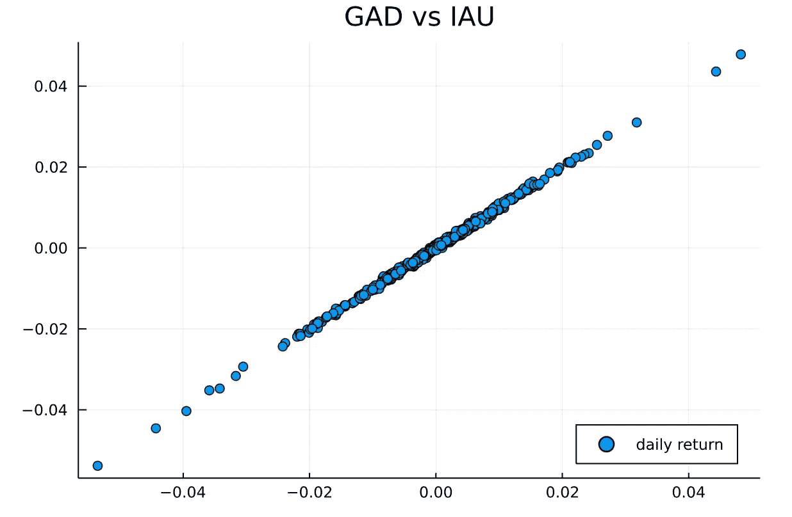
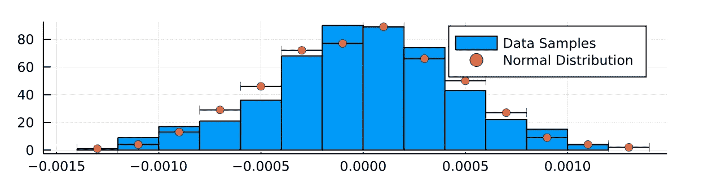
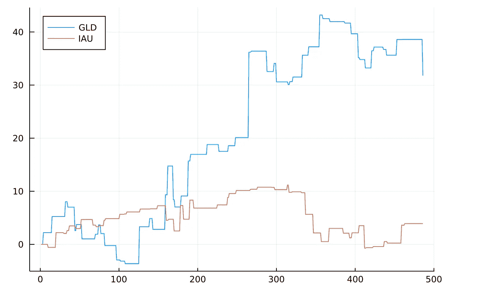

# 协整贸易

> 原文：<https://medium.com/analytics-vidhya/trade-with-cointegration-f1116dfc42?source=collection_archive---------2----------------------->

# 介绍

金融衍生品的价格将取决于其基础资产，因此具有相同基础资产的两个金融衍生品应该表现相似，即相关。在本文中，我将研究两个黄金交易所交易基金的相关性:(GLD 和 IAU)，然后利用它们的相关性制定交易策略。

# 黄金交易所交易基金

要了解更多什么是 ETF 和黄金 ETF，请参考[https://www . investopedia . com/articles/investing/032116/what-relationship-between-Gold-Gold-ETFs-gld-IAU . ASP](https://www.investopedia.com/articles/investing/032116/what-relationship-between-gold-and-gold-etfs-gld-iau.asp)

GLD 和 IAU 是两个受欢迎的黄金交易所交易基金，由不同的信托公司持有。两者都将密切跟踪黄金价格。因此，我们预计它们的回报率将遵循类似的模式。

# 分布分析

1.  使用[羊驼 API](https://alpaca.markets/docs/api-documentation/api-v2/) 下载每日收盘价。
2.  计算前一天的百分比回报
3.  散点图(图 1 中)
4.  从 IAU 减去 GLD 的每日收益
5.  按分位数过滤掉异常值
6.  绘制直方图(见图 2)

**观察**:非常接近均值为零的正态分布。



图一



图 2

使用分布拟合函数“拟合”来验证数据是否符合正态分布。下面是 Julia 代码，用于绘制直方图和数据的正态分布拟合。

```
using Random, Distributions
using StatsBase
df = DataFrame(data)lower = quantile(df[:,:Diff], 0.01)
upper = quantile(df[:,:Diff], 0.99)
df = filter(:Diff => x -> x > lower, df)
df = filter(:Diff => x -> x < upper, df)
[@show](http://twitter.com/show) mean(df[!,:Diff])
[@show](http://twitter.com/show) std(df[!,:Diff])
histogram(df[!,:Diff], labels="Data Samples")
d=fit(Normal, df[!,:Diff])
n = length(df[:,:Diff])
plot!(rand(d, n), seriestype=:scatterhist, linestyle=:solid, size=(600,150),labels="Normal Distribution")
```

# 平稳性

平稳时间序列是指其统计特性，如均值、方差、自相关等。都是不变的。

使用[扩展的 Dickey–Fuller(ADF)测试](https://en.wikipedia.org/wiki/Augmented_Dickey–Fuller_test)来测试时间序列是否平稳。测试结果的 *p 值*是一种常用的检查方式。

> 如果 p 值> 0.05，则它是非平稳的。如果 p 值≤ 0.05，则为静态。

1.  GLD 和 IAU 的价格不是一成不变的。(GLD p 值= 0.8521，IAU p 值= 0.9077)
2.  GLD 和 IAU 的每日收益是稳定的。(GLD 收益 p 值< 1e-25，IAU 收益 p 值< 1e-25)
3.  GLD 和 IAU 的日收益率之差是固定的。(p 值< 1e-99)

下面是测试平稳性的 Julia 代码。

```
using Plots
function testStationary(df)
    y = autocor(df,1:20)
    display(bar(y))
    y = pacf(df,1:20)
    display(bar(y))
    ADFTest(df,:none,1)
end
```

# 共整合现象

事实上，基于上述性质，我们可以说 GLD 和 IAU 是协整的，并且我们可以用 Engle-Granger 检验来检验这种协整性。有关协整的更多信息，请参考其 [Wiki](https://en.wikipedia.org/wiki/Cointegration) 页面。关于如何实施恩格尔-格兰杰检验，请参考[这本实用指南](https://www.real-statistics.com/time-series-analysis/time-series-miscellaneous/engle-granger-test/)。

# 交易策略

两个 ETF 的收益率之差服从均值为零的正态分布。它也是一个平稳的时间序列，所以它将恢复到它的均值零。

由于两个 ETF 回报的差异将恢复到零，如果差异超过一个标准差，我们预计差异将减少到零，这意味着第一个 ETF 的回报将下降，第二个将上升。所以我们的交易信号是卖出第一只 ETF，买入第二只 ETF。

类似地，如果差值小于一个标准差，我们预计差值将增加到零，这意味着第一个 ETF 的回报将增加，第二个将下降。所以我们的交易信号是买第一个，卖第二个。

# 回溯测试

我使用 2019 年 7 月 12 日至 2021 年 6 月 17 日的收盘价数据进行后验测试。

1.  如果我收到买入信号，我的头寸是 0，我将买入 1 股，并从账户余额中扣除收盘价。
2.  如果我收到买入信号，我的仓位是 1，我仍然会持有这 1 股。
3.  如果我收到卖出信号，我的头寸是 1，我将卖出这 1 股，并将收盘价加到账户余额中。
4.  如果我收到卖出信号，而我的仓位是 0，那就什么都不会做。

由于 GLD 的价格大约是 IAU 的 5 倍，当我与 IAU 交易时，我将使用 5 单位份额而不是 GLD 的 1 单位份额。

以下是最终结果。

1.  在 GLD 进行了 53 次交易，在 IAU 进行了 52 次交易。
2.  GLD 的 28 笔交易和 IAU 的 32 笔交易都获得了收益。平均而言，57%的交易获利。
3.  GLD 和 IAU 分别盈利 31.8 美元和 3.9 美元

这里显示了一段时间内的平衡:



GLD 天平的最大损耗(缺点)是 0.7，IAU 是 3.6。

# 与布林线的对比

为了便于比较，我用布林线对交易策略做了同样的回溯测试。

1.  在 GLD 做了 13 笔交易，在 IAU 做了 13 笔交易。
2.  GLD 有 6 笔交易和 IAU 有 8 笔交易是盈利的。平均而言，54%的交易获利。
3.  GLD 亏损 8.7 美元，IAU 盈利 4.3 美元

# 结论

1.  使用协整的交易策略可以产生更高的利润。
2.  捕捉更多的交易信号。
3.  更高的盈利交易百分比。