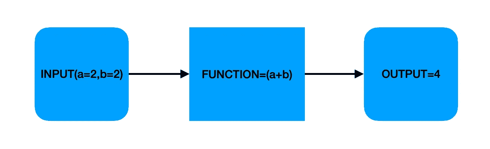
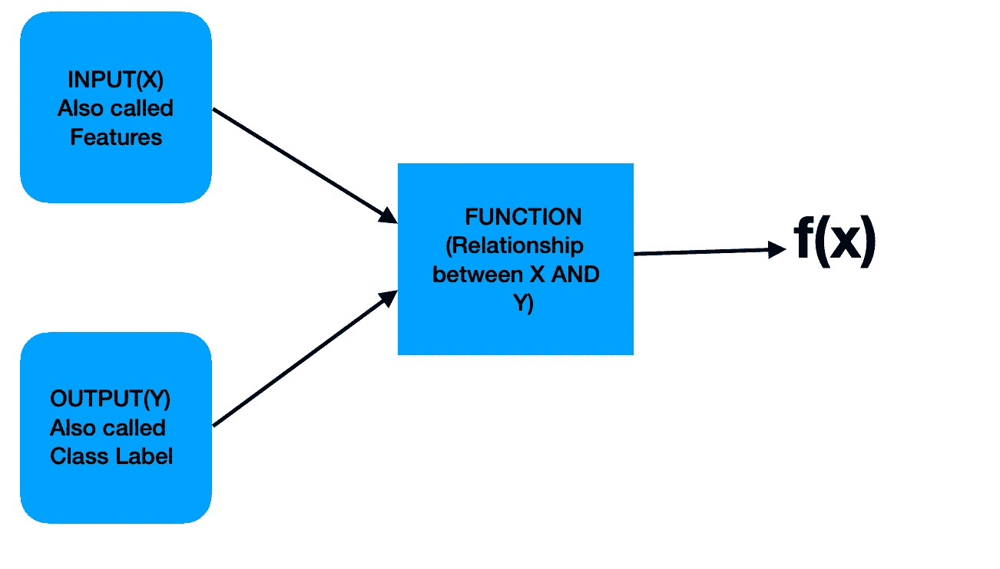
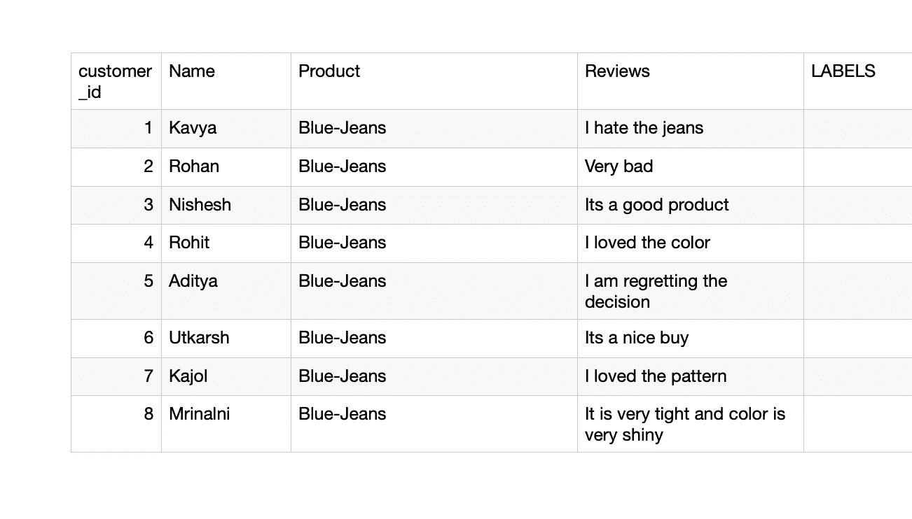
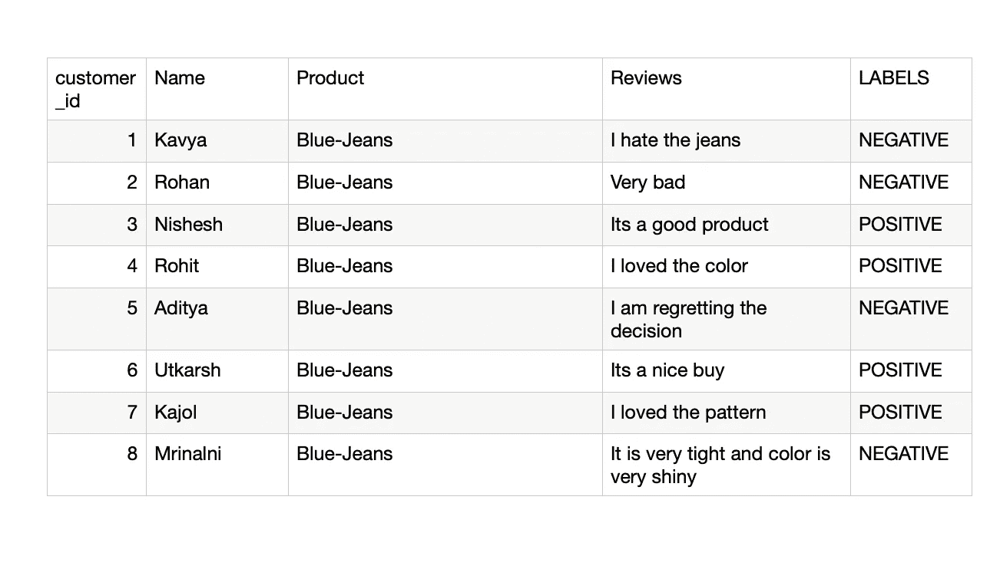

# 传统编程与机器学习编程

> 原文：<https://medium.com/analytics-vidhya/traditional-programming-vs-machine-learning-programming-85b8bd428e9d?source=collection_archive---------14----------------------->

机器学习在很多年前就已经被引入，但最近几年它所获得的兴奋是难以置信的，每个人都在谈论机器学习，但世界上许多事情都被赋予了不同的含义。谈到机器学习的意义，不同的人有不同的看法，可能他们都以自己的方式是正确的。

但对于初学者来说，这可能会非常混乱，本文旨在缓解机器学习基本定义背后的想法。

在了解机器学习之前，我们先了解一下什么是传统编程？？

## **传统编程**

假设我们有一个接受两个输入(a 和 b)并返回总和(a+b)的函数，那么在传统编程中，我们只需接受输入，放入函数中，就可以得到所需的输出。

这个函数可以是任何函数，可以是函数中的函数，可以是一个程序中上百个函数，但是基本块非常简单。

## **机器学习编程**

现在假设我们有输入，也有输出，这里的目标是得到 x 和 y 之间的关系，或者这么看，

我们有一个函数，

F(x)=y

这里有 x，有 y，我们需要逼近函数 F。

输入 X 也可以称为机器学习世界中的特征，输出 Y 也可以称为类别标签。

让我们通过一个简单的例子来理解这一点，

想象一下，你在亚马逊获得了一份数据科学家的工作，你的经理要求建立一个机器学习模型，该模型可以预测亚马逊客户给出的特定评论是正面还是负面。

现在，在建立机器学习模型之前，让我们了解一下为什么它很重要，

为什么亚马逊客户的评论对亚马逊很重要？

假设亚马逊网站上有一款产品“蓝色牛仔裤”,总共有 500 条评论，400 人不喜欢该产品，他们给出了差评，只有 100 人给出了好评。现在的问题是，“亚马逊会把这个产品放在他们的第一个初始页面上吗？”

**答案是“不”，亚马逊不会把这样的产品放在他们的第一个初始页面上。**

这就是顾客的评论对亚马逊非常重要的原因。

## 回到机器学习公式…

假设你的经理给了你顾客对一个产品“牛仔裤”的最后 8 次评论的数据(最初的数据比这个长得多，在现实世界中我们可能会得到 10 万次评论来提出一个模型，但为了简单起见，我只拿了 8 个不同的人的 8 次评论，有些人给了积极的评论，有些人不喜欢这个产品。

现在，亚马逊的一个团队被指派给这些数据贴上标签，无论这些数据在阅读评论后是正面还是负面。

数据集示例(无标签)

## 手动标记后，评论数据将看起来像这样，

数据集示例(带标签)

亚马逊每秒钟从全球各地获得数千条评论，因此如果一个人工团队将标记每一条评论，亚马逊必须花费大量的金钱和时间来完成这些标记。

**那么机器学习是否有潜力为我们标注这些评论呢？？**

回答是“有”。

现在让我们把这些点连接起来，我们把机器学习编程定义为，我们有输入和输出，我们需要找到函数 F(X)。

我们需要找到 Y 和 x 之间的关系。

## 现在我们有 X = {客户 id，姓名，产品，评论}

## (这是我们的输入)

## 现在我们有 Y={Labels}

## (这是我们的输出)

我们有输入和输出，我们需要找到函数 F(X ),它能给出 Y 和 X 之间的关系。

## 意味着如果明天，任何随机的人评论这个牛仔裤产品，那么机器学习系统应该能够预测它是正面评论还是负面评论。

# 尼舍什·戈吉亚

*   ***如果你喜欢这个，*** [***跟我来这里***](/@nishesh.kumar) ***了解更多***
*   ***有兴趣合作吗？下面就来连线一下***[***insta gram***](https://www.instagram.com/nishesh_gogia/)