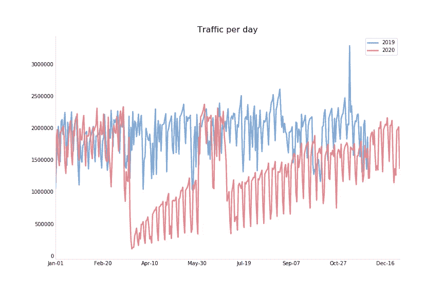
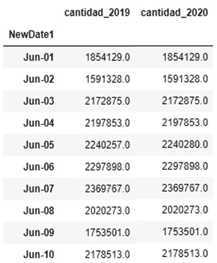
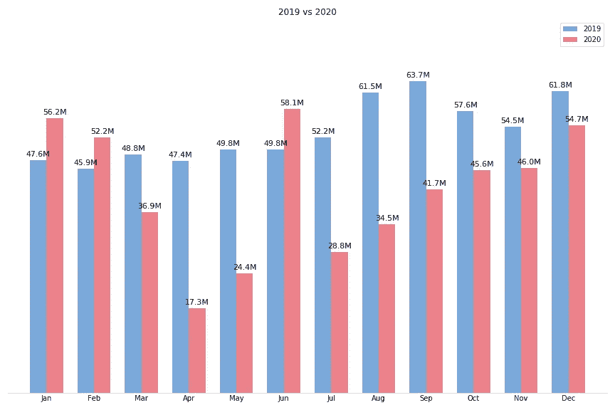
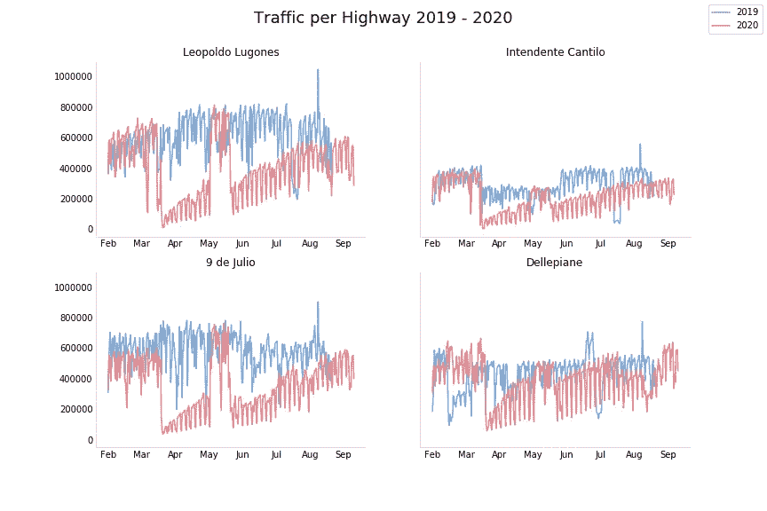
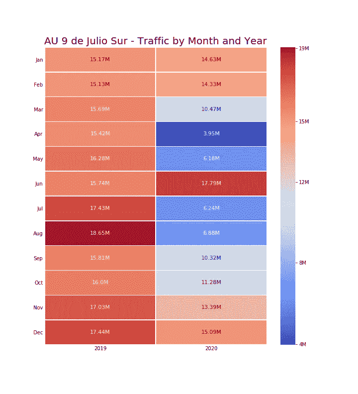

# 新冠肺炎期间布宜诺斯艾利斯城市公路的交通流量:探索性数据分析

> 原文：<https://medium.com/analytics-vidhya/traffic-flow-in-buenos-aires-city-highways-during-covid-19-an-exploratory-data-analysis-9b690c1c56fd?source=collection_archive---------29----------------------->

[*点击西班牙语版本*](https://juanmaovando.medium.com/flujo-vehicular-en-las-autopistas-de-la-ciudad-de-buenos-aires-durante-el-covid-19-an%C3%A1lisis-953bd7453771)

# **目录**

[简介](#3ead)；

[关键见解](#2e11)；

[关键事实](#0254)；

[数据分析题](#fdfa)；

[数据分析](#8185):

*   [各年每天的交通流量分布](#7857)；
*   [各条公路的交通流量](#18c7)；

[结论与未来分析](#ff87)；

# **简介**

该项目的主要目的是对 2020 年阿根廷布宜诺斯艾利斯市的交通流量进行探索性分析。目的是找出新冠肺炎的封锁是如何影响布宜诺斯艾利斯主要高速公路的交通流量的。

为此，从布宜诺斯艾利斯官方数据网站[收集了数据。目标是比较 2019 年和 2020 年，以更好地了解非疫情年是什么样子，以及交通流量限制的影响。](https://data.buenosaires.gob.ar/dataset/flujo-vehicular-por-radares-ausa)

数据集包含 2019 年和 2020 年期间雷达捕捉的每小时交通流量。它们包括具体的雷达日期、时间、公路名称、雷达位置及其名称。

在 Jupyter Notebook 中使用 Python 处理和分析数据。使用的一些主要库是 Pandas、Numpy、Matplotlib 和 Seaborn。要深入了解该项目，以及对数据集和清理过程的介绍，请访问 Kaggle 中的[版本。](https://www.kaggle.com/javulja/buenos-aires-traffic-during-covid)

[*返回目录*](#4dc6)

# **关键见解**

从获得的结果来看，可以得出一些结论:

数据的总体趋势显示，疫情的情况在头两个月迅速下降，随后在未来几个月逐渐上升，直到在 2020 年最后一个月达到非疫情数字。

2020 年的封锁在布宜诺斯艾利斯市高速公路交通流量减少方面发挥了重要作用；

虽然所有公路的交通量普遍下降，但在 9 号胡利奥和 4 号卢戈内斯受到的影响最大；

2020 年 4 月是车流量下降比较明显的月份；

[*返回目录*](#4dc6)

# **关键事实**

布宜诺斯艾利斯自治市(CABA)是阿根廷最大的城市，人口估计为 2，891，082 人(2010 年最新人口普查)；

CABA 是布宜诺斯艾利斯大都市区(AMBA)的一部分，布宜诺斯艾利斯大都市区是由 CABA 和布宜诺斯艾利斯省的 40 个城市组成的城市群。根据 2010 年人口普查数据，AMBA 人口约为 13 147 638 人。它的部分居民也是 CABA 公路的使用者；

阿根廷政府及其辖区决定于 2020 年 3 月 19 日在阿根廷新冠肺炎疫情开始实施封锁。在其他限制中，这意味着只有获得官方许可的人才能在城市及其高速公路上通行；

11 月 9 日，卡巴和 AMBA 解除了封锁措施，在封锁开始 7 个月后。大部分交通限制都放宽了；

[*返回目录*](#4dc6)

# **数据分析题**

2020 年的交通流量会因为封锁而有变化吗？如果是，与 2019 年相比，这一变化有多大？

2020 年的交通流量趋势如何？

交通量水平的变化对高速公路有何影响？

就交通流量而言，哪条高速公路受到的影响最大？

[*返回目录*](#4dc6)

# **数据分析**

收集数据的雷达安装在布宜诺斯艾利斯的五条主要公路上:

AU 4 卢戈内；

AU 5 坎蒂洛；

南方胡里奥 9 日；

AU Dellepiane

AU 7 坎波拉；

**各年每天的交通流量分布**

总的来说，2020 年的总流量近 4.96 亿，而 2019 年的流量记录为 6.4 亿。与非疫情的情况相比，减少了 22.48%。平均而言，2020 年的日流量记录为 135 万，而 2019 年为 192 万。

可以看出，2020 年 6 月的数字看起来与总体趋势大相径庭。当比较 2019 年和 2020 年的日交通流量时，数据显示每天的数量有很大的一致性，这可以解释为在两年中使用了相同的数据。另一方面，很明显，这些数字没有遵循疫情时期的流量趋势——值得一提的是，CABA 在 2020 年 6 月仍处于封锁状态。

两个数据集之间的快速比较表明，2020 年 6 月的数据很可能是从 2019 年的数据集中意外提取的。

展望未来，在探索性分析期间，2020 年 6 月应该是一个问号，直到对该数据是如何处理的有了更好的理解。

如图表所示，很明显，自封锁开始(3 月 19 日)以来，2020 年的交通流量大幅下降，并且在接下来的一个月更加明显。

回到细节，与 2019 年同期相比，2020 年开始时的数字更大，2020 年 1 月和 2020 年 2 月的道路交通水平分别增长 18%和 13%。然而，数据显示，3 月 19 日的封锁似乎改变了这一趋势，因为流量从 2 月份的 5220 万下降到 3 月份的 3690 万。这一下降在 4 月份更加明显，数字降至 1730 万，与 2019 年同月相比减少了 64%。

另一方面，尽管封锁措施仍然存在，但从 5 月份开始，下降趋势发生了变化，因为交通流量开始逐月略有增加——如果我们排除 2020 年 6 月的数据，由于前面讨论的原因。虽然 11 月 9 日是政府放松封锁限制的日子，但 10 月似乎是交通流量首次出现平稳迹象的月份。

最后但并非最不重要的是，尽管这些数字仍比 2019 年的平均水平低 12%左右，但可以看出，2020 年结束时，与非疫情情况对应的水平相似，即 5470 万条交通记录。这可能是由于之前的封锁措施在 11 月 9 日结束，以及阿根廷假期开始。

[*返回目录*](#4dc6)

**每条公路的交通流量**

2019 年，AU 4 Lugones 和 AU 9 de Julio Sur 都经历了最大的交通流量记录，日均分别为 61 万左右和 58.7 万。相反，AU Dellepiane 记录的交通量要少得多，不到 43.3 万辆，而 AU 5 Cantilo 是迄今为止最少使用的道路，根据数据，日均接近 29.4 万辆。

可以预见的是，2020 年的交通流量将小于 2019 年，AU 4 Lugones 是最受欢迎的高速公路，平均每天有 39.6 万条记录，其次是 AU Dellepiane，约 39 万条。至于 AU 9 de Julio 和 AU 5 Cantilo，它们在此期间的交通量较小，分别低于 35.6 万辆和 21.4 万辆。

无法比较 AU 7 Campora 的数据，因为没有 2019 年的数据。然而，与 2020 年的其他高速公路相比，2020 年这条高速公路的记录数量要少得多，仅超过 4.3 万条。

根据手头的数据，可以得出结论，封锁对雷达记录的车辆数量有很大影响。在这方面，AU 9 de Julio 是受封锁影响最大的道路，与 2019 年相比下降了 33%以上。其次，AU 4 Lugones 跌幅接近 29%，AU 5 Cantilo 跌幅在 21%左右。

最后，有趣的是，与 2019 年相比，AU Dellepiane 的流动性下降幅度没有其他高速公路大，仅为 0.9%。

放大受封锁影响最大的道路 AU 9 de Julio，显示 2020 年的总体趋势在这条公路的流量中得到了很好的描述:3 月份逐渐下降，随后在 4 月份急剧下降，然后在年底前呈上升趋势。

[*返回目录*](#4dc6)

# **结论与未来分析**

综上所述，探索性数据分析表明，2020 年的封锁对布宜诺斯艾利斯市公路交通流量的减少起到了显著作用。这一变化在 2020 年 4 月尤为显著，尽管自 5 月以来交通流量逐渐增加，直到 12 月达到正常数字。

在这方面，可以注意到，不管政策限制如何，自封锁的第二个月以来，流量逐月增长。

虽然交通量的下降影响了每一条记录在案的公路，但 AU 9 de Julio 和 AU 4 Lugones 是受影响最大的公路。

对于未来的研究，投影模型将允许分析相关性，纬度和经度可用数据可用于绘制地理数据。

[*返回目录*](#4dc6)