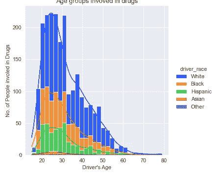

# 🚦来，我们一起探索交通违章数据🚘📊

> 原文：<https://medium.com/analytics-vidhya/traffic-violation-eda-c7ee4b6fe356?source=collection_archive---------13----------------------->

这是基于 Python 的对交通数据集的探索性数据分析，以找出不同的趋势，从而减少交通违规。

## 关于数据集:

该数据集包含大约 65，000 多条与交通相关的违规记录。

**属性信息:**
1。*停止日期-* 违章日期
2。*停止时间-* 违反时间
3。*驾驶员 _ 性别-* 违章者性别(男-M，女-F)
4。*驾驶员 _ 年龄-* 违章者年龄
5。*车手 _ 比赛-* 违规者的比赛
6。*违章-* 违章类别:
-超速
-行车违章(鲁莽驾驶、肇事逃逸、袭击其他司机、行人、不当转弯和变道等)
-设备(车窗颜色违规、前灯/尾灯熄灭、排气声大、挡风玻璃破裂等)。)
-登记/牌照
-安全带
-其他(呼叫服务、违反城市/城镇条例、可疑人员、汽车驾驶员协助/礼貌等。)
7。 *search_conducted -* 是否以真假形式进行搜索
8。*停止 _ 结果-* 违反的结果
9。 *is_arrested -* 一个人是否以真假形式被捕
10。 *stop_duration -* 违章者滞留时间约(分钟)
11。*毒品 _ 相关 _ 停止-* 一个人是否涉及毒品犯罪(对，错)

## **使用的库:**

1.  熊猫
2.  Matplotlib
3.  海生的
4.  缺少编号

## **数据加载:**

## **数据清理:**

**检查数据集中缺失的值:**

*   如上图所示， *country_name* 和 *search_type* 列包含了几乎所有的 NaN 值。我们必须删除这两列。
*   所有其他列都有几乎相似的缺失值模式，我们必须从这些列中删除行。

*   一些缺失值将保留在 driver_age 列中。我们必须用中位数来填补这些缺失的值。
*   清理之后，我们必须再次检查剩余的缺失值。

*   现在，我们的数据集看起来非常适合进一步分析。

## 数据分析:

让我们开始分析交通违规，并获得一些精彩的见解。

1.  年龄分布

*   我们可以观察到，年龄在 20 岁到 40 岁之间的男性和女性司机的违规行为最多，而 16 岁以上的司机的违规行为最少。从图中还可以清楚地看出，一个性别群体的侵犯行为和年龄组的趋势跟随其他性别群体的趋势。这意味着侵犯行为与一个人的性别无关，显然考虑到所有其他参数不变。

2.违规类型分布

*   毫无疑问，根据该数据集，交通违规发生最多的原因是超速问题，占所有其他违规原因的 60.5%。

3.违反速度的小时数

*   从图中可以看出，对于最常见的违规原因，即“超速”，大多数违规发生在上午 8:00 和下午 4:00，而午夜后和深夜的违规发生率较低。

4.车辆停止的小时数

*   很明显，人们违反交通规则有多种原因，不管是匆忙还是紧急，驾驶技术不足等等。因此，对于一个松散的分析，只考虑“匆忙”作为一个违反的原因，我们可以从这个情节中推导出书面的。同样值得注意的是，这种假设并非完全不合理，因为 60.5%的违规行为是因为超速而发生的(参见第二幅图)。此外，该图与之前的柱状图相比高度较高，表明一天中几乎每个小时的大多数整体违规都是由于“超速”造成的。因此，从统计数据来看，我们为大多数违规者打掩护。从晚上 10:00 到凌晨 2:00，大量的违规事件发生！对此的一种解释可能是人们回家或去参加聚会、庆祝活动等。另一个重要的观察结果可能是上午 8:00 到下午 3:00 之间所有(平均)违规中最高的。这种可能性可能是在这些时间内公众的常规工作时间，并且在这种情况下可能出现“超速”的几种情况。人们还必须注意到违规事件大幅减少，特别是在这段时间的中午 12 时。最后，在一天的所有时间里，女性的违规案例总是远远少于男性。这可能有很多种可能性，其中一些是，女司机比男司机少，或者上面提到的可能性并不适用于两种性别，或者也许“女性”只是“更好的司机”！

5.基于种族的交通违章分布

*   将所有违规行为划分到违规者的种族中，从该图中可以清楚地看出，白人、黑人和西班牙裔人的违规行为占所有违规行为的近 97%。在这些有白人背景的人中，违反者最多，占总数的 74.4%。一个非常明显的原因可能是不同种族人群中的人口分布，也就是说，由于白人最多，因此任何数据集都可能有更多的此类违规观察结果。但是，必须记住，这种趋势也可能有多种其他原因，这仅仅是经验判断。

6.涉及毒品的年龄组

*   据观察，20 多岁的人，即 20-30 岁年龄组的人比任何其他年龄组的人更多地卷入毒品。这也解释了这个年龄组的违规记录的高数量，如在第一情节中。这也强调了“药物”是等式中的一个重要元素，并且必须在交通违规预测中加以考虑。

7.基于比赛的停止持续时间

*   这种映射使得具有西班牙裔和/或黑人种族背景的人比任何其他种族的人更容易停车，因为这是一种潜在的违规情况。其次，令人惊讶的是，尽管白人违反交通规则的次数最多；相对来说，他们被阻止得不够多。

8.相关热图

*   该图显示了“涉毒”案件与针对各种违规类型或原因进行的搜索之间的相关性。正如在所有违规类型中所遵循的那样，所进行的全部搜索中的大多数结果并不是涉及毒品的人。虽然其中一小部分属于“涉毒类”。有趣的是，这种关系与交通违规的类型无关。

9.总搜查行为与毒品相关的拦截

*   该柱状图也遵循与上图类似的趋势，只是在一个柱状图中，将提交的总搜索分解为时间(每年)，在另一个柱状图中，分解为违规类型。

10.被捕与未被捕(搜查前后)

*查看*我的 [GitHub](https://github.com/shubamsumbria66) 简介，获取**数据集**和**代码** **参考。❗**

如果你觉得这个故事信息丰富，请留下评论。✨

***感谢阅读！*T13*🤗***