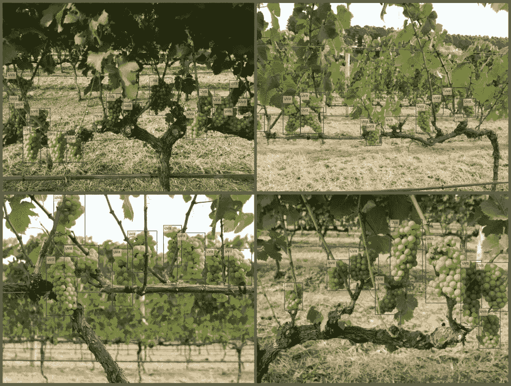
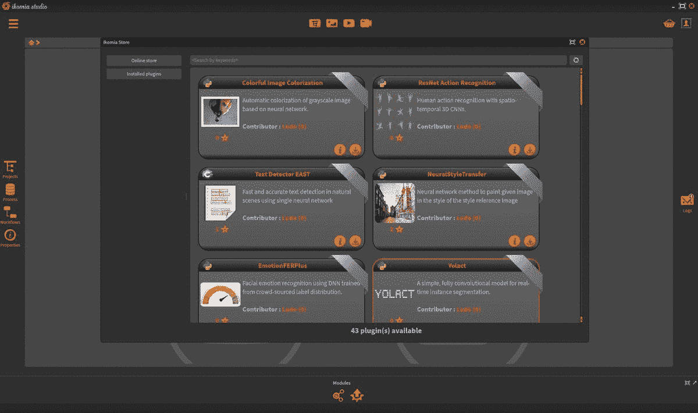
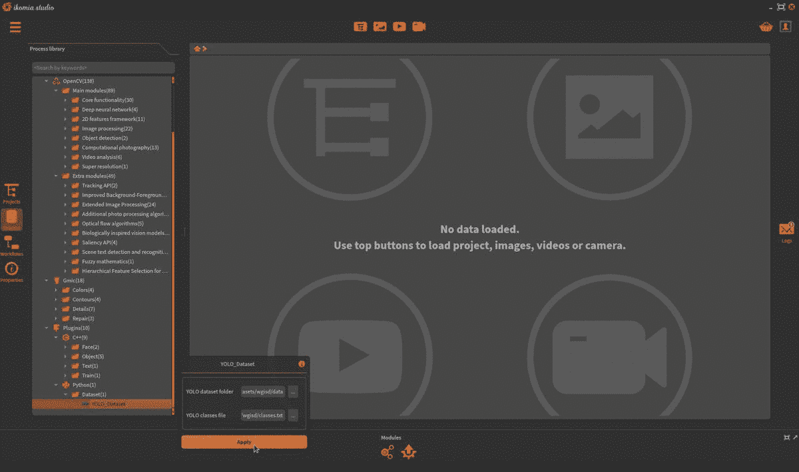
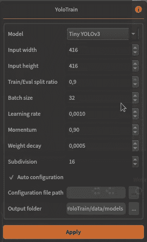
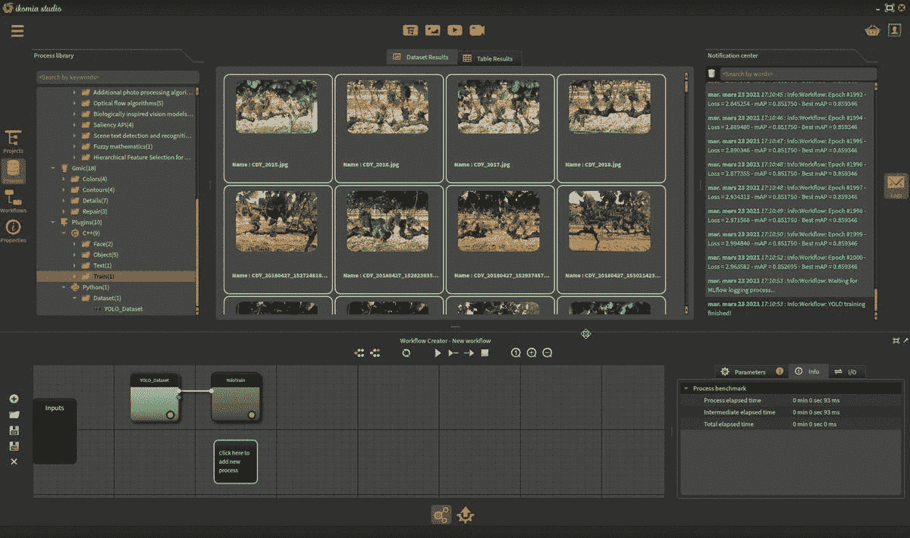
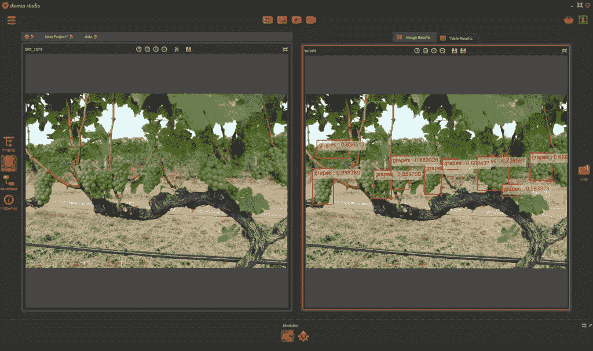

# 在不到 5 分钟的时间内训练一个自定义对象检测模型

> 原文：<https://medium.com/analytics-vidhya/train-a-custom-object-detection-model-in-less-than-5-min-96ceff8f567a?source=collection_archive---------15----------------------->

## 使用微型 YOLO v4 的 Grapes 检测

## 2022 年 11 月 11 日更新:我们刚刚发布了我们的开源 Python API，你现在可以用几行代码做同样的事情！关于我们的 Github 的更多信息。

虽然从预训练的模型启动对象检测非常简单，但当训练您的自定义对象检测模型时，事情可能会变得更难。这篇文章描述了这个任务是如何通过 [**Ikomia 平台**](https://ikomia.com/) 在几次点击中被有效解决的。

# 自动葡萄检测

我们今天的用例旨在葡萄栽培中基于图像的监控和田间机器人的背景下检测葡萄。

首先，我们需要一个合适的数据集来训练我们的自定义对象检测模型。我们在这里选择 Embrapa WGISD 数据集。这是 Santos 等人[1]利用深度神经网络和三维关联 进行 [*葡萄检测、分割和跟踪研究工作的一部分。*](https://arxiv.org/abs/1907.11819v3)



当搜索对象检测算法时，YOLO 系列是最受欢迎的算法之一。以下是主要优势的非详尽列表:

*   **快速**:在支持 GPU 的设备上进行实时检测
*   **高效** : YOLOv3 和最近的 YOLOv4 [2]实现了最先进的性能
*   **完整性**:不同的架构可供选择，从采用微型 YOLO 的边缘计算到采用 YOLOv4 的高效率
*   经济实惠:训练可以在只有一个传统图形处理器的标准计算机上执行
*   开源框架:由充满活力的社区支持

点击[这里](https://github.com/AlexeyAB/darknet)看一下 YOLO 框架。


# 让我们在 Ikomia 工作室训练吧

训练一个定制的物体检测器从未如此简单。Ikomia HUB 为我们的培训渠道提供了所有的构件。一切都是现成的，没有代码。当然，您将能够在不到 5 分钟的时间内开始您的训练。只要按照这四个步骤。

# 1-从中心安装算法

为了构建我们的定制训练工作流，我们只需要两个算法。

第一个将数据集转换为 Ikomia 格式，以确保与任何训练算法兼容。WGISD 数据集的注记以 YOLO 格式存储。每个图像都有一个描述对象类别和框坐标的文本文件。集线器中已经存在一个专用加载器。

第二个有效地训练了我们的基于*暗网*框架的目标检测模型。而且，这个插件提供了不同的模型架构。所以你可以选择一个最符合你需要的。在本教程中，我们使用微型 YoloV4 网络。

以下是在 Ikomia STUDIO 中安装它们的步骤:

*   从 Ikomia STUDIO 打开中枢
*   搜索 ***dataset_yolo*** 和 ***train_yolo_v4*** 插件(在搜索栏中使用‘yolo’关键字)
*   按顺序安装它们



YOLO 算法的安装

# 2-加载数据集

首先，从 Github 存储库中获取数据集:

```
cd your-favorite-dataset-folder
git clone [https://github.com/thsant/wgisd.git](https://github.com/thsant/wgisd.git)
```

其次，在 *wgisd* 文件夹中创建一个文件 *classes.txt* 来存储类标签。数据集包含在一个表示 grapes 的类中，所以只需在文件中放一行“ *grapes* ”。

然后，用 ***dataset_yolo*** 插件在 Ikomia STUDIO 中加载数据集:

1.  在过程库中搜索新安装的插件(左窗格)
2.  填充参数

*   数据文件夹(应为 *path-to-wgisd/data*
*   类文件(应为*path-to-wgisd/classes . txt*)

3.点击*应用*



YOLO 数据集加载和可视化

# 3-设置 YOLO 火车插件

此时，我们已经准备好将 YOLO 培训作业添加到工作流中:所以在过程库中搜索新安装的插件(左窗格)。

在开始我们的培训之前，我们需要挖掘可用的参数。



**模型选择** : *darknet* *框架*提供不同的深度学习架构。因此，我们必须选择模型来训练我们的葡萄检测。由于我们想进行快速有效的训练，我们选择了微型 YOLOv4。显然，您可以自由选择列表中的任何一个。

**输入尺寸**:必须是 32 的倍数。更高的输入分辨率意味着更高的精度，但会占用更多内存。您必须根据您的 GPU 内存能力来设置输入大小。

**训练/评估分割比**:插件自动将数据集分为训练和评估子集。值 0.9 表示 90%的数据用于训练，10%用于评估。

**超参数**:驱动优化过程的公共参数。更多信息请咨询[官方知识库](https://github.com/AlexeyAB/darknet)。

**自动配置**:在*暗网* *框架*中的培训工作基于配置文件。因此，该功能会根据最佳实践自动生成配置文件。此外，对于想要完全控制的专家，可以禁用自动配置。然后是有效的配置文件(。cfg)必须设置。

**输出文件夹**:包含训练作业中生成的所有文件以及推理时需要的所有文件。

# 4-开始训练

现在，按下*应用*按钮，将" *train_yolo"* 任务添加到当前工作流程中。

培训过程立即开始。得益于 MLflow 的无缝集成，您可以实时监控训练进度。平均精度和损失值等参数和指标会自动报告，并可通过 MLflow 仪表盘查看。

请查看以下结果，这些结果是在输入尺寸为 608 像素且所有其他参数设置为默认值的小型 YOLOv4 模型上运行时获得的:

*   平均精度(mAP@0.5): 85.9%
*   最小损失值:2.99
*   时代数:2000
*   培训时间:30 分钟(单个 GPU —英伟达 GTX 1060)
*   模型大小:22.4 兆字节

最后，Ikomia STUDIO 给你几个选择:

*   修改训练参数以开始新的跑步和比较
*   保存当前工作流以备将来培训



YOLO 模型的训练过程

# 测试您的定制训练模型

一旦您的定制模型被训练，您可以很容易地在 Ikomia STUDIO 中测试它。关闭之前的培训工作流程，并遵循以下步骤:

1.  从 Ikomia STUDIO 打开中枢
2.  搜索"***infer _ yolo _ v4 "***插件并安装
3.  打开 grapes 图像
4.  在工艺库中选择新安装的"***【infer _ yolo _ v4】***(左窗格)
5.  填充参数:

*   输入大小:必须是 32 的倍数(可以不同于训练输入分辨率)
*   型号:和训练用的一样(我们用的是小 YOLOv4)
*   培训内容:定制
*   训练过程中生成的配置、权重和标签文件(默认文件夹:*user-folder/Ikomia/Plugins/c++/infer _ yolo _ v4/data/models/*)

6.按下*应用*

7.尽情享受吧！



用 TinyYOLOv4 检测葡萄

# 结论

我希望你会喜欢 Ikomia 工作室的简单。没有更多的时间浪费在训练自定义对象检测模型，如 YOLO。你可能会在 [Ikomia HUB](https://github.com/Ikomia-hub) 中找到其他有趣的算法。因此，请随意查看并发现它们。

[1] T. T. Santos，L. L. de Souza，A. A. dos Santos，S. Avila， [*利用深度神经网络和三维关联进行葡萄检测、分割和跟踪*](https://arxiv.org/abs/1907.11819v3) (2020)，计算机和电子在农业中的应用

[2] A. Bochkovskiy，C-y .-y . m .廖， [YOLOv4:物体探测的最佳速度和精度](https://arxiv.org/abs/2004.10934) (2020)