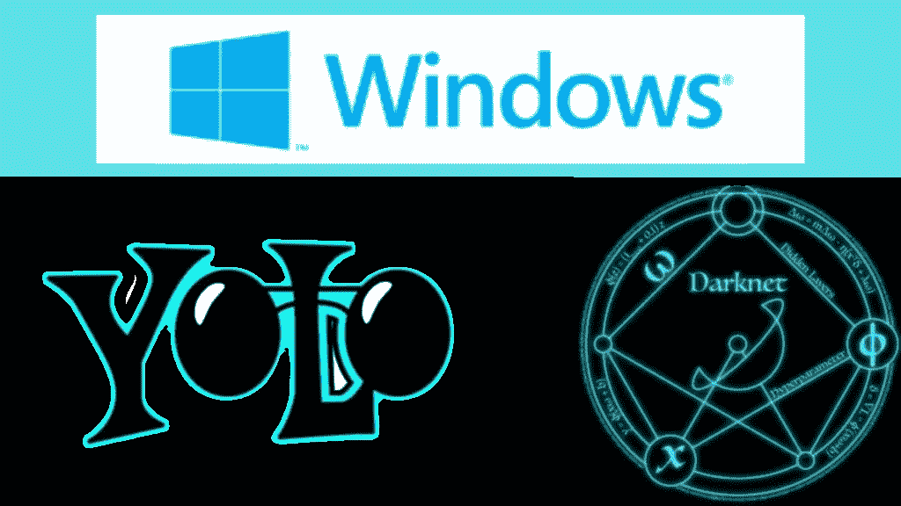
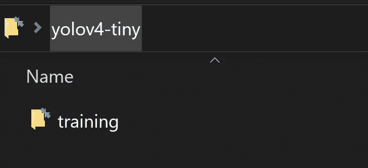
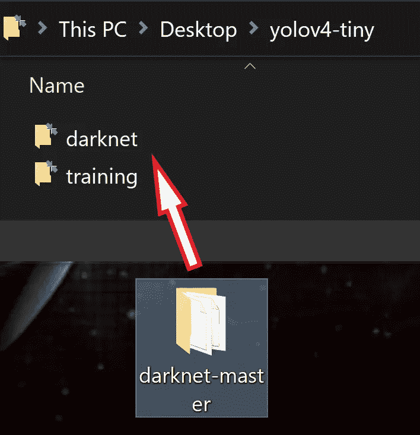
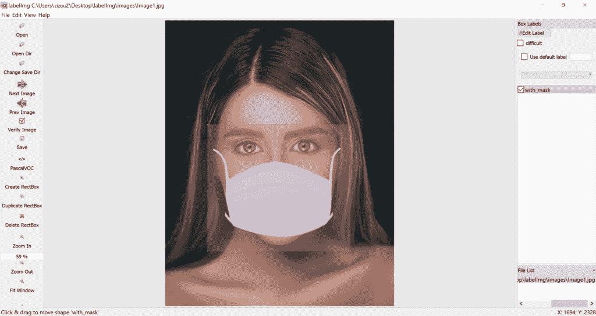
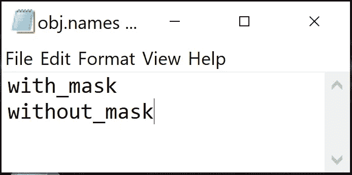
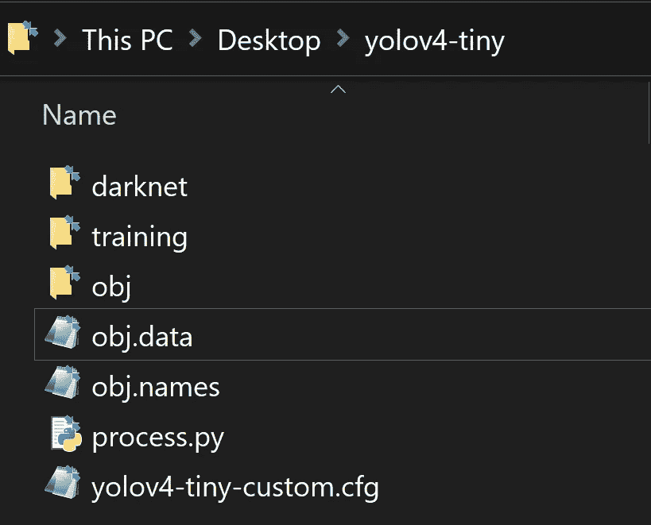
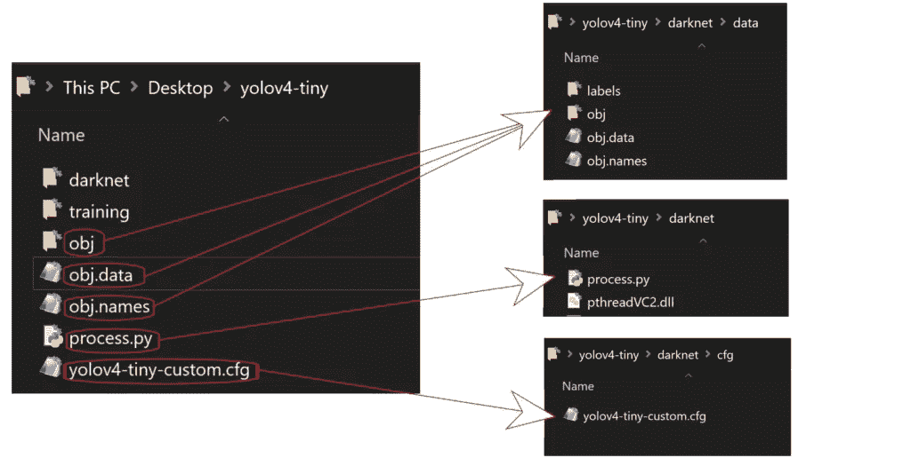
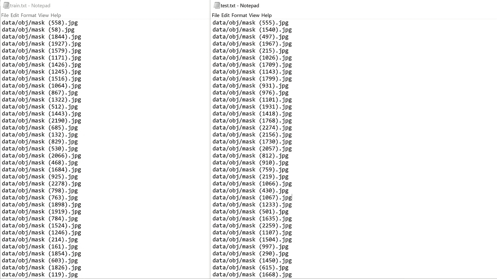
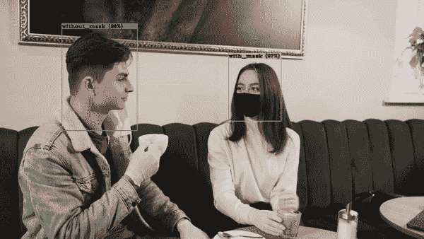

# 在 Windows 上训练一个定制的 yolov 4-微小物体探测器

> 原文：<https://medium.com/analytics-vidhya/train-a-custom-yolov4-tiny-object-detector-on-windows-5ec436100433?source=collection_archive---------0----------------------->

## (初学者教程)

# 我在 YouTube 上的视频

# 在本教程中，我们将使用 YOLOv4-tiny 和 Darknet 在我们的 Windows 系统上训练一个用于遮罩检测的自定义对象检测器



# 按照以下 10 个步骤，使用 YOLOv4-tiny 训练一个物体检测器

(但首先✅Subscribe 到我的 YouTube 频道👉🏻[https://bit.ly/3Ap3sdi](https://bit.ly/3Ap3sdi)😁😜)

1.  [在你的桌面上创建 ***yolov4* -tiny** 和 ***训练*** 文件夹](#065e)
2.  [打开命令提示符，导航到“ **yolov4-tiny** ”文件夹](#18aa)
3.  [创建并复制**darknet.exe**文件](#679d)
4.  [创建&将我们训练需要的文件(即 **obj** 数据集、 **yolov4-tiny-custom.cfg** 、 **obj.data** 、 **obj.names** 、 **process.py** )复制到你的***yolov 4*-tiny**dir](#b85a)
5.  [将文件“ **yolov4-tiny-custom.cfg** ”、“ **obj.data** ”、“ **obj.names** ”、“ **process.py** ”和“ **obj** ”数据集文件夹从 ***yolov4* -tiny** 目录复制到 ***darknet*** 目录](#0dc2)
6.  [运行 **process.py** python 脚本创建**train . txt**&**test . txt**文件](#3fb1)
7.  [下载预先训练好的 **YOLOv4-tiny** 重量](#7fc1)
8.  [训练探测器](#4b87)
9.  [检查性能](#efe9)
10.  [测试您的自定义对象检测器](#126a)

# ~ ~ ~ ~ ~ ~ ~ ~ ~ ~ ~ ~ ~ ~ ~开始吧！！~~~~~~~~~~~~~~


# 1)创建“yolov4-tiny”和“training”文件夹

在桌面上创建一个名为 ***yolov4-tiny*** 的文件夹。接下来，在***yolov 4-tiny***文件夹内创建另一个名为 ***training*** *的文件夹。这是我们将保存训练权重的地方(该路径在我们稍后将上传的 ***obj.data*** 文件中有提及)*



# 2)打开命令提示符并导航到“yolov4-tiny”文件夹

```
**Navigate to C:\Users\zizou\Desktop\yolov4-tiny** **folder**. 
**NOTE:** Replace zizou here with your Usernamecd C:\Users\zizou\Desktop\yolov4-tiny
```


# 3)创建并复制 darknet.exe 文件

创建包含**darknet.exe**文件的 ***暗网*** 文件夹，并复制到 ***yolov4* -tiny** 文件夹中。要了解如何使用 CMake 创建包含 darknet.exe 文件的 darknet 文件夹，请访问本博客。按照所有的步骤在 Windows 上安装 YOLO。

这一步可能有点乏味，但这是整个过程中最困难的部分。下面剩下的训练过程相当简单。因此，请确保您仔细遵循上述文章中的所有步骤来创建 darknet，并在您的系统上安装和配置 CUDA 和 cuDNN。你会在上面提到的博客的 A 部分找到详细解释的所有步骤。你也可以在上面提到的博客的 YouTube 视频部分下面查看我的 YOLO Windows 安装视频。

以上过程完成后，将我们从中获取的***darknet-master***文件夹复制到你桌面上的 ***yolov4-tiny*** 文件夹。为简单起见，将***darknet-master***文件夹重命名为 ***darknet*** 。



# 4)创建并复制以下文件，我们需要这些文件来训练自定义检测器

```
**a. Labeled Custom Dataset
b. Custom cfg file
c. obj.data and obj.names files
d. process.py file (to create train.txt and test.txt files for training)**I have uploaded my custom files for mask detection on my [**GitHub**](https://github.com/techzizou/yolov4-tiny-custom-training_LOCAL)**.** I am working with 2 classes i.e. “with_mask” and “without_mask”.
```

# 标注数据集

输入图像示例(**Image1.jpg**)


您可以使用任何软件进行贴标，如 [**labelImg**](https://github.com/tzutalin/labelImg#labelimg) 工具。



我使用一个叫做 **OpenLabeling** 的开源标签工具，它有一个非常简单的 UI。


点击下面的链接，了解更多关于贴标过程和其他软件的信息:

[**影像数据集标注条**](/analytics-vidhya/image-dataset-labeling-annotation-bec3390eda2d)

**注:**垃圾入=垃圾出。选择和标记图像是最重要的部分。尽量找质量好的图片。数据的质量在很大程度上决定了结果的质量。

标有 file 的输出 YOLO 格式如下所示。


# 4(a)创建带标签的自定义数据集“obj”文件夹，并将其复制到“yolov4-tiny”文件夹

把所有输入的图像”。jpg "文件及其对应的 YOLO 格式标注"。txt "文件放在一个名为 **obj** 的文件夹中。

将其复制到 ***yolov4-tiny*** 文件夹中。


# 4(b)创建自定义配置文件，并将其复制到“yolov4-tiny”文件夹中

从 ***darknet/cfg*** 目录*，*下载***yolov 4-tiny-custom . CFG***文件，对其进行修改，并复制到 ***yolov4-tiny*** 目录。

你也可以从官方 [AlexeyAB Github](https://www.github.com/AlexeyAB/darknet) 下载定制配置文件。

**您需要在您的自定义配置文件中进行以下更改:**


*   将行批更改为批=64
*   将线细分改为细分=16 **或**细分=32 **或**细分=64(阅读本节后的注释以了解关于这些值的更多信息)
*   设置网络大小宽度=416 高度=416 或 32 的任意倍数
*   将行 max_batches 更改为(类*2000，但不小于训练图像数，且不小于 6000)，例如，如果训练 3 个类，max_batches=6000
*   将生产线步骤更改为 max_batches 的 80%和 90%，即步骤=4800，5400


*   在每个[yolo]层之前的 **2** **【卷积】**中，将[filters=255]更改为 filters=(classes + 5)x3，请记住，它必须是每个[yolo]层之前的最后一个[卷积]。
*   在每个**2【yolo】**层中，将线条类别=80 改为你的对象数量。

因此，如果 classes=1，那么它应该是 filters=18。如果 classes=2，则编写 filters=21。

一旦你理解了训练过程的基本原理，你也可以调整其他参数值，如学习率、角度、饱和度、曝光和色调。对于新手来说，以上改动应该足够了。

## 注意:什么是细分？

*   这是我们分成的许多小批量的数量。
*   Batch=64 ->一次迭代加载 64 幅图像。
*   细分=8 ->将批次分为 8 个小批次，因此每个小批次有 64/8 = 8 个图像，这 8 个图像被发送进行处理。该过程将被执行 8 次，直到该批完成，并且新的迭代将从 64 个新图像开始。
*   如果您使用的是低内存的 GPU，请为细分设置一个较高的值(32 或 64)。这显然需要更长的时间来训练，因为我们正在减少加载的图像数量以及小批量的数量。
*   如果您有一个高内存的 GPU，设置一个较低的细分值(16 或 8)。这将加速训练过程，因为每次迭代加载更多的图像。

# 4(c)创建你的“obj.data”和“obj.names”文件，并将它们复制到 yolov4-tiny 文件夹中

## 对象数据

***obj.data*** 文件有:

*   班级的数量。
*   我们后面要创建的 ***train.txt*** 和 ***test.txt*** 文件的路径。
*   路径为" ***obj.names"*** 文件，其中包含类的名称。
*   保存训练权重的 ***训练*** 文件夹的路径。

```
classes = 2
train = data/train.txt
valid = data/test.txt
names = data/obj.names
backup = ../training
```

## 对象名称

包含对象的名称，每个名称占一行。确保分类的顺序与标记图像时使用的 class_list.txt 文件中的顺序相同，以便每个分类的索引 id 与标记的 YOLO 文本文件中提到的相同。



# 4(d)将<process.py>脚本文件复制到你的 yolov4-tiny 文件夹</process.py>

(将所有图像文件分成 2 部分。90%用于训练，10%用于测试)

这个 ***process.py*** 脚本创建了文件***train . txt***&***test . txt***，其中 ***train.txt*** 文件具有指向 90%图像的路径，而 ***test.txt*** 具有指向 10%图像的路径。

可以从我的 [**GitHub**](https://github.com/techzizou/yolov4-tiny-custom-training_LOCAL) **下载 ***process.py*** 脚本。**

*** *重要提示:“*process . py”*脚本只有。jpg "格式写在里面，所以其他格式如"。png“，”。jpeg”，甚至是”。JPG”(大写)不会被承认。如果您使用任何其他格式，请相应地在 *process.py* 脚本中进行更改。**

现在我们已经上传了所有的文件，我们桌面上的 ***yolov4-tiny*** 文件夹应该是这样的:



# 5)将所有文件从'`yolov4-tiny'`目录复制到' yolov4-tiny/darknet '目录

您可以通过文件浏览器手动完成所有这些步骤。

首先，清理 ***数据*** 和 ***cfg*** 文件夹，除了 ***数据*** 文件夹内的**标签**文件夹需要在检测框上写标签名称。所以只需从 ***data*** 文件夹中删除除 ***labels*** 文件夹之外的所有文件，接下来，完全清理 ***cfg*** 文件夹，因为我们已经在 ***yolov4-tiny*** 主文件夹中有了我们的自定义配置文件。

接下来，复制所有文件:

*   将 **yolov4-tiny-custom.cfg** 复制到 ***darknet/cfg*** 目录下。
*   将 **obj.names** 、 **obj.data** 和 **obj** 文件夹复制到 ***darknet/data*** 目录下。
*   将 **process.py** 复制到 ***darknet*** 目录下。



**或**

使用命令提示符和以下命令来完成此操作。当前工作目录是**C:\ Users \ zizou \ Desktop \ yolov 4-tiny \ darknet**

**清理*数据*和 *cfg* 文件夹。**

```
**#change dir to data folder and clean it. Delete all files and folders except the labels folder** 
cd data/ 
FOR %I IN (*) DO IF NOT %I == labels DEL %I 
cd ..**#delete the cfg dir** 
rmdir /s cfg 
**#Are you sure (Y/N)? press y and enter****#create a new cfg folder** 
mkdir cfg
```

5(a)复制 ***obj*** 文件夹，使其现在位于 **/darknet/data/** 文件夹中

```
xcopy ..\obj data\obj# In the following prompt, press D for Directory
```

*   ***在提示符下，按 D 键进入目录**

5(b)复制您的***yolov 4-tiny-custom . CFG***文件，使其现在位于 **/darknet/cfg/** 文件夹中

```
copy ..\yolov4-tiny-custom.cfg cfg
```

5(c)复制 ***obj.names*** 和 ***obj.data*** 文件，使它们现在位于 **/darknet/data/** 文件夹中

```
copy ..\obj.names data
copy ..\obj.data  data
```

5(d)将 ***process.py*** 文件复制到当前 ***darknet*** 目录下

```
copy ..\process.py .
```

# 6)运行 process.py python 脚本，在数据文件夹中创建 train.txt & test.txt 文件

当前工作目录是**C:\ Users \ zizou \ Desktop \ yolov 4-tiny \ darknet**

```
python process.py
```

列出 ***data*** 文件夹的内容，检查**train . txt**&**test . txt**文件是否已经创建。

```
ls data
**#OR**
dir data
```

上面的 **process.py** 脚本创建了两个文件 **train.txt** 和 **test.txt** ，其中 **train.txt** 指向 90%的图像，而 **test.txt** 指向 10%的图像。这些文件如下所示。



# 7)将预先训练好的 YOLOv4-tiny 权值下载复制到“yolov4-tiny\darknet”目录下。

当前工作目录是**C:\ Users \ zizou \ Desktop \ yolov 4-tiny \ darknet**

这里我们用迁移学习。我们没有从头开始训练模型，而是使用预先训练好的 yolov 4-微小的权重，它已经被训练到 29 个卷积层。从这里下载 YOLOv4-tiny 预训练权重文件[并复制到你的 ***darknet*** 文件夹。](https://github.com/AlexeyAB/darknet/releases/download/darknet_yolo_v4_pre/yolov4-tiny.conv.29)

[yolov4-tiny.conv.29 预训练重量文件](https://github.com/AlexeyAB/darknet/releases/download/darknet_yolo_v4_pre/yolov4-tiny.conv.29)

# 8)培训

## 训练您的定制检测器

当前工作目录是**C:\ Users \ zizou \ Desktop \ yolov 4-tiny \ darknet**

为了获得最佳结果，如果可能的话，当平均损失小于 0.05 或者至少持续低于 0.3 时，应该停止训练，否则训练模型，直到平均损失暂时没有任何显著变化。

```
darknet.exe detector train data/obj.data cfg/yolov4-tiny-custom.cfg yolov4-tiny.conv.29 -dont_show -map#The **map** parameter here gives us the **M**ean **A**verage **P**recision. The higher the **mAP** the better it is for object detection. You can remove the **-dont_show** parameter to see the progress chart of mAP-loss against iterations.
```

你可以访问官方的 AlexeyAB Github 页面，它给出了关于何时停止训练的详细解释。点击下面的链接跳转到该部分。

[AlexeyAB GitHub 什么时候停止训练？](https://github.com/AlexeyAB/darknet/#user-content-when-should-i-stop-training)

## 重新开始训练(以防训练没有结束，训练过程中断)


如果训练过程因某种原因中断或停止，您不必再次从头开始训练您的模型。你可以从你停止的地方重新开始训练。使用上次保存的重量。在***yolov 4-tiny***dir 内的***training***文件夹中，每 100 次迭代将权重保存为**yolov 4-tiny-custom _ last . weights**。(我们在“obj.data”文件中作为备份给出的路径)。

**因此，要重新开始训练，请运行以下命令:**

```
darknet.exe detector train data/obj.data cfg/yolov4-tiny-custom.cfg ../training/yolov4-tiny-custom_last.weights -dont_show -map
```

# 9)检查性能

## 查看培训图表

您可以通过查看*文件来检查所有训练过的重量的性能。然而，chart.png 文件**仅在训练没有中断的情况下显示结果，即，如果您没有断开连接或丢失会话。如果从保存的点重新开始训练，这将不起作用。***

*打开 ***暗网*** 目录下的**chart.png**文件。*

*如果这不起作用，还有其他方法来检查你的表现。其中之一是通过检查训练权重的地图。*

## *检查地图(平均精度)*

*您可以检查每 1000 次迭代保存的所有权重的贴图，例如:-yolov 4-tiny-custom _ 4000 . weights，yolov 4-tiny-custom _ 5000 . weights，yolov 4-tiny-custom _ 6000 . weights，等等。这样，您可以找出哪个权重文件给你最好的结果。地图越高越好。*

*运行以下命令来检查特定已保存权重文件的映射，其中 **xxxx** 是其迭代编号。(例如:- 4000，5000，6000，…)*

```
*darknet.exe detector map data/obj.data cfg/yolov4-tiny-custom.cfg ../training/yolov4-tiny-custom_xxxx.weights -points 0*
```

# *10)测试您的自定义对象检测器*

## *对自定义配置文件进行更改，将其设置为测试模式*

*   *将行批更改为批=1*
*   *将线细分改为细分=1*

*您可以手动完成，也可以简单地运行下面的代码*

```
*cd cfg
sed -i 's/batch=64/batch=1/' yolov4-tiny-custom.cfg
sed -i 's/subdivisions=32/subdivisions=1/' yolov4-tiny-custom.cfg
cd ..*
```

***注意:**根据您在 cfg 文件中的设置，在上面的命令中将细分的第一个值设置为 16 / 32 / 64。此外，要在 Windows 中使用“sed”或其他 Unix 命令，您需要使用 Cygwin 或 GnuWin32 安装它们。*

## *对图像运行检测器*

*将图像上传到桌面上名为***mask _ test _ images***的文件夹中。*

*使用此命令对图像运行您的自定义检测器。(阈值标志设置对象检测所需的最低精度)*

```
*darknet.exe detector test data/obj.data cfg/yolov4-tiny-custom.cfg ../training/yolov4-tiny-custom_best.weights ../../mask_test_images/image1.jpg -thresh 0.3*
```

*其输出保存为 ***暗网*** 文件夹中的**predictions.jpg**。您可以将其复制到任何输出文件夹，并用不同的名称保存。我将它保存为***mask _ test _ images***文件夹中的 **output_image.jpg** 。*

```
*copy predictions.jpg ..\..\mask_test_images\output_image.jpg*
```

**

## *对视频运行检测器*

*将视频上传到桌面上名为***mask _ test _ videos***的文件夹中。*

*使用此命令对视频运行您的自定义检测器。(thresh 标志设置对象检测所需的最低精度)。这会将输出视频保存在与“ **output.avi** ”相同的文件夹中。*

```
*darknet.exe detector demo data/obj.data cfg/yolov4-tiny-custom.cfg ../training/yolov4-tiny-custom_best.weights ../../mask_test_videos/test.mp4 -thresh 0.5 -i 0 -out_filename ../../mask_test_videos/output.avi*
```

**

## *在实时网络摄像头上运行检测器*

*运行下面的代码。*

```
*darknet.exe detector demo data/obj.data cfg/yolov4-tiny-custom.cfg ../training/yolov4-tiny-custom_best.weights -thresh 0.5*
```

**

# *注意:*

*我收集的用于遮罩检测的数据集主要包含特写图像。你可以在网上搜索更多的长镜头图片。有很多网站可以下载有标签和无标签的数据集。我在数据集来源下面给出了一些链接。我也给出了一些掩膜数据集的链接。其中一些有超过 10，000 张图片。*

*虽然我们可以对我们的训练配置文件进行某些调整和更改，或者通过增强为每种类型的对象类向数据集添加更多图像，但我们必须小心，以免导致过度拟合，从而影响模型的准确性。*

*对于初学者，你可以简单地使用我上传到 GitHub 上的配置文件。我还上传了我的掩模图像数据集和 YOLO 格式的文本文件，这可能不是最好的，但会给你一个如何使用 YOLO 训练你自己的自定义探测器模型的良好开端。你可以找到一个质量更好的带标签的数据集或者一个不带标签的数据集，以后自己标注。*

# *GitHub 链接*

*我已经在下面的 GitHub 链接上传了在 Windows 中训练一个定制的 YOLOv4-tiny 探测器所需的所有文件。*

*[yolov 4-tiny-custom-training _ LOCAL _ MACHINE](https://github.com/techzizou/yolov4-tiny-custom-training_LOCAL)*

# *带标签的数据集(obj.zip)*

*[标记的屏蔽数据集](https://www.kaggle.com/techzizou/labeled-mask-dataset-yolo-darknet)*

# *关于这个的 YouTube 视频！*

# *信用*

## *参考*

*   *[阿列克谢 AB GitHub](https://github.com/AlexeyAB/darknet)*
*   *[pjreddie Github](https://github.com/pjreddie/darknet)*
*   *[代码 Github](https://github.com/theAIGuysCode/YOLOv4-Cloud-Tutorial)*
*   *[纸质 YOLOv4](https://arxiv.org/abs/2004.10934)*
*   *[pjreddie 站点](https://pjreddie.com/darknet/yolo/)*

## *数据集源*

*您可以从下面提到的网站下载许多对象的数据集。这些网站还包含许多种类的对象的图像以及它们的多种格式的注释/标签，例如 YOLO _ 黑暗网文本文件和帕斯卡 _VOC XML 文件。*

*   *[通过谷歌打开图像数据集](https://storage.googleapis.com/openimages/web/index.html)*
*   *[Kaggle 数据集](https://www.kaggle.com/datasets)*
*   *[Roboflow 公共数据集](https://public.roboflow.com/)*
*   *[可视化数据数据集](https://www.visualdata.io/discovery)*

## *屏蔽数据集源*

*我将这 3 个数据集用于我的标记数据集:*

*   *[般若 Github](https://github.com/prajnasb/observations)*
*   *[约瑟夫·尼尔森·罗博弗洛](https://public.roboflow.com/object-detection/mask-wearing)*
*   *[X-张洋 Github](https://github.com/X-zhangyang/Real-World-Masked-Face-Dataset)*

## *更多掩膜数据集*

*   *Prasoonkottarathil Kaggle(20000 张图片)*
*   *Ashishjangra27 Kaggle (12000 张图片)*
*   *[Andrewmvd Kaggle](https://www.kaggle.com/andrewmvd/face-mask-detection)*

## *视频源*

*   *[https://www.pexels.com/](https://www.pexels.com/)*

**