# 使用 GOOGLE COLAB 训练一个定制的 yolov 4-微小物体探测器

> 原文：<https://medium.com/analytics-vidhya/train-a-custom-yolov4-tiny-object-detector-using-google-colab-b58be08c9593?source=collection_archive---------0----------------------->

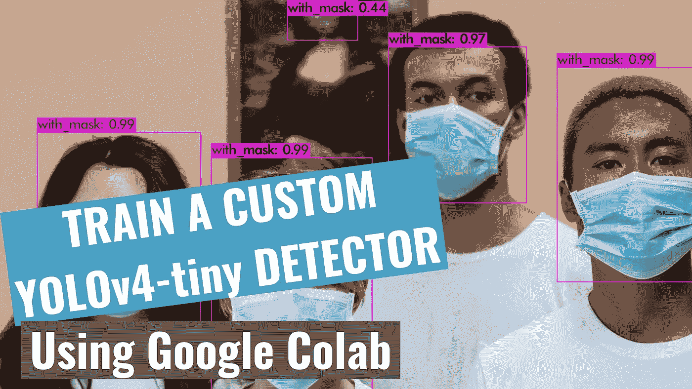

## 初学者教程

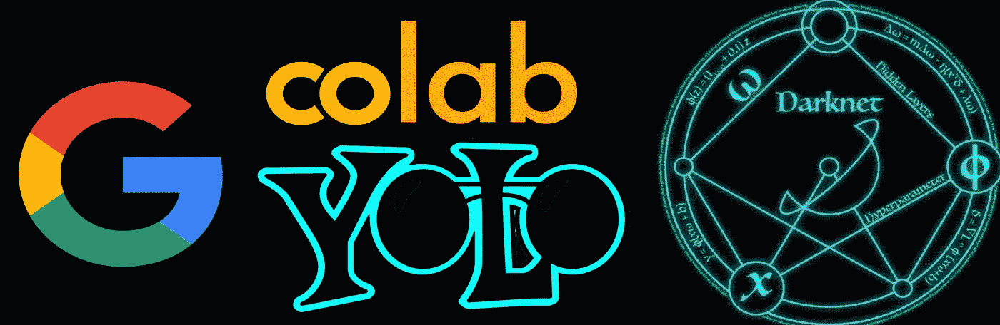

# 在本教程中，我们将使用 YOLOv4-tiny 和 Darknet 训练我们的自定义检测器进行掩膜检测。YOLOv4-tiny 更适合用于实时对象检测，因为它的推理时间更快。

# 我在 YouTube 上的视频！

# 如何开始？

*   ✅Subscribe 到我的 YouTube 频道👉🏻[https://bit.ly/3Ap3sdi](https://bit.ly/3Ap3sdi)😁😜
*   在你的浏览器上打开我的 [Colab 笔记本](https://colab.research.google.com/drive/1hQO4nOoD6RDxdbz3C1YSiifTsyZjZpYm?usp=sharing)。
*   点击菜单栏中的**文件**，并点击**在驱动器**中保存一份副本。这将在您的浏览器上打开我的 Colab 笔记本的副本，您现在可以使用它了。
*   接下来，一旦你打开了我的笔记本并连接到 Google Colab 虚拟机，点击菜单栏中的**运行时**，点击**更改运行时类型**。选择 **GPU** 并点击保存。

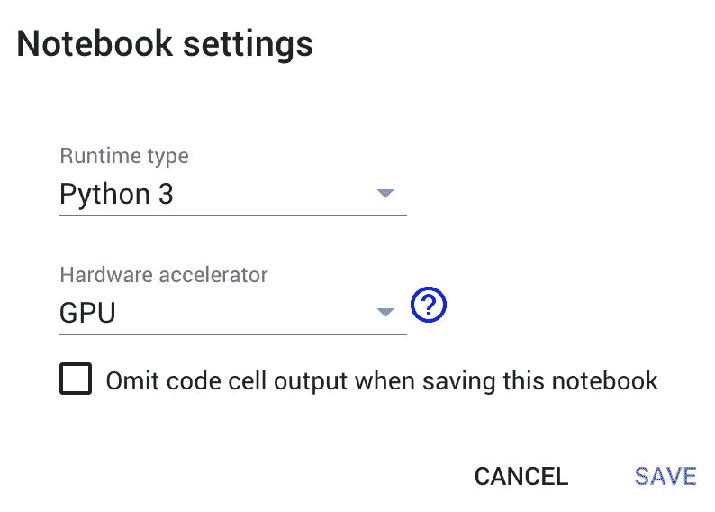

# 按照这 12 个步骤，用 YOLOv4-tiny 训练一个物体检测器

(**注:**除了自定义配置文件和预训练权重文件步骤外，其他步骤与之前自定义 YOLOv4 训练教程相同([https://medium . com/analytics-vid hya/train-a-custom-yolov 4-object-detector-using-Google-cola b-61 a659 d 4868](/analytics-vidhya/train-a-custom-yolov4-object-detector-using-google-colab-61a659d4868))。我还对 YOLOv4-tiny 教程做了另外一个改动，我们将把 Darknet git 存储库克隆到 Colab cloud VM 本身，不像以前的 YOLOv4 教程那样，我们将存储库克隆到 google drive 的一个文件夹中。)

> Google Colab 实例的内存比 google drive 快。如果我们从访问时间较长的 google drive 中访问文件，速度会很慢。因此，这里我们将文件复制到 colab 实例，然后训练我们的检测器模型，这将使过程更快。

1.  [将 **Darknet** git 仓库克隆到 Colab VM](/p/b58be08c9593#a70f)
2.  [在你的 google drive](/p/b58be08c9593#a06e) 中创建 ***yolov4-tiny*** 和 ***training*** 文件夹
3.  [创建&将我们培训需要的文件(即“ **obj.zip** ”、“ **yolov4-tiny-custom.cfg** ”、“ **obj.data** ”、“ **obj.names** 、“ **process.py** ”)上传到你的驱动器](/p/b58be08c9593#4be1)
4.  [安装驱动器并链接您的文件夹](http://Image Dataset Labeling Medium post#6243)
5.  [在 Makefile 中进行修改，启用 **OPENCV** 和 **GPU**](/p/b58be08c9593#a777)
6.  [运行 **make** 命令构建暗网](/p/b58be08c9593#ba6f)
7.  [将 ***yolov4-tiny*** 文件夹中的文件“ **obj.zip** ”、“ **yolov4-tiny-custom.cfg** ”、“ **obj.data** ”、“ **obj.names** ”、“ **process.py** ”复制到 Colab 中的 ***darknet*** 目录下](/p/b58be08c9593#5316)
8.  [运行 **process.py** python 脚本创建**train . txt**&**test . txt**文件](/p/b58be08c9593#b7b4)
9.  [下载预先训练好的**yolov 4-微小重量**](/p/b58be08c9593#d4cc)
10.  [训练探测器](/p/b58be08c9593#e5b4)
11.  [检查性能](/p/b58be08c9593#1a83)
12.  [测试您的自定义对象检测器](/p/b58be08c9593#4842)

# 我们开始吧！！！

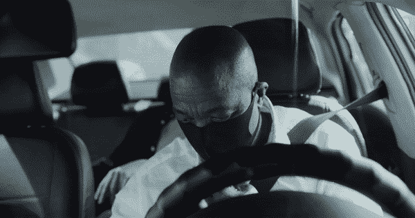

来自 [Pexels](https://www.pexels.com/photo/4612297/?utm_content=attributionCopyText&utm_medium=referral&utm_source=pexels) 的 [cottonbro](https://www.pexels.com/@cottonbro?utm_content=attributionCopyText&utm_medium=referral&utm_source=pexels) 原创视频

# 1)克隆 Darknet git 存储库

在 Colab 虚拟机上克隆 Darknet git 存储库

```
!git clone [https://github.com/AlexeyAB/darknet](https://github.com/AlexeyAB/darknet)
```

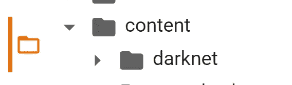

Colab 虚拟机上克隆的 Darknet git repo

# 2)在您的驱动器中创建“yolov4-tiny”和“training”文件夹

在你的驱动器中创建一个名为 ***yolov4-tiny*** 的文件夹。接下来，在***yolov 4-tiny***文件夹内创建另一个名为***training****的文件夹。这是我们将保存我们训练过的权重的地方(这个路径在我们稍后将上传的 ***obj.data*** 文件中提到)*

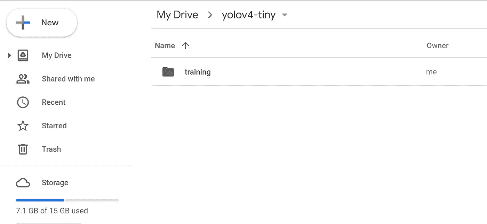

# 3)创建并上传以下文件，我们需要这些文件来培训定制检测机

```
**a. Labeled Custom Dataset
b. Custom cfg file
c. obj.data and obj.names files
d. process.py file (to create train.txt and test.txt files for training)**
```

我已经在我的 [**GitHub**](https://github.com/techzizou/yolov4-tiny-custom_Training) 上传了我的用于遮罩检测的自定义文件。我正在处理两个类，即“带 _ 掩码”和“不带 _ 掩码”。

## 标注数据集

输入图像(【Image1.jpg】T4)


来自 [Pexels](https://www.pexels.com/photo/close-up-photo-of-woman-biting-her-lower-lip-2878373/?utm_content=attributionCopyText&utm_medium=referral&utm_source=pexels) 的[阿里·帕扎尼](https://www.pexels.com/@alipazani?utm_content=attributionCopyText&utm_medium=referral&utm_source=pexels)的原始照片

您可以使用任何软件进行贴标，如 [**贴标机**](https://github.com/tzutalin/labelImg#labelimg) 工具。


**Image1.jpg 标签图形用户界面**

我使用一个叫做 **OpenLabeling** 的开源标签工具，它有一个非常简单的 UI。

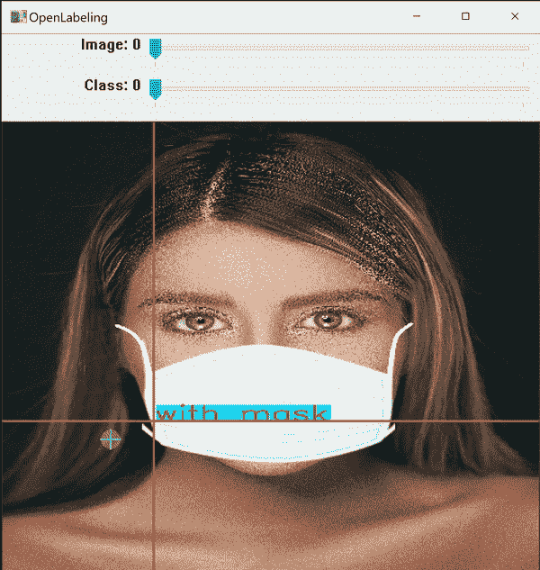

**打开贴标工具 GUI**

点击下面的链接，了解更多关于贴标过程和其他软件的信息:

*   [**影像数据集标注介质贴**](/@techzizou007/image-dataset-labeling-annotation-bec3390eda2d)

> **注:垃圾入=垃圾出**。选择和标记图像是最重要的部分。尽量找质量好的图片。数据的质量在很大程度上决定了结果的质量。

标有 file 的输出 YOLO 格式如下所示。

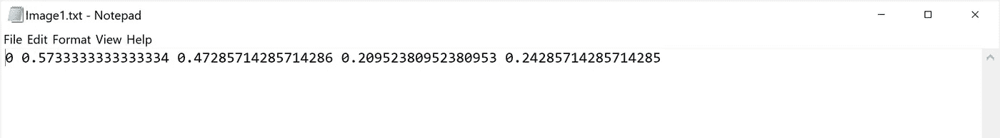

**Image1.txt**

## 3(a)创建带有标签的自定义数据集“obj.zip”文件，并上传到驱动器上的“yolov4-tiny”文件夹中

把所有输入的图像”。jpg "文件及其对应的 YOLO 格式标注"。txt "文件放在名为 **obj** 的文件夹中。

创建它的 zip 文件 **obj.zip** 并上传到你硬盘上的 ***yolov4-tiny*** 文件夹。

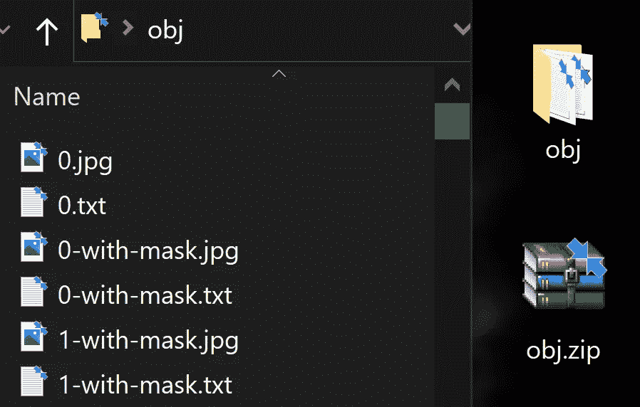

**包含输入图像文件和 YOLO 标签文本文件的 obj 文件夹**

## **3(b)创建您的自定义配置文件，并将其上传到驱动器上的“yolov4-tiny”文件夹**

从***darknet/CFG****目录下载*yolov 4-tiny-custom . CFG*文件，对其进行修改，并上传到你硬盘上的 ***yolov4-tiny*** 文件夹。*

*你也可以从官方 [AlexeyAB Github](https://github.com/AlexeyAB/darknet) 下载定制配置文件。*

***在自定义配置文件中进行以下更改:***

*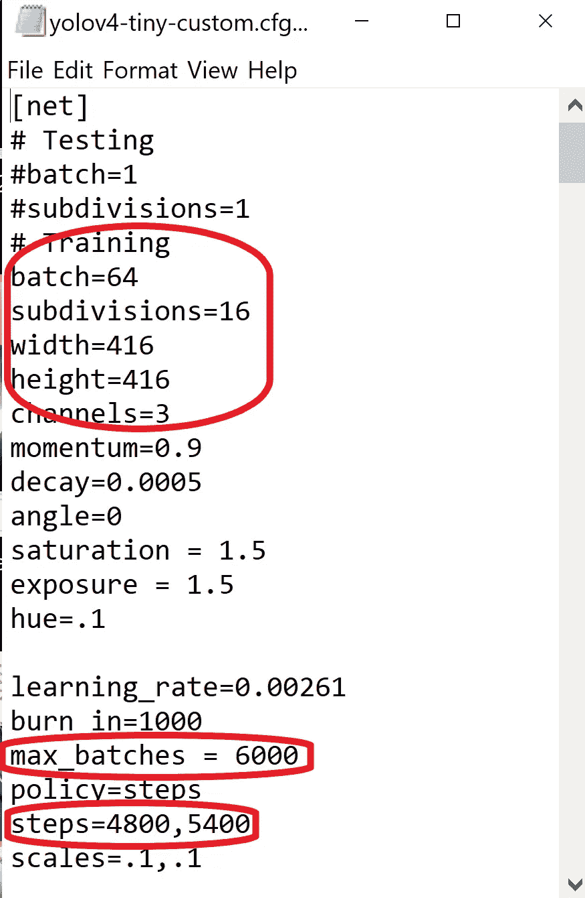*

*   *将行批更改为批=64*
*   *将线条细分改为细分=16*
*   *设置网络大小宽度=416 高度=416 或 32 的任意倍数*
*   *将行 max_batches 更改为(类*2000，但不小于训练图像数，且不小于 6000)，例如，如果训练 3 个类，max_batches=6000*
*   *将生产线步骤更改为 max_batches 的 80%和 90%，即步骤=4800，5400*

*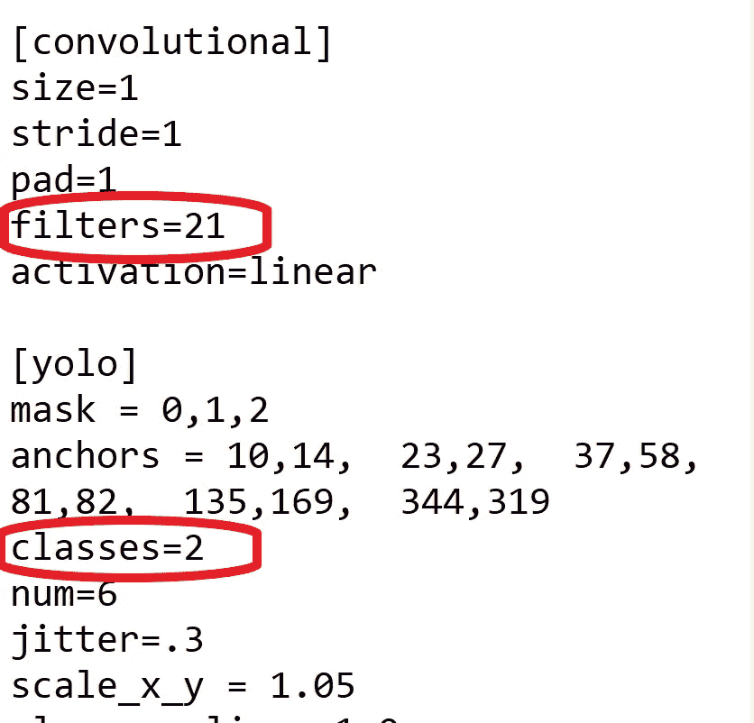*

*   *在每个[yolo]层之前，将**2[卷积]**中的[filters=255]更改为 filters=(classes + 5)x3，请记住，它只需是每个[yolo]层之前的最后一个[卷积]。*
*   *在每层**2【yolo】**中，将线条类别=80 改为你的对象数量*

*因此，如果 classes=1，那么它应该是 filters=18。如果 classes=2，则编写 filters=21。*

*一旦你理解了基本的训练过程是如何工作的，你也可以调整其他的参数值，比如学习速率、角度、饱和度、曝光和色调。对于初学者来说，以上改动就足够了。*

## *注意:什么是细分？*

*   *这是我们分成的许多小批量的数量。*
*   *Batch=64 ->一次迭代加载 64 幅图像。*
*   *细分=8 ->将批次分为 8 个小批次，因此每个小批次有 64/8 = 8 个图像，这 8 个图像被发送进行处理。该过程将被执行 8 次，直到该批完成，并且新的迭代将从 64 个新图像开始。*
*   *如果您使用的是低内存的 GPU，请为细分设置一个较高的值(32 或 64)。这显然需要更长的时间来训练，因为我们正在减少加载的图像数量以及小批量的数量。*
*   *如果您有一个高内存的 GPU，设置一个较低的细分值(16 或 8)。这将加速训练过程，因为每次迭代加载更多的图像。*

## *3(c)创建您的“对象数据”和“对象名称”文件，并将它们上传到您的驱动器*

## *对象数据*

****obj.data*** 文件有:*

*   *班级的数量。*
*   *我们后面要创建的 ***train.txt*** 和 ***test.txt*** 文件的路径。*
*   ****obj.names*** 文件的路径，其中包含了类的名称。*
*   *保存训练权重的 ***训练*** 文件夹的路径。*

## *对象名称*

*包含对象的名称，每个名称占一行。确保分类的顺序与标记图像时使用的 class_list.txt 文件中的顺序相同，以便每个分类的索引 id 与标记的 YOLO txt 文件中提到的相同。*

## *3(d)将 process.py 脚本文件上传到驱动器上的“yolov4-tiny”文件夹中*

*(将所有图像文件分成 2 部分。90%用于训练，10%用于测试)*

*这个 ***process.py*** 脚本创建了文件***train . txt***&***test . txt***其中***train . txt****文件具有指向 90%图像的路径，而 ***test.txt*** 具有指向 10%图像的路径。**

**可以从我的 [**GitHub**](https://github.com/techzizou/yolov4-tiny-custom_Training) **下载 ***process.py*** 脚本。****

***** *重要提示:“*process . py”*脚本只有。jpg "格式写在里面，所以其他格式如"。png“，”。jpeg”，甚至是”。JPG”(大写)不会被承认。如果您使用任何其他格式，请相应地更改 *process.py* 脚本文件。****

****process.py 脚本****

**现在我们已经上传了所有的文件，我们驱动器上的***yolov 4-tiny****文件夹应该是这样的:***

***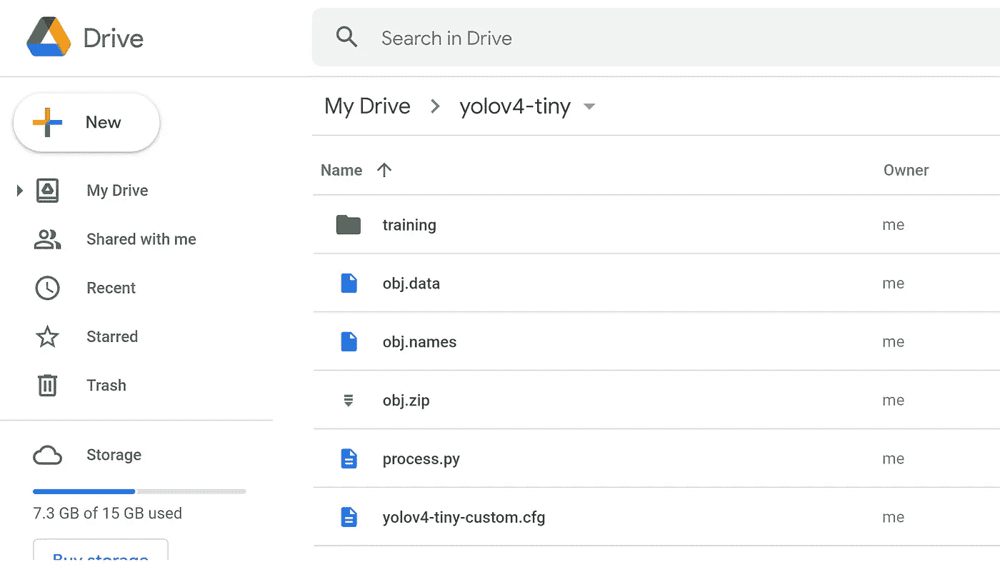***

# ***4)安装驱动器并链接您的文件夹***

## ***安装驱动器***

```
***%cd ..
from google.colab import drive
drive.mount('/content/gdrive')***
```

## ***链接您的文件夹***

***运行以下命令创建一个符号链接，这样现在路径**/content/g Drive/My \ Drive/**就等于 **/mydrive*****

```
***!ln -s /content/gdrive/My\ Drive/ /mydrive***
```

# ***5)在 makefile 中进行更改，以启用 OPENCV 和 GPU***

***(还要将 CUDNN、CUDNN_HALF 和 LIBSO 设置为 1)***

```
***%cd darknet/
!sed -i 's/OPENCV=0/OPENCV=1/' Makefile
!sed -i 's/GPU=0/GPU=1/' Makefile
!sed -i 's/CUDNN=0/CUDNN=1/' Makefile
!sed -i 's/CUDNN_HALF=0/CUDNN_HALF=1/' Makefile
!sed -i 's/LIBSO=0/LIBSO=1/' Makefile***
```

# ***6)运行 make 命令构建暗网***

```
***!make***
```

# ***7)将所有文件从“`yolov4-tiny'`文件夹复制到 Colab VM 中的“darknet”目录***

***当前工作目录是 **/content/darknet*****

***清理 ***数据*** 和 ***cfg*** 文件夹，除了 ***数据*** 文件夹内的**标签**文件夹，这是在检测盒上写标签名称所需要的。***

**因此，只需从 ***data*** 文件夹中删除所有其他文件，并彻底清理 ***cfg*** 文件夹，因为我们的驱动器上的 ***yolov4-tiny*** 文件夹中已经有了我们的自定义配置文件。**

**这个步骤是可选的。**

```
**%cd data/
!find -maxdepth 1 -type f -exec rm -rf {} \;
%cd ..%rm -rf cfg/
%mkdir cfg**
```

****7(a)** 将 ***obj.zip*** 文件从您的驱动器复制到 ***darknet*** 目录，并将其解压缩到 Colab 虚拟机的 ***data*** 文件夹中**

```
**!cp /mydrive/yolov4-tiny/obj.zip ../!unzip ../obj.zip -d data/**
```

****7(b)** 复制你的***yolov 4-tiny-custom . CFG***文件，这样它现在就在 Colab 虚拟机的 **/darknet/cfg/** 文件夹中**

```
**!cp /mydrive/yolov4-tiny/yolov4-tiny-custom.cfg ./cfg**
```

****7(c)** 复制 ***obj.names*** 和 ***obj.data*** 文件，使它们现在位于 Colab 虚拟机的 **/darknet/data/** 文件夹中**

```
**!cp /mydrive/yolov4-tiny/obj.names ./data
!cp /mydrive/yolov4-tiny/obj.data  ./data**
```

****7(d)** 将 ***process.py*** 文件复制到 Colab VM 中当前的 ***darknet*** 目录下**

```
**!cp /mydrive/yolov4-tiny/process.py ./**
```

# **8)运行 process.py python 脚本，在数据文件夹中创建 train.txt 和 test.txt 文件**

```
**!python process.py**
```

**列出 ***数据*** 文件夹的内容，检查 ***train.txt*** 和 ***test.txt*** 文件是否已经创建**

```
**!ls data/**
```

**上面的 **process.py** 脚本创建了两个文件 **train.txt** 和 **test.txt** ，其中 **train.txt** 指向 90%的图像，而 **test.txt** 指向 10%的图像。这些文件如下所示。**

**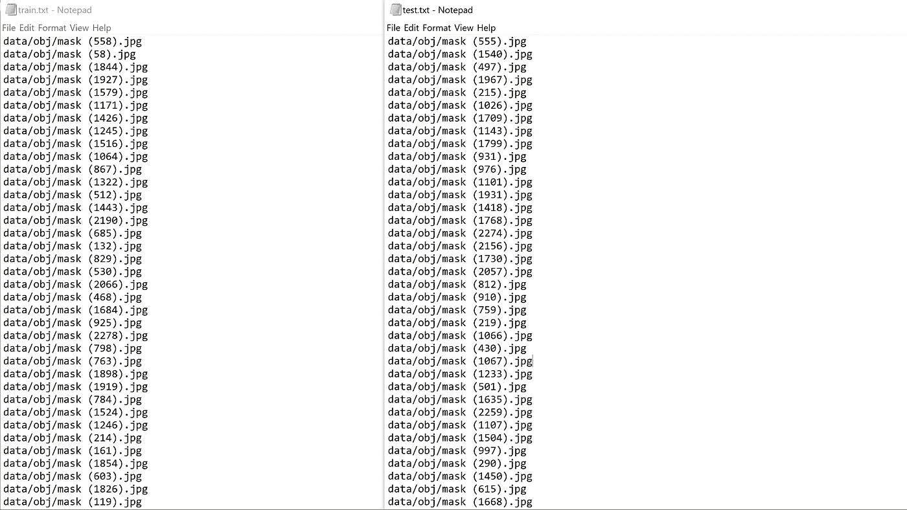**

**train.txt 和 test.txt 文件**

## **重要提示:**

**确保下载这两个“train.txt”和“test.txt”文件，以便在将来断开连接时使用。因为我们是在 colab VM 中创建这些文件，所以如果您丢失了会话，这些文件将被删除。因此，当您从步骤 10 中提到的最后保存的检查点重新开始训练时，请将这些文件上传到在步骤 8 中创建它们的相同位置，即 ***darknet/data*** 目录。您不必每次都使用“process.py”脚本来创建这些文件。**

# **9)下载预先训练的 yolov 4-微型举重器**

**这里我们用迁移学习。我们没有从头开始训练模型，而是使用预先训练好的 yolov 4-微小的权重，它已经被训练到 29 个卷积层。运行以下命令下载 YOLOv4-tiny 预训练权重文件。**

```
**!wget https://github.com/AlexeyAB/darknet/releases/download/darknet_yolo_v4_pre/yolov4-tiny.conv.29**
```

# **10)培训**

## **训练您的定制检测器**

**为了获得最佳结果，如果可能的话，当平均损失小于 0.05 或者至少持续低于 0.3 时，应该停止训练，否则训练模型，直到平均损失暂时没有任何显著变化。**

```
**!./darknet detector train data/obj.data cfg/yolov4-tiny-custom.cfg yolov4-tiny.conv.29 -dont_show -map**
```

**这里的**映射**参数给了我们**M**ean**A**verage**P**精度。**贴图**越高，越有利于物体检测。**

**你可以访问官方的 AlexeyAB Github 页面，它给出了关于何时停止训练的详细解释。点击下面的链接跳转到该部分。**

**[](https://github.com/AlexeyAB/darknet/#user-content-when-should-i-stop-training) [## AlexeyAB/darknet

### https://arxiv.org/abs/2004.10934 纸 YOLO v4:https://arxiv.org/abs/2011.08036 纸缩放 YOLO v4:用于复制…

github.com](https://github.com/AlexeyAB/darknet/#user-content-when-should-i-stop-training)** 

## **重新开始您的培训(以防培训未结束而断开连接)**

**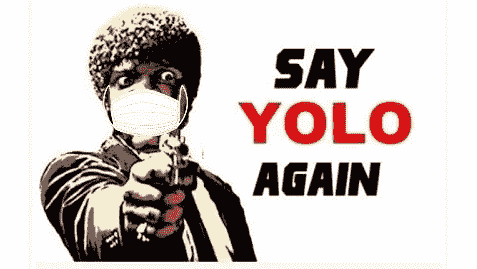**

**如果您断开连接或丢失会话，您不必再次从头开始训练您的模型。你可以从你停止的地方重新开始训练。使用上次保存的重量。每 100 次迭代，权重将被保存为硬盘上***yolov 4-tiny/training***文件夹中的***yolov 4-tiny-custom _ last . weights***。(我们在“obj.data”文件中作为备份给出的路径)。**

****要从上次保存的检查点重新开始训练，请运行步骤 1、4、5、6、7，对于步骤 8，只需上传我们在步骤 8 中第一次创建后下载的相同“train . txt”&“test . txt”文件，因为我们每次训练都会使用这些相同的文件。接下来，运行以下命令:****

```
**!./darknet detector train data/obj.data cfg/yolov4-tiny-custom.cfg /mydrive/yolov4-tiny/training/yolov4-tiny-custom_last.weights -dont_show -map**
```

****注意:**由于我正在将文件复制到 colab VM 内部的 darknet 目录中，因此每当您丢失会话时，这些文件都会丢失，因此您每次都必须使用 step 7 将这些文件复制到 colab VM 内部的 darknet 目录中。**

# **11)检查性能**

## ****定义辅助函数*im show*****

```
**def imShow(path):import cv2
import matplotlib.pyplot as plt
%matplotlib inline
image = cv2.imread(path)
height, width = image.shape[:2]
resized_image = cv2.resize(image,(3*width, 3*height), interpolation = cv2.INTER_CUBIC)
fig = plt.gcf()
fig.set_size_inches(18, 10)
plt.axis(“off”)
plt.imshow(cv2.cvtColor(resized_image, cv2.COLOR_BGR2RGB))
plt.show()**
```

## ****查看培训图表****

**您可以通过查看*文件来检查所有训练过的砝码的性能。然而，***chart.png***文件仅在训练没有中断的情况下显示结果，即，如果您没有断开连接或丢失会话。如果从保存的点重新开始训练，这将不起作用。***

```
**imShow('chart.png')**
```

**如果这不起作用，还有其他方法来检查你的表现。其中之一是通过检查训练权重的地图。**

****检查地图(平均平均精度)****

**您可以检查每 1000 次迭代保存的所有权重的贴图，例如:-yolov 4-tiny-custom _ 4000 . weights，yolov 4-tiny-custom _ 5000 . weights，yolov 4-tiny-custom _ 6000 . weights，等等。这样你就知道哪个权重文件会给你最好的结果。地图越高越好。**

**运行以下命令来检查特定已保存权重文件的映射，其中 **xxxx** 是其迭代编号。(例如:- 4000，5000，6000，…)**

```
**!./darknet detector map data/obj.data cfg/yolov4-tiny-custom.cfg /mydrive/yolov4-tiny/training/yolov4-tiny-custom_**xxxx**.weights -points 0**
```

# **12)测试您的自定义对象检测器**

## **对自定义配置文件进行更改，将其设置为测试模式**

*   **将行批更改为批=1**
*   **将线细分改为细分=1**

**您可以手动完成，也可以简单地运行下面的代码**

```
**%cd cfg
!sed -i 's/batch=64/batch=1/' yolov4-tiny-custom.cfg
!sed -i 's/subdivisions=16/subdivisions=1/' yolov4-tiny-custom.cfg
%cd ..**
```

## **对图像运行检测器**

**上传一张图片到你的 google drive 进行测试。**

**使用此命令对图像运行您的自定义检测器。(阈值标志设置对象检测所需的最低精度)**

```
**!./darknet detector test data/obj.data cfg/yolov4-tiny-custom.cfg /mydrive/yolov4-tiny/training/yolov4-tiny-custom_best.weights /mydrive/mask_test_images/image1.jpg -thresh 0.3imShow('predictions.jpg')**
```

**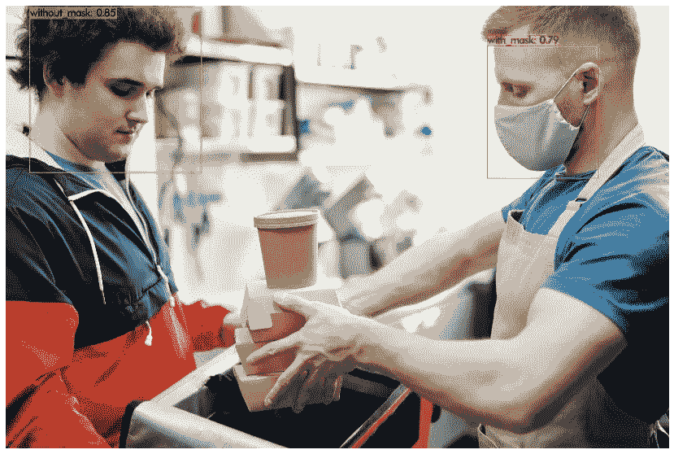**

**来自 [Pexels](https://www.pexels.com/photo/men-putting-food-on-a-thermal-bag-4393665/?utm_content=attributionCopyText&utm_medium=referral&utm_source=pexels) 的 [Norma Mortenson](https://www.pexels.com/@norma-mortenson?utm_content=attributionCopyText&utm_medium=referral&utm_source=pexels) 的原始照片**

## **对网络摄像头图像运行检测器**

**要在网络摄像头捕捉的图像上运行检测器，请运行以下代码。这是由 Colab 提供的相机代码片段，除了最后两行在保存的图像上运行检测器。**

**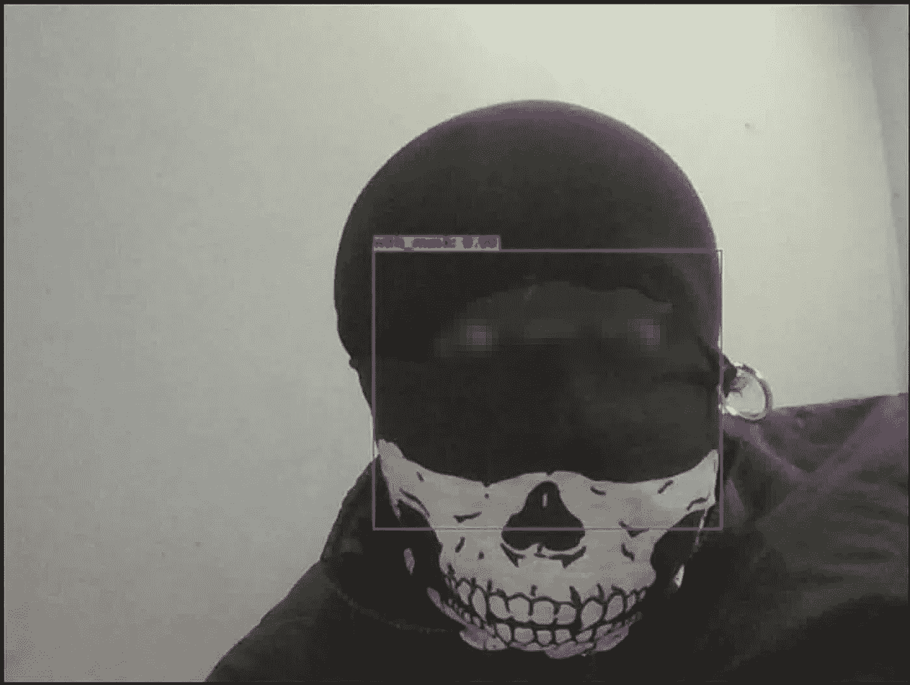**

****网络摄像头图像检测****

## **对视频运行检测器**

**上传一段视频到你的 google drive 进行测试。**

**使用此命令对视频运行您的自定义检测器。(thresh 标志设置对象检测所需的最低精度)。这将在输出路径中保存带有检测的输出视频**

```
**!./darknet detector demo data/obj.data cfg/yolov4-tiny-custom.cfg /mydrive/yolov4-tiny/training/yolov4-tiny-custom_best.weights -dont_show /mydrive/mask_test_videos/test1.mp4 -thresh 0.7 -i 0 -out_filename /mydrive/mask_test_videos/results1.avi**
```

**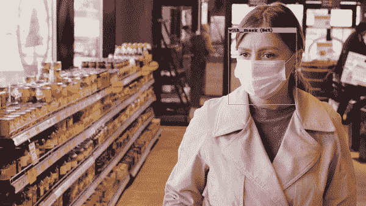**

**来自 [Pexels](https://www.pexels.com/photo/woman-pushing-a-shopping-cart-full-of-toilet-papers-4318387/?utm_content=attributionCopyText&utm_medium=referral&utm_source=pexels) 的 [Pavel Danilyuk](https://www.pexels.com/@pavel-danilyuk?utm_content=attributionCopyText&utm_medium=referral&utm_source=pexels) 原创视频**

## **在实时网络摄像头上运行检测器**

**首先导入依赖项，定义助手函数并加载自定义的 YOLOv4-tiny 文件，然后在网络摄像头上运行检测器。**

**运行下面的代码。**

**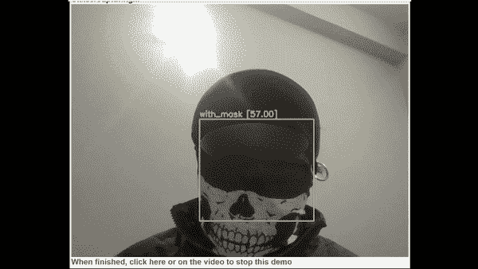**

****实时网络摄像头检测****

# ****注:****

**我收集的用于遮罩检测的数据集主要包含特写图像。你可以在网上搜索更多的长镜头图片。有很多网站可以下载有标签和无标签的数据集。我在数据集来源下面给出了一些链接。我也给出了一些掩膜数据集的链接。其中一些有超过 10，000 张图片。**

**虽然我们可以对我们的训练配置文件进行某些调整和更改，或者通过增强为每种类型的对象类向数据集添加更多图像，但我们必须小心，以免导致影响模型准确性的过度拟合。**

**对于初学者，你可以简单地使用我上传到我的GitHub **上的配置文件开始。**我还上传了我的屏蔽图像数据集以及 YOLO 格式的标签文本文件，虽然这可能不是最好的，但将为您如何使用 YOLO 训练您自己的定制检测机模型提供一个良好的开端。你可以找到一个质量更好的带标签的数据集或者一个不带标签的数据集，以后自己标注。**

****

**来自 [Pexels](https://www.pexels.com/photo/a-teacher-and-his-students-wearing-a-face-mask-while-looking-at-the-camera-5199637/?utm_content=attributionCopyText&utm_medium=referral&utm_source=pexels) 的 [Max Fischer](https://www.pexels.com/@max-fischer?utm_content=attributionCopyText&utm_medium=referral&utm_source=pexels) 的原始视频**

# **我的 GitHub**

**我已经在下面的 GitHub 链接上上传了我的自定义 mask 数据集和训练 Yolov4-tiny detector 所需的所有其他文件。**

**[](https://github.com/techzizou/yolov4-tiny-custom_Training) [## techzizou/yolov 4-tiny-custom _ Training

### cottonbro 的原始视频来自 Pexels，该存储库中的 yolov4-tiny 文件夹包含所需的 4 个自定义文件…

github.com](https://github.com/techzizou/yolov4-tiny-custom_Training) 

# 我的标注数据集(obj.zip)

[](https://www.kaggle.com/techzizou/labeled-mask-dataset-yolo-darknet) [## 带标签的掩膜数据集(YOLO 暗网)

### YOLO 格式注释

www.kaggle.com](https://www.kaggle.com/techzizou/labeled-mask-dataset-yolo-darknet) 

# 我给 YOLOv4 的 Colab 笔记本-小训练

[](https://colab.research.google.com/drive/1hQO4nOoD6RDxdbz3C1YSiifTsyZjZpYm?usp=sharing) [## 谷歌联合实验室

定制 yolov4-tiny 训练教程](https://colab.research.google.com/drive/1hQO4nOoD6RDxdbz3C1YSiifTsyZjZpYm?usp=sharing) 

# 如果你觉得这篇文章有帮助，请订阅并支持我在 YouTube 🖖的频道

[](https://www.youtube.com/techzizou) [## 泰克齐祖

### 创建人工智能、机器学习、深度学习、计算机视觉、物体检测、图像等方面的视频教程

www.youtube.com](https://www.youtube.com/techzizou) 

# 我在 YouTube 上的视频！

# 信用

## 参考

*   [阿列克谢 AB GitHub](https://github.com/AlexeyAB/darknet)
*   [pjreddie Github](https://github.com/pjreddie/darknet)
*   [代码 Github](https://github.com/theAIGuysCode/YOLOv4-Cloud-Tutorial)
*   [纸质 YOLOv4](https://arxiv.org/abs/2004.10934)
*   [纸张 YOLOv4-Scaled](https://arxiv.org/abs/2011.08036)
*   [pjreddie 站点](https://pjreddie.com/darknet/yolo/)

## 数据集源

您可以从下面提到的网站下载许多对象的数据集。这些网站还包含许多种类的对象的图像以及它们的多种格式的注释/标签，例如 YOLO _ 黑暗网文本文件和帕斯卡 _VOC XML 文件。

*   [通过谷歌打开图像数据集](https://storage.googleapis.com/openimages/web/index.html\)
*   [Kaggle 数据集](https://www.kaggle.com/datasets)
*   [Roboflow 公共数据集](https://public.roboflow.com/)
*   [可视化数据数据集](https://www.visualdata.io/discovery)

## 屏蔽数据集源

我将这 3 个数据集用于我的标记数据集:

*   [般若 Github](https://github.com/prajnasb/observations)
*   [约瑟夫·尼尔森·罗博弗洛](https://public.roboflow.com/object-detection/mask-wearing)
*   [X-张洋 Github](https://github.com/X-zhangyang/Real-World-Masked-Face-Dataset)

更多掩膜数据集

*   Prasoonkottarathil Kaggle(20000 张图片)
*   Ashishjangra27 Kaggle (12000 张图片)
*   [Andrewmvd Kaggle](https://www.kaggle.com/andrewmvd/face-mask-detection)

## 视频源

*   [https://www.pexels.com/](https://www.pexels.com/)

## 别忘了留下👏

## 祝您愉快！！！✌

## ♕·特奇佐·♕

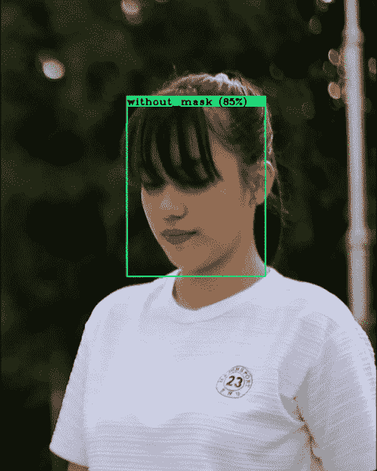

来自[像素](https://www.pexels.com/photo/a-young-woman-wearing-a-face-mask-4873251/?utm_content=attributionCopyText&utm_medium=referral&utm_source=pexels)的[前方无物](https://www.pexels.com/@ian-panelo?utm_content=attributionCopyText&utm_medium=referral&utm_source=pexels)的原始视频**