# 使用 Yolo-V5 训练自定义对象检测模型

> 原文：<https://medium.com/analytics-vidhya/training-a-custom-object-detection-model-with-yolo-v5-aa9974c07088?source=collection_archive---------0----------------------->

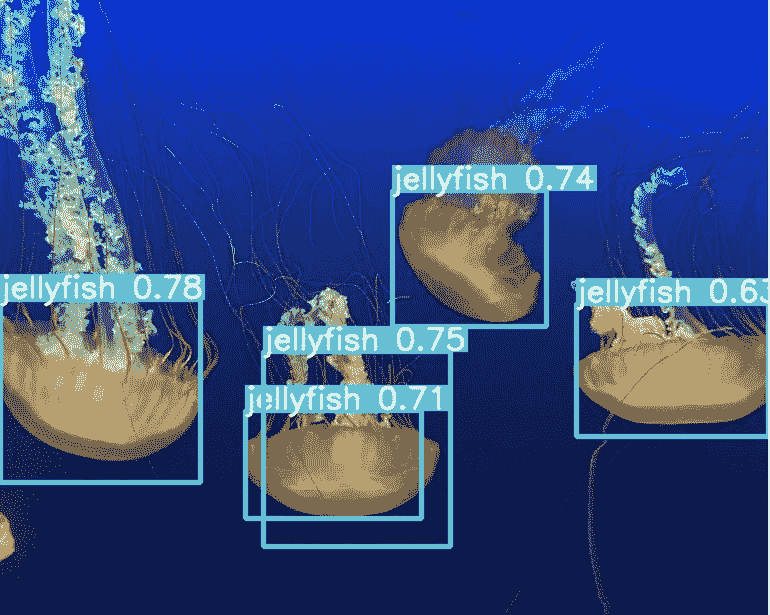

目标检测是计算机视觉中的一项任务，其重点是检测图像/视频中的目标。

有各种对象检测算法，如 YOLO(你只看一次)，单镜头检测器(SSD)，更快的 R-CNN，梯度方向直方图(HOG)等。

在本文中，我们将使用 Yolo-V5 来训练我们的自定义对象检测模型。YOLO 是最著名的目标检测模型之一。

YOLO-V5 的 1.0 版本于 2020 年 5 月 27 日由 [Utralytics](https://github.com/ultralytics) 的创始人&CEO[格伦·约彻](https://www.linkedin.com/in/glenn-jocher)发布。它是用 PyTorch 写的，可以在 [Github](https://github.com/ultralytics/yolov5) 上下载。

## **先决条件**

有深度学习计算机视觉的基础知识就好。以及如何在 Google Colab 环境下工作。

## 本教程涵盖的步骤

要训练我们自己的自定义对象检测器，请遵循以下步骤

*   准备数据集
*   环境设置:安装 YOLOv5 依赖项
*   设置数据和目录
*   为培训建立 YAML 档案
*   训练模型
*   评估模型
*   可视化训练数据
*   在测试图像上运行推理
*   导出权重文件以备后用

# 准备数据集

我们将使用 [**水族馆数据集**](https://public.roboflow.com/object-detection/aquarium) ，它在 [Roboflow 公共对象检测数据集](https://public.roboflow.com/object-detection)中可用。你可以查看那里更多的数据集。

水族馆数据集由 638 幅图像组成。这些图像已经被 Roboflow 团队标记了。它有 7 类，如鱼，水母，企鹅，鲨鱼，海雀，黄貂鱼和海星，大多数图像包含多个边界框。

要下载数据集，您需要首先创建一个 roboflow 帐户。非常简单容易。

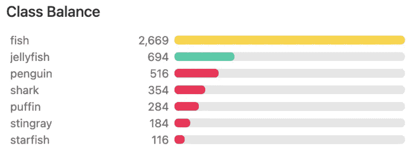

资料来源:https://public.roboflow.com/object-detection/aquarium

如果你想使用自己的图像，你可以使用标注工具，如 [LabelImg](https://github.com/tzutalin/labelImg) 、 [CVAT](https://github.com/openvinotoolkit/cvat) 或者你可以尝试任何大规模的解决方案，如 scale 或 AWS Ground Truth。

当您为自己添加注释时，请确保遵循最佳实践。查看此[链接](https://nanonets.github.io/tutorials-page/docs/annotate)了解更多详情。

准备好数据集后，我们就可以设置环境并训练数据集了。

# 环境设置

这是我笔记本的链接:[谷歌实验室](https://colab.research.google.com/drive/16QCaYzTuHCOF9CQLQYmGNxmtY1xKAIdn?usp=sharing)

你需要一个谷歌账户才能使用谷歌 Colab。您可以使用我的笔记本进行培训，也可以创建自己的笔记本并跟随学习。

在 Google Colab 中，你将获得 12 小时的免费 GPU。如果您在 Colab 中使用新笔记本，请将运行时会话更改为 GPU。

如果您打算使用我的笔记本，请确保文件→在您的驱动器中保存一份副本。然后，您将能够编辑代码。

**安装依赖关系**

```
!git clone https://github.com/ultralytics/yolov5  # clone repo!pip install -U -r yolov5/requirements.txt  # install dependencies
```

不知何故，PyTorch 版本与 GPU 不兼容，所以我安装了 PyTorch 的另一个版本

```
#installing for google colab GPU use!pip install torch==1.6.0+cu101 torchvision==0.7.0+cu101 -f [https://download.pytorch.org/whl/torch_stable.html](https://download.pytorch.org/whl/torch_stable.html) 
```

.

```
%cd /content/yolov5
!ls
```

我们可以导入，看看我们 Google Colab 提供的 GPU 规范。

```
import torchfrom IPython.display import Image  # for displaying imagesfrom utils.google_utils import gdrive_download  # for downloading models/datasetsprint('Using torch %s %s' % (torch.__version__, torch.cuda.get_device_properties(0) if torch.cuda.is_available() else 'CPU')) 
```

这是我得到的

```
Using torch 1.6.0+cu101 _CudaDeviceProperties(name='Tesla T4', major=7, minor=5, total_memory=15079MB, multi_processor_count=40)
```

Google Colab 预装了 Cuda 和 Torch 以及其他一些依赖项。如果你计划在本地培训，那么你必须自己设置 Cuda 和依赖关系。我以后肯定会做一个关于它的教程。

# 设置数据和目录

环境设置完成后。我们可以将数据集导入 colab。由于我正在使用我将要下载的 Roboflow 数据集，如果你打算使用你自己的数据集，你可以使用 Google Drive 导入它。

```
# You need to sign up in roboflow to get the key and then you can use the dataset!curl -L “https://public.roboflow.com/ds/PUT YOUR OWN KEY HERE” > roboflow.zip; unzip roboflow.zip; rm roboflow.zip
```

这将下载数据，解压缩并保存在 yolov5 目录中。

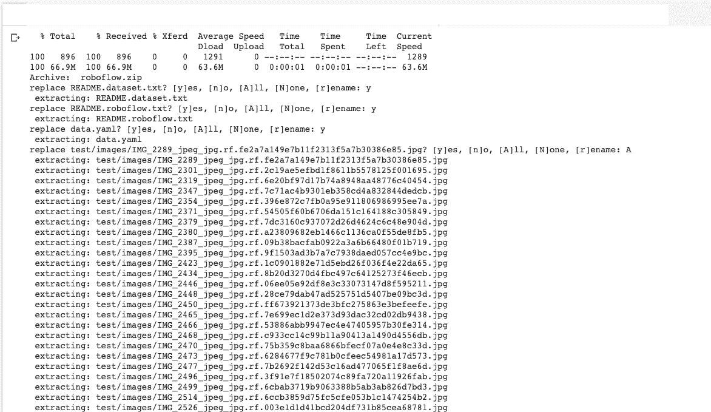

**项目文件夹结构**

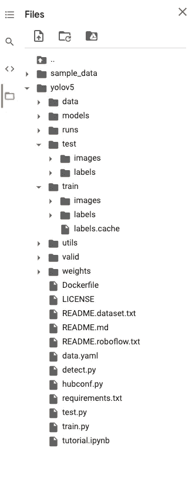

# 为培训建立 YAML 档案

为了训练一个 YOLO-V5 模型，我们需要两个 YAML 文件。

第一个 YAML 明确指出:

*   我们的培训和验证数据在哪里
*   我们想要检测的类的数量
*   以及对应于这些类别的名称

我们的这个 YAML 看起来像这样:

```
train: ./train/images 
val: ./valid/images nc: 7 
names: ['fish', 'jellyfish', 'penguin', 'puffin', 'shark', 'starfish', 'stingray']
```

第二个 YAML 是指定整个模型配置。如果您愿意，可以在这一步更改网络架构，但我们将使用默认架构。

我们称之为`custom_yolov5s.yaml`的 YAML:

我们可以把 YAML 文件放在任何我们想要的地方，因为我们可以在以后引用文件路径。但是将它放在 YoloV5 目录中是一个好主意。

# 训练模型

配置完成后，我们可以开始我们的培训。

我们可以指定多个超参数，它们是:

*   **img:** 定义输入图像尺寸
*   **批量:**确定批量大小
*   **时期:**定义训练时期的数量。
*   **数据:**设置我们 YAML 文件的路径
*   **cfg:** 指定我们的模型配置
*   **权重:**指定权重的自定义路径
*   **名称:**结果名称
*   **nosave:** 仅保存最后一个检查点
*   **缓存:**缓存图像以加快训练速度

我们需要指定上面创建的两个 YAML 文件的路径。

```
 %cd /content/yolov5/!python train.py --img 416 --batch 80 --epochs 100 --data './data.yaml' --cfg ./models/custom_yolov5s.yaml --weights ''
```

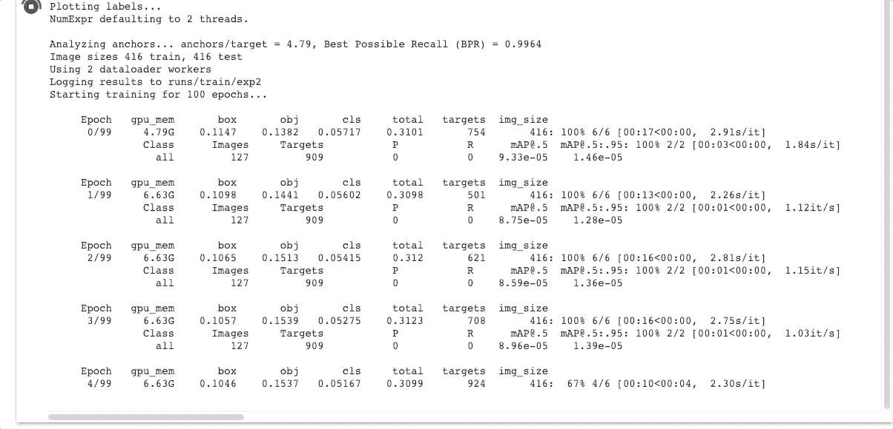

培养

使用 100 个 epochs，训练在 35 分钟内完成。

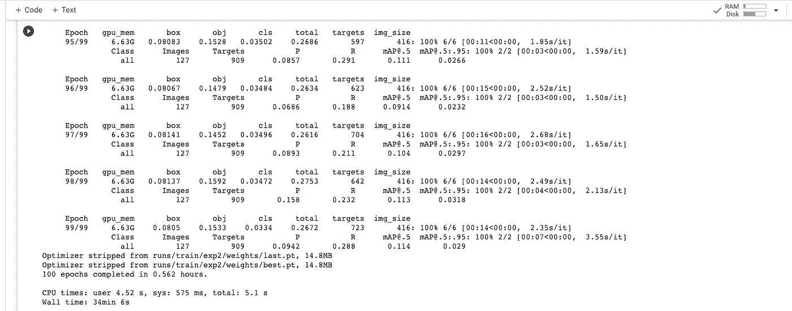

# 评估模型

当我们训练时，训练损失和表现指标被保存到 Tensorboard 和上面定义的带有 **— name** 标志的日志文件中。在我们的例子中，我们将其命名为`yolov5s_results`。(如果没有给出名称，则默认为`results.txt`。)训练完成后，结果文件被绘制为 png。

部分完成的`results.txt`文件可以用`from utils.utils import plot_results; plot_results()`出图。

```
# Start tensorboard
# Launch after you have started training to all the graphs needed for inspection
# logs save in the folder "runs"%load_ext tensorboard
%tensorboard --logdir /content/yolov5/runs
```

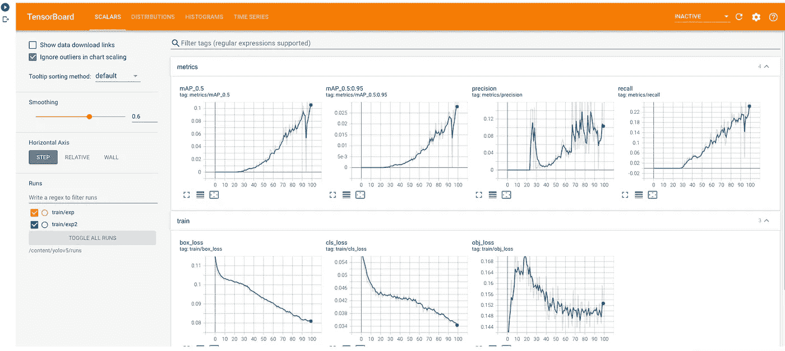

# 可视化训练数据

训练开始后，查看`train*.jpg`图像，查看训练图像、标签和增强效果。我们可以可视化地面实况训练数据，以及地面实况、增强数据。

```
# first, display our ground truth data
# The ground truth [Train data] is available in jpg file at location /content/yolov5/runs/train/exp2/test_batch0_labels.jpg print("GROUND TRUTH TRAINING DATA:")
Image(filename='/content/yolov5/runs/train/exp2/test_batch0_labels.jpg', width=900)
```

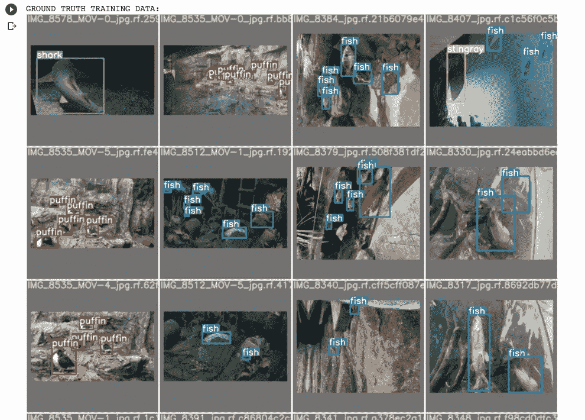

```
# print out an augmented training example
# Below is the augmented training data.
# NOTE: The dataset already contains the augmented data with annotations, so that you dont have to do it.print("GROUND TRUTH AUGMENTED TRAINING DATA:")
Image(filename='/content/yolov5/runs/train/exp2/train_batch0.jpg', width=900)
```

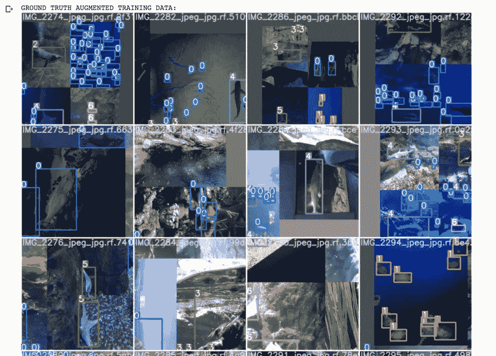

# 运行推理

使用训练后保存的最终训练权重，我们可以运行我们的推断

**权重文件夹**

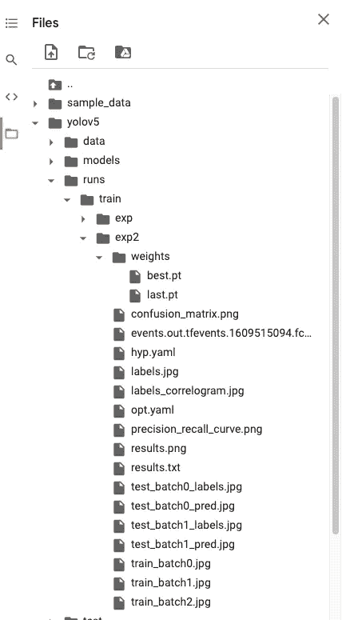

要运行模型推理，我们可以使用下面的命令。

```
# use the best weights!
# Final weights will be by-default stored at /content/yolov5/runs/train/exp2/weights/best.pt%cd /content/yolov5/!python detect.py --weights
/content/yolov5/runs/train/exp2/weights/best.pt --img 416 --conf 0.4 --source ./test/images
```

*   —来源:输入图像目录或单个图像路径或视频路径
*   -权重:训练模型路径
*   — conf:置信度阈值

这将处理输入并将输出存储在我们的推理目录中。

以下是一些输出图像:

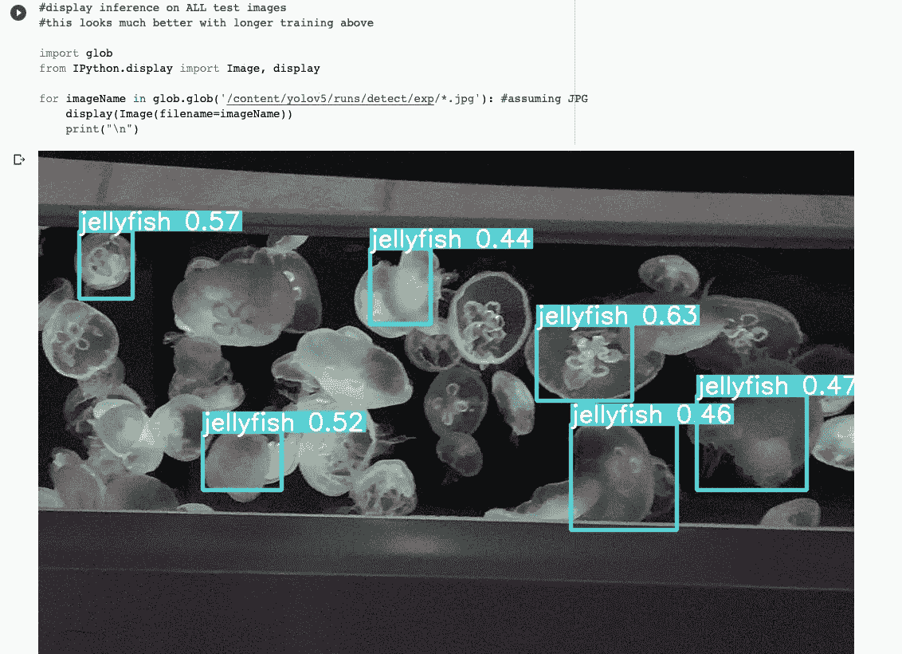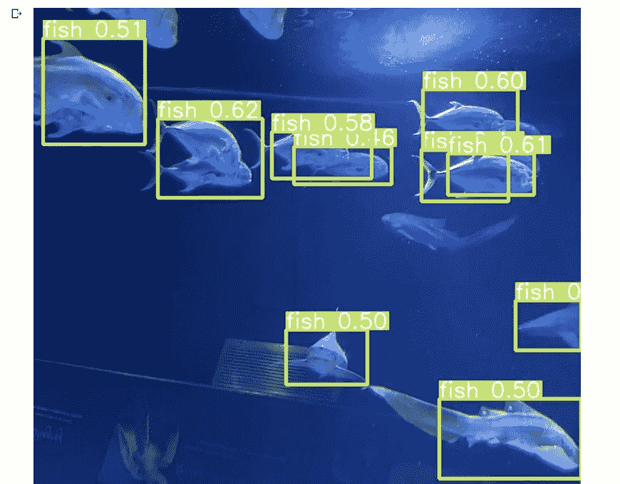

# 导出重量以备后用

现在我们已经成功地训练了我们的定制模型。我们可以下载重量文件，并将其保存在本地目录或 Google Drive 中。

为此，我们导入一个 Google Drive 模块，然后将它们发送出去

```
from google.colab import drive
drive.mount('/content/gdrive')%cp /content/yolov5/runs/train/exp2/weights/best.pt /content/gdrive/My\ Drive
```

# 结论

我希望你能够跟得上，并且能够成功地训练。

我已经将笔记本、配置文件和重量上传到我的 Github 存储库中。你可以在这里查看。

如果你有任何问题、建议或批评，可以通过 [Twitter](https://twitter.com/thecaffeinedev) 或通过我的[邮件](mailto:thedlmonk@gmail.com)联系我。请随时联系我。

# 参考资料:

*   官方回购:[https://github.com/ultralytics/yolov5](https://github.com/ultralytics/yolov5)
*   [Roboflow 数据集](https://public.roboflow.com/object-detection/aquarium)
*   [我的 Colab 笔记本](https://colab.research.google.com/drive/16QCaYzTuHCOF9CQLQYmGNxmtY1xKAIdn?usp=sharing)
*   [Roboflow 博客](https://blog.roboflow.com/how-to-train-yolov5-on-a-custom-dataset/)