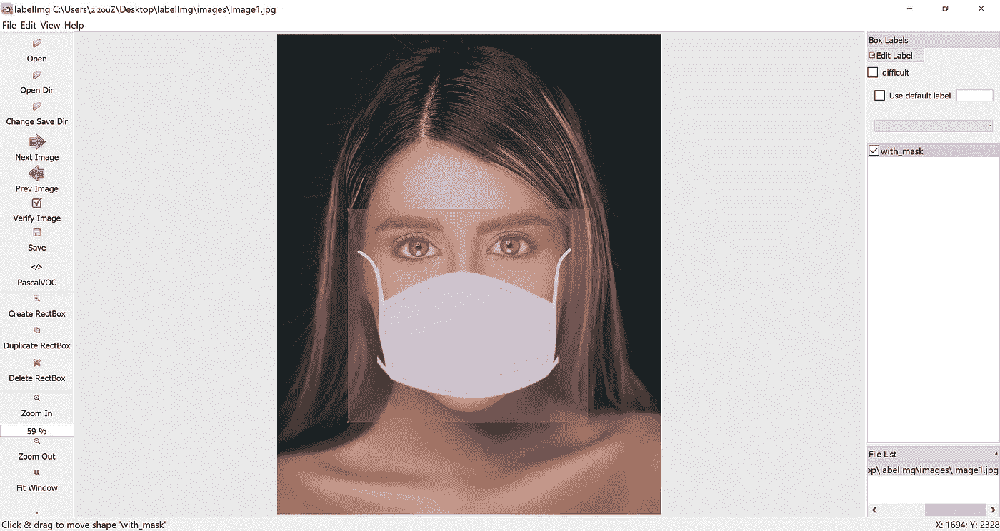
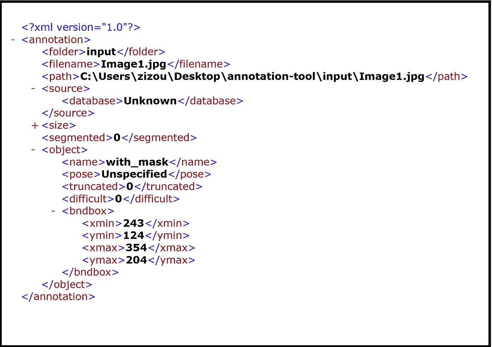
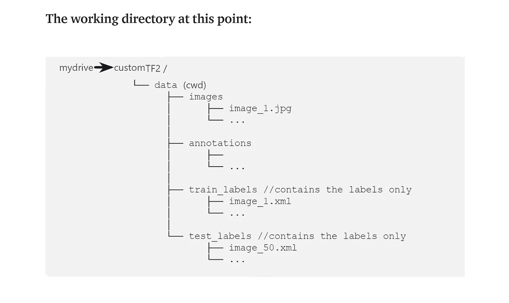
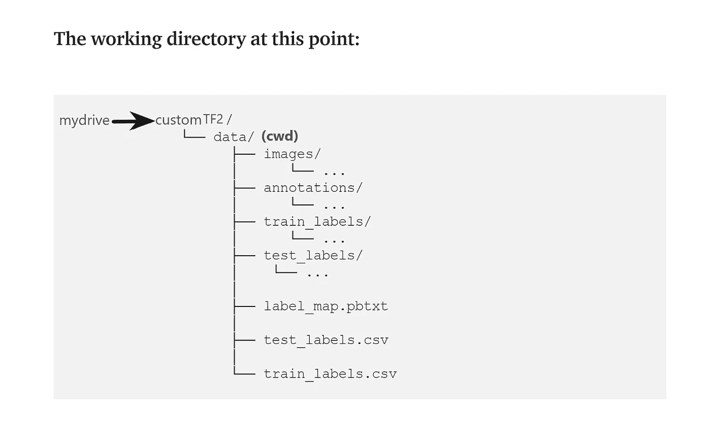
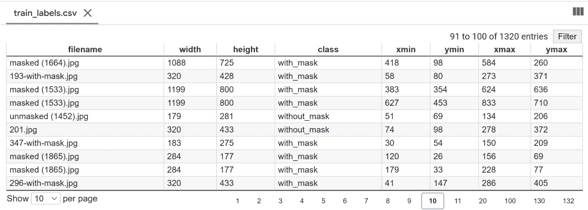
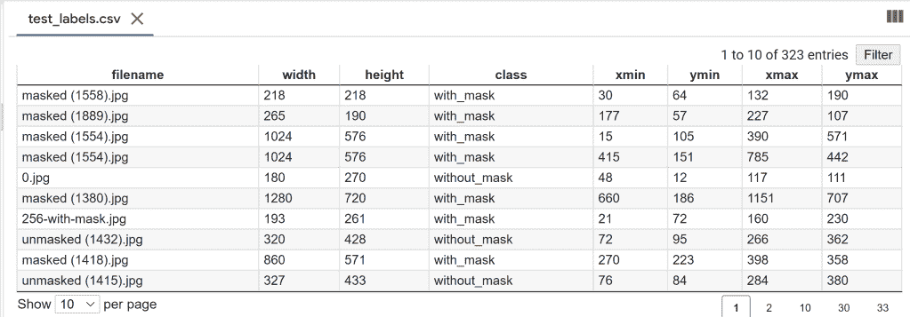
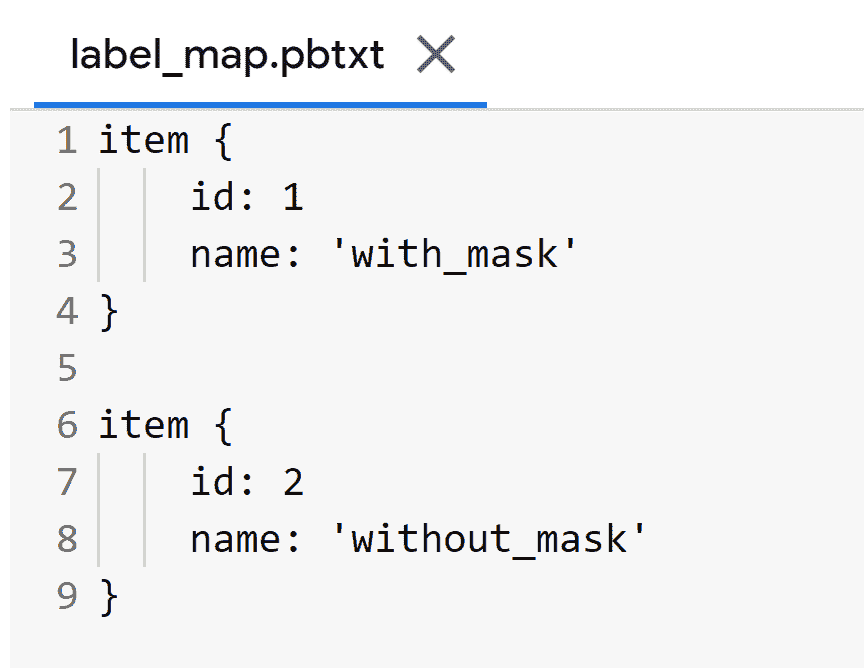
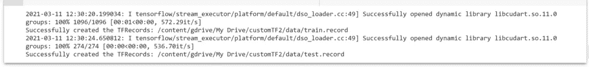
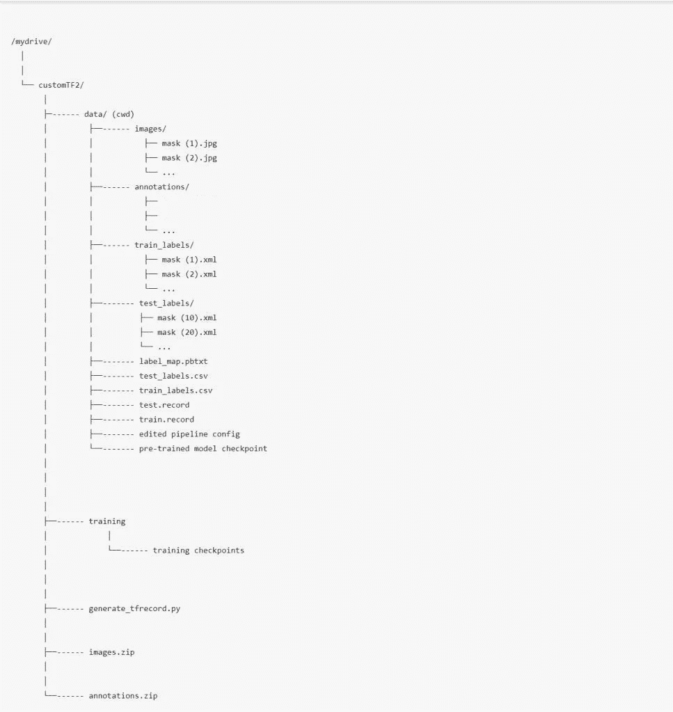

# 在 Google Colab 上训练自定义对象检测(TF 2.x)模型

> 原文：<https://medium.com/analytics-vidhya/training-a-model-for-custom-object-detection-tf-2-x-on-google-colab-4507f2cc6b80?source=collection_archive---------0----------------------->


## 使用 TensorFlow 对象检测 API

# 我在 Youtube 上的视频！

## 在本教程中，我将在 Google Colab 上使用 **TensorFlow 2.x** 训练一个用于自定义对象检测的深度学习模型。下面是它的路线图。

## 路标

*   收集图像数据集，并对它们进行标记，以获得它们的 XML 文件。
*   安装 TensorFlow 对象检测 API。
*   生成培训所需的 TFRecord 文件。(为此需要生成 _tfrecord.py 脚本和 CSV 文件)
*   编辑模型管道配置文件，并下载预先训练的模型检查点。
*   训练和评估模型。

在这里，我正在训练一个自定义对象检测(人脸面具检测)的模型。这是通过下面提到的 16 个步骤完成的:

(但首先✅Subscribe 到我的 YouTube 频道👉🏻https://bit.ly/3Ap3sdi[😁😜)](https://bit.ly/3Ap3sdi)

1.  [**导入库**](#4364)
2.  [**在 google drive**](#bb6b) 中创建 customTF2、training 和 data 文件夹
3.  [**创建并上传您的图像文件和 XML 文件**](#8841)
4.  [**将 generate_tfrecord.py 文件上传到您的驱动器**](#e2ca) 中的 customTF2 文件夹
5.  [**挂载驱动并链接你的文件夹**](#5a27)
6.  [**克隆 TensorFlow 模型 git 库&安装 TensorFlow 对象检测 API**](#863d)
7.  [**测试模型构建器**](#6806)
8.  [**导航到*/my drive/custom tf2/data/*，将 images.zip 和 annotations.zip 文件解压到数据文件夹**](#b513)
9.  **C**[**create test _ labels&train _ labels**](#065a)
10.  [**创建 _CSV 和“label_map.pbtxt”文件**](#8978)
11.  [**创建‘train . record’&【test . record】文件**](#041b)
12.  [**下载预训练模型检查点**](#b748)
13.  [**获取模型管线配置文件，对其进行修改，并将其放入数据文件夹**](#9634)
14.  [**负载张量板**](#6dfc)
15.  [**训练模型**](#5a3a)
16.  [**测试你训练好的模型**](#666a)

# 如何开始？

*   在您的浏览器上打开我的 [Colab 笔记本](https://colab.research.google.com/drive/1QCU_dCR0ozI8j6X2btEDCsaUk5p_b1uw?usp=sharing)。
*   点击菜单栏中的**文件**并点击**在驱动器**中保存一份副本。这将在您的浏览器上打开我的 Colab 笔记本的副本，您现在可以使用它了。
*   接下来，一旦你打开了我的笔记本的副本，并连接到 Google Colab 虚拟机，点击菜单栏中的**运行时**，并点击**更改运行时类型**。选择 **GPU** 并点击保存。

# 我们开始吧！！

# 1)导入库

```
import os
import glob
import xml.etree.ElementTree as ET
import pandas as pd
import tensorflow as tf
```

# 2)在 google drive 中创建 customTF2、training 和 data 文件夹

在 google drive 中创建一个名为 ***customTF2*** 的文件夹。

在 ***customTF2*** 文件夹内再创建一个文件夹，名为***training***(***training***文件夹是训练时保存检查点的地方)。

在 ***customTF2*** 文件夹内创建另一个名为 ***data*** 的文件夹。

# 3)创建并上传您的图像文件及其相应的带标签的 XML 文件。

为您的自定义数据集图像创建一个名为 ***images*** 的文件夹，并为其对应的 PASCAL_VOC 格式的 XML 文件创建另一个名为 ***annotations*** 的文件夹。

接下来，创建他们的 zip 文件并上传到你的驱动器中的 ***customTF2*** 文件夹。

> ***确保所有的图像文件的扩展名都为”。仅 jpg”。***
> 
> *其他格式如* ***<。png >，<。jpeg >*** *会给出错误自****generate _ TF record******和****XML _ to _ CSV******脚本这里只有* ***<。jpg >*** *在其中。如果您有其他格式的图像，您可以相应地在脚本中进行更改。*****

**对于数据集，您可以在本文底部的致谢部分查看我的数据集来源。**

## **收集图像数据集并标记它们以获得它们的 PASCAL_VOC XML 注释。**

## **标注数据集**

**输入图像示例(**Image1.jpg**)**

****

**您可以使用任何软件进行贴标，如 [**贴标**](https://github.com/tzutalin/labelImg#labelimg) 工具。**

****

**我使用一个叫做 **OpenLabeling** 的开源标签工具，它有一个非常简单的 UI。**

****

**点击下面的链接，了解更多关于贴标过程和其他软件的信息:**

*   **[**影像数据集标注条**](https://techzizou.com/dataset-labeling-annotation-tutorial-for-beginners/)**

****注:**垃圾入=垃圾出。选择和标记图像是最重要的部分。尽量找质量好的图片。数据的质量在很大程度上决定了结果的质量。**

**输出的 PASCAL_VOC 标记的 XML 文件如下所示:**

****

# **4)将 generate_tfrecord.py 文件上传到驱动器中的 customTF2 文件夹。**

**你可以在这里找到 generate_tfrecord.py 文件**

# **5)安装驱动器并链接您的文件夹**

```
****#mount drive**from google.colab import drive
drive.mount('/content/gdrive')**# this creates a symbolic link so that now the path /content/gdrive/My Drive/ is equal to /mydrive**!ln -s /content/gdrive/My Drive/ /mydrive
!ls /mydrive**
```

# **6)克隆 TensorFlow 模型 git 存储库并安装 TensorFlow 对象检测 API**

```
****# clone the tensorflow models on the colab cloud vm**!git clone --q https://github.com/tensorflow/models.git**# navigate to /models/research folder to compile protos**%cd models/research**# Compile protos.**!protoc object_detection/protos/*.proto --python_out=.**# Install TensorFlow Object Detection API.**!cp object_detection/packages/tf2/setup.py .
!python -m pip install .**
```

# **7)测试模型构建器**

```
**!python object_detection/builders/model_builder_tf2_test.py**
```

# **8)导航到/mydrive/customTF2/data/**

```
**%cd /mydrive/customTF2/data/**# unzip the datasets and their contents so that they are now in /mydrive/customTF2/data/ folder**!unzip /mydrive/customTF2/images.zip -d .
!unzip /mydrive/customTF2/annotations.zip -d .**
```

# **9)创建测试标签和训练标签**

**当前工作目录为***/my drive/custom tf2/data/*****

**将标注分为 test_labels(20%)和 train_labels(80%)。**

****

# **10)创建 CSV 文件和“label_map.pbtxt”文件**

**当前工作目录为***/my drive/custom tf2/data/*****

**运行下面的 xml_to_csv 脚本，创建***test _ labels . CSV***和***train _ labels . CSV*****

**该脚本还使用 xml 文件中提到的类创建了***label _ map . Pb txt***文件。**

****

**创建的 3 个文件，即 **train_labels.csv** 、 **test_labels.csv** 和 **label_map.pbtxt** ，如下图所示:**

************

**train_labels.csv 包含所有训练图像的名称、这些图像中的类及其注释。**

****test_labels.csv** 包含了所有测试图像的名称，这些图像中的类，以及它们的注释。**

****label_map.pbtxt** 文件包含来自您的带标签的 XML 文件的类名。**

****注意:**我有两个类，即“带 _mask”和“不带 _mask”。**

> ***标签映射 id 0 为背景标签保留。***

# **11)创建训练记录和测试记录文件**

**当前工作目录为***/my drive/custom tf2/data/*****

**运行***generate _ TF record . py***脚本，创建 ***train.record*** 和 ***test.record*** 文件**

```
****#Usage:**
#!python generate_tfrecord.py output.csv output_pb.txt /path/to/images output.tfrecords**#For train.record**
!python /mydrive/customTF2/generate_tfrecord.py train_labels.csv  label_map.pbtxt images/ train.record**#For test.record**
!python /mydrive/customTF2/generate_tfrecord.py test_labels.csv  label_map.pbtxt images/ test.record**
```

****

**图像文件的总数是 1370。因为我们将标签分为两类，即。train_labels(80%)和 test_labels(20%)，“**train . record”**的文件数为 1096，“ **test.record** 的文件数为 274。**

# **12)下载预先训练的模型检查点**

**当前工作目录为***/my drive/custom tf2/data/*****

**根据您的数据和要求，您可以选择任何模型进行培训。阅读[这篇](https://serokell.io/blog/how-to-choose-ml-technique)博客，了解更多这方面的信息。TensorFlow 2.x 的检测模型检查点官方列表可以在[这里](https://github.com/tensorflow/models/blob/master/research/object_detection/g3doc/tf2_detection_zoo.md)找到。**

**在本教程中，我将使用**SSD _ mobilenet _ v2 _ fpnlite _ 320 x320 _ coco 17 _ TPU-8**模型。**

```
****# Download the pre-trained model ssd_mobilenet_v2_fpnlite_320x320_coco17_tpu-8.tar.gz into the *data* folder & unzip it**!wget http://download.tensorflow.org/models/object_detection/tf2/20200711/ssd_mobilenet_v2_fpnlite_320x320_coco17_tpu-8.tar.gz!tar -xzvf ssd_mobilenet_v2_fpnlite_320x320_coco17_tpu-8.tar.gz**
```

# **13)获取模型管线配置文件，对其进行更改，并将其放入数据文件夹中**

**当前工作目录为***/my drive/custom tf2/data/*****

**从***/content/models/research/object _ detection/configs/tf2***下载**SSD _ mobilenet _ v2 _ fpn lite _ 320 _ coco 17 _ TPU-8 . config**。对其进行必要的修改，并上传到***/my drive/custom/data***文件夹。**

****或****

**在 colab vm 中编辑***/content/models/research/object _ detection/configs/tf2***中的配置文件，并将编辑后的配置文件复制到***/my drive/custom tf2/data***文件夹中。**

**您还可以在我们在上一步中刚刚下载的模型检查点文件夹中找到管道配置文件。**

****你需要做如下修改:****

*   **将 ***num_classes*** 更改为您的类数。**
*   **将***test . record***path、***train . record***path&***label map***path 改为您创建这些文件的路径(训练时路径应该相对于您当前的工作目录)。**
*   **将 ***微调检查点*** 改为步骤 12 下载的检查点所在的目录路径。**
*   **根据类型，用值**分类**或**检测**改变 ***微调检查点类型*** 。**
*   **根据您的 GPU 的能力，将 ***batch_size*** 更改为 8 的任意倍数。(例如:- 24，128，…，512)。GPU 能力越好，你能走的越高。我的设置为 64。**
*   **将 ***num_steps*** 更改为您希望探测器训练的步数。**

> **最大批量大小=可用 GPU 内存字节数/ 4 /(张量大小+可训练参数)**

****接下来，复制编辑好的配置文件**。**

```
****# copy the edited config file from the configs/tf2 directory to the data/ folder in your drive**!cp /content/models/research/object_detection/configs/tf2/ssd_mobilenet_v2_fpnlite_320x320_coco17_tpu-8.config /mydrive/customTF2/data**
```

****此时的工作区:****

****

> **您可以添加许多数据扩充选项。查看完整列表 [*此处*](https://github.com/tensorflow/models/blob/master/research/object_detection/protos/preprocessor.proto) 。对于新手来说，以上改动就足够了。**

## **数据扩充建议(可选)**

**首先，您应该使用带有上述基本更改的示例配置文件来训练模型，并看看它做得如何。如果你过拟合，那么你可能想做一些更多的图像放大。**

**在示例配置文件中:默认添加`**random_horizontal_flip**` & `**ssd_random_crop**`。您也可以尝试添加以下内容:**

**(**注**:每次图像增强都会大幅增加训练时间)**

1.  **来自**列车配置{}:****

```
**data_augmentation_options {
    random_adjust_contrast {
    }
  }
  data_augmentation_options {
    random_rgb_to_gray {
    }
  }
  data_augmentation_options {
    random_vertical_flip {
    }
  }
  data_augmentation_options {
    random_rotation90 {
    }
  }
  data_augmentation_options {
    random_patch_gaussian {
    }
  }**
```

**2.在**型号{ }>SSD { }>box _ predictor { }:**将`**use_dropout**`设置为`true`这将帮助您应对过度拟合。**

**3.在 **eval_config : {}** 设置`**num_examples**`中的**测试**图像的数量，并移除`**max_eval**`以无限期评估**

```
**eval_config: {
  num_examples: 274 # set this to the number of test images we divided earlier
  num_visualizations: 20 # the number of visualization to see in tensorboard
}**
```

# **14)加载张量板**

```
**%load_ext tensorboard
%tensorboard --logdir '/content/gdrive/MyDrive/customTF2/training'**
```

# **15)训练模型**

**导航到 Colab VM 中的***object _ detection***文件夹**

```
**%cd /content/models/research/object_detection**
```

## **15 (a)使用 model_main_tf2.py 进行培训**

**这里 **{PIPELINE_CONFIG_PATH}** 指向管道配置， **{MODEL_DIR}** 指向训练检查点和事件将被写入的目录。**

```
****#Run the command below from the content/models/research/object_detection directory****"""
PIPELINE_CONFIG_PATH=path/to/pipeline.config
MODEL_DIR=path to training checkpoints directory
NUM_TRAIN_STEPS=50000
SAMPLE_1_OF_N_EVAL_EXAMPLES=1****python model_main_tf2.py -- \
--model_dir=$MODEL_DIR --num_train_steps=$NUM_TRAIN_STEPS \
--sample_1_of_n_eval_examples=$SAMPLE_1_OF_N_EVAL_EXAMPLES \
--pipeline_config_path=$PIPELINE_CONFIG_PATH \
--alsologtostderr****"""**!python model_main_tf2.py --pipeline_config_path=/mydrive/customTF2/data/ssd_mobilenet_v2_fpnlite_320x320_coco17_tpu-8.config --model_dir=/mydrive/customTF2/training --alsologtostderr**
```

****注:****

**为了获得最佳结果，如果可能的话，应该在损失小于 0.1 时停止训练，否则训练模型，直到损失暂时没有任何显著变化。理想的损耗应该在 0.05 以下(在不过度拟合模型的情况下，尽量让损耗尽可能低。如果模型已经收敛，不要在训练步骤上走得太高，以试图降低损失。如果它不能进一步显著减少损失，并且需要一段时间才能下降。)**

**理想情况下，我们希望损失尽可能低，但我们应该小心，以免模型过度拟合。您可以将步数减少到 50000，并检查损失是否低于 0.1，如果没有，则可以用更高的步数重新训练模型。**

**输出通常看起来像是“冻结”了，但不要急于取消该过程。默认情况下，训练仅每 100 步输出一次日志，因此，如果您等待一段时间，您应该会在第 100 步看到一个丢失日志。您应该等待的时间可能会有很大的不同，这取决于您是否使用 GPU 以及在配置文件中为`batch_size`选择的值，所以请耐心等待。**

## **15 (b)使用 model_main_tf2.py 的评估(可选)**

**您可以打开另一个 colab 笔记本，同时运行这个命令和上面的训练命令(不要忘记安装驱动器，克隆 TF git repo，并在那里安装 TF2 对象检测 API)。这将给你验证损失，地图等，所以你有一个更好的想法如何你的模型执行。**

**这里**{检查点目录}** 指向包含训练作业产生的检查点的目录。评估事件被写入**{模型 _ 目录/评估}** 。**

```
****# Run the command below from the content/models/research/object_detection directory****"""
PIPELINE_CONFIG_PATH=path/to/pipeline.config
MODEL_DIR=path to training checkpoints directory
CHECKPOINT_DIR=${MODEL_DIR}
NUM_TRAIN_STEPS=50000
SAMPLE_1_OF_N_EVAL_EXAMPLES=1****python model_main_tf2.py -- \
--model_dir=$MODEL_DIR --num_train_steps=$NUM_TRAIN_STEPS \
--checkpoint_dir=${CHECKPOINT_DIR} \
--sample_1_of_n_eval_examples=$SAMPLE_1_OF_N_EVAL_EXAMPLES \
--pipeline_config_path=$PIPELINE_CONFIG_PATH \
--alsologtostderr
"""**!python model_main_tf2.py --pipeline_config_path=/mydrive/customTF2/data/ssd_mobilenet_v2_fpnlite_320x320_coco17_tpu-8.config --model_dir=/mydrive/customTF2/training/ --checkpoint_dir=/mydrive/customTF2/training/ --alsologtostderr**
```

## **重新训练模型(以防断线)**

**如果您在 Colab VM 上断开连接或丢失会话，您可以从您停止的地方开始您的培训，因为检查点保存在您的驱动器上的 ***training*** 文件夹中。要重新开始训练，只需运行**步骤 1、5、6、7、14 和 15。****

**请注意，由于我们拥有培训所需的所有文件，如记录文件、编辑过的管道配置文件、label_map 文件和模型检查点文件夹，因此我们不需要再次创建这些文件。**

**【The model _ main _ tf2.py 脚本每 1000 步保存一次检查点。训练会自动从上次保存的检查点重新开始。**

**但是，如果您发现它没有从最后一个检查点重新开始训练，您可以在管道配置文件中进行 1 处更改。将 **fine_tune_checkpoint** 更改为写入最新训练检查点的位置，并使其指向最新检查点，如下所示:**

```
**fine_tune_checkpoint: "/mydrive/customTF2/training/ckpt-X" (where ckpt-X is the latest checkpoint)**
```

**阅读[这篇](https://tensorflow-object-detection-api-tutorial.readthedocs.io/en/latest/training.html#) TensorFlow 物体检测 API 教程，了解更多关于 TF2 的培训过程。**

# **16)测试您训练过的自定义对象检测模型**

## **导出推理图**

**当前工作目录是***/内容/模型/研究/对象 _ 检测*****

```
**!python exporter_main_v2.py --trained_checkpoint_dir=/mydrive/customTF2/training --pipeline_config_path=/content/gdrive/MyDrive/customTF2/data/ssd_mobilenet_v2_fpnlite_320x320_coco17_tpu-8.config --output_directory /mydrive/customTF2/data/inference_graph**
```

****注意**:上述命令中的 *trained_checkpoint_dir* 参数需要训练目录的路径。有一个名为“检查点”的文件，其中保存了所有的模型路径和最新的模型检查点路径。因此它会自动使用最新的检查点。在我的例子中，检查点文件中为最新的 model_checkpoint_path 写入了 ckpt-36。**

**对于 *pipeline_config_path* ，给出我们用来训练上述模型的已编辑配置文件的路径。**

## **在图像上测试您训练的自定义对象检测模型**

**当前工作目录为***/内容/模型/研究/对象 _ 检测*****

**这一步是可选的。**

```
**# **Different font-type and font-size for labels text**!wget https://freefontsdownload.net/download/160187/arial.zip
!unzip arial.zip -d .%cd utils/
!sed -i "s/font = ImageFont.truetype('arial.ttf', 24)/font = ImageFont.truetype('arial.ttf', 50)/" visualization_utils.py
%cd ..**
```

## **测试您训练好的模型**

# **对于网络摄像头捕捉或视频测试:**

**使用[这款 colab 笔记本](https://colab.research.google.com/drive/17ej2V3gUg6PTl6PpyYjKWtTdFWLEEOGh?usp=sharing)。**

# **注意:**

**我收集的用于遮罩检测的数据集主要包含特写图像。你可以在网上搜索更多的长镜头图片。有很多网站可以下载有标签和无标签的数据集。我在数据集来源下面给出了一些链接。我也给出了一些掩膜数据集的链接。其中一些有超过 10，000 张图片。**

**虽然我们可以对我们的训练配置文件进行某些调整和更改，或者通过增强为每种类型的对象类向数据集添加更多图像，但我们必须小心，以免导致影响模型准确性的过度拟合。**

**对于初学者，你可以简单地使用我上传到 GitHub **上的配置文件开始。**我还上传了我的掩模图像数据集以及 PASCAL_VOC 格式的文本文件，虽然这可能不是最好的，但将为您提供一个如何使用 SSD 模型训练您自己的自定义对象检测器的良好开端。你可以找到一个质量更好的带标签的数据集或者一个不带标签的数据集，以后自己标注。**

****

# **我的 GitHub**

**培训文件**

**[](https://github.com/techzizou/Train-Object-Detection-Model-TF-2.x) [## GitHub-techzizou/Train-Object-Detection-Model-TF-2 . x:训练一个自定义的对象检测模型，使用…

### 此时您不能执行该操作。您已使用另一个标签页或窗口登录。您已在另一个选项卡中注销，或者…

github.com](https://github.com/techzizou/Train-Object-Detection-Model-TF-2.x) 

# 我的掩膜数据集

[](https://www.kaggle.com/techzizou/labeled-mask-dataset-pascal-voc-format) [## 带标签的掩膜数据集(PASCAL_VOC)

### PASCAL_VOC 格式 XML 注释

www.kaggle.com](https://www.kaggle.com/techzizou/labeled-mask-dataset-pascal-voc-format) 

# 我的 Colab 笔记本

[](https://colab.research.google.com/drive/1QCU_dCR0ozI8j6X2btEDCsaUk5p_b1uw?usp=sharing) [## TECHZIZOU '

自定义对象检测 TensorFlow 2.x](https://colab.research.google.com/drive/1QCU_dCR0ozI8j6X2btEDCsaUk5p_b1uw?usp=sharing) 

# 如果你觉得这篇文章有帮助，请订阅我的 YouTube 频道，并考虑在 YouTube、Medium 或以下任何🖖上支持我

[](https://www.youtube.com/techzizou) [## 泰克齐祖

### 创建人工智能、机器学习、深度学习、计算机视觉、物体检测、图像等方面的视频教程

www.youtube.com/techzizouizichtech](https://www.youtube.com/techzizou)  [## 给我买杯咖啡！

### 嘿，👋我正在创建技术博客和视频。你现在可以给我买杯咖啡来支持我的频道了！

www.buymeacoffee.com/techzizou](https://www.buymeacoffee.com/techzizou) [](https://www.patreon.com/techzizou) [## 订阅模式

### 立即成为 TechZizou 的赞助人:获得世界上最大的会员的独家内容和体验…

www.patreon.com/techzizou](https://www.patreon.com/techzizou) 

# 看看我在 Youtube 上的视频

# 信用

## 文件/参考资料

*   [Tensorflow 简介](https://github.com/tensorflow/tensorflow)
*   [Tensorflow 模型 Git 库](https://github.com/tensorflow/models)
*   [TensorFlow 对象检测 API 库](https://github.com/tensorflow/models/tree/master/research/object_detection)
*   [TensorFlow 物体检测 API 教程](https://tensorflow-object-detection-api-tutorial.readthedocs.io/en/latest/training.html#)
*   [TF 对象检测文档](https://github.com/tensorflow/models/tree/master/research/object_detection/g3doc)
*   [TF2 安装指南](https://github.com/tensorflow/models/blob/master/research/object_detection/g3doc/tf2.md)
*   [TensorFlow 2 检测模型动物园](https://github.com/tensorflow/models/blob/master/research/object_detection/g3doc/tf2_detection_zoo.md)
*   [TensorFlow 2 分类模型动物园](https://github.com/tensorflow/models/blob/master/research/object_detection/g3doc/tf2_classification_zoo.md)
*   [使用 TensorFlow 2 进行培训和评估](https://github.com/tensorflow/models/blob/master/research/object_detection/g3doc/tf2_training_and_evaluation.md)
*   [张量流教程](https://www.tensorflow.org/tutorials)
*   [张量流枢纽](https://tfhub.dev/)
*   [TensorFlow Hub 对象检测 Colab](https://github.com/tensorflow/hub/blob/master/examples/colab/tf2_object_detection.ipynb)
*   [物体探测器教程](https://towardsdatascience.com/detailed-tutorial-build-your-custom-real-time-object-detector-5ade1017fd2d)

## 数据集源

您可以从下面提到的网站下载许多对象的数据集。这些网站还包含许多种类的对象的图像以及它们的多种格式的注释/标签，例如 YOLO_DARKNET txt 文件和 PASCAL_VOC xml 文件。

*   [通过谷歌打开图像数据集](https://storage.googleapis.com/openimages/web/index.html)
*   [Kaggle 数据集](https://www.kaggle.com/datasets)
*   [Roboflow 公共数据集](https://public.roboflow.com/)
*   [可视化数据数据集](https://www.visualdata.io/discovery)

## 屏蔽数据集源

*   [般若 Github](https://github.com/prajnasb/observations)
*   [安德鲁·默德·卡格尔](https://www.kaggle.com/andrewmvd/face-mask-detection)
*   [X-张洋 Github](https://github.com/X-zhangyang/Real-World-Masked-Face-Dataset)

## 更多掩膜数据集

*   Prasoonkottarathil ka ggle(20000 张图片)
*   ashishjangra 27 ka ggle(12000 张图片)

# 故障排除:

## OpenCV 错误:

如果上面的 _registerMatType cv2 出现错误，这可能是因为 Colab 中的 OpenCV 版本不匹配。运行`!pip list|grep opencv`查看已安装的 OpenCV 包版本，即`opencv-python`、`opencv-contrib-python`、&、`opencv-python-headless`。版本会有所不同，这导致了这个错误。当 colab 更新其支持的版本时，此错误将会消失。现在，您可以通过简单地卸载和安装 OpenCV 包来解决这个问题。

**检查版本:**

！pip 列表|grep opencv

**如果只有 opencv-python-headless 的版本不同**，则使用以下两个命令

```
!pip uninstall opencv-python-headless --y!pip install opencv-python-headless==4.1.2.30
```

如果其他 opencv 包是不同的版本，则使用以下命令。卸载并安装所有相同的版本。

```
!pip uninstall opencv-python --y!pip uninstall opencv-contrib-python --y!pip uninstall opencv-python-headless --y!pip install opencv-python==4.5.4.60!pip install opencv-contrib-python==4.5.4.60!pip install opencv-python-headless==4.5.4.60
```

# DNN 误差

## 没有找到 DNN 图书馆

此错误是由于 Google Colab 环境中的版本不匹配造成的。这可能是由于两个原因。第一，由于 Google Colab 的默认 TensorFlow 版本是 2.8，但是我们在步骤 6 中安装的对象检测 API 的默认 TensorFlow 版本是 2.9.0，这导致了一个错误。

第二，Google Colab 的默认 cuDNN 版本是 8.0.5，但是对于 TF 2.8 和更高版本，它应该是 8.1.0。这也会导致版本不匹配。

当 Colab 更新它的包时，这个错误将会消失。但是对于临时解决方案，在搜索了许多在线论坛并查看了 Google Colab 团队成员的回复后，我可以推荐以下两个可能的解决方案:

## 解决方案 1)

这是最简单的修复方法，但是根据 Google Colab 团队成员在论坛上的评论，这不是最佳实践，也不安全。这也会导致与其他包或库不匹配。但是作为这里的一个临时解决方法，这将会起作用。

在训练步骤之前运行以下命令。这将更新 cudnn 版本，之后您将不会有任何错误。

```
!apt install --allow-change-held-packages libcudnn8=8.1.0.77-1+cuda11.2
```

**解决方案 2)**

在此方法中，您可以编辑要安装在 TensorFlow 对象检测 API 中的包版本，使其与 Colab 的默认版本相同。

我们将步骤 6 分成两个部分。

第一节:

```
# clone the tensorflow models on the colab cloud vm
!git clone --q [https://github.com/tensorflow/models.git](https://github.com/tensorflow/models.git)#navigate to /models/research folder to compile protos
%cd models/research# Compile protos.
!protoc object_detection/protos/*.proto --python_out=.
```

上面的第 1 节将克隆 TF 模型 git 存储库。

之后可以在***object _ detection/packages/tf2/setup . py***编辑文件。
更改所需包中的代码，在 pandas 包行后包含以下 4 行:

```
 'tensorflow==2.8.0',
    'tf-models-official==2.8.0',
    'tensorflow_io==0.23.1',
    'keras==2.8.0'
```

接下来，在这之后，您可以运行下面所示的步骤 6 的第 2 部分，用更新后的 ***setup.py*** 文件安装 TF2 OD API。

第二节:

```
# Install TensorFlow Object Detection API.!cp object_detection/packages/tf2/setup.py .
!python -m pip install .
```

这将使用 TensorFlow 2.8 0 安装 TensorFlow 对象检测 API，并使用我们在 ***setup.py*** 文件中指定的更新版本安装其他必需的包。

现在，您将能够正确无误地运行培训步骤。

# 别忘了留下👏

# 祝您愉快！！！✌

# ⚡♕·特奇佐·♕⚡**