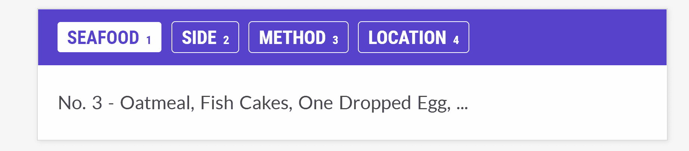
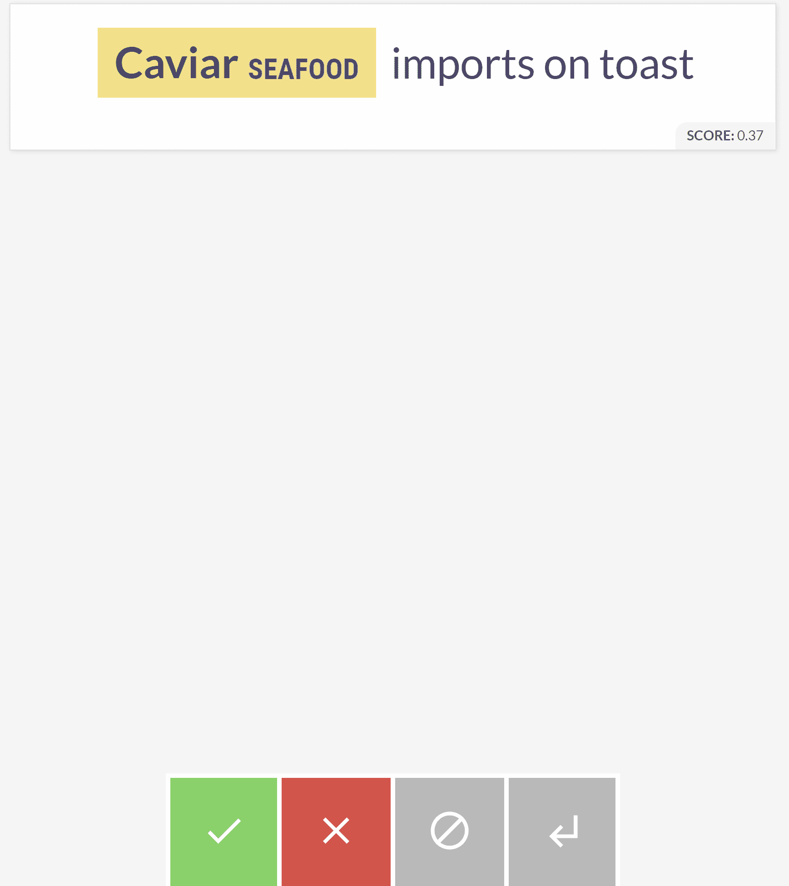
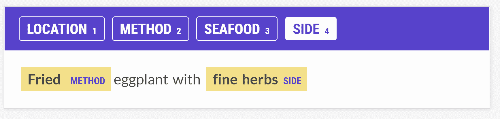

# 用神童训练空间 NER 管道

> 原文：<https://medium.com/analytics-vidhya/training-a-spacy-ner-pipeline-with-prodigy-ca58350cb868?source=collection_archive---------5----------------------->

布鲁诺·马丁斯在 [Unsplash](https://unsplash.com?utm_source=medium&utm_medium=referral) 上的照片

自定义命名实体识别(NER)模型的成功取决于传递给它的数据的质量。然而，为模型提供足够的训练数据示例通常是一个耗时且费力的过程。使用 Prodigy，为构建空间模型的自定义 NER 管道而标记数据的任务变得更快更简单。

据官方[神童网站](https://prodi.gy/docs):

> Prodigy 是一款现代注释工具，用于为机器学习模型创建训练和评估数据。您还可以使用 Prodigy 来帮助您检查和清理数据，进行错误分析，并开发基于规则的系统来与您的统计模型结合使用。

Prodigy 可以轻松标记您的数据，以便在模型训练中使用。对于这个概述，我们将使用一个数据集，其中包含从 19 世纪 40 年代开始的海鲜菜单项。我们将介绍如何使用全新的实体标签向空白空间模型添加定制的 NER 管道，包括:

**海鲜**:与海鲜相关的菜肴，如大比目鱼、鳕鱼或蛤蜊杂烩。

**面**:不是海鲜的菜，帮助我们理解人们通常如何搭配他们选择的海鲜。

**方法**:一道菜的准备方式，如烤、烘或烤。

**位置**:海鲜的来源，帮助我们确定采购模式。

因为我们正在训练一个全新的 NER 管道，我们必须手工注释几百个例子。我们可以使用`ner.manual`菜谱*(菜谱是指各种可用的方法)*来做到这一点。

初始标记的终端命令

在 Prodigy 中手动标记实体

在`ner.manual`命令中几乎没有要解包的项目。该命令和后续命令都是通过命令行运行的。

*   `prodigy`:激活在终端中使用的工具。
*   `ner.manual`:我们要用的配方。
*   `seafood_ents`:我们要保存注释的数据集的名称(第一次运行时为空)。这也被称为黄金集，可以被视为主要或基本事实注释集。
*   `blank:en`:用作基线模型的空间模型。在这种情况下，我们将使用空白模型进行标记化。
*   `data/translated_items.txt`:用于批注的文档。
*   `--label SEAFOOD,SIDE,METHOD,LOCATION`:标签标志启动所需标签的标注过程。

一旦我们有了几百个工作实例，我们就可以进行一个初始的训练周期，并定义一个新的模型。这一过程有助于我们未来的标记任务，因为在训练之后，我们的模型将帮助我们注释新的示例。

初始模型训练的终端命令

*   `train`:我们要用的配方。
*   `ner`:我们要训练的管道组件。
*   `seafood_ents`:在`ner.manual`后创建的黄金套注解。
*   `blank:en`:标记化的相同基线模型。请注意，如果您想要添加或改进当前空间模型，也可以使用预训练模型。
*   `--output seafood_model`:输出标志将模型保存在当前目录下。在这种情况下，我们将保存一个名为`seafood_model`的新模型。

训练并保存初始模型后，我们可以使用`ner.teach` 命令加快贴标过程。`ner.teach`的好处是标记过程变得二元，意味着我们只需要确认或否认模型的标记预测。

为单个标签执行辅助注释的脚本

在新模型的帮助下进行二进制标记

*   `ner.teach`:我们要用于二进制注释的配方(是或否)。
*   `seafood_ents_binary`:二进制标注的新数据集。
*   `seafood_model`:使用`prodigy train`训练的新模型。
*   `data/translated_items.txt`:用于标注更多标签的文档。
*   `--label SEAFOOD`:我们要标注的标签。在这一步中，您可以创建多个标签，但是，一次创建一个标签比一次创建多个标签更有效。这意味着您应该为每个标签运行这个脚本，以最大限度地减少人为错误。

在重新训练我们的模型之前，我们必须将二进制数据集转换为黄金数据集。Prodigy 有两种类型的数据集，白银和黄金。银色数据集类型指的是二进制标签集，而金色数据集指的是完整的基础数据集。让我们使用`ner.silver-to-gold`将我们创建的银数据集与我们在手动标记过程中创建的金数据集合并。

将白银数据转换为黄金数据的脚本

确认和修复模型预测

*   `ner.silver-to-gold`:我们想要用来合并白银和黄金数据的配方。
*   `seafood_ents`:用`ner.manual`创建的黄金数据集。
*   `seafood_ents_binary`:使用`ner.teach`进行二进制标记时产生的银色数据集。
*   `seafood_model`:用`prodigy train`训练的初始定制模型。

使用`ner.silver-to-gold`，Prodigy 界面与`ner.manual`步骤相同。此步骤将手动标注与自动标注相结合，以确认和修复模型的预测。

我们现在可以用黄金组重新训练我们的模型，以改进我们的结果并进一步简化标记。

使用更多注释进行再培训

再培训脚本与之前的参考`prodigy train`脚本几乎相同。不同之处在于，我们将使用在第一次训练迭代中创建的`seafood_model`，而不是引用`blank:en`。

训练定制管道的过程是迭代的，并且永远不会完成。在整个过程中，我们可以观察到，随着为摄取准备更多的训练数据，模型变得更加准确。

**模型结果**

下面是一个自定义 NER 组件如何执行的示例，大约有 1，800 个带标签的示例。经过 10 次训练迭代后，模型的 F 值为 77.329。

单个标签结果

**简要说明**:F 分数，也称为 F1 分数，是模型对数据集预测能力的一种度量。它评估二进制分类系统，将例子分为“正面”或“负面”这个指标类似于准确度，或者正确标记的例子与错误标记的例子。F 分数对等级不平衡更加稳健，这超出了本概述的范围。(来源: [DeepAI](https://deepai.org/machine-learning-glossary-and-terms/f-score) )

非常感谢您阅读这篇关于在您的自然语言处理项目中使用 Prodigy 的概述。Prodigy 文档[为您的模型提供了其他用例，我希望提供各种可用方法的额外概述。](https://prodi.gy/docs)