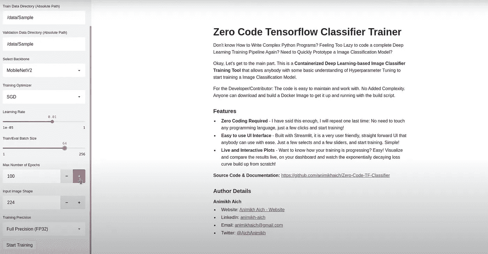
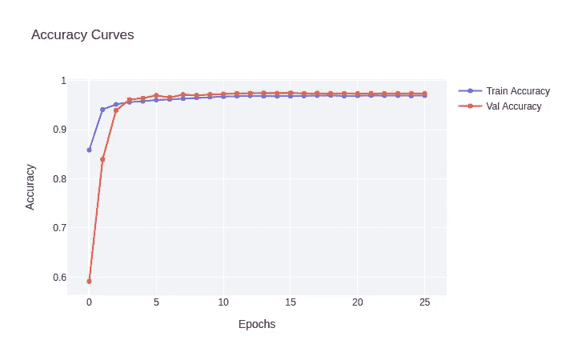
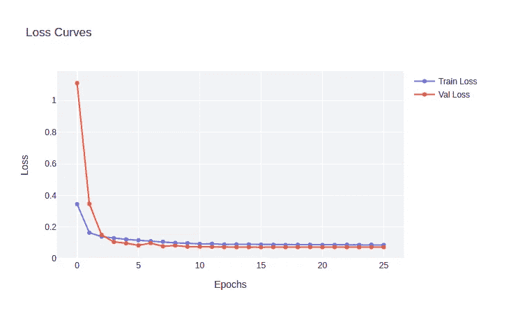

# 用零行代码训练图像分类器

> 原文：<https://medium.com/analytics-vidhya/training-an-image-classifier-in-zero-lines-of-code-b1e68e91cb47?source=collection_archive---------11----------------------->

## 零码张量流图像分类介绍

克里斯里德在 [Unsplash](https://unsplash.com/s/photos/python?utm_source=unsplash&utm_medium=referral&utm_content=creditCopyText) 上的照片

在了解如何在不编写任何代码的情况下训练一个分类器之前，让我们先了解一下创建这个项目背后的动机。

训练图像分类器是一项重要的任务，需要对计算机视觉和 Python 编程有深刻的理解。然而，并不是每个进入计算机视觉领域的人都是 Python 奇才，因此有一个空白需要填补。 [**Zero Code TF 图像分类训练器**](https://github.com/animikhaich/Zero-Code-TF-Classifier) 就是为了填补这一行业空白而设计的，因为它会在引擎盖下为你做所有的重活，你只需要担心应用你的直觉来训练模型。

# 什么是零码 TF 图像分类训练器？

它是使用 TensorFlow 和 Streamlit 构建的 Python 应用程序。
它将 Python 代码抽象化，您需要做的只是在 web 浏览器上设置一些参数，它将负责模型训练部分(查看下图以供参考)。

零代码 TF 图像分类训练器(来源——图片由作者提供)

现在进入最重要的部分，你为什么会想使用这个应用程序？嗯，这么做有多种原因。我在下面列出了一些最令人兴奋的。

# 使用零代码培训器的理由

*   快速原型制作
*   发展直觉
*   初学者友好

## 快速原型制作

无论你是行业资深人士还是试图做出成绩的实习生，训练深度学习模型有时会让人感到不知所措。
您需要关注各种因素，如数据集质量、超参数调整、数据扩充等。所以已经有很多挑战了。
在这种情况下，您不希望增加编写代码来训练模型的工作量。
使用零代码 TF 分类器，您可以快速构建多个模型的原型，并选择性能最佳的模型，而无需编写任何代码

## 发展直觉

作者图片

作者图片

发展直觉是深度学习最困难的方面之一。
零代码 TF 分类器为您训练的每个模型提供了格式良好的图，这使得比较模型变得更加容易，也培养了直觉。
您将更好地了解哪个模型在哪个数据集上表现良好。整个模型分析过程被简化并融入到应用程序中。

## 初学者友好

我提到过你不用写任何代码吗，我想我提到过，但我会再次提到。由于实际上不需要编写任何代码，对于刚进入深度学习领域的人来说，实际理解模型训练的过程并获得深度学习如何工作的基本想法变得很容易。
除此之外，您将使用 GUI 应用程序训练模型，因此即使是非技术背景的人也可以轻松使用该应用程序。

# 特征表

该应用程序充满了激动人心的功能。有些是-

*   支持最先进的模型，如 ResNet、MobileNet、DenseNet 等。
*   支持多个优化器，如 Adam、Adagrad 等。
*   混合精确训练
*   回调，如 LR 衰减和早期停止，以减轻过度拟合
*   内置数据集验证
*   优化的 Tf。最大限度利用 GPU 的数据实现
*   实时训练图表
*   内置图像增强
*   文档化应用

唷，太多了！！！
但这些只是这个应用程序拥有的众多酷功能中的一部分。

如果你想感受一下这个应用程序是如何工作的，那么你可以看看[这个](https://youtu.be/gbuweKMOucc)视频。
演示了如何设置参数、训练、监控和分析您的模型。

我希望你现在已经被卖了。所以现在我将分享如何使用该应用程序的细节。

# 如何使用

你可以前往该项目的 GitHub 页面的[入门](https://github.com/animikhaich/Zero-Code-TF-Classifier#getting-started)部分。
您可以在这里找到设置和使用该应用程序的所有必要信息。

# 信用

这个应用程序是由 [Animikh Aich](http://www.animikh.me/) 开发的，你可以在这里[与他取得联系](https://www.linkedin.com/in/animikh-aich/)
你可以查看[项目页面](https://github.com/animikhaich/Zero-Code-TF-Classifier)了解更多详情。