# 培训和评估

> 原文：<https://medium.com/analytics-vidhya/training-and-evaluation-c9f3894422ac?source=collection_archive---------9----------------------->

这是这个项目的第二阶段。在这个阶段，我将在 Google AutoML Vision 上训练和评估数据集，了解不同因素如何影响模型的输出。这个项目的第一阶段是用阿彭创建和注释数据集，可以在这里找到。

数据集分为四个类别，都在每个类别的 zip 文件夹中。每个数据集被自动分成 80%的训练、10%的验证和 10%的测试。

1.  包含 100 张健康肺的图像和 100 张肺炎患病肺的图像的干净且平衡的数据集。

**分割数据集:**

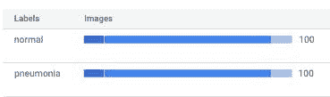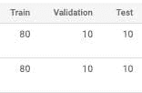

**混乱矩阵:**

该模型在对病变肺的分类上比健康肺更好。

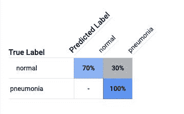

**精度和召回:**

该模型的平均准确率为 98%，使用 0.5 的分数阈值，准确率为 85%，召回率为 85%。

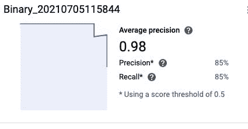

**分数阈值:**

当阈值增加到 1 时，精确度接近 1，而召回率接近 0。

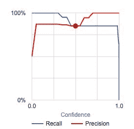

2.干净且不平衡的数据集，包含 100 张健康肺的图像和 300 张肺炎病变肺的图像。

**分割数据集:**

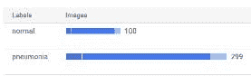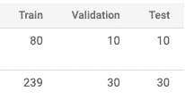

**混淆矩阵:**

该模型在分类健康肺方面有所改进，但在分类患病肺方面没有任何改进。

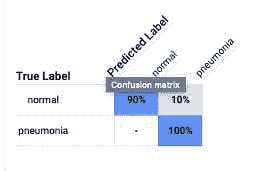

**精度和召回率:**

该模型的平均准确率为 99.6%，使用 0.5 的分数阈值，准确率为 97.5%，召回率为 97.5%。

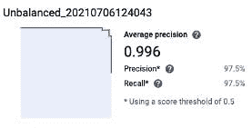

**分数阈值:**

不平衡的数据会引入偏差，从而影响模型的准确性。随着准确率的提高，回忆并没有改变。对比图。

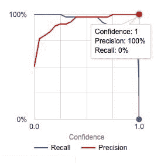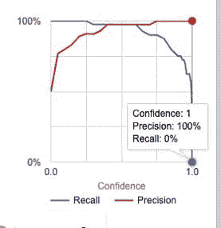

3.脏的和平衡的数据集包含 100 个健康肺的图像和 100 个肺炎病变肺的图像，每个类别的 30%的图像被交换。

**混淆矩阵:**

如下图所示，该模型表现不佳。

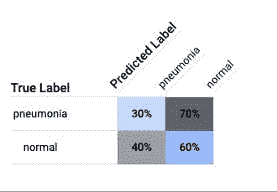

**精度和召回:**

该模型的平均准确率为 47.7%，使用 0.5 的分数阈值，准确率为 45%，召回率为 45%。

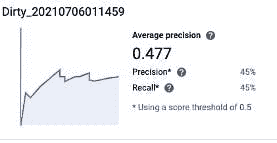

**分数阈值:**

当标签混淆时，模型显然很难在类别中找到模式。该模型在两者中发现了相同的模式，导致了较差的性能。

4.包含 100 幅健康肺图像、100 幅病毒性肺炎肺图像和 100 幅细菌性肺炎肺图像的三类数据集。

**混淆矩阵:**

凭直觉，细菌图和病毒图可能会混淆。但该模型能够准确地对细菌和健康图像中的假阳性病毒性肺炎进行分类。

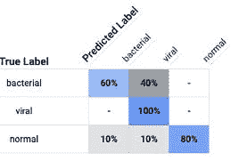

**精度和召回率:**

该模型的平均准确率为 90.5%，使用 0.5 的分数阈值，准确率为 85.19%，召回率为 76.67%。

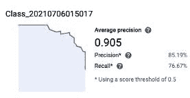

**F1 得分:**

F1 的分数固定在 80.701%

# 结论:

数据集中的异常会影响模型的性能。总体而言，表现最好的模型是干净且平衡的模型和干净且不平衡的模型。这一阶段的报告可以在我的[回购](https://github.com/Nwosu-Ihueze/AI_for_PM/tree/main/Build_Model)中找到，你可以在 [LinkedIn](https://www.linkedin.com/in/rosemary-nwosu-ihueze/) 上与我联系。