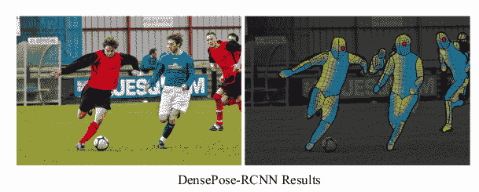

# 在没有密集标记的情况下训练高质量模型

> 原文：<https://medium.com/analytics-vidhya/training-high-quality-models-without-densepose-markup-90476757a3da?source=collection_archive---------14----------------------->

有没有可能在没有相应的 DensePose 标记的情况下，训练一个高质量的模型，从一张照片预测动物体表的 3D 坐标？答案是肯定的！

来自脸书 AI 的研究人员在 CVPR 2020 大会上介绍了这个问题。

# 关于密集任务

早些时候，这些研究人员向科学界展示了一个新的 DensePose-COCO 数据集和一个处理这些数据的神经网络架构([文章](https://arxiv.org/abs/1802.00434))。该数据集由来自 COCO 2014 的图像中的人的特别组装的标记组成。

# 关于数据集的更多信息

数据包括:

*   照片中人物的边框，
*   像素完美的前景-背景遮罩，
*   32x 身体部位的分割，在上面的面具里面，
*   以及每张照片的一大组三元组 ***(c，u，v)*** ，其中 ***c*** 是身体部分的索引， ***u，v*** 是身体部分内的测地线坐标。

它们组装如下:

任务是确定人类图像上随机投掷的点(在分割掩模内)和 3D 人类模型的六个预渲染图像上的点之间的对应关系，即 SMPL 模型在不同角度的六个 2D 投影上的点。得到这个标记后，研究人员恢复了人体表面这些点的 ***(c，u，v)*** 坐标。

根据这个原理，COCO 2014 数据集内的 **5 万张**人物图片，收集了**500 万个**点。

这种数据允许我们建立一个类似 Mask-RCNN 的模型，用于从图像中预测具有 3D 坐标的掩模。

这个决定值得注意的是后续的着装。由于神经网络允许你得到一个人的模型，你可以在这个模型上放一个衣服的模型。下面的例子:

视频格式的可视化可以在[这里](https://www.youtube.com/watch?v=Dhkd_bAwwMc)找到。

# 现在说说猴子

在这篇新论文中，研究人员建议使用 DensePose-COCO 和 COCO 数据集的标记来解决预测动物表面三维坐标的类似问题。然而，建议*不要根据上述算法标记动物的图像*。有人认为，你不仅可以将现有的标记用于黑猩猩，还可以用于任何其他在解剖学上与人类不太相似的动物。

通过这种方式，研究人员成功实现了公制密度平均精度等于 34.9 的质量。在标记了一类人的数据后，第一篇文章中的模型显示结果= 46.8，考虑了度量从 0 到 100 变化的事实。知识转移的好结果？

为了衡量新模型的质量，有必要标记一定数量的黑猩猩照片(就像对人类做的一样)。为此，提出了一种方法来恢复人类模型的 SMPL 点和非常详细的艺术 3D 黑猩猩模型之间的对应关系。

这不仅使得收集必要的评估标记成为可能，而且也不会显著地改变度量模型质量的代码。

# 给我看看代码！

像通常情况下由著名的科学团体如公平发表的文章一样，它们伴随着一个代码。对于这两篇文章，都可以在 [GitHub](https://github.com/facebookresearch/detectron2/tree/master/projects/DensePose) 上的官方 detectron2 库中找到。

来自第一篇文章的早期代码，使用基于 Caffe2 的 detectron 的第一个版本编写，也可以在 GitHub 上找到。