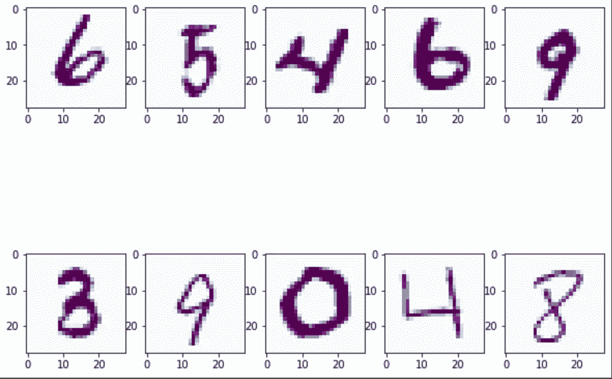
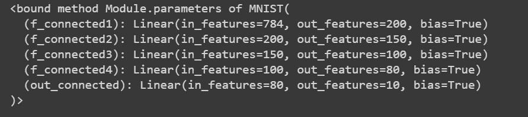
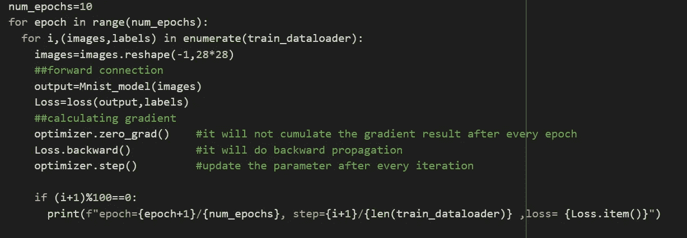
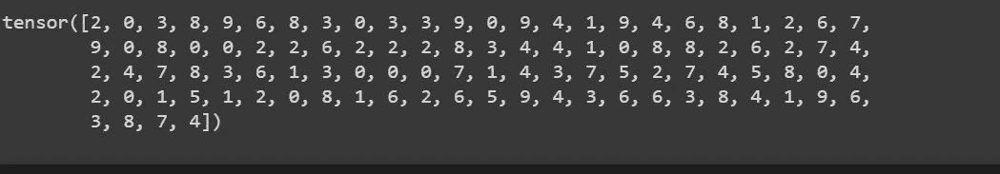

# 使用 Pytorch 的 MNIST 手写数字识别

> 原文：<https://medium.com/analytics-vidhya/training-mnist-handwritten-digit-data-using-pytorch-5513bf4614fb?source=collection_archive---------0----------------------->


> **数据概述**

MNIST 数据集由 60，000 幅手写数字图像组成。其中每个图像的大小为 28×28。在这里，MNIST 代表修改后的国家标准与技术研究所。它包括从 0 到 9 的 10 个不同的类别。这意味着我们要处理的问题是多类分类问题。在这个博客上，你将了解 Pytorch 的基本实现。

**步骤 1 :-导入必要的库&参数初始化**

```
**import torch
import torchvision
import numpy as np
import pandas as pd
import matplotlib.pyplot as plt
import torch.nn as nn
from torchvision.transforms import transforms
import torch.nn.functional as F**
```

初始化参数

```
input_size=784   #28X28 pixel of image
hidden_size1=200 #size of 1st hidden layer(number of perceptron)
hidden_size2=150 #size of second hidden layer
hidden_size3=100 #size of third hidden layer
hidden_size=80   #size of fourth hidden layer
output =10       #output layer
bach_size=100
lr_rate=0.01 
```

**步骤 2:-使用 Pytorch 数据集和数据加载器加载数据集**

MNIST 数据集已经存在于火炬视觉库中。

```
train_dataset=torchvision.datasets.MNIST('/content',train=True,trans
              forms=transforms.ToTensor(),download=True)
```

1.  “/content”:保存/下载数据的目录…
2.  train = True:-数据集将被用作进一步操作的训练示例。
3.  转变。ToTensor():将图像数据集转换为张量………

4.download=True:-将从 Pytorch 集合中下载数据

```
test_dataset=torchvision.datasets.MNIST('/content',train=False,     
              transforms=transforms.ToTensor(),download=False)
```

将列车数据加载器和测试数据加载器用于进一步操作。

```
train_dataloader=torch.utils.data.DataLoader(dataset=train_dataset, 
                                  batch_size=100,shuffle=True)
train_dataloader=torch.utils.data.DataLoader(dataset=test_dataset, 
                                  batch_size=100,shuffle=True)
```

在这里，我们已经通过使用数据加载器解决了数据过载问题，我们将只从大型数据集中传递固定的一批数据。

让我们看看已经批量传递的数据 data 的形状

```
data=iter(train_dataloader)
samples,labels=next(data)
print(f"number of samples{samples.shape}")
print(f"number of labels {labels.shape}")[out]>>shape of samplestorch.Size([100, 1, 28, 28])
       shape of labels torch.Size([100])
```

**步骤 3:-打印数据集的图像**

```
plt.figure(figsize=(10,8))
for i in range(10):
    plt.subplot(2,5,i+1)
    plt.imshow(samples[i][0],cmap='BuPu')
plt.show()
```



图像输出

**步骤 4:-定义培训管道**

培训管道设计将包括以下三个步骤:

1.  用激活函数取输入尺寸、隐尺寸和输出尺寸设计神经网络
2.  为特定问题构建损失和优化函数
3.  训练循环包括三个步骤:- a .正向传递:- a .给出预测 b .反向传递:-梯度和 c .权重更新

```
class MNIST(nn.Module):
    def __init__(self,input_size,hidden_size1,hidden_size2
                       ,hidden_size3,hidden_size,output):
        super(MNist,self).__init__()
        self.f_connected1=nn.Linear(input_size,hidden_size1)
        self.f_connected2=nn.Linear(hidden_size1,hidden_size2)
        self.f_connected3=nn.Linear(hidden_size2,hidden_size3)
        self.f_connected4=nn.Linear(hidden_size3,hidden_size)
        self.out_connected=nn.Linear(hidden_size,output)def forward(self,x):
        out=F.relu(self.f_connected1(x)) 
        out=F.relu(self.f_connected2(out))
        out=F.relu(self.f_connected3(out))
        out=F.relu(self.f_connected4(out))
        out=self.out_connected(out)
        return out
```

`nn.module`:-py torch 中的`nn.module`帮助我们创建人工神经网络。`nn.Linear` 使特征和神经元之间的线性连接& `Torch.nn.functional`模块由所有的激活函数和输出函数组成(例如:- relu，leaky relu，softmax，sigmoid 等。)不，我们已经成功地建立了神经网络和正向传递。

```
Mnist_model=MNIST(input_size,hidden_size1,hidden_size2
                       ,hidden_size3,hidden_size,output)
#calling the object that has been created inside MNIST class
```

打印所有用于创建神经网络的参数。权值和偏差被认为是神经网络的参数。

```
print(Mnist_model.paramaters)
```



图:结果

模型的构造损耗及优化

```
loss=nn.CrossEntropyLoss()
optimizer=torch.optim.Adam(Mnist_model.parameters(),lr=lr_rate)
```

现在我们将建立一个训练循环，它包括预测结果的前向传递，梯度的后向传递，最后权重将被更新。

由于我们在上面已经看到了训练样本的形状，即[100，1，28，28]，我们需要将样本形状转换为[100，28*28]。因此，我们的第一步将是重塑样本的大小，然后我们将再次进行进一步的训练过程。



训练图像

让我们在验证数据集上检查模型的准确性。在我们的例子中，验证数据集应该是 test_dataloader。

```
with torch.no_grad():
    n_correct=0
    n_samples=0
    for images,labels in test_dataloader:
        images=images.reshape(-1,784)
        output=Mnist_model(images)
        labels=labels
        _,prediction=torch.max(output,1)
        n_samples=labels.shape[0]
        n_correct=(prediction==labels).sum().item()
   accuracy=(n_correct/n_samples)*100
```

在这个模型上，我在验证集上获得了 97%的准确率。

让我们预测一下结果

```
predicted=[]
with torch.no_grad():
    n_correct=0
    n_samples=0
    for images,labels in test_dataloader:
        images=images.reshape(-1,784)
        output=Mnist_model(images) #applying the model we have built
        labels=labels
        _,prediction=torch.max(output,1)
        predicted.append(prediction)
print(prediction)
```



决赛成绩

**结论:-**

希望你喜欢这个博客，请给我们宝贵的反馈，以便进一步改进。这个博客的灵感来自 python 工程师视频，请不要错过观看视频，以便更好地理解。不断探索不断学习……..