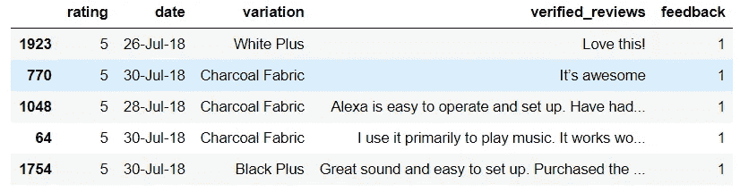
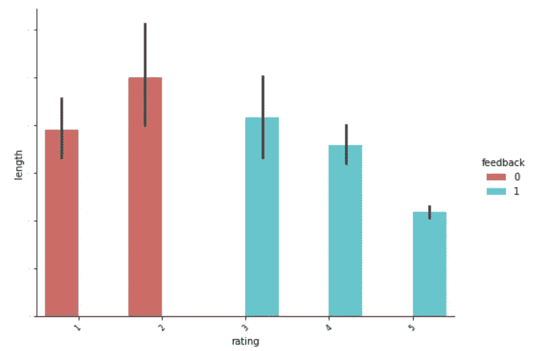
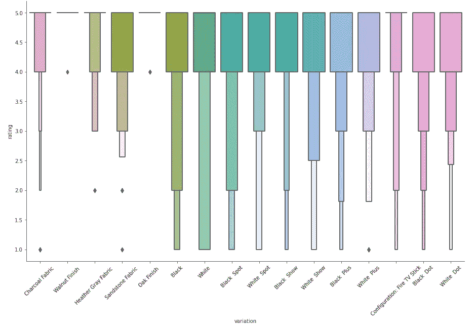
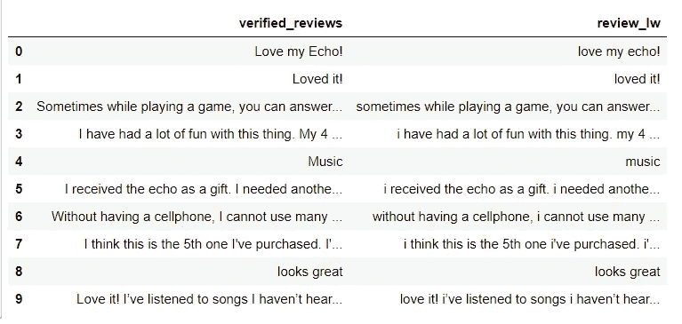
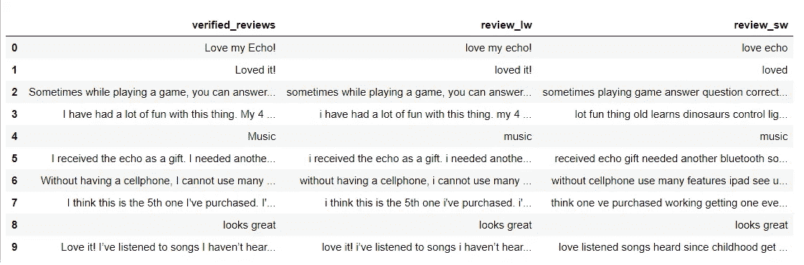
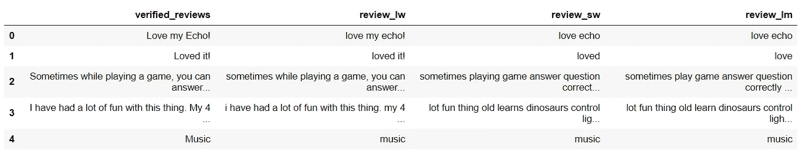
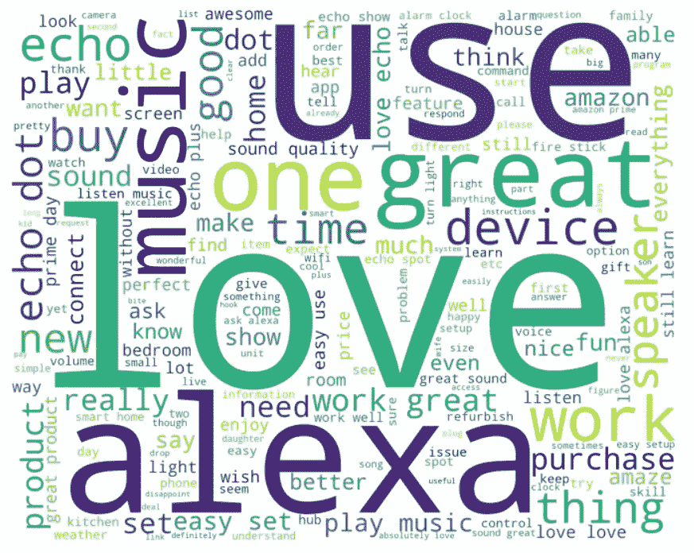
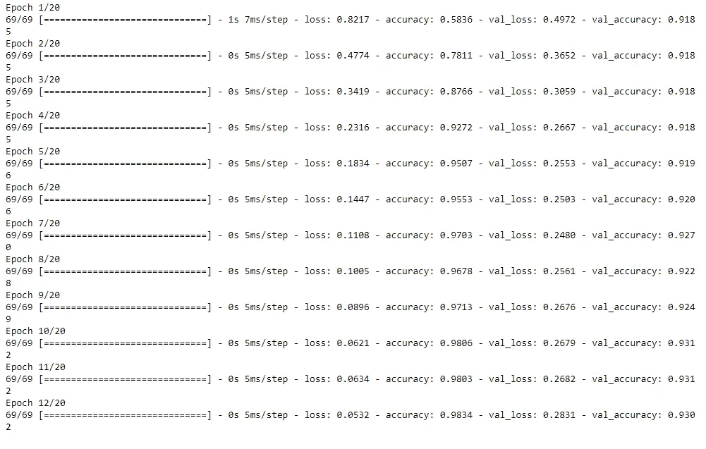
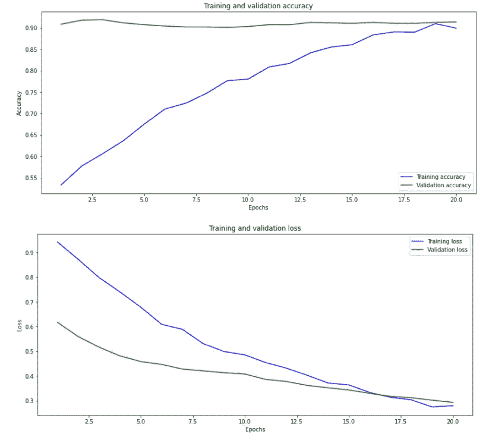
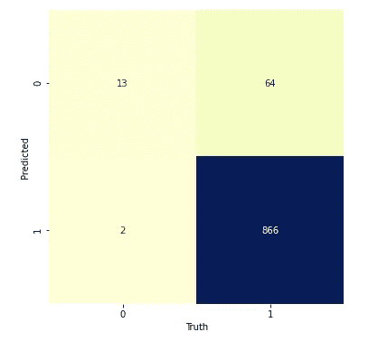

# 用于情感分析的训练神经网络

> 原文：<https://medium.com/analytics-vidhya/training-neural-network-for-sentiment-analysis-57cbe85442ab?source=collection_archive---------11----------------------->

## 基于客户评论，逐步预测对亚马逊 Alexa 产品的看法(正面或负面)。

图片由[凯文·金](https://pixabay.com/users/kevinking-289243/?utm_source=link-attribution&utm_medium=referral&utm_campaign=image&utm_content=423857)从[皮克斯拜](https://pixabay.com/?utm_source=link-attribution&utm_medium=referral&utm_campaign=image&utm_content=423857)拍摄

我一直着迷于这样一个想法，一台机器如何能够读取顾客给出的**评论**并**将**分类为**正面**或**负面**以及许多其他问题，比如-

## 清洗数据需要什么样的预处理才能让机器看得懂？

> 如何删除标点符号和 HTML 标签？？
> 
> 小写和大写字母的混合会混淆机器学习算法吗？
> 
> 如何删除不增加任何价值的重复单词，如“a，an，and，the”。？
> 
> 如何移除表情符号*😅？*

当我解决一个'**亚马逊** **Alexa 情绪分析问题**时，所有上述问题都得到了回答，该问题根据使用过 **Alexa** 的特定变体(如*炭布、黑点、胡桃木饰面*)的各种客户给出的**评论**来预测情绪是**正面**还是**负面**

# 对我有什么好处？

情绪分析问题的端到端解决方案，即根据自由文本**评论**或**亚马逊 Alexa** 的客户反馈，预测情绪是**正面**还是**负面**

> 完整的 Python 代码可以在我的 [**GitHub**](https://github.com/rahul-pednekar/NLP-Sentiment-Analysis-Alexa/blob/main/nlp-alexa-with-93-accuracy.ipynb) 资源库中找到。

# 要使用哪个数据集？

我们将使用来自 [**Kaggle**](https://www.kaggle.com/) 的**亚马逊 Alexa 评论**数据集，可以从 [**这里**](https://www.kaggle.com/sid321axn/amazon-alexa-reviews) 下载

## 关于数据

> 该数据集包括近 3000 条亚马逊客户评论(输入文本)、星级、评论日期、各种亚马逊 Alexa 产品的变体和反馈，如 Alexa Echo、Echo dots、Alexa Firesticks 等。

# 先看数据

总共有 5 列—

1.  等级:唯一值为(1，2，3，4，5) ' **1'** 最低等级，' **5'** 最高等级
2.  日期:给出反馈的日期
3.  变体:有 16 个唯一值。几个例子:白色加，木炭织物等
4.  已核实 _ 评论:客户在自由文本中给出的实际**评论**——正面或负面
5.  反馈(**预测**的目标变量) :唯一值‘1’(**快乐客户**)或‘0’(**悲伤客户**)

**总结** —基于**‘已验证 _ 评论’**列，我们需要预测**反馈**列(即反馈是**‘1’**(即正面)还是**0**’(即负面))

# 方法:

让我们把这个问题分成 4 个简单的步骤

1.  可视化数据并得出推论(EDA)
2.  数据清理
3.  模型建立和预测
4.  总结和总结

**我的首选工具** : Python 3.8 和 Jupyter 笔记本

## 所以让我们开始吧！！

# 第一步:可视化数据并得出推论(EDA)

*   让我们计算每篇评论的长度，并做出推论

评分=5 的评论数量最高，长度为 1955(0-199)

*   *探究* ***长度*******评审*** *如何随着* ***评级*** *与* ***色相=反馈****

**

*上图证实了-*

> *反馈=1 对应于等级 3、4、5(分别为好、更好、最好)*
> 
> *反馈=0 对应于评分 1，2(分别为最差、差)*
> 
> *' **feedback=0** '的平均长度高于' **feedback=1** ' ( **不满意的人比满意的人更有可能写出冗长的评论*😃*** )*
> 
> *与其他人(评分 1-4)相比，高度满意的人(评分=5)写得最少*
> 
> *评分= 2 的产品评论最长*

*   **探究* ***长度******回顾*** *如何根据* ***变化*** *与* ***色相=反馈****

**

> *一般来说，反馈=0(即负面评价)的评价时间长度要比反馈=1(即正面评价)的长*
> 
> *如果反馈=0，则“黑色秀”、“黑色加”和“白色加”的审核时间更长*
> 
> *对于“胡桃木饰面”和“橡木饰面”，反馈=0*

*   *让我们通过评级来确定最佳和最差产品*

**

> *最佳产品:胡桃木饰面和橡木饰面只有 5 分*
> 
> *最差产品:白色，因为等级 1、2 和 3 的密度更大*

# *步骤 2:数据清理*

> *让我们清理数据(例如，转换成小写，删除标点符号，HTML 标签等)*

*   *将所有评论转换为小写*

**

*大写到小写转换*

*   *使用 BeautifulSoup 库删除 HTML 标签*

**

*   *删除停用词和标点符号*

## *什么是停用词？*

> *停用词是最常见的词(“the”、“is”、“in”、“for”、“where”、“when”、“to”、“at”等)。)在任何自然语言中。为了分析文本数据和构建自然语言处理模型，这些停用词可能不会给文档的含义增加太多价值，因此需要被移除。*

**

*示例—从第 3 行中，删除了“a”*

*   *让我们对数据进行词汇化*

## *什么是词汇化？*

> **把任何一种词转换成它的基根模式的方法叫做词元化。**
> 
> *词汇化的例子:*
> 
> *1.玩:玩
> 2。爱过:爱
> 3。更好:好*

**

*例如:第 2 行—“loved”变成了“love”*

> *这就是清理数据所需的全部内容。让我们用干净的数据来可视化单词云*

## *好评如潮的 Wordcloud*

**

*我们可以看到积极的词汇，如爱，伟大，真棒，易于使用，完美*

## *带有负面评论的 Wordcloud*

**

*我们可以用消极的词，比如失望、可怜、糟糕*

# *第三步:模型建立和预测*

**

*图片来自 [Pixabay](https://pixabay.com/?utm_source=link-attribution&utm_medium=referral&utm_campaign=image&utm_content=3829057) 的 [Gerd Altmann](https://pixabay.com/users/geralt-9301/?utm_source=link-attribution&utm_medium=referral&utm_campaign=image&utm_content=3829057)*

> *正面评价总数:2893，负面评价总数:257*
> 
> ***准备训练和测试数据集***
> 
> *反馈=1:总共 2893 条评论*
> 
> *我们可以将第一个 2025(70%)用于训练，剩下的 868(30%)用于测试。即 2893=2025+868*
> 
> *反馈=0:共 257 条评论*
> 
> *我们可以将前 180(70%)用于训练，剩余的 77(30%)用于测试，即 257=180+77*

## *用 Tensorflow 和 Keras 构建深度学习模型*

*   *将数据符号化*

*将数据符号化*

*   *准备深度学习模型*

**

*图片由 [Ahmed Gad](https://pixabay.com/users/ahmedgad-9403351/?utm_source=link-attribution&utm_medium=referral&utm_campaign=image&utm_content=3637503) 提供，来自 [Pixabay](https://pixabay.com/?utm_source=link-attribution&utm_medium=referral&utm_campaign=image&utm_content=3637503)*

> *让我们使用**神经网络**的第一层中的 **256 个神经元**和第二层中的 **128 个神经元**指定 input_shape =总字数
> 我们将使用激活函数作为 **relu**
> 以及两层中的**批处理规范化函数**
> 添加一个**丢弃层**以丢弃第一层中 50%的神经元和第二层中 50%的神经元*

*   *编译模型*

> *由于这是一个二进制分类问题，我们用“二进制交叉熵”作为损失函数*
> 
> *作为优化者的亚当*
> 
> *准确性评估指标*

*   *拟合模型并运行 20 个时期*

*   *评估模型*

**

*模型预测的验证准确率为 93%*

*   *让我们绘制培训/验证准确性图表和损失图表*

**

*   *让我们评估混淆矩阵*

**

*混淆矩阵*

# *第 4 步:结论和要点*

*   *模型达到了 **93%** 的预测精度*
*   *人工神经网络能够正确地预测 868 个正面评论中 866 个，错误地预测 2 个评论*
*   *然而，它只能正确预测 77 篇评论中的 13 篇负面评论，而错误预测 64 篇评论*
*   *主要原因是我们的数据不平衡，即 **92%** (2893/3150)的评论是正面的，而 **8%** (257/3150)的评论是负面的*
*   *使用过采样和欠采样技术，如 **SMOTE** (合成少数过采样技术)或**随机过/欠采样**，可以进一步提高精度*

*这是我们讨论过的内容*

1.  *如何使用 NLTK 工具包清理自由文本数据*
2.  *如何标记数据*
3.  *如何建立一个简单的人工神经网络*
4.  *如何预测和验证预测*

*干杯，感谢阅读！😃*

*您可以在我的 Github 资源库中找到完整的 Python 代码。*

* [## Rahul-pednekar/NLP-情感分析-Alexa

### 用于情感分析的训练神经网络

github.com](https://github.com/rahul-pednekar/NLP-Sentiment-Analysis-Alexa/) 

> *如有任何疑问，请随时联系我*[***LinkedIn***](https://www.linkedin.com/in/pednekar-rahul/)*&我很乐意提供支持。*

*跟我连线上*[*LinkedIn*](https://www.linkedin.com/in/pednekar-rahul/)*[*中*](/@rahul.pednekar) *和* [*Kaggle*](https://www.kaggle.com/rahulpednekar)**