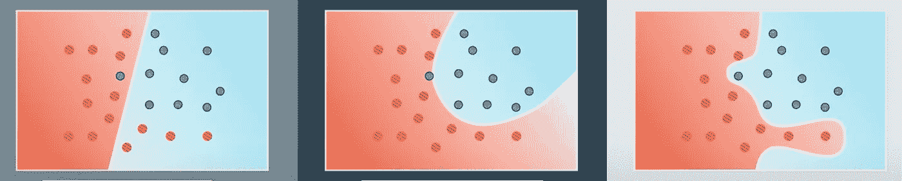

# 为什么训练/验证/测试分割有助于避免过度拟合— 04

> 原文：<https://medium.com/analytics-vidhya/training-neural-networks-for-dummies-04-pt-1-train-validate-test-split-9b1141496c63?source=collection_archive---------7----------------------->

# 概述

在以前的文章中，我们展示了如何将几个感知器连接在一起是一种找到非线性决策边界的强大方法。

但是我们如何确保我们找到的决策边界在看不见的数据上工作良好呢？

# 过度拟合和欠拟合

为了详细说明上面提出的问题，考虑以下模型。我们认为哪个最有可能成功分类未来的数据点(那些目前不在我们的数据集中的数据点)？

来源: [Udacity](https://classroom.udacity.com/courses/ud188/lessons/b4ca7aaa-b346-43b1-ae7d-20d27b2eab65/concepts/207e59e5-4542-4bf3-9acf-2c67c22525e8)

我们知道左边的模型过于简单，这样的模型可以说是“不符合”数据。在 MLPs 的上下文中，这意味着我们的架构不够复杂(我们在隐藏层中没有足够的感知器和/或层来创建足够复杂的模型)。

如果我们引入任何新数据，右边的模型看起来会很糟糕。**记住这些应该是预测模型。**本练习的要点是使用我们标记的数据点找出一个模型，该模型将采用未标记的数据点并对其进行正确分类。因此，虽然右边的模型平均损失最低，但它不是最好的模型。

一个过度符合数据的模型就像一个学生刚刚记住了一组过去试卷的所有答案，但却没有学到任何潜在的概念。他们总是在过去的试卷上得 100 分，但在一次看不见的考试中表现很差。

中间的模型似乎是“金发女孩”模型，我们在其中找到了复杂性*和通用性*的良好平衡。这是我们的目标，我们希望在训练后确保我们的模型足够复杂，但也能很好地处理看不见的数据点。我们现在将详细说明我们可以采取的步骤，以增加这种情况发生的可能性。

# 训练/验证/测试分割我们的数据集

所以回想一下上一篇文章，我们讨论这些神经网络是如何训练的那部分。

**这里有一个快速总结:**

1.  我们获取数据集中的每个数据点，并在模型中运行。这是向前传球。
2.  我们通过损失函数计算损失，然后使用梯度下降或其他优化器。这告诉我们应该如何更新我们的模型的权重和偏差，以使它为该数据点提供更准确的输出。
3.  我们对数据集中的所有数据点都这样做，这是一个时期。然后，我们通过平均所有建议的变化来更新权重和偏差。这降低了我们整个数据集的平均损失。

如果我们在几个时期内不断重复上述内容，我们最终的损失应该会越来越低。但是我们需要一些方法来检查模型是否同时过度适合我们的数据集。这就是为什么在实践中，我们将数据集分成 *3 个子集*:

**训练集**——这是网络在训练过程中会看到的总数据的子集(以上循环)，通常占总数据的 70%。

**验证集** -这是总数据的子集，将用于在训练期间测试模型性能，通常占总数据的 10%。

**测试集** -这是用于测试最终模型性能的全部数据的子集，通常占全部数据的 20%。

让我们用之前学生为考试而学习的类比来分解每一组。

训练集是习题集，学生被分配去学习概念，更好地解决期末考试中可能出现的问题。对于我们的模型，训练集是它用来实际更新其权重和偏差以减少损失的数据。它从这个数据集中学习将什么值分配给它的参数，以便它可以保持低损失。

验证数据集将是过去的论文，学生可以用来测试他们对基础概念的知识。如果学生只是记住了问题单的答案，他们会做得很差。如果他们真的学会了这些概念，那么他们会做得很好。对于我们的模型，我们在每个时期之后(在训练数据集通过模型的每个完整过程之后)在验证数据集上测试它的性能。**我们不会根据验证损失**更新模型的权重和偏差。我们只是用这种方法来衡量它在看不见的数据上的表现。我们希望随着培训的继续，验证损失会减少。如果我们看到验证损失增加，我们知道我们现在过度适应训练数据。

最后一个数据集是训练集，这是学生必须参加的期末考试，以获得这门课程的分数。对于我们的模型，这是我们用来测试其真实性能的最终数据集。**该数据集只能使用一次。**如果事实证明模型性能不佳，我们必须重新经历训练、验证和测试新模型的整个过程。

## 验证与测试

好了，我们可以通过保留部分数据并在训练期间验证我们的模型来标记过度拟合。那么，为什么我们需要第三组测试集呢？

测试集被用作最终数据集来测试我们最终训练的模型的准确性。那么，是什么阻止我们仅仅使用验证数据集来测试我们的最终模型呢？毕竟，模型没有使用这个数据集来更新它的权重和偏差，所以就模型而言，它是看不见的数据。

在实践中，我们实际上训练了一堆不同的模型。这些模型可能有不同的体系结构，或者它们可能只是有一组不同的超参数(下一篇文章将详细介绍)。重点是，我们通常会训练一堆候选模型，我们会挑选具有最低**验证损失**的模型作为最终模型。我们仍然需要确定我们的改变会导致一个真正更好的模型，而不是一个恰好适合验证集的模型。

让我们进一步分解一下。假设您正在训练一个模型来对 MNIST 数据集中的一些数字进行分类。您已经将数据分解为培训和验证。您已经选择了模型的架构和一组超级参数。现在，您训练模型，并在每个时期后，在测试集上测试它。随着训练的继续，您将看到验证损失的减少。太好了！在某一点上，你的确认损失要么保持平稳，要么开始回升。此时你想停止训练。现在你去想，也许如果只是增加另一个隐藏层或增加学习率，我可以得到一个较低的最终损失。所以你回去，对模型做一些调整，重新训练和测试。你一直这样做，直到最终你的最终确认损失非常低，并且你对结果感到满意。

现在，上述情况的问题是，通过在最后进入，查看验证损失，然后对我们的模型进行更改，我们已经引入了**人类偏见**。我们已经手动修改了我们的模型，以优化特定的数据集。我们还没有看到在验证损失上取得的收益是由于一个更好的模型还是由于我们的模型在数据集上得到优化。**这就是**的测试集。这是为了对我们的模型进行公正的评估。如果它在我们的测试集上表现不佳，我们只需像以前一样重新进行训练、验证和测试。但是现在我们在一个新的数据集上测试。通过这种方式，我们可以确保我们的模型性能确实在提高，而不仅仅是在一组特定的数据上变得更加优化。

# 摘要

在本文中，我们介绍了训练、验证和测试分割方法背后的推理，以避免过度拟合。这是确保训练好的模型推广到看不见的数据的好方法。这是训练神经网络系列的第一篇文章。下一篇文章将介绍如何处理班级失衡，最后一篇文章将介绍不同类型的超参数以及它们如何影响训练。