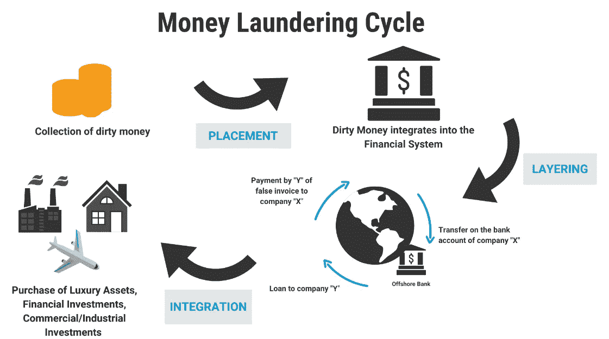
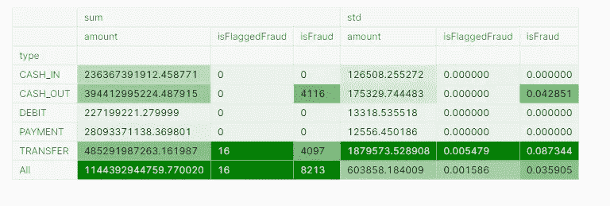
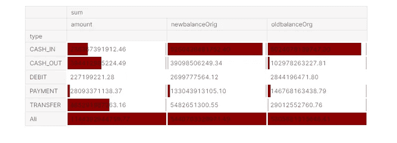
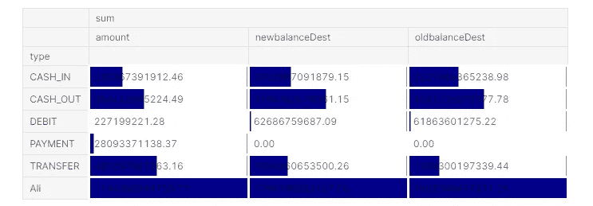
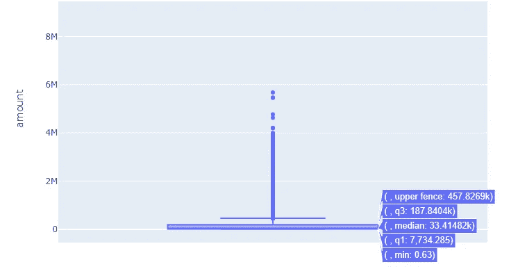
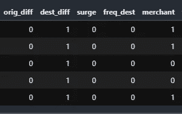
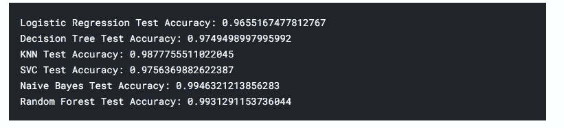
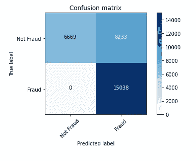
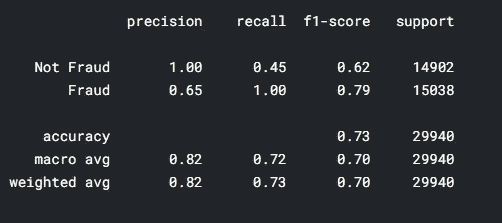
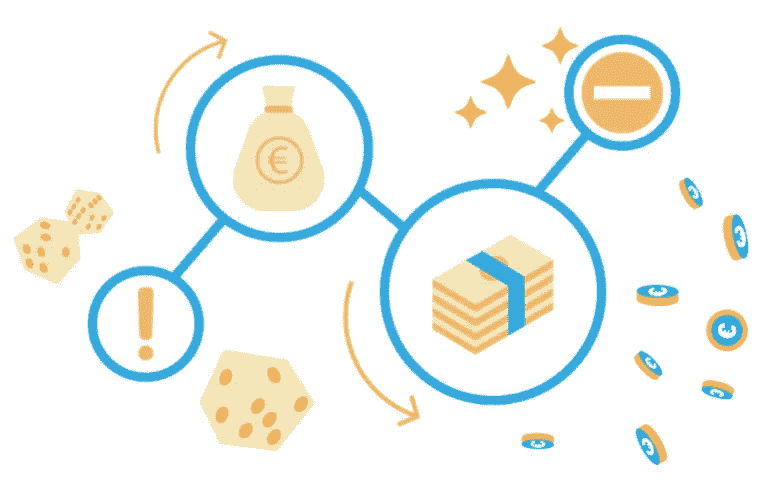

# 交易欺诈检测🕵️‍♂️|自动洗钱警报

> 原文：<https://medium.com/analytics-vidhya/transaction-fraud-detection-%EF%B8%8F-%EF%B8%8F-automating-money-laundering-alerts-8d7d265befa9?source=collection_archive---------4----------------------->

自从互联网出现以来，数字革命已经兴起，并且已经渗透到我们生活的方方面面。最重要的数字革命之一发生在金融系统，尤其是以数字方式向世界各地的人进行货币交易。数字交易已经成为日常生活的一部分，如在线购买产品、给朋友寄钱、在银行存款、投资等。他们从中得到了很多好处，这也为欺诈活动铺平了道路。人们开始使用数字货币交易媒介来洗钱，并使这些钱看起来像是来自合法来源。

# 💰了解流程中的各个阶段

洗钱过程总共有三个阶段，帮助洗钱者清洗他们的脏钱。

1.  **投放:**脏钱融入金融体系，资金被投放到金融工具中。
2.  **分层:**进行复杂的金融交易，掩盖非法来源。 ***这是交易欺诈发生的阶段，因为洗钱者会进行大量电汇，并创建一个复杂的循环，在这个循环中很难识别资金的来源。***
3.  **整合:**由于资金来源已被隐藏，洗钱者会将资金重新投入经济，用于购买奢侈品、金融和商业投资。

# 反洗钱行业的☠️问题

银行和金融行业遵循 OFAC 准则和 FATF 建议提供反洗钱支持。这些程序用于识别和阻止系统中的欺诈活动。系统中实施了一种基于规则的算法，以便在发现任何欺诈交易时发出警报。分析师随后会对这些警报进行调查，并决定该交易是欺诈(真阳性)还是非欺诈(假阳性)。在当前的场景中，算法给出了许多假阳性警报，调查人员在规定的时间内关闭这些警报。由于存在大量误报警报，因此需要投入更多时间来清除警报，并且组织需要大量人力资源来调查这些警报。因此，大量的成本和时间被浪费，只是因为基于规则的算法不够智能，无法识别非欺诈性交易。

# 💡解决办法

例如，基于规则的算法可能触发丈夫和妻子之间的高价值交易。在这里，该算法将各方视为客户 A 和客户 B，并且不理解交易的潜在动机以及它们之间的关系。此外，基于规则的算法是固定的，不能学习和适应趋势。洗钱者正试图避免陷入这种算法，并随机应变他们的策略，以避免被抓住。因此，当务之急是，系统也应该变得先进，以学习交易中的欺诈模式，并仅触发实际的欺诈交易，避免误报命中。这可以通过用过去的数据训练机器学习模型来实现，这些数据包含交易细节，算法是否将其标记为欺诈，以及调查者对这些标记的警报的结果(实际上是否是欺诈)。

# 资料组

由于数据隐私，交易中缺乏公开可用的数据集。因此，我们在这里使用 Paysim 的模拟数据，该数据基于从一个非洲国家实施的移动货币服务的一个月财务日志中提取的真实交易样本来模拟移动货币交易。它使用来自私有数据集的聚合数据来生成类似于正常交易操作的合成数据集，并注入恶意行为，以便稍后评估欺诈检测方法的性能。

在这里找到数据集

## **数据集描述**

**1.步长-映射真实世界中的时间单位。在这种情况下，1 步需要 1 小时的时间。总步骤 744 (30 天模拟)。
2。类型—现金输入、现金输出、借记、支付和转账。
3。金额—以本地货币表示的交易金额。
4。nameOrig —开始交易的客户
5。oldbalanceOrg —交易前的初始余额
6。newbalanceOrig —交易后的新余额
7。具名客户——接受交易的客户
8。旧余额测试—交易前的初始余额接收者。请注意，没有以 M(商家)开头的客户信息。
9。newbalanceDest —交易后新的余额接收方。请注意，没有以 M(商家)开头的客户信息。
10。isFraud —这是模拟中欺诈代理进行的交易。在这个特定的数据集中，代理的欺诈行为旨在通过控制或客户账户来获利，并试图通过转移到另一个账户来清空资金，然后从系统中套现。
11。isFlaggedFraud——这种商业模式旨在控制从一个账户到另一个账户的大规模转账，并标记非法企图。此数据集中的非法尝试是指试图在单次交易中转移超过 200.000 英镑的金额。**

# **📋数据透视表分析**

****

**支点 1:实际欺诈与标记的欺诈**

****🔍推论:**
根据当前基于规则的算法，在 cash_out 的欺诈交易中没有标记，这是反洗钱系统的一个严重问题。此外，只有 16 笔交易被标记为欺诈，而大约 4，000 笔交易实际上是欺诈。我们现在的任务是建立一个有效的算法来降低让欺诈交易畅通无阻的风险**

****

**透视 2:原始帐户详细信息**

****🔍推论:**
从表中我们可以了解到，大多数客户使用该系统进行转账，而我们的支付数据相对较少。注意到新旧天平之间的差异也很有趣，因为它告诉了我们一些故事。这里我们只有原始账户和现金余额的图像，除了 cash_in 之外的所有情况都减少了。即使在转账中，余额也减少了，这表明我们在原始帐户中有更多的发送者信息**

****

**透视 3:目标帐户详细信息**

****🔍推论:**
在这个表中我们有目的账户的信息，从转账信息中我们可以看到新余额的增加，因此这是接收方的信息。没有可用于目的地信息的付款金额。**

## **📊金额分配**

**了解我们的数据分布是很重要的，因为它在模型构建和理解我们的数据中扮演着重要的角色。展望未来，我们将只使用 50k 行，因为处理 viz 和模型构建的所有记录需要很多时间。在这里，我们检查使用应用程序进行交易的金额分布**

****

****🔍推论:**
从柱状图中我们可以了解到，我们有一个非常偏右的数据集，其中有许多离群值，达到 10M，中位数为 33k。上括号(第 75 百分位)计数高达 450k**

# **🔧特征工程**

**对于不了解什么是特征工程的读者来说，它是使用当前特征(如“交易类型”、“转账金额”等)来衍生新特征或改变现有特征的过程。衍生更多的特征可以帮助算法更好地学习和理解底层模式。利用现有信息，很难训练模型并获得更好的结果。因此，我们通过改变现有特征来创建新特征。因此，我们可以创建四个函数，为该领域创建一个高度相关的特性**

1.  **差额:从发送方账户借记的金额会毫无偏差地贷记到接收方账户，这是一条普遍真理。但是如果借记和贷记的金额有偏差呢？有些可能是由于服务提供商收取的费用，但我们需要标记这种不寻常的情况**
2.  ****浪涌指示器:**当交易涉及大量金额时，我们也必须触发标志。从金额的分布中，我们了解到在交易中有很多高金额的异常值。因此，我们将第 75 百分位(450k)视为阈值，超过 450k 的金额将被触发为标志**
3.  ****频率指示器:**这里我们标记的是用户而不是交易。当有一个接收者从很多人那里收到钱时，这可能是一个触发器，因为它可能是一些非法的机会或运气游戏。因此，当有一个收款人收款超过 20 次时，它就会被标记。**
4.  ****商户指示器:**接收方的客户 id 以“M”开头，这意味着他们是商户，他们显然会有很多接收交易。因此，每当有商家接收时，我们也进行标记**

****

# **👨🏻‍🔧建立模型和评估结果**

**我们手头有一个分类问题。该算法必须决定它是欺诈交易(1)还是非欺诈交易(0)。分类问题有很多不同的算法。在这里，我们将在所有算法上迭代数据，并选择具有更好准确性的算法。**

****

****💭思想:**
我们可以看看谁获奖了——是朴素贝叶斯。其他算法的表现也与 NB 不相上下，尤其是随机森林和 KNN。它确实看起来过度拟合，因为精度接近 100%，可以使用测试数据进行验证。**

## **模型的🧪评估**

**用测试数据集对模型进行评估后，混淆矩阵如下所示**

****

****💭想法:**
模型已经识别出假阳性，但从未放过哪怕一个比 FP 更重要的假阴性。因为我们无法遗漏欺诈交易，但我们可以通过调查来管理假阳性结果**

****精度和召回指标:****

****

****💭思考:**
当我们发现我们的假阴性比假阳性更重要时，我们必须查看召回数量，我们在发现欺诈交易时有 100%的召回，在发现非欺诈交易时有 100%的精确度，平均而言，我们的模型执行超过 70%的精确度，这相当不错，并且有可能改进该模型的性能。**

# **🍃结论**

****

**随着数字交易的出现，洗钱的可能性也随着技术的使用而飙升。数以百万计的调查人员在现场打击欺诈交易。在当前的行业中，我们有大量的误报命中，清除误报命中需要很长时间。世界各地使用金融科技平台的客户需要闪电般的服务。因此，我们的目标是通过机器学习实现自动命中，并减少误报命中。但不是以遗漏假阴性为代价。因此，当我们试图减少假阳性时，我们需要更加注意假阴性。**

**请分享你对我的工作的评论，并检查我的其他文章**

**我的 [Kaggle 笔记本](https://www.kaggle.com/benroshan/transaction-fraud-detection)上有代码**