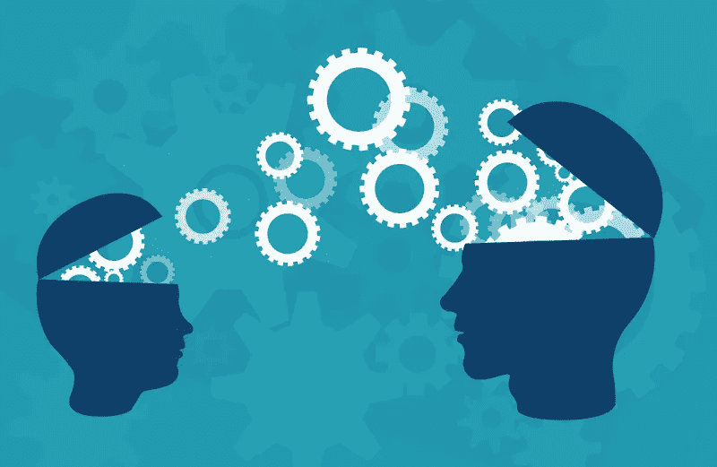
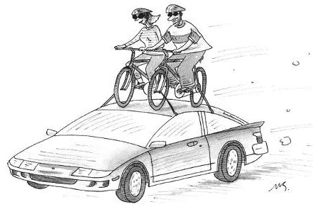
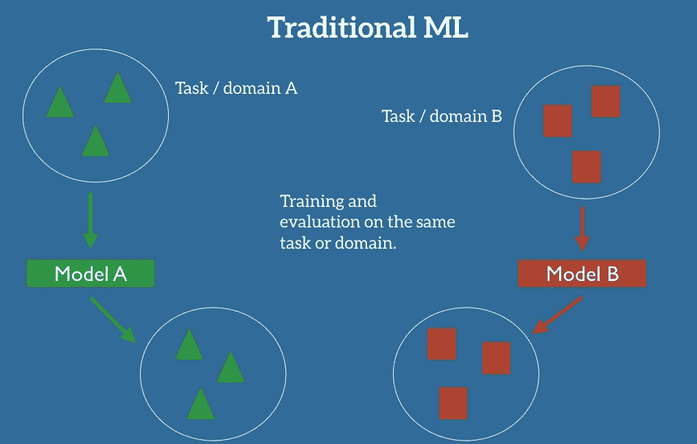

# 迁移学习

> 原文：<https://medium.com/analytics-vidhya/transfer-learning-3fd39789301c?source=collection_archive---------19----------------------->

**简介**

人类从童年开始就在日常活动中成长和学习。因为人类通过学习一项任务来获取知识。通过使用相同的知识，我们倾向于解决相关的任务。比如在实时场景中

*   知道如何骑摩托车⮫学习如何骑汽车
*   知道如何演奏古典钢琴⮫学习如何演奏爵士钢琴
*   了解数学和统计⮫学习机器学习

**ML 中的迁移学习**

传统的 ML 用于为提供的每个任务/领域创建单独的模型。没有用于保存模型的知识库。迁移学习过去有一个知识库来存储为特定任务/领域训练/利用的模型。此外，我们可以使用相同的知识来训练新模型。

为了更好地理解，请考虑实现以下两种可能场景的示例

*   为了识别图像中在一个餐馆的限制区域内的物体，比如说 **T1**
*   从公园或咖啡馆的图像中检测物体为 ***T2*** 。

让我们开始使用传统的 ML 执行任务，我们需要创建两个模型，即模型 A 和模型 B。其中模型 A 用于实现任务 **T1** 而模型 B 用于实现任务 **T2。**最后，通过使用 A 的各自模型& B，可以根据业务需要检测对象。

好吧！！。如果我们采用迁移学习方法，下面的方法将会实现。如果我们开始实施任务 **T1** 使用深度学习创建新模型，因为(TFOD，CV2…等)检测餐厅中的对象，并最终将模型保存到知识库。为了实现任务 **T2** 我们不需要创建另一个新模型，而是从知识库中取出保存的模型。从保存的模型中，我们也可以将它用于任务 **T2** 。从两者要求具有相似性的对象检测，所以我们可以选择迁移学习作为最佳实现。如果这个任务有车道检测/交通灯检测的手段，我们就不能用同一个模型来训练数据。

让我们使用 Python 实现二进制分类。这里我们使用 Keras mnist 数据集。用优化后的参数训练模型，最后保存模型。使用保存的模型进行二元分类。让我们看看如何才能实现学习方法的迁移。

希望这篇文章能让你对迁移学习有一个更好的认识。

感谢阅读文章:)

下次再见了！！！