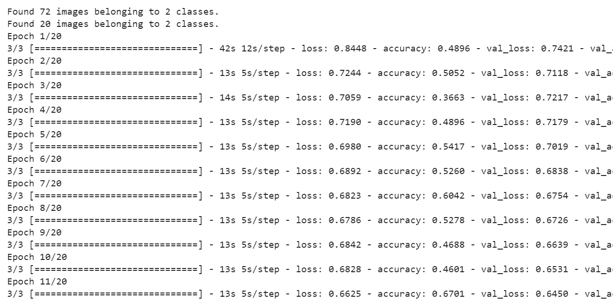
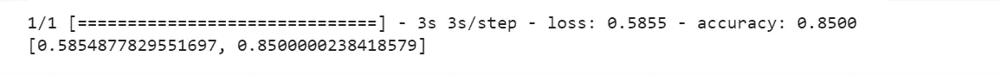

# 迁移学习

> 原文：<https://medium.com/analytics-vidhya/transfer-learning-995134cc8cd3?source=collection_archive---------17----------------------->

凯利·西克玛在 [Unsplash](https://unsplash.com?utm_source=medium&utm_medium=referral) 上的照片

大家好。在这篇博客文章中，我们将了解迁移学习的概念。深度学习很牛逼。它为计算机视觉和物体检测/分类插上了翅膀。然而，我们需要大量的数据来训练一个好的检测模型，这可能并不容易获得。在这篇文章中，我将演示如何使用迁移学习在较少的数据上训练一个模型，并且仍然可以得到很好的结果。先说文章。

人类倾向于从一项任务中获取知识，并将其应用到另一项任务中。例如，从骑自行车中学到的知识被用来骑踏板车。

迁移学习是将从一项任务中获得的知识用于解决另一项任务的过程。在迁移学习中，我们使用别人为他们的问题创建的预先存在的模型，这些模型在各种 GPU 上训练了几周，并经历了痛苦的超参数优化。因此，通过使用迁移学习，我们可以通过使用预先存在的模型的权重来有效地初始化我们的模型，因此，它可以优化模型的性能。迁移学习可用于我们的问题只有小数据集的情况，我们使用在相对较大的数据集上训练的现有模型，从而获得良好的结果。

有两种使用迁移学习的方法

a)特征提取器:-在这种方法中，我们冻结现有模型的所有层，并根据新任务替换最后一层(分类层)。

b)微调:-在神经网络中，网络的较低层和中间层提取一般特征，而顶层特定于任务。在这种方法中，我们解冻模型的顶层，并联合训练分类器和模型的顶层，以便使它们与特定任务相关。

**迁移学习的实施**

**数据收集:-**

为了进行实验，我从 Kaggle 下载了一个数据集(https://www . ka ggle . com/dans Becker/urban-and-rural-photos)。数据集分为训练集(城市和农村场景各 36 幅图像)和验证集(各 10 幅图像)。我们将在给定的问题中使用 **ResNet-50** 模型，实验在 Google Colab 上进行。

1.  **在 Google drive 中上传数据集，并在 Google colab 中安装驱动器**

第一步是读取数据集。为此，我们将在 Google drive 中上传数据集，并在 Google Colab 中挂载该驱动器。安装驱动器的步骤如下所示:-

**2。模型构建**

第二步是建模。这个问题用的是 ResNet50 型号。这里，weights='imagenet '由于我想用' imagenet '权重初始化模型，include_top=False 以不包括模型中的最后一层。我在 ResNet-50 模型中添加了全局平均池和密集输出层。模型.层[0]。因为我们不想训练模型的第一层，所以可训练被设置为假。

**3。型号摘要**

该模型的概要如下所示

**4。编译模型**

这里，损失参数被指定为**‘二元 _ 交叉熵’**。度量参数设置为**“准确性”**，最后我们使用 **adam** 优化器来训练网络。

**5。拟合模型**

现在，我们已经准备好将图像传送到网络。这些图像从 Google drive 中读取并经过预处理。一旦我们训练了模型，我们可以可视化训练/验证的准确性和损失。所有训练/验证准确性和损失都存储在历史变量中。

**6。测试型号**

验证集的准确率为 85%。

**7。绘制训练和验证损失和准确度图**

在这里，我将使用 matplotlib 可视化训练/验证准确性和损失。

**在上述实验中，我们对 72 幅图像进行了模型训练，取得了 85%的准确率。**

非常感谢！

**参考文献**

*   克拉斯
*   tensorflow.org
*   machinelearningmastery.com