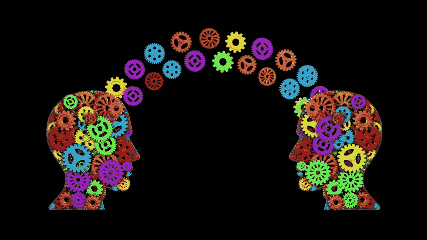
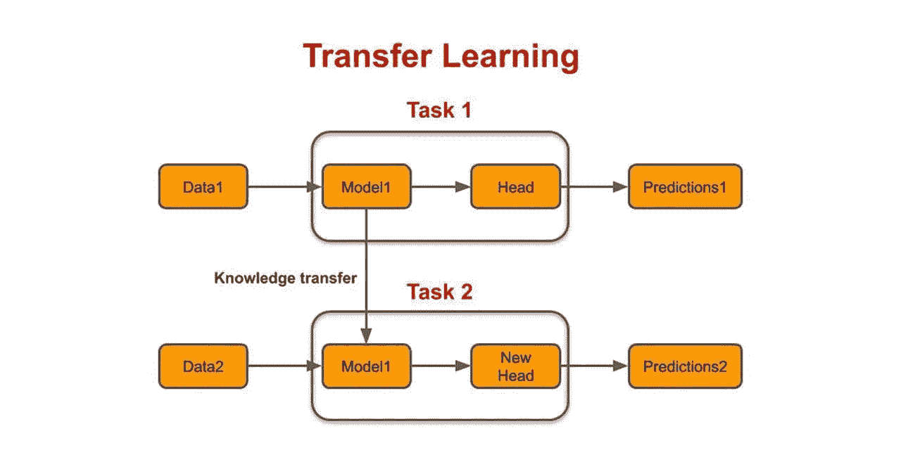
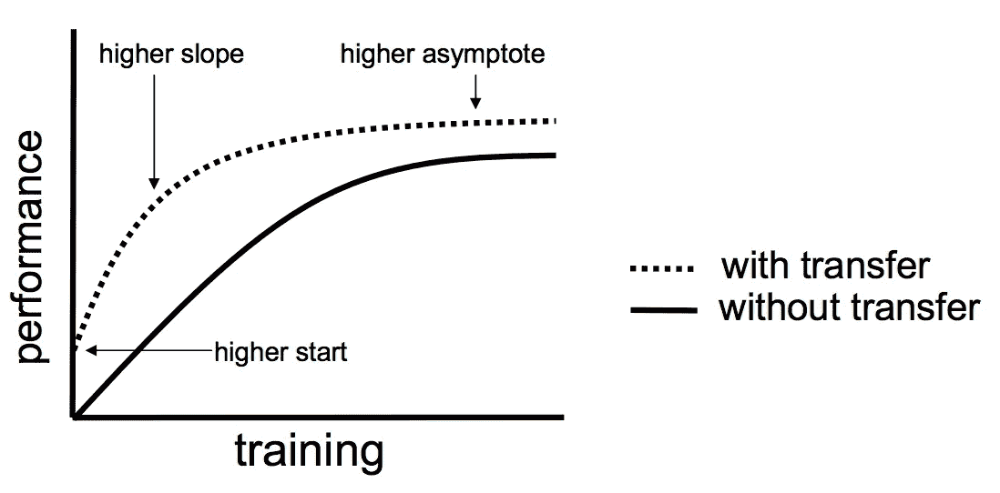

# 转学，知道重要吗？

> 原文：<https://medium.com/analytics-vidhya/transfer-learning-is-it-important-to-know-934eeb3c0ea?source=collection_archive---------13----------------------->

是的，迁移学习是机器学习(ML)的重要组成部分，尽管它不是一种机器学习技术，但在许多现实世界的应用中使用

## 为什么重要？

当我们人类学习时，我们并不完全从零开始，我们可能(有意或无意地)对我们试图学习的东西有一些了解，所以我们在学习新东西或试图完成新任务时使用我们以前的经验。现在它和 ML 有什么关系？

由 ShutterShock 提供

ML 模型做一些类似的事情，使用它以前从一些其他任务中获得的经验来完成当前的任务，这被称为**迁移学习。**

> 机器学习中使用的迁移学习是对新问题的预训练模型的重用。在迁移学习中，机器利用从以前的任务中获得的知识来提高对另一个任务的概括。例如，在训练一个分类器来预测图像是否包含食物时，您可以使用它在训练中获得的知识来识别饮料。

总的想法是，在一个没有太多数据的新任务中，使用模型从一个具有大量可用标记训练数据的任务中学到的知识。我们不是从零开始学习过程，而是从解决相关任务中学到的模式开始。

## **它是如何工作的？**

用 ML 术语来说，它使用前一个模型的预训练权重来添加该模型的层，以便它可以识别前一个模型在没有对其进行明确训练的情况下可以识别的内容

由媒体提供

## **迁移学习的优势**

使用迁移学习有很多好处。主要的优势基本上是你节省了训练时间，你的神经网络在大多数情况下工作得更好，你不需要大量的数据。你可以用相对较少的训练数据建立一个可靠的机器学习模型，因为模型已经预先训练好了。

这在自然语言处理中尤其有价值，因为创建大型标注数据集需要大量专家知识。此外，训练时间也减少了，因为有时需要几天甚至几周的时间来从零开始训练一个复杂任务的深度神经网络。

它还可以处理对象检测或人脸识别等任务，比如说在人脸识别等任务中，如果您使用预先训练的模型，它已经可以检测人脸，然后就可以很容易地比较人脸编码来识别它们

**注意**:迁移学习只有在从第一项任务中学到的功能是通用的情况下才有效，这意味着它们在其他相关任务中也是有用的。

结束了！(至少目前如此)

**PS** :如果你有任何疑问，你可以给我发邮件[这里](http://pavankunchalapk@gmail.com/)，你可以从[这里**在我的 linkedin 上联系我**](https://www.linkedin.com/in/pavan-kumar-reddy-kunchala/) ，你可以从 [**这里**](https://github.com/Pavankunchala) 在我的 Github 上查看我的其他代码(它有非常酷的东西)

我也在寻找深度学习和计算机视觉领域的自由职业机会，如果你愿意合作，请给我发邮件([pavankunchalapk@gmail.com](mailto:pavankunchalapk@gmail.com))

祝你有美好的一天！