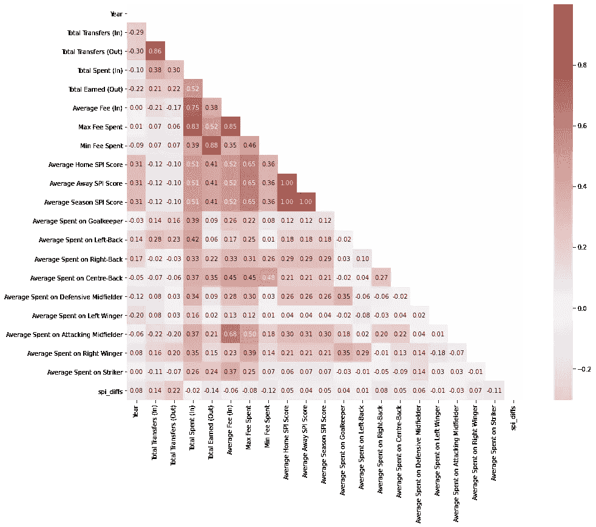
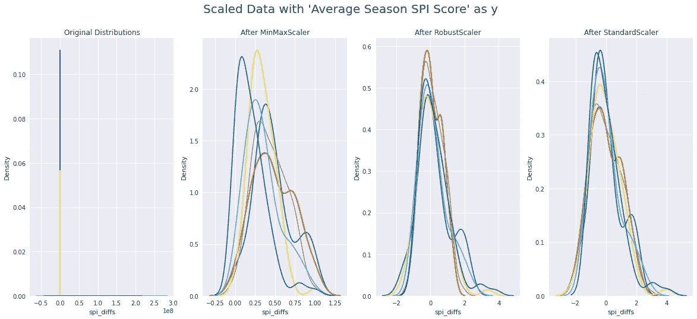

# 转会窗口——预测英超俱乐部收视率

> 原文：<https://medium.com/analytics-vidhya/transfer-windows-predicting-english-premier-league-club-ratings-779b37008353?source=collection_archive---------18----------------------->


蒂姆·贝彻维斯在 [Unsplash](https://unsplash.com?utm_source=medium&utm_medium=referral) 上的照片

当莱斯特城赢得 2015-2016 英超联赛冠军时，他们完成了一个 5000-1 的奇迹赛季，并在历史上首次获得了欧洲冠军联赛的参赛资格。赢得英超冠军的球队名单很短——每个赛季的冠军都是曼联(13)、切尔西(5)、曼城(5)、阿森纳(3)、利物浦(1)、莱斯特城(1)或布莱克本流浪者(1)。

即使是最不经意的足球迷也会看到这份名单，并认识到名单上的前五支球队是所有体育运动中最知名的俱乐部品牌。曼联、曼城、切尔西、阿森纳和利物浦是六大俱乐部中的五个(包括托特纳姆)，之所以这样称呼是因为它们的全球品牌定位以及它们在英超联赛其他领域的相对主导地位。是什么让这六大俱乐部与几乎所有其他英超俱乐部区分开来？钱，特别是他们带来的球员的市场价值。根据追踪俱乐部和球员市场价值的 [transfermarkt](https://www.transfermarkt.com/) ，目前六大俱乐部的平均价值为€8.0323 亿英镑，而其余 14 家俱乐部的平均价值仅为€2.6948 亿英镑。更大的俱乐部背后的资金使得他们如此具有统治地位。金钱买球员和经理，球员和经理赢得更多奖杯，更多奖杯提高品牌定位，俱乐部保持在联赛的顶端。

知道我们对足球中金钱的了解(即金钱是王道)，但仅仅拥有一个更大的战争基金并不等于轻而易举的成功。托特纳姆是六大俱乐部之一，但还没有赢得过英超冠军。阿森纳是六大俱乐部之一，但在过去的五个赛季中，每一个赛季都排在第五名以下，甚至低至第八名。

问题就变成了:俱乐部花钱的方式如何影响他们的表现？俱乐部在每个赛季的两个转会窗口期间花费和赚钱，以最佳价值建立最佳阵容，这些球员最终推动每个俱乐部的表现。为了弄清楚金钱是如何影响俱乐部实力的，我决定看看转会对俱乐部实力的影响，这由所谓的 SPI 评级来表示。

[SPI 评级](https://fivethirtyeight.com/methodology/how-our-club-soccer-predictions-work/)由[538](https://medium.com/u/2e5f29790cac?source=post_page-----779b37008353--------------------------------)团队创建，用于预测比赛和赛季的结果。这些年来，他们扩大了自己的联赛，现在[拥有 600 多支男子职业俱乐部球队的完整排名](https://projects.fivethirtyeight.com/soccer-predictions/global-club-rankings/)。截至本帖排名第一的团队？曼城，常年英超强队和金融巨擘。排名最差的队伍？斯肯索普队在一场降级战后刚刚在英乙联赛中获得了一席之地。

使用 2016-2020 赛季的转会数据和英超联赛中每个俱乐部的 SPI 评级，我使用贝叶斯岭回归来评估俱乐部如何花钱影响他们的 SPI 评级。

继续之前，有一点需要注意:这不是一个关于调整算法参数或特性选择的循序渐进的教程。这也不是对足球分析的深入解释。这是第一个项目，涉及我热爱的一项运动的数据。对我来说，这是解决我的第一个项目和为未来学习的一种方式。对其他人来说，我希望它能很好地展示初学者的项目是什么样子，对每个人来说，我希望它能激励你承担一个看起来令人生畏的项目。继续读下去！

# 数据和特征创建

我使用了两个数据集来检查转移和 SPI 评级。

对于传输，我使用了从 transfermarkt 收集的[数据，这些数据是](https://ewen.io/2018/08/27/building-open-football-player-transfer-data/) [Ewen](https://medium.com/u/785d692624b8?source=post_page-----779b37008353--------------------------------) 在 [Github 存储库](https://github.com/ewenme/transfers)中提供的。有令人难以置信的大量数据，我鼓励任何对市场价值或转让活动感兴趣的人浏览一下他所做的工作。对于 SPI 评级，我使用了 [FiveThirtyEight](https://medium.com/u/2e5f29790cac?source=post_page-----779b37008353--------------------------------) [存储库](https://github.com/fivethirtyeight/data/tree/master/soccer-spi)，其中包含了全球职业足球联盟的足球比赛数据。

在项目开始时，我计划使用英国足球金字塔的英冠和英超两个部门。由于这是我的第一次建模练习(我是这方面的新手)，我决定将数据仅限于英超联赛。我觉得最舒服的是单独处理每个数据集，然后合并做一些最后的清理；现在，我对自己使用笔记本和熊猫图书馆的能力更有信心了，如果我再尝试一次，我可能会以不同的方式处理这个项目。

我使用了五个赛季中每个赛季的每个球队的 SPI 评级，包括主场和客场，并创建了一个新功能，每个赛季的平均 SPI 评级。


小提琴的情节显示了英超联赛中 SPI 收视率的广泛传播。有趣的是，从 2017 年到 2018 年，最低评级有所增加，因为较弱的球队被降级，而较强的球队被晋级。

单个俱乐部在他们的赛季中也有 SPI 评级的分布。分配给莱斯特城的灰色条显示了一支球队在五个赛季中平均表现的好坏。分布在最右边的六个条形？那些是六大。钱很重要。



从上面的关联图可以清楚地看出，与平均 SPI 分数关联最密切的特性(在创建时并没有用到它！)是花费的最大费用，在转会窗口中花费的平均费用，以及俱乐部在转会窗口中通过向俱乐部出售球员而获得的费用总额。有趣的是，在一个特定的赛季中，俱乐部的总进进出出与平均 SPI 评级呈负相关。我们开始在英超联赛中看到“质量胜于数量”的证据。快速补充说明:我从我的分析中删除了平均主客场 SPI 分数，因为它们用于创建平均赛季 SPI 分数特征。

# 建模和分析

正如我上面提到的，这是我的第一个项目，所以我尝试了尽可能多的不同方法来对数据进行缩放和建模。



我使用了 MinMax、RobustScaler 和 StandardScaler 对拆分成测试集后的数据进行缩放。我决定在项目中使用 MinMax scaler，然后尝试使用各种回归算法。我的第一次尝试，我不会在这里展示，但你可以在[库](https://github.com/tdraths/transfers_capstone)中看到，有一些非常高的分数！我的第一个项目，我的第一次尝试，巨大的分数！

然后我意识到，我的数据中仍然有平均主场和客场 SPI 评级。因为他们被用来创建平均赛季 SPI 分数，我夸大了分数。我又试了一次，降低了主客场收视率。

你可以在下面看到我第二次尝试的结果。最高分算法——贝叶斯岭回归器。

```
**OLS Linear Regression** 
	Season model score: 0.1268
	Season MAE: 4.8705
	SPI model score: -0.541
	SPI MAE: 3.58**Non-negative Least Squares Linear Regression** 
	Season model score: 0.3194
	Season MAE: 4.5814
	SPI model score: -0.5924
	SPI MAE: 2.6768**Least-Angle Regressor** 
	Season model score: 0.3541
	Season MAE: 6.5048
	SPI model score: -0.1531
	SPI MAE: 2.2011**Bayesian Ridge** 
	Season model score: 0.4189
	Season MAE: 5.432
	SPI model score: -0.1555**Suppor Vector** 
	Season model score: 0.1083
	Season MAE: 8.9043
	SPI model score: -0.1068
	SPI MAE: 2.259**Gaussian Process Regressor** 
	Season model score: 0.2136
	Season MAE: 6.3722
	SPI model score: -0.587
	SPI MAE: 1.7552**Partial Least Squares Regressor** 
	Season model score: 0.4004
	Season MAE: 4.8793
	SPI model score: -0.6122
	SPI MAE: 3.2796**DecisionTree Models with Default Max Depth** 
	Season model score: 0.2041
	Season MAE: 5.595
	SPI model score: -0.4527
	SPI MAE: 3.4612

 **DecisionTree Models with Max Depth of 2** 
	Season model score: 0.0834
	Season MAE: 5.134
	SPI model score: -0.3567
	SPI MAE: 2.7878

 **DecisionTree Models with Max Depth of 5** 
	Season model score: 0.022
	Season MAE: 7.3408
	SPI model score: -0.5005
	SPI MAE: 3.9308

 **DecisionTree Models with Max Depth of 8** 
	Season model score: 0.1159
	Season MAE: 5.675
	SPI model score: -0.7262
	SPI MAE: 2.785**ADABoosted - DecisionTree Models with Default Max Depth** 
	Season model score: 0.31
	Season MAE: 4.63
	SPI model score: -0.1058
	SPI MAE: 2.7712

 **ADABoosted - DecisionTree Models with Max Depth of 2** 
	Season model score: 0.24
	Season MAE: 4.7757
	SPI model score: -0.4566
	SPI MAE: 2.885

 **ADABoosted - DecisionTree Models with Max Depth of 5** 
	Season model score: 0.2994
	Season MAE: 4.8814
	SPI model score: -0.139
	SPI MAE: 2.7266

 **ADABoosted - DecisionTree Models with Max Depth of 8** 
	Season model score: 0.3153
	Season MAE: 4.705
	SPI model score: -0.1174
	SPI MAE: 2.7475
```

然后，我查看了贝叶斯岭回归的特征重要性，以确定哪些特征最能预测某个俱乐部在给定赛季的平均 SPI 得分。


特征重要性-贝叶斯岭回归

瞧啊。最具预测性的特征是:

***最大花费费用:*** 单个球员花费的最大转会费

***总花费(In):*** 俱乐部为引进球员所花费的总花费

***总收入(出):*** 俱乐部出售球员时的总收入

# 结论和后续步骤

金钱是王道。在职业足球联赛中，这种情况没有也不会改变，球队必须相应地管理他们的财务和球队目标。处于顶端的俱乐部，通常在表现和财力上都是如此，为了最大化他们在积分榜上的位置并有资格参加欧洲比赛，他们在球员身上花费了大量的金钱。排名靠后的俱乐部有更适中但同样重要的目标:每个赛季提高他们在积分榜上的位置，远离降级战，管理支出以保持俱乐部良好的财务状况。有鉴于此，不管一个俱乐部有多少钱，我们现在知道每个球队都可以在转会窗口采取措施来提高他们的 SPI 排名，这可能会导致每个赛季结束时在积分榜上的位置更高。

首先，俱乐部应该在每个窗口锁定一名关键球员，并投入一大笔资金。在一个球员身上花更多的钱比把费用分散到很多位置上更有影响力。

第二，俱乐部应该控制开支，以最大限度地增加吸引球员的资金。几个赛季前，托特纳姆在转会窗口期间引进了零名球员。他们仍然感觉到这种战术的结果，并没有在英超积分榜上看到他们想要的结果。

第三，俱乐部应该在球员身上下好赌注，并在每个转会窗口出售他们以“平衡支票簿”。使用发展学院和尽早卸载高质量球员将有助于俱乐部管理他们的收入和支出。2020-2021 赛季后，利物浦正在购买他们的顶级防守球员之一，因为他的价值被上赛季的表现夸大了。全欧洲都需要他。继续让他留在队中对他的市场价值来说风险太大了。现在卖掉他，即使他是一名有着光明未来的优秀球员，也会帮助他们在下一个转会窗口保持一些平衡。

正如我多次提到的，这是我的第一个“数据科学”相关项目。我不是数据科学家，我仍在学习贝叶斯岭回归器、决策树和其他算法背后的数学。我对结果很满意，但我知道当我再次回顾这个项目时，还有一些后续步骤需要探索:

**首先**，我需要研究为什么贝叶斯岭比决策树表现更好。理解为什么一个算法比其他算法表现得更好，即使只是一点点，也是很重要的。在我看来，仅仅知道代码是不够的；不过，这是一个好的开始。

**第二个**，说到性能，我需要回到我的预处理和建模，调整算法参数，试图提高我的分数。我现在正在完成第二个项目，探索员工保留，我学到了很多关于参数调整的知识。我将回到这个足球转移项目，并应用我的知识来看看我能做些什么来提高模型性能。

**第三个**，完成项目对我来说是真正的信心助推器！我离开了很长时间，部分是因为生活事件，但主要是因为对自己的能力感到紧张。很难将那些消极的想法置之不理:“你不擅长这个。你知道的还不够多。这是个笑话。”我学到的是，到达一个停止点是一个巨大的信心提升。对于未来的项目，我知道我可以把注意力集中在到达一个停止点，评估我到那个点的努力，并决定接下来的步骤。

正如我的导师在我们讨论我的自信时所说——“如果你认为自己知道的还不够，那就去学点东西吧！”谢谢，[拉斐尔·卡斯蒂洛·阿尔西巴尔](https://medium.com/u/730d9c1f9125?source=post_page-----779b37008353--------------------------------)。

在[项目仓库](https://github.com/tdraths/transfers_capstone)亲自看看我的作品。我很乐意接受任何想要分享的人的建设性或指导性的反馈！