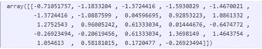
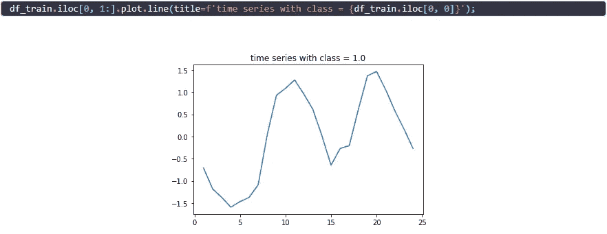
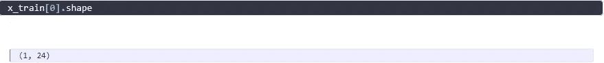
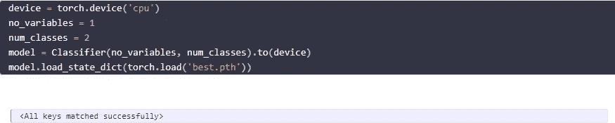
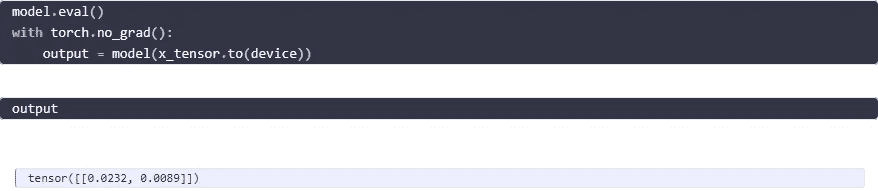

# 将 PyTorch 模型转换为 onnx

> 原文：<https://medium.com/analytics-vidhya/transform-a-pytorch-model-to-onnx-90e581258997?source=collection_archive---------4----------------------->

安迪·布鲁纳在 [Unsplash](https://unsplash.com?utm_source=medium&utm_medium=referral) 上的照片

在本教程中，我想展示如何轻松地将 PyTorch 模型转换为 onnx 格式。但首先，你为什么要这么做？根据我的经验，有几个原因可能会对您有用:

*   你的发展区域和你的生产区域是不同的。以我的经验来看，往往是这样。当我们有大量数据要进行批量推断时，首先将数据从一个源转移到 python 服务器，在那里进行推断，然后再将数据放回去，这通常不是最好的主意。onnx 可以让你直接使用你的深度学习模型，这是一个巨大的好处。
*   onnx 通过他们的 API 在 Java 上运行，这意味着你可以用 Python 训练你的模型，但是要在 Java 上部署它。这有很大的不同，因为您可以直接在集群中部署您的模型。
*   onnx 支持所有流行的深度学习框架，如 PyTorch、TensorFlow 或 Caffe(以及更多)。这意味着在团队中，一些人觉得使用 TensorFlow 更舒服，而另一些人觉得使用 PyTorch 更舒服，部署过程仍然可以是相同的。

在[之前的教程](/analytics-vidhya/time-series-classification-with-convolutions-ed5cb33b1e3b)中，我已经向你展示了卷积神经网络在时间序列方面的强大。我使用意大利电力需求数据集做了一个分类任务，这是为了区分哪一天来自。为了向您展示如何部署您的模型，我将用 PyTorch 在 CPU 上训练这个模型，并向您展示如何将它保存为 onnx 模型。onnx 的工作方式是，它首先需要一个示例数据点(张量)的“样本”,我们曾经用它来做推理部分。因此，让我们首先加载数据，只取我们想要进行预测的第一个示例。

提醒一下，这个 numpy 数组表示 24 小时内的用电量，我们试图预测这一天是从 10 月到 3 月(含)，还是从 4 月到 9 月。

我们现在将这个 numpy 数组转换成 PyTorch 张量。在建立我们的模型时，我们唯一需要记住的是张量必须遵循一定的形状。现在这个形状看起来像这样:

然而，模型期望的形状是这样的:[批量大小，变量个数，观察个数]。在我们的例子中，我们希望 batch_size 为 1，我们只有 1 个变量需要预测(功耗),我们有 24 个观察值，每小时一个。此外，在这种情况下，我们需要使张量类型为 float，因为在训练模型时，我们使用 float 类型作为输入。

现在我们需要重新加载我们的模型。保存模型的最佳实践是只保存 state_dict()。然而，这意味着当重新分配模型时，如果您愿意，我们首先需要定义模型的“骨架”，然后它将由保存的 state_dict()中相应的权重和偏差进行更新。同样，如果你还没有读过如何建立模型的教程，我强烈推荐你再读一遍。

记住，我们只有一个变量来预测两个类中的一个(0 或 1)。

我们已经快完成了。最后缺少的是推理部分。为此，我们首先必须将模式置于评估模式(否则它也会将目标变量作为模型的输入)，并且为了更快的推断，我们还会告诉模型不要每次都计算梯度。

现在我们准备将我们的模型保存为 onnx 模型。请记住，对输出所做的任何更改(例如应用 sigmoid 函数)都不会保存在 onnx 模型中。然后需要在应用模型的地方进行后续操作，例如，在 Java 设置中使用模型时，需要使用 sigmoid 的 Java 功能。

就是这样！我们现在已经用 onnx 保存了我们的模型，可以直接部署到其他框架上。在下一篇教程中，我想向您展示如何使用这个 onnx 模型，并让它在 Java 上运行。

拉塞

*原载于 2021 年 8 月 28 日*[*https://lschmiddey . github . io*](https://lschmiddey.github.io/fastpages_/2021/04/10/DeepLearning_TabularDataAugmentation.html)*。
Git 回购:*[https://github.com/lschmiddey/pytorch_to_onnx](https://github.com/lschmiddey/pytorch_to_onnx)