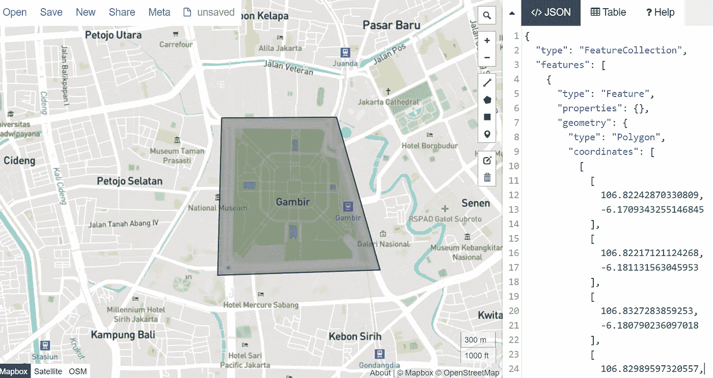
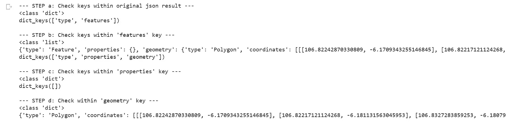
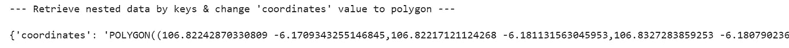
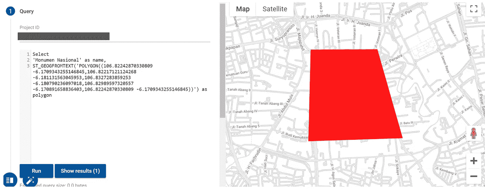

# 使用简单的 Python 脚本将 GeoJSON 的几何要素转换为 BigQuery 的多边形格式

> 原文：<https://medium.com/analytics-vidhya/transforming-geometric-features-into-bigquerys-polygon-format-with-simple-python-script-bfd6d44dfc3f?source=collection_archive---------18----------------------->

> *将 GeoJson.io 中可用的几何数据纳入分析用例。*

由[德尔菲·德拉鲁阿](https://unsplash.com/@delfidelarua7?utm_source=medium&utm_medium=referral)在 [Unsplash](https://unsplash.com?utm_source=medium&utm_medium=referral) 上拍摄的照片

在一家叫车技术公司的分析领域工作，我经常意识到空间/GIS 格式的信息可以提供传统数据分析中容易错过的独特见解。例如，能够观察某些地理边界上的趋势，而不是在城市层面上观察时间序列，可以帮助我们定位异常并获得更好的见解(例如，在疫情期间，从购物中心到购物中心的旅行发生了什么？同样，长假期间居民的生活会发生什么变化？)

虽然工程团队已经开发了 [s2 库](https://www.gojek.io/blog/appreciating-the-geo-s2-library)，该库将空间地图划分为更小的矩形形状(这对*在某些位置近似*趋势非常有帮助)，但仍有一些情况下，我们更喜欢自由绘制边界的*灵活性。这是因为某个兴趣点的实际形状可能不一定是矩形的(如 malls & residentials 示例)，并且根据粒度，强制 s2 库可能会覆盖或覆盖不到相关空间。*

幸运的是，*定位和标记地理边界*的灵活性被像 [GeoJson.io](http://geojson.io/#map=2/20.0/0.0) 这样的工具很好地覆盖了，它为某些地理特征提供了[视觉和 GeoJSON r](https://sumit-arora.medium.com/what-is-geojson-geojson-basics-visualize-geojson-open-geojson-using-qgis-open-geojson-3432039e336d) 表示。举例来说，假设我们想要生成雅加达[国家纪念碑](https://en.wikipedia.org/wiki/National_Monument_(Indonesia))周围的地理要素:

图片作者(来自 [Geojson.io](http://geojson.io/#map=15/-6.1756/106.8242) )

我们从上面的截图中看到的是雅加达最受欢迎的城市标志之一*国家纪念碑*的视觉(左)和地理特征(右)。一旦我们可以在地图上找到雅加达的位置，就可以通过选择*“画多边形”*工具栏，并自己在目标区域绘制地图。很方便，不是吗？

没那么快。尽管知道地理特征，这些信息还不能用于分析。也就是说，即使我们有指向和来自地图坐标的用户移动性的事务记录(即 SQL/BigQuery 中的数据库), GeoJSON 要素格式仍需要进行解析，这可能会造成一些麻烦。

例如，BigQuery 有特定的规则[用于 GIS](https://cloud.google.com/bigquery/docs/gis-data) 。输入 JSON 片段必须由 GeoJSON 几何类型组成，仅包括`Point`、`MultiPoint`、`LineString`、`MultiLineString`、`Polygon`、`MultiPolygon`和`GeometryCollection`。GeoJSON `Feature`或`FeatureCollection`，比如我们在 Geojson.io 中看到的，如果不解析，将导致**错误。**

在本文中，我们将使用简单的 python 脚本将 GeoSJON `FeatureCollection`解析成`Polygon`。最终结果如下:`POLYGON((0 0, 0 2, 2 2, 0 2, 0 0))`其中括号中的值是从 GeoJSON.io 几何要素集合中获取的坐标。

## 步骤 1:导入相关库& **复制粘贴** GeoJSON 特征集合到变量“**result”**

第一步是加载 json 库，从 GeoJSON.io 复制粘贴值，这基本上是脚本中唯一需要的手动步骤。

## 步骤 2:遍历 JSON，寻找相关的键值对

这种探索性的方法可以推广，特别是对于迭代较长的 JSON 非常有用，这种 JSON 通常是字典格式的。一个好的检查是首先确认 JSON 中每个嵌套元素的类型是否是一个字典(很可能是)。如果是，我们将继续检查它的键值对。

为了更好地理解正在发生的事情，下面是每个步骤的打印声明:

作者图片

从步骤 a 我们发现有*【类型】*和*【特征】*键名。由于我们的预期值可以在*“功能”*中找到，接下来(在步骤 b 中)我们可以更深入地挖掘*“功能”*键。步骤 c-d 意味着在子键中发现更多的键，直到我们可以找到我们要找的东西。请注意，我们的相关键最终可以在步骤 d 中找到，其中*“geometry”*键指向存储在*“coordinates”*子键中的 long lat 值。

## 步骤 3:从嵌套数据中检索相关值，并将其重新格式化为多边形字符串格式

在这一步中，我们将 long lat 值转换为 BigQuery 可解析多边形格式。这也是这个 Python 脚本的便利之处。

结果如下:

作者图片

完美！现在我们可以开始在 SQL/BigQuery 中使用多边形了。因此，让我们复制并粘贴打印字符串'多边形((…))'并在 BQ 中探索。

## 第四步:在 BigQuery 中尝试一下，看看是否有效！

一个有趣的(但可选的)检查多边形是否在 BigQuery 中工作的方法是通过 [BigQueryGeoviz](https://bigquerygeoviz.appspot.com/) 并将多边形文本复制粘贴到其中。不要忘记使用`ST_GEOGFROMTEXT`将我们的多边形字符串转换成地理格式。点击运行，就可以了，一个和 GeoJSON.io 中一模一样的地图！

作者图片

检查它是否有效的第二种方法是对照实际数据进行分析。例如，下面是在 SQL 上测试它的样子。

如果查询返回预期值，那么恭喜您已经成功地将几何要素转换为面。测试愉快！

注意:Python 脚本和示例 SQL 代码的链接可以在[这里](https://github.com/taufiqbashori/parse-geojson2polygon)找到。