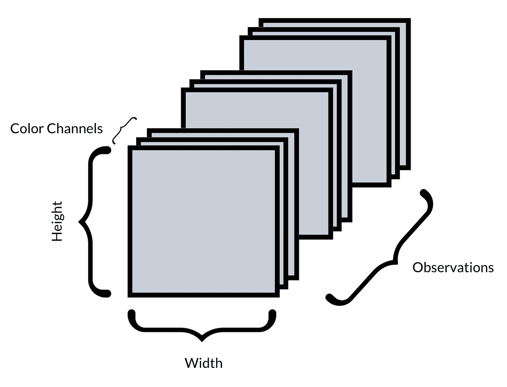
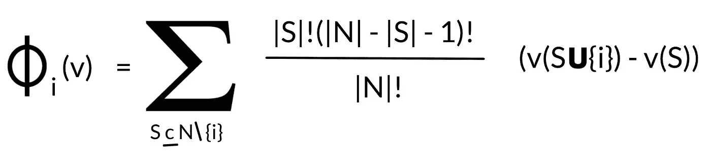
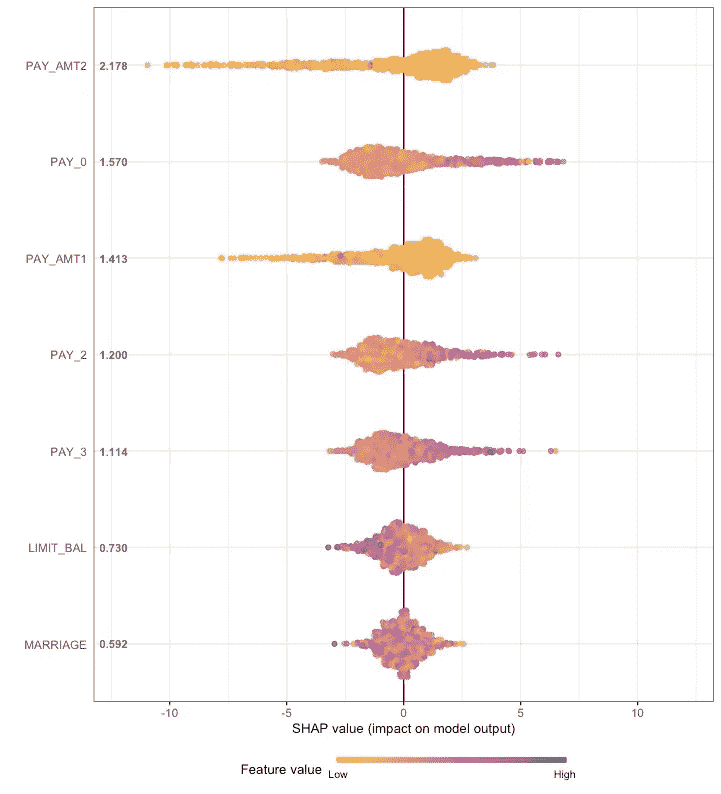
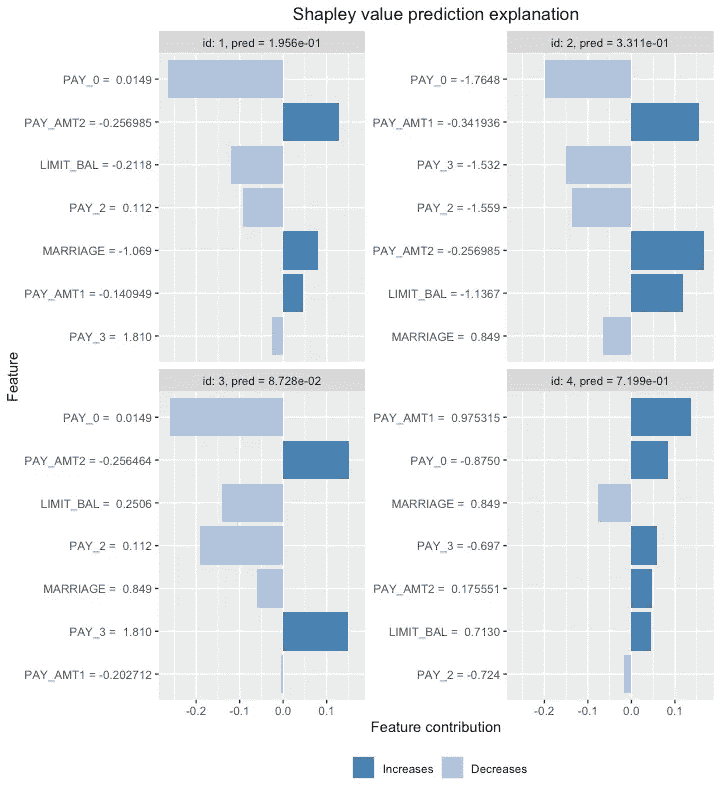

# 机器学习应用中的透明度和治理

> 原文：<https://medium.com/analytics-vidhya/transparency-and-governance-in-machine-learning-applications-17f5e3c068f1?source=collection_archive---------5----------------------->

机器学习模型，以及在所有人面前，深度学习应用程序经常被贴上“黑盒”工具的标签。大量的输入数据被输入机器。数据被咀嚼了一段时间。最终，一个结果被吐出来，但是我们不太清楚我们是如何得到那个结果。

为什么一个估价模型将一套公寓的价格定为 345，000 欧元，而另一套公寓的价格仅为 295，000 欧元？为什么信用评分模型将一个信用申请人评定为潜在违约，而将另一个信用申请人归类为潜在非违约？

这种先进技术的问题是，这些应用程序可以读取包含大量数据的复杂模式(以便将其用于某些任务)，这是人类无法做到的。也就是说，使用这些模型的透明性丧失了，因为人类再也无法检索结果的详细逻辑。

这种情况可能不符合植根于**欧盟 ESG 分类法**并被公司纳入其各自治理政策的治理规则。当风险决策必须在监管更严格的行业(如金融机构)中基于数据驱动的环境做出时，情况可能会更糟，在这些行业中，决策的**透明度是必需的商品**。

在这里，我们讨论 **Shapley 价值观**如何有助于为数据驱动的决策过程带来更多透明度，以及为什么**博弈论**为这一切建立了一个无价的基础。

# 透明度和治理问题

不用说，人们应该了解机器学习/深度学习模型的**架构、涉及的算法、嵌入的损失函数以及整个工具的目的。这是**在数据驱动的业务环境中建立透明度和适当治理的第一步**。**

另一个故事是在将机器学习/深度学习模型付诸行动时保持这种承诺。然后，基于底层算法和功能，大量数据点通过该架构被搅动。如前所述，这些模型的**工作是检测手头数据中的模式和行为**，由于潜在的复杂性，这些模式和行为**是人类无法访问的。**

想象一个数据集，包含 60，000 幅基于 RGB 的图像，网格为 256 x 256 像素。这将意味着 4D 张量对象中总共有 11，796，480，000 个数据点(60，000 个观察值 x 256 像素高度 x 256 像素宽度 x 3 个颜色通道)可用于训练深度学习模型。人类不可能详细地遵循训练过程。

作者图片

那么，如何在数据驱动的流程中处理透明度和治理呢？这个问题的解决方案可以在 Shapley 值中找到。

# 沙普利价值观和博弈论

沙普利值的概念是在 1953 年建立的，指的是博弈论的世界(你可以在下面找到参考资料)。

更具体地说，我们正在接触在**合作博弈论**领域中最广泛使用的特征函数游戏。特征功能游戏是由一组**玩家和一个给出这些玩家合作结果的功能**定义的。

不同的球员组合会取得不同的结果。一个问题是，组合的数量随着玩家的数量呈指数增长。合作博弈的另一个问题是参与合作的玩家子集必须是稳定的。即，没有玩家有离开群体的动机，当玩家在合作时比单独行动时赚得更多时会出现这种情况。

第三个问题是**如何在玩家**之间分配合作游戏取得的结果。在这里，沙普利价值观提供了一个原则性的方法来做到这一点。根据这些原则，每个玩家应该得到满足以下公理的金额:

*   效率:应分配已实现结果的总价值。
*   虚拟玩家:没有贡献的玩家不应该得到任何东西。
*   对称:做出相同贡献的玩家应该得到相同的回报。
*   可加性:该值应该是所有游戏集合的可加性(因为有几个不同组合的游戏)。

由于结构的**指数行为，这使得在许多情况下分析确定 Shapley 值不切实际，如果不是不可能的话，当增加玩家数量时，这个**值必须近似为**。Shapley 值有几种紧凑的表示。尽管这超出了本文的范围。有关详细信息，请参见以下参考资料。**

# Shapley 值和人工智能

那么，这和我们的机器学习/深度学习应用有什么关系呢？

为了使 Shapley 值概念适用于机器学习/深度学习模型，数据集的**输入特征被处理为这种合作游戏**中的参与者。

在这种情况下，在给定模型输出并与其他输入参数相关的情况下，测量每个输入参数的平均边际贡献。这是通过仔细轻推输入要素，然后检查输入参数的更改如何与最终模型输出相对应来实现的。并且这是在所有观测中完成的，其中不同观测中的特征可以具有不同的边际贡献。

这在 Shapley 值方程中再次得到了总结:

作者图片

换句话说，该等式的作用是计算在没有特定输入特征的情况下模型的预测值，然后计算具有该特征的模型的预测值，最后计算差值。模型预测的变化(即差异)本质上是该特定特征的影响。

需要注意的是，输入特征在模型中的添加顺序对于其值的分配非常重要。根据订单的不同，可能会有很大的差异。因此，Shapley 值考虑任何可能的排序，并计算加权和以找到最终值。这就是为什么 Shapley 值必须在所有可能的特征分组集合(减去我们感兴趣的特征)上置换的原因。

这使得**计算 Shapley 值的计算成本很高**，也就是说，必要的计算将随着输入参数的增加而呈指数增长。为了保持复杂性可管理，Shapley 值通常基于特征的子组来计算，并且相对于充当基准组的比较或背景组来计算。

此外，必须使用**近似方法****来保持计算的可行性**。

换句话说，必须估计真实的沙普利值。其中一种方法是**核 SHAP** ，这是一种在更高维度上计算高效的 Shapley 值近似。

当然，使用近似方法也有局限性。核 SHAP 的一个主要限制是它假设输入要素是独立的。为了克服这一点，必须采用不同的方法来估计条件概率，例如:

*   多元高斯分布方法
*   高斯连接方法
*   经验条件分布方法
*   条件推理树方法

另一个问题是 Shapley values 容易受到不切实际的输入的影响，例如，将纬度和经度作为单独特征的房价模型，该模型是在山中或水中的房地产上查询的。攻击者甚至可以利用这些情况。

有关详细信息，请参见下面的参考资料。

# 沙普利值—示例

让我们看看这在实践中是如何工作的。

一个 **xgboost —机器学习模型**在一个信用卡投资组合上被**训练，以便能够**对潜在的违约客户**进行分类。**

本例中的输入要素是:

*   婚姻…已婚，单身或其他
*   限额 _ 余额…信用卡限额
*   PAY_AMT1，PAY_AMT2 …前几个月的付款金额
*   PAY_0，PAY_2，PAY_3 …前几个月的付款历史，如 1 =按时付款，2 =延迟 1 个月付款，3 =延迟 2 个月付款，依此类推

对于潜在借款人，模型的最终分类是 0 代表无违约，1 代表违约。

在本例中，我们使用 shapr — package/ Rstats，通过基于条件推理树方法的核 SHAP 方法来计算 Shapley 值。每个输入参数对分类结果的贡献如下:

作者图片

在 y 轴上，示出了在 xgboost 模型中实现的输入参数。在 x 轴上显示了各个参数对模型结果的影响。所有这些黄色、橙色和紫色点都是模型训练数据集的单一观察值。点的颜色表示对于某项观察，特征值是低(例如低信用额度)还是高(例如延迟还款的延长月数)。

本例中 Shapley 值的结果不能全信。该示例仅用于说明目的，模型的特征并非真正经过工程设计，并且不同输入特征的汇集是有限的。

然而，可能已经有了对沙普利值的解释。以参数‘信用额度’为例。对分类结果的影响在两个方向上都不太大。但它表明，相当小的信贷限额更容易导致违约。这可能表明，偿还能力较低的借款人更容易获得较低的限额。

转到 PAY_x —参数，可以发现较低的值(当然)不会导致默认的分类。虽然，影响不是很深。较高的值(例如 9 =付款延迟 8 个月及以上)已经对模型结果产生了更明显的影响。

应该注意的是，每个输入参数对单次观测的影响可能非常不同。这可以在下图中从数据集中随机选择的 4 个观察值中看出。

作者图片

此外——这肯定是这种方法的主要**限制之一——随着每个输入特征的添加，Shapley 值的计算变得非常非常快。这需要在开发机器学习/深度学习模型和足够的计算基础设施时进行明智的特征工程。**

# 结论

机器学习/深度学习中一个重要的**问题**是**为什么一个算法会做出某个决定**。

能够**解释机器学习/深度学习应用的个体预测有助于在数据驱动的决策环境中带来透明度**，从而有助于**在 ESG 政策中匹配治理标准**。

Shapley 值通过比较模型使用和不使用该特征时的表现来计算输入变量的优势。这是以每种可能的顺序完成的，因为模型看到要素的输入变量的顺序会影响其预测。

**Shapley 值**的概念被认为是**唯一的模型不可知的解释方法，具有坚实的理论基础**。模型不可知意味着只要输入(即观察值和输入特征)和输出(即模型结果)都在表上，就可以在不知道模型内部机制的情况下计算 Shapley 值。

并且，理论上的**基础**是从**博弈论**推导出来的。

不容置疑:

许多**金融机构**在建立他们的“高级”信用评分系统时仍然坚持逻辑回归，同时**削减了更有效的信用评分应用的潜力**。原因在于，否则**他们不可能保持必要的透明度，也不可能按照金融当局的要求**解释模型正在做什么。

**沙普利价值观是改变这种态度的又一个工具箱！**

# 参考

Shapley L .的《n 人游戏的价值》,发表于《游戏理论的贡献 II 》,普林斯顿大学出版社，第 307–317 页/ 1953

《合作博弈论:基本概念和计算挑战》,作者圣乔治·查尔基亚达基斯、伊迪丝·埃尔金德和迈克尔·伍尔德里奇，发表于《人工智能和博弈论》,第 86-90 页，IEE 计算机学会/ 2012 年

Divya Gopinath 发表于《走向数据科学》/ 2021 年 10 月 26 日的 ML 模型的 Shapley 值

Scott Lundberg 对 Github/2021 年 10 月 20 日最新承诺有贡献

shapr:Camilla Lingjaerde，Martin Jullum & Nikolai Sellereite 于 2019 年在 cranr.r-project.org/发表的《用 Shapley 值解释个体机器学习预测》

用 SHAP 价值观解读复杂模型作者 Gabriel Tseng 发表于 Medium/2018 年 6 月 21 日

由在 R 中进行的可视化，发表于杨的研究博客/2018 年 10 月 14 日