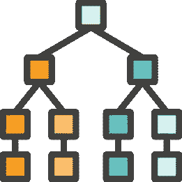
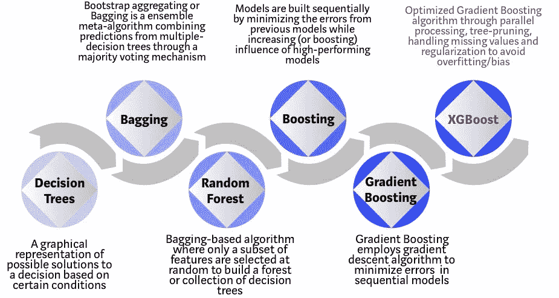
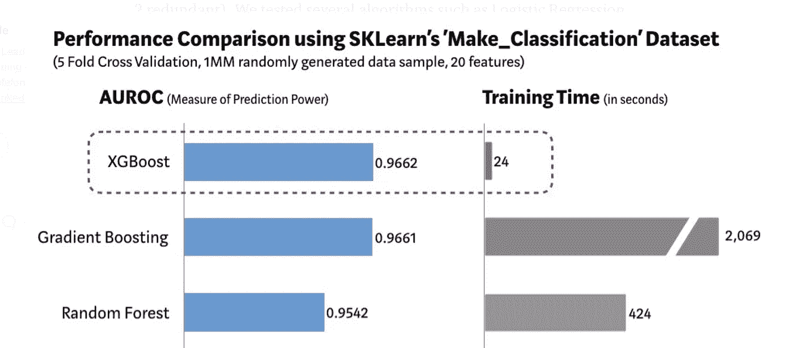

# 基于树的机器学习算法解释

> 原文：<https://medium.com/analytics-vidhya/tree-based-machine-learning-algorithms-explained-b50937d3cf8e?source=collection_archive---------3----------------------->

# 机器学习🤖

机器学习是人工智能的一个分支，其理念是模型和算法可以从数据中学习模式和信号，将信号与数据中的固有噪声区分开来，并使用学习来预测新的、未知的数据。由于模型可以快速、高效和一致地扩展和预测大量新数据，机器学习也是一种自动化技术。不管我们是否知道，我们每天都在与各种各样的机器学习算法进行交互——从网飞、Spotify、YouTube 和亚马逊上的推荐引擎；社交媒体来源于 LinkedIn、Instagram、Twitter 和脸书；Gmail 和 Outlook 上的垃圾邮件分类器；到谷歌等搜索引擎。我会尽量用非技术英语解释看似复杂但很流行的机器学习算法，没有任何复杂的数学方程或吓人的代码。

# 机器学习的三种口味

M 机器学习算法有三种口味:**监督学习、非监督学习和强化学习**。

在监督机器学习中，数据被标记以告诉机器它应该寻找什么模式。示例包括以贷款违约(是或否)为目标/标签的银行贷款数据集构建的模型，或以糖尿病阳性(是或否)为目标变量的医院患者健康数据集构建的模型。在无监督的机器学习中，数据没有被标记，因此机器不知道要寻找什么模式，但它仍然可以找到一些模式。网络安全是无人监管的人工智能可以应用的一个领域。强化学习是一种通过试错来学习的算法。它有一个目标，它尝试了很多不同的事情，奖励或惩罚取决于它的行为是帮助还是阻碍它达到目标。

在本文中，我们将简要了解基于**三棵树**的监督机器学习算法和我个人的最爱——**决策树、随机森林和 XGBoost。**

# 决策图表🌲

我们大多数人在生活中的某个时候都会看决策树。看起来像下图中的东西。决策树有节点和分支。假设我们有一个来自一家著名银行的贷款数据集，该数据集具有关于提出贷款申请的人以及他/她的贷款是否被批准的属性，这是目标或标签。因此，顶层节点的算法从应用程序中选择一个特征，该特征将数据集一分为二，并提供最大的“**信息增益”**，假设它选择此人是否拥有或出租他居住的房子。然后在接下来的两个节点，算法从应用程序中选择另一个提供最大信息增益的特征，假设它选择这个人的年收入是超过 8 万美元还是低于 8 万美元。因此，随着树越长越深，算法会不断从数据集中挑选特征，并不断学习。

决策树。由[贝克里斯](https://www.flaticon.com/authors/becris)从[平面图标](https://www.flaticon.com/)制作的图标

现在，这里的主要问题是，随着树的不断增长，算法的复杂性也在增加，因此它不仅从信号中学习，还从数据集中学习噪声。这个问题就是机器学习中经典的“**过拟合**”问题。过度拟合数据的模型将具有极高的准确性，但不会很好地概括，并且当暴露于新的和看不见的数据集时，将提供较差的预测，因为除了信号之外，它还从噪声中学习。因此，这个问题的解决方案被称为“**树修剪**”，我们可以限制决策树的最大深度，也可以限制树中叶子节点的数量。根据经验，任何最大深度超过 4 层的决策树都会过度拟合，并产生无意义的输出。在大多数真实场景中，我们使用 CART(分类和回归树),它与决策树略有不同，决策树中的每个叶节点都有一个分数，而不仅仅是一个是/否类型的决策。

## **决策树的优点:**

1.  易于理解并向非技术风险承担者解释。
2.  如果在“**产品数据科学”**中使用，则易于实现和部署到产品中，因为它只是一组嵌套的 if-then-else 语句。当策略是交付而不是准确性时，它可能是首选的算法。
3.  可以处理连续和分类特征/变量，与回归模型不同，回归模型不能对分类变量建模，除非一次性编码(转换为 1/0 虚拟变量)。
4.  数据集不需要使用数据标准化等方法进行预处理，可以按原样使用。
5.  不需要任何处理就可以处理带有缺失值的数据集，这与回归不同，回归需要使用某种技术移除、填充或估算缺失值。
6.  不需要散点图中特征和标记/目标之间的线性关系，并且可以完美地处理非线性关系。

## **决策树的缺点:**

1.  很容易造成过度拟合。
2.  通常，精度较差，需要进行组合以提高精度。
3.  添加或删除功能可能会彻底改变整个树结构和算法。

# 随机森林🌲🌲🌲🌲

T 决策树中过度拟合问题的解决方案是“**集合”**，这基本上意味着将许多弱树放在一个强林中，从每棵树中获得预测，并投票决定获胜的预测。因此，在我们的示例中，如果我们在随机森林中构建 1000 棵树的集合，并且“700”棵树产生“是”作为贷款批准的预测，而“300”棵树产生“否”作为预测，则属于“是”的民主多数投票成为算法的输出。听起来很简单，对吧？这就是随机森林算法背后的概念。

随机森林

它基于群体比个人更明智的原则，即使森林中的一些弱树/学习者产生无意义的预测，森林中的其他树也会纠正这个错误，因此整个森林/模型会朝着更准确的预测前进。这种拥有许多平行的**不相关的**树/估值器的方法也被称为“**打包**”。要求树是不相关的和多样的(彼此之间)。如果我们集成相似的相关树，那么输出将仅与来自单个决策树的输出一样好。为此，随机森林算法将采用替换的数据集样本，这里要强调的要点是，这些样本不是子集，它们与训练数据集具有相同的样本大小，但它们是替换的样本。

另一种使树/学习者彼此多样化的方法是使用“**特征随机性**”。在决策树中，在树的每个节点处，数据集中可用的所有要素都被考虑在要素选择中，以获得最大的信息增益，但是在随机森林中，只有要素的子集可供选择。这意味着模型进一步多样化，避免过度拟合。实际上，这可以通过调整模型中的最大要素参数来实现。

## 随机森林的优点:

1.  解决了决策树中的过拟合问题，并且与单个决策树相比，该模型在产生预测方面明显更准确。
2.  决策树的其他优势也应用于此:可以处理连续和分类特征/变量。
3.  数据集不需要使用数据归一化等方法进行预处理。
4.  可以处理带有缺失值的数据集，而不进行任何缺失值处理。
5.  不需要散点图中特征和标记/目标之间的线性关系，并且可以完美地处理非线性关系。
6.  随机森林的**最重要的优势**是所谓的**特征重要性**或可变重要性的产生。这基本上只是一个分配了**重要性**值的模型特征列表，这对于寻找具有最佳预测能力或对信息增益贡献最大或减少叶节点杂质的特征非常有用。
7.  当迭代模型时，知道特征的重要性可以特别有助于特征选择，因为大多数机器学习模型要求数据科学家/ ML 工程师选择最少的不相关变量，这些变量可以解释数据中的最大差异。

## 随机森林的缺点:

1.  与决策树不同，随机森林不容易理解和解释，当模型需要在实现之前向非技术风险承担者解释时，以及当需要遵守算法透明规则时，这可能是一个问题。
2.  将模型部署到产品中(对于**产品数据科学**)也是乏味的，尤其是如果遵循老派的部署策略，比如将模型(用 R/ Python)翻译成编写产品的语言(比如 Rails)。因此，这使得组织有必要投资 MLOps 进行部署(MLOps 相当于开发运维的 ML)。
3.  在学习时，尤其是对于大规模数据集，会对计算资源造成巨大的压力。

# XGBoost🌲 🌲🌲🌲😜

虽然随机森林的性能明显优于决策树，但是" **XGBoost"** 被认为是所有基于树的算法之母，也是进化程度最高的基于树的算法。在组织设置中，如果我们不是为产品数据科学构建模型，而是为组织内的其他接触点(如运营、营销等)构建模型，并且如果我们处理的是表格结构数据(而不是文本、图像、语音)，那么 XGBoost 几乎总是性能最好、最准确的模型。XGBoost 代表“**极端梯度增强”**树。随机森林是一种基于 **Bagging 的**算法，而 XGBoost 是一种基于 **Boosting 的**算法。

**增强**:是一个过程，其中弱决策树被串联集合以产生强学习器/估计器，并且每个后续的树试图从它的前一个树的错误中学习，并且朝着最小化那些错误的方向工作。下面是装袋和助推的深度对比。

> **装袋:**
> 
> 1.弱学习器/决策树被并行集成。
> 
> 2.学习者不会互相学习。
> 
> 3.学习者不会提升高绩效学习者的影响力。
> 
> 4.因为树是并行集合的，所以模型学习很快。
> 
> 5.用于构建新学习器的数据集是与原始数据集具有相同样本大小的样本，但有替换。
> 
> 6.在 Bagging 中，预测基于民主多数票或所有学习者输出的简单平均值。
> 
> **增压:**
> 
> 1.弱学习器/决策树被顺序集成。
> 
> 2.由于学习器是顺序构建的，所以学习器致力于最小化其前辈(以前的学习器)的错误。
> 
> 3.学习者提升高绩效学习者的影响力，因此得名:提升。
> 
> 4.由于树是按顺序集合的，它们学习起来很慢。但在统计学中，学习速度慢的模型表现更好。
> 
> 5.用于构建新学习器的数据集也是与替换的原始数据集具有相同样本大小的样本，但是因为学习器是顺序集合的，所以每个数据点被加权，并且在每次学习结束时，权重被重新分配。因此，如果数据被错误分类(错误)，那么权重会增加以表明它们的难度，随后的学习者会在学习过程中强调它们。
> 
> 6.在 Boosting 中，输出是使用第二组权重(不是第 5 点中讨论的那个)集合的所有学习者的加权平均值。与其他弱学习者相比，一些表现好的学习者将具有更高的权重。

基于树的算法的发展。从决策树到 XGBoost。信息图来源于 [Vishal Morde](/@vishalmorde) 。

**梯度提升:**在梯度提升中，当集合弱学习者时，我们还使用了一种“**梯度下降算法”**来优化或最小化损失函数。在这个例子中，我们预测贷款是否被批准，这是一个**分类**问题，因此可以使用“**对数损失”**(对数损失通过惩罚错误的分类来量化分类器的准确性，并且是在大多数 Kaggle 分类竞赛中用于创建排行榜的指标)。例如，在**回归**问题的情况下，如果我们预测批准/支付的贷款金额，那么我们使用**平方误差**(预测值和实际值之差的平方)。

XGBoost 结合了增强、梯度增强等优势，可产生令人难以置信的精度和性能，这也是它被称为**极限**梯度增强的原因。因此，运行机器学习工作负载的一个关键限制是计算资源的紧张。随机森林和梯度提升算法**极度消耗资源，在学习大规模数据集时会严重消耗硬件基础设施**，并可能导致基础设施频繁崩溃，学习时间也会延长。XGBoost 成功地解决了这个问题，并一再成为计算效率最高的机器学习算法(甚至优于回归算法的基准集)。下面是 Random Forest、GBM 和 XGBoost 在通过 Scikit-Learn 的 make_classification 数据集生成的数据集进行学习时在准确性/预测能力和对计算资源的压力方面的比较，该数据集具有 100 万行和 20 个特征。

随机森林、梯度增强树和 XGBoost 之间的性能比较。来源于 [Vishal Morde](/@vishalmorde) 。

## XGBoost 的优点:

1.  使用一个更正则化的学习器，我们将在另一篇文章中了解更多关于正则化的内容，但是正则化是解决模型过度拟合的灵丹妙药，因此与其他 ML 算法相比，模型精度和性能往往是最优越的。
2.  具有内置的交叉验证，交叉验证还可以防止模型过度拟合。
3.  通过提高计算效率的并行化来实现序列化组装。
4.  数据集不需要使用数据归一化等方法进行预处理。
5.  不需要散点图中特征和标记/目标之间的线性关系，并且可以完美地处理非线性关系。
6.  可以处理大量缺失的稀疏数据集，因此不需要缺失值处理。

## XGBoost 的缺点:

1.  像 Random Forest 一样，XGBoost 不容易理解和解释，当模型需要在实现之前向非技术风险承担者解释时，以及当需要遵守算法透明性规则时，这可能是一个问题。
2.  将模型部署到产品中(对于**产品数据科学**)也是乏味的，尤其是如果遵循老派的部署策略，比如将模型(用 R/ Python)翻译成编写产品的语言(比如 Rails)。因此，这使得组织有必要投资 MLOps 进行部署。

## 为什么不总是使用 XGBoost，为什么还要担心其他算法呢？😈

X GBoost 是性能最好的算法，但其准确性高度依赖于数据科学家或 ML 工程师调整其超参数的能力，如学习速率(学习越慢，性能越好)、树/学习者的最大深度等。在产品数据科学中，除非组织投资像 MLOps 这样的前瞻性模型部署管道，否则与决策树和逻辑回归等其他轻量级算法相比，将 XGBoost 算法部署到产品中会成为一个严重的问题。在许多业务需求中，算法透明性和可解释性是关键需求。例如，如果一个基于 ML 的金融投资顾问建议我基于机器学习算法做出投资决策，我很想清楚地知道这个算法是基于什么做出这个决策的。因此，在这些情况下，很难向最终用户和利益相关者解释 XGBoost 算法。因此，在为项目选择正确的算法时，有许多因素需要考虑，尤其是当模型部署提上日程时。

## 结论

> 机器学习与其说是科学，不如说是一门艺术！！