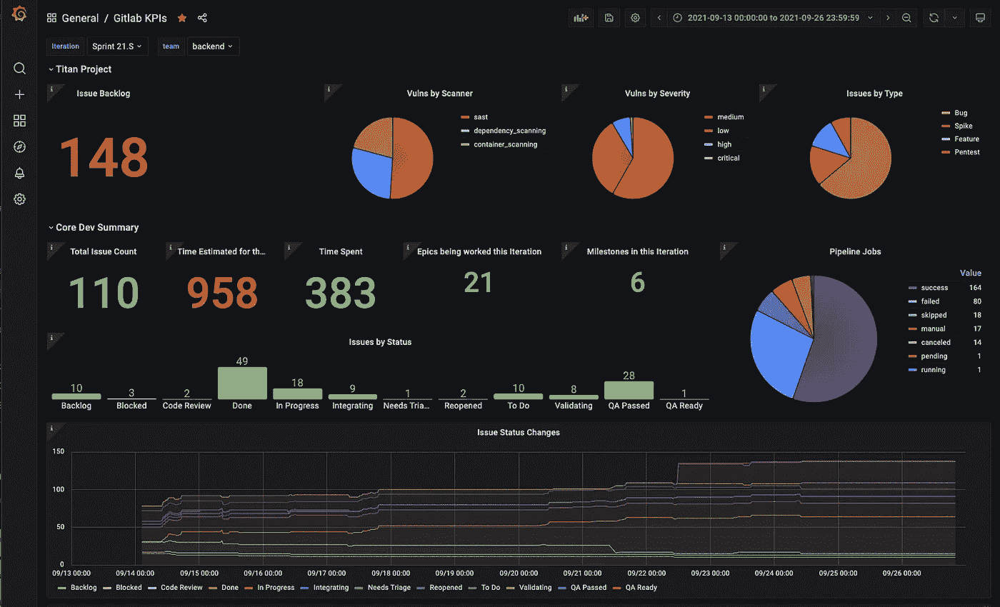

# Prometheus 中的趋势 GitLab 数据

> 原文：<https://medium.com/analytics-vidhya/trending-gitlab-iteration-data-in-prometheus-4ca78749e6b0?source=collection_archive---------5----------------------->

Grafana 的 Gitlab 数据

在工作中，我们在今年早些时候切换到 GitLab，通过它，我们不得不从一些不同的工具和流程中迁移出来，并试图尽可能地集中在 GitLab 上。我写了一些我做的事情，让我们从[迁移进来，从吉拉](/analytics-vidhya/migrating-issues-from-jira-to-gitlab-e9520bd2e53d)带来问题，从 Aha 带来[史诗，以及我们使用](/analytics-vidhya/moving-epics-and-features-from-aha-to-gitlab-b58e29b87906) [GitLab 分类机器人](/analytics-vidhya/gitlab-triage-bot-ba8afca4440a)