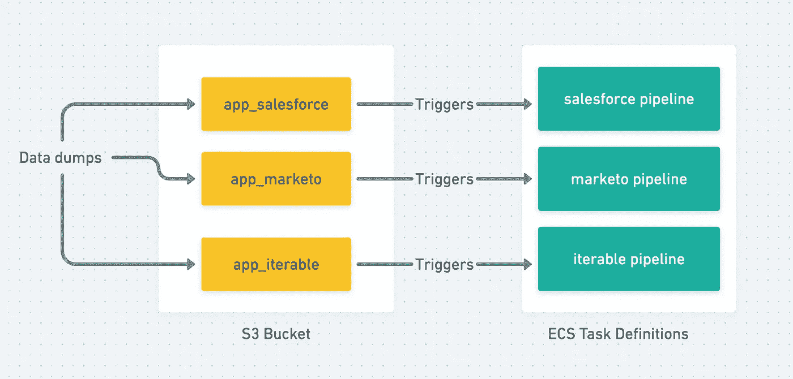
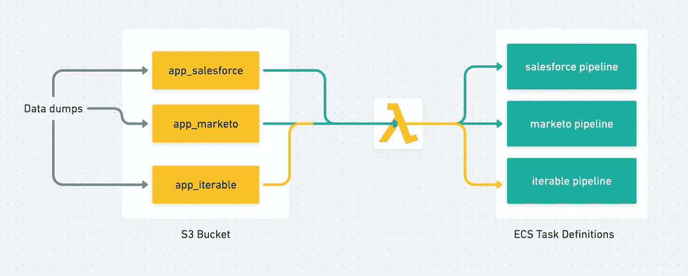
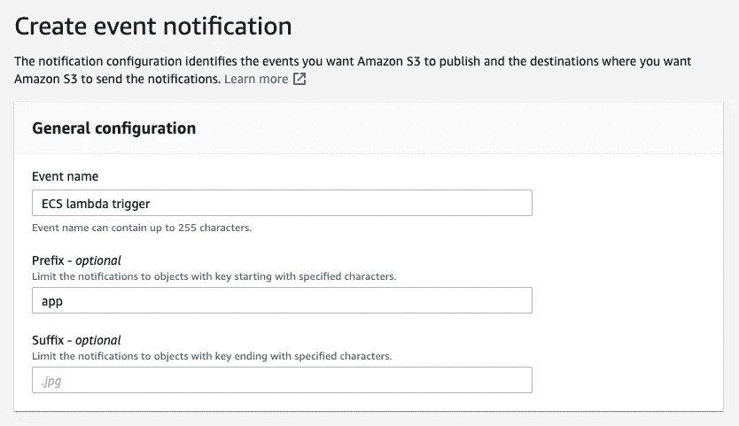
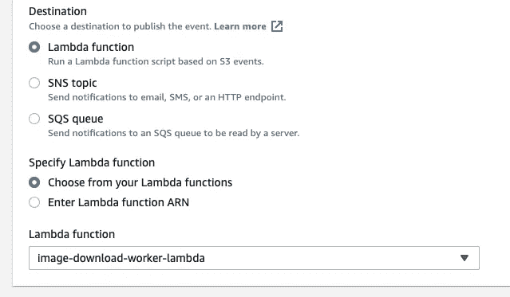

# 使用 S3 有效负载触发“特定”ECS 任务

> 原文：<https://medium.com/analytics-vidhya/trigger-specific-ecs-tasks-with-s3-payloads-79c9ce6aa57d?source=collection_archive---------1----------------------->

并将有效负载注入触发的任务

随着 AWS Fargate 的推出，ECS(弹性容器服务)成为那些想要管理容器编排，但没有必要或专业知识来转换到 Kubernetes 的组织的更有利可图的产品。

作为无服务器函数调用之王，AWS Lambda 有一个主要的瓶颈，那就是它在一次调用中最多只能运行 15 分钟。我们可以选择[设计模式](https://lumigo.io/learn/aws-lambda-timeout-best-practices/)来克服这个问题，但是对于长时间的事件驱动工作流，Fargate 上的 ECS 提供了一个很好的替代方案，没有时间限制的约束。

让我们看一下问题陈述，以便更加清楚:

触发相应 ECS 任务的 S3 数据转储

在 S3 存储桶中有多个转储数据的流程，每个流程的数据都需要单独的工作流来处理/转换。在我们的例子中，每种类型的转换都由一个单独的 ECS 任务处理。

作为设计模式的考虑，如果我们要处理`salesforce`数据，我们的 ECS 任务命名为`salesforce pipeline`。进程转储数据应该转储到 S3 前缀`app_salesforce`下。这将任务名称嵌入到 S3 键中，有助于从本质上将数据映射到其管道。

现在，让我们考虑一下，S3 已经被设置为当特定前缀上的数据转储发生时发出事件(如何做同样的事情在下面讨论)。将这些多个事件映射到它们正确的任务的桥(下面的实现)是一个 lambda 函数，它由事件触发并运行正确的 ECS 任务。

*   S3 事件通知→λ→ECS 任务触发器

Lambda 用作指导正确任务调用的中介

> 注意:本文假设 ECS 任务存在并且设置正确。
> 我们不会深入探讨如何创建 lambda 函数或 S3 桶，因为可以在相同的上找到多个引用，此解决方案将处理这些组件之间的集成。

# 1.设置 Lambda

我们从 lambda 设置开始，因为给定一个模拟负载，很容易测试它是否能够触发正确的 ECS 任务。

lambda 是用 python 编写的，它从 s3 键中提取文件夹名，并为它调用相应的 ECS 任务。关于 API 调用的细节，附上核心逻辑代码供参考。

> **run_task 函数调用**中的 **containerOverrides** 段是解决方案的关键。

然后可以使用模拟 S3 有效负载来测试这个 lambda，以验证它是否可以正确地触发 ECS 任务，同时将有效负载注入到环境变量中。

# 2.设置 S3 来触发拉姆达

为 lambda 添加触发器

1.  转到存储桶→属性选项卡→创建事件通知
2.  添加事件名称并保留前缀“**app”**

在 S3 创建活动

3.事件类型:**所有对象创建事件**

4.添加我们在上面创建的 Lambda 函数。保持您设置的名称。

添加 lambda 函数

# 3.将这一切结合在一起

现在，当数据被任何来源转储到 S3 时，我们可以检查相应的任务是否已经执行，并验证 S3 桶和密钥是否作为要使用的环境变量被注入。

最后，我想告诉您，还有另一种方法可以使用 Cloudtrail + EventBridge 规则实现上述功能，我很乐意在评论中讨论这方面的可伸缩性问题。

希望您喜欢阅读这篇文章，如果您喜欢更深入地研究其他 AWS 细微差别和架构讨论，请告诉我。