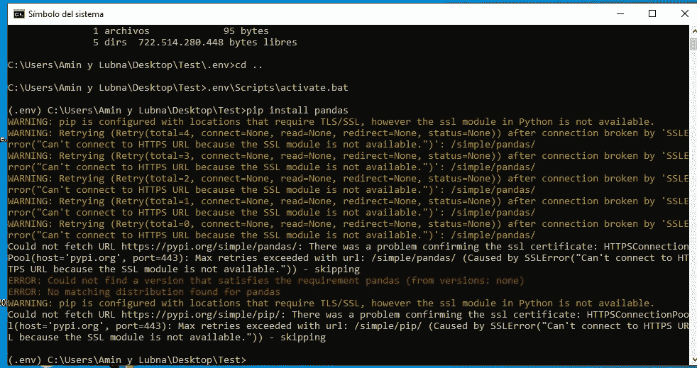
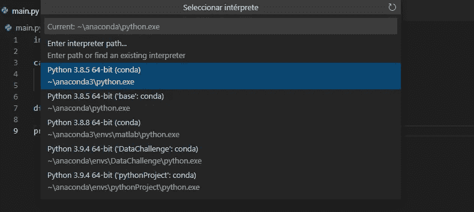

# 使用 Windows 10 和 VSCode 对虚拟环境设置进行故障排除

> 原文：<https://medium.com/analytics-vidhya/troubleshooting-virtual-environment-setup-with-windows-10-and-vscode-fdd99fdf4d66?source=collection_archive---------7----------------------->

最近我的主电脑(Linux)坏了。所以，与此同时，我使用了我另一台安装了 VSCode 的电脑(Windows 10)。老实说，我在 Windows 中使用 VSCode 在虚拟环境中构建应用程序时遇到了困难。


亚历克斯·丘马克在 [Unsplash](https://unsplash.com/) 上的照片

# **什么是虚拟环境？**

可能你们大多数人已经知道什么是虚拟环境，但是对于那些不知道的人来说。下面是一个快速且有希望清晰的解释。python 虚拟环境是一个隔离的环境，其中您使用与其余应用程序隔离的解释器、库和脚本。

想更深入的可以查看这篇[帖](https://towardsdatascience.com/why-you-should-use-a-virtual-environment-for-every-python-project-c17dab3b0fd0)。

# 让我们把手弄脏吧！！

在 Windows 10 中创建虚拟环境与 Linux 发行版略有不同。

首先，我将创建一个测试文件夹，我将在其中构建我的虚拟环境。

```
C:\Users\Amin\Desktop>mkdir Test && cd Test
```

现在，我们建立虚拟环境。

```
C:\Users\Amin\Desktop\Test>python -m venv .env
```

如果您输入。您应该会看到类似这样的内容。

```
C:\Users\Amin\Desktop\Test>cd .env
Directorio de C:\Users\Amin\Desktop\Test\.env25/06/2021  22:12    <DIR>          .
25/06/2021  22:12    <DIR>          ..
25/06/2021  22:12    <DIR>          Include
25/06/2021  22:12    <DIR>          Lib
25/06/2021  22:12                95 pyvenv.cfg
25/06/2021  22:13    <DIR>          Scripts
               1 archivos             95 bytes
               5 dirs  722.514.280.448 bytes libres
```

然后，我们必须激活虚拟环境。

```
C:\Users\Amin\Desktop\Test\.env> cd ..
C:\Users\Amin\Desktop\Test> .env\Scripts\activate.bat
```

一旦虚拟环境被激活，我们安装的所有软件包都将安装在虚拟环境中。

这里是事情开始变得混乱的地方。

当我尝试 pip 安装 pandas 时，我得到以下错误:



自己做的截图

通过谷歌导航，我找到了这两个解决方案:

1.  添加以下环境路径:

```
D:\Anaconda3 
D:\Anaconda3\Scripts
D:\Anaconda3\Library\bin
```

如果您不知道如何添加环境路径，请查看 [post](https://helpdeskgeek.com/windows-10/add-windows-path-environment-variable/) 。

2.更新 pip。

```
python -m pip install --upgrade pip
```

首先，我添加了环境路径，但它不起作用。然后我试着从 Windows cmd 更新 pip 包，也不行。

然后做了一点试验，我找到了问题的解决方案，我从 Anaconda 提示符下更新了 pip 包:

```
C:\Users\Amin\Desktop\Test>.env\Scripts\activate.bat
(.env)C:\Users\Amin\Desktop\Test>cd .env
(.env)C:\Users\Amin\Desktop\Test\.env>cd Scripts
(.env)C:\Users\Amin\Desktop\Test\.env\Scripts>python.exe -m pip install --upgrade pip
```

它修复了我的错误，之后我就可以安装熊猫了。

构建了虚拟环境并安装了我需要的所有包之后，是时候编码了。我喜欢从终端打开 VSCode，这样它会打开你正在处理的文件夹。

```
(.env) C:\Users\Amin\Desktop\Test>code . 
```

现在，您可以在项目文件夹中创建 python 文件。

有时，VSCode 会使用不同于虚拟环境中保存的 python 解释器。要获得正确的解释器，按 Ctrl+Shift+p，命令 Pallert 将打开。


自己做的截图

然后点击*“Python:Select Interpreter”*，会显示解释器列表。您必须在虚拟环境文件夹(在我们的例子中是. env)中查找包含该路由的文件。



自己做的截图

如果你找不到它(像我一样)或者你想使用位于另一个文件夹中的虚拟环境，你将不得不手动添加 python 解释器路径。

按 Ctrl+Shift+p，然后在搜索栏上输入*‘工作空间’*。


自己做的截图

点击*“打开工作区设置(JSON)”*。它将打开一个 JSON 文件，然后编写以下内容:

```
"python.defaultInterpreterPath": ".env/Scripts/python.exe"
```

编辑:以前是 *"python.pythonPath "，*，现在被替换为*" python . defaultinterpreterpath "*:

在 ***虚拟环境名称*** 中输入你分配给你的虚拟环境的名称。

现在，您已经准备好在虚拟环境中构建您的应用程序了。

# **使其可复制**

当您构建了您的应用程序后，您可以使用下面的命令来获取 requirement.txt 文件。

```
(.env) C:\Users\Amin\Desktop\Test>pip freeze > requirements.txt
```

它将保存您所有的项目依赖项，所以下次您需要重新创建您的环境时，您只需运行以下命令。

```
pip install -r requirements.txt
```

它将安装您的所有项目需求。