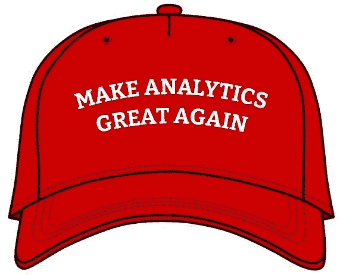
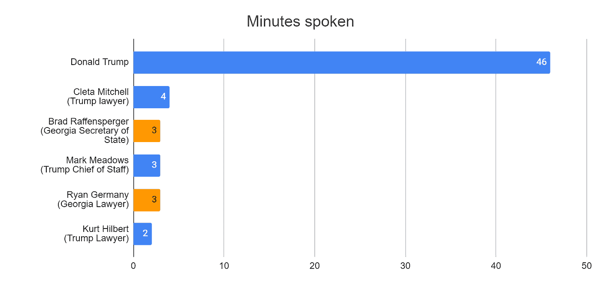
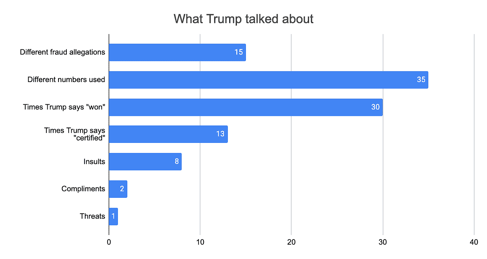
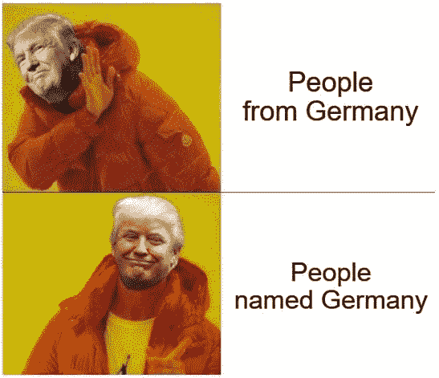

# 特朗普的说服策略

> 原文：<https://medium.com/analytics-vidhya/trumps-persuasion-tactics-7a3ec8479574?source=collection_archive---------32----------------------->

## 量化特朗普与佐治亚州选举官员的通话

来自 [trumphat.github.io](http://trumphat.github.io/)

世界上有权势的人经常因他们的说服力而受到称赞。领导一个成功的公司、活动或技术革命的关键部分是说服他人跟随你的愿景。苹果创始人史蒂夫·乔布斯让他的工程师相信不可能的事情是可能的，据说这就像一个“[现实扭曲场](https://en.wikipedia.org/wiki/Reality_distortion_field)，被视为创造苹果热门产品和软件的关键部分。现在，像埃隆·马斯克[这样的人被描述为拥有这样的技能。](https://www.ft.com/content/559ab16e-9b7e-11e8-9702-5946bae86e6d)

虽然我们可能会看到这些人的公开声明，但不幸的是，我们通常不会看到他们如何在现实生活中应用他们的现实扭曲技能。在工作会议上，别人可以挑战他们或反击他们，他们是什么样的？

然而，当现代最好的说服者之一的一个电话泄露出去时，这种情况最近发生了变化。在这部影片中，美国总统唐纳德·特朗普试图说服佐治亚州的选举官员推翻对他有利的选举结果。

不管你是爱他还是恨他，很难否认特朗普有说服的天赋。他是纽约市的亿万富翁，道德败坏，但他设法说服基督徒和美国农村工人阶级成为他最坚定的支持者。这篇文章不会对特朗普总统使用的论点是真是假做出任何判断，这纯粹是关于他如何试图说服电话中的其他人。

这个电话发生在 2021 年 1 月 2 日。时长一小时，主要是川普和佐治亚州国务卿布拉德·拉芬斯佩格之间的对话。双方的律师也出席了。这发生在选举后的两个月，这使得特朗普的任务特别困难，因为格鲁吉亚已经进行了无数次调查，没有发现任何重大问题。翻转佐治亚州的选票对于特朗普赢得总统大选的任何希望都至关重要，所以我们可以假设他正在尽最大努力。

那么，特朗普如何着手这一看似不可能的说服尝试呢？

作者创建的图表

# 如何像总统一样劝说

## 1.说了很多

你会很快注意到特朗普在他的第一轮演讲中做了多少发言，他在介绍他的论点时做了超过 12 分钟。他总共讲了 46 分钟，占整个通话的四分之三。

## 2.一些杀手，很多填充物

用许多次要的论点来充实你的好论点，以增加你的主张的份量。

特朗普在电话中提出了 15 项不同的欺诈指控[1]。然而，他只关注其中的几个(主要是一段来自州立农场竞技场计票中心的视频，据称显示了富尔顿县的选票填充和投票机问题)。如果有人向他挑战，他会迅速离开。例如，当佐治亚州官员驳回他的主张时，5000 名死者投了票。他最初请克莱塔·米切尔(他身边的一名律师)为其辩护，但不到一分钟后，当她听起来没有说服力并继续前进时，他就打断了她。

相比之下，特朗普不会轻易就 Start Farm Arena 计票中心的一段视频做出让步。据称，它显示新的选票被从桌子底下拿出来，每张都被扫描三次。当佐治亚州官员说他们最终证明选票没有扫描三次时，特朗普无视他们，并在电话的其余部分继续声称这一点。

## 3.使用大量数字

特朗普的公众形象不是数字人或注重细节，但在这次私人会议上，他广泛使用数字来支持自己的论点。

他使用了 35 个不同的数字，其中 16 个是非整数，如 18325 个空缺地址选民或 4925 个州外选民。除了欺诈指控，他还经常提到他和拜登之间的 11，779 票差距。

尽管他面前可能有这些数字，但这么多数字，我很惊讶他很少混淆。他只错报了两个数字而没有纠正自己，而且都是在最后 15 分钟内[2]。

## 4.重申，重申，重申

*   在他使用的 15 种不同的欺诈指控中，包括重复和在指控之间来回移动，他说总共有 36 次。
*   在 35 个不同的数字中，他一共说了 72 次
*   他重复说他赢得了 30 次选举

## 5.拥有完全的自信，纠正任何不自信的人

尽管特朗普将从他的一些观点继续前进，但他对每一点都充满信心和严肃。仅仅过了 26 分钟，他的律师克莱塔·米切尔(Cleta Mitchell)就表示，州立农场竞技场视频中的 18，000 张选票只是一个估计，很明显，特朗普一方的每个人都没有他那么自信。特朗普谈到她时，毫不含糊地解释说，他肯定 1.8 万这个数字，“因为我们把我们的(他的磁带副本)放大了”。

## 6.说些官方的东西

川普的数字不是普通的数字，而是来自*注册会计师和律师的*认证数字。尽管在电话中说了 13 次“认证”,但他从未解释过这是什么意思。**

## *7.侮辱对手*

*我不认为这是最明智的说服策略，但我有什么资格去评判呢？特朗普在第 27 分钟开始辱骂，不带任何讽刺，他称佐治亚州国务卿为孩子。*

> *我的意思是，你看，你必须是一个孩子才能想到其他的事情。只是个孩子。*

*他接着又对佐治亚州的官员进行了 7 次侮辱。*

## *8.如果侮辱不起作用，试试赞美*

*44 分钟后，在侮辱了佐治亚州律师瑞安·德(“你为什么不想找这个，瑞安？你怎么了？”).特朗普试图通过称赞他来修复关系。特朗普可能需要更多的赞美别人的练习，因为这听起来像是来自一个出错的机器学习算法。*

> *我确信你是一个好律师。你的姓很好听。*

**

*特朗普通常不和德国人相处，但是一个叫德国的家伙？这可能行得通*

*不久之后，他又补充了一句，至少听起来像是人类想出来的..*

> *我听 Ryan 说他可能是，我肯定是个很棒的律师。*

## *9.放下偶尔的威胁*

*他多次把事情描述成犯罪，但通常是用间接的语言。这有点主观，但有一次，35 分钟后，我觉得他说的是一种彻底的威胁。虽然他声称富尔顿县的选票被粉碎以掩盖欺诈行为，但他告诉佐治亚州国务卿和他的律师，如果事情没有得到解决，他们就是犯罪的同谋。*

> *…对你来说比对他们来说更不合法，因为你知道他们做了什么，而你却没有举报。那是罪犯，那是刑事犯罪。你不能让这种事发生。这对你和你的律师 Ryan 来说都是很大的风险。*

*这就是你想要的，像美国总统一样说服别人的 9 个简单步骤。特朗普在这次通话中实际上没有如愿。也许我们会在未来的另一次泄漏中得到治疗，他是成功的，如果他做了任何不同的事情，我们可以进行比较。*

# *脚注*

## *[1]特朗普的欺诈指控*

1.  *他的集会规模比拜登大，所以肯定也获得了更多的选票*
2.  *250-300，000 张选票投入了投票站*
3.  *富尔顿县“几十万”伪造签名*
4.  *“成千上万”的选民出现了，但由于已经投票而被禁止投票*
5.  *4 502 名选民不在选民登记册上*
6.  *18，325 名空缺地址选民*
7.  *只有邮政信箱号码的 904 名选民*
8.  *州立农场竞技场的视频显示，从一张桌子下面拿出 18，000 张选票，每张被扫描 3 次*
9.  *4925 名州外选民*
10.  *向空缺地址发送了 2，326 张选票*
11.  *投递箱被取走，但直到 3 天后才被放下。照片和宣誓书作为证据。*
12.  *根据在州议会、国会和参议院选举中的成功来判断其他有经验的政治家。“许多政界人士说他们不可能打败我”。*
13.  *将近 5000 名死者投票*
14.  *富尔顿县设备和选票篡改。焚烧/粉碎 3000 磅选票，拆除/更换投票机设备*
15.  *来了一批军方选票，完全是为了拜登，这是不可能的，因为特朗普有强大的军方支持*

## *[2]错误陈述的数字*

*特朗普在电话中两次说错了号码*

1.  *将投票差额从 11，779 票改为 17，779 票*
2.  *声称他需要少于 2000 张选票才能获胜。可能意味着不到 2 万。*

## *[3]特朗普的侮辱*

*针对佐治亚州国务卿布拉德·拉芬斯佩格:*

1.  *我的意思是，你看，你必须是一个孩子才能想到其他的事情。只是个孩子。*
2.  *他们(斯泰西·艾布拉姆斯和富尔顿县)到处玩弄你，在背后嘲笑你，布拉德*
3.  *你已经拿下了一个共和党的州，你让一个共和党人几乎不可能赢得选举，因为作弊。*
4.  *但是你可以进行一场假选举？你可以有一个虚假的选举，对不对？*
5.  *斯泰西·艾布拉姆斯在嘲笑你。她到处说这些家伙比石头还笨。*
6.  *你会看到人们不去投票。他们不想投票。他们恨这个国家，他们恨州长，他们恨国务卿。*
7.  *唯一喜欢你的人是永远不会投你票的人。你认识那个布拉德，对吧？*

*针对格鲁吉亚方面的律师瑞安·德:*

1.  *你为什么不想找到这个，Ryan？你怎么了？*

## *[4]数据来源*

*   *完整的音频和文字记录可从[华盛顿邮报](https://www.washingtonpost.com/video/politics/audio-trumps-full-jan-2-call-with-ga-secretary-of-state/2021/01/03/3f9426f4-7937-4718-8a8e-9d6052001991_video.html)获得*
*   *在 Github [这里](https://github.com/MarkMacArdle/trump_georgia_phone_call)可以找到这篇文章中用来制作图表和统计数据的通话分析数据。*