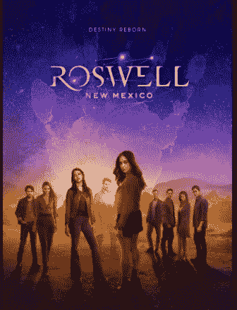

# 尝试新事物！！！

> 原文：<https://medium.com/analytics-vidhya/trying-something-new-bfd704c58bb8?source=collection_archive---------15----------------------->

DogeCoin 的随机图片

在 2021 年 5 月 10 日**，**我想做一些不同的事情。我不确定它会成功还是会彻底失败

我的意图是写一篇每日博客，记录我一整天都做了些什么。除此之外，我会添加一些我觉得有趣的东西，比如一部电影或一段内容，或者可能是我在浏览互联网时发现的一个网站。

> W **我今天做了什么？**

1.  学习了 ***深度学习基础*** 与实现使用 ***Keras***
2.  Tableau 教程
3.  GRE 的准备
4.  我会在文章的结尾或中间或中间的某个地方透露一些东西:)

> **使用 Keras 的深度学习基础**

我的目标是在年底前在简历中增加更多技能。在专业上，我是一名数据科学家，所以提升我简历的东西是与数据处理或人工智能相关的新工具和库。

在最近的三个月里，我研究了深度学习，但没有用 Keras 实现任何东西，所以我觉得是时候复习深度学习主题并使用 Keras 实现它们了。

所以我用 Keras 实现了一个简单的人工神经网络

我笔记本上的图片

> （舞台上由人扮的）静态画面

作为一名寻求关注者，我看到很多人在 Linkedin 上上传仪表盘，获得了很多浏览量。所以我开始学习 Tableau，这样我就可以构建多个仪表盘。

学习了导入源、地块类型、创建措施和其他基本内容。

看起来很糟糕，但是我会在六月底创作出一些杰作

> GRE 准备

我想获得数据科学硕士学位，追寻我学习 XAI(可解释人工智能)的热情。我通过多次录取获得了录取，但没有获得 100%的奖学金。因为这个，我在准备 GRE

我今天学到的一些单词的列表

1.  汞合金(多种物质的混合物)
2.  焦躁不安

> 观看罗斯威尔新墨西哥州第一季第一集第二集

这部剧发生在一个叫罗斯威尔的小镇，在那里一些外星人躲藏在人类中间。一般的表演，但很适合放松。

罗斯韦尔封面照片

反馈和意见会帮助我改进我的日常博客，掌声会让我开心。

**谢谢，登出**