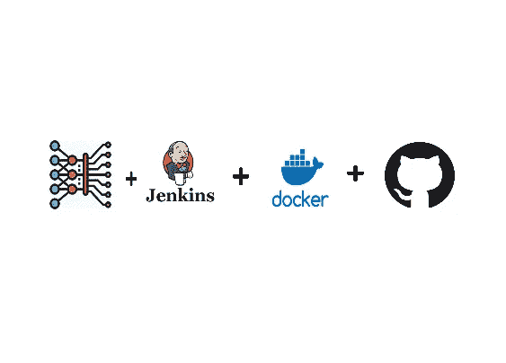
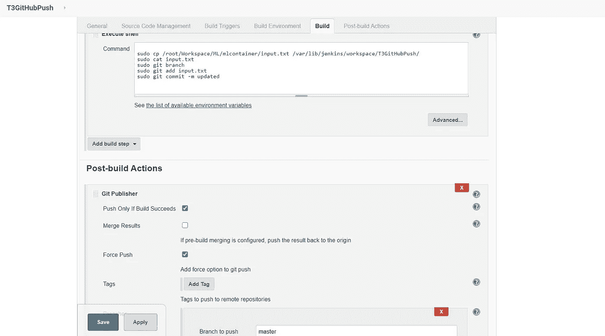

# 调整超参数，从而自动化深度学习模型

> 原文：<https://medium.com/analytics-vidhya/tuning-the-hyperparameter-thus-automating-deep-learning-model-a15e55ff5563?source=collection_archive---------5----------------------->

ML 模型训练 ML 模型…听起来很酷..？

# **简介**

这是一个每个计算机专业学生都期待成为数据科学家的时代。他们的工作主要是利用数据进行预测。但是有许多需要手动完成的事情，比如超参数调整。那么为什么不直接自动化呢？

这个博客包含使用 python 和 devops idea 的超参数调优的自动化。

## 什么是超参数？

*超参数是决定网络结构的变量(例如:隐藏单元的数量)和决定网络如何训练的变量(例如:内核大小)。在训练之前(在优化权重和偏差之前)设置超参数。*

现在，既然我们意识到了博客的主要目标，让我们继续。

在这里，博客分为 5 个独立的工作，将为我们做的工作，所以让我们开始吧。

**工作 1:从 GitHub 仓库获取数据。**

每当开发人员将任何代码推送到 GitHub 存储库时，在 Jenkins 上安装的 GitHub 插件的帮助下，我们将能够监控存储库中的更改，因此，如果发现任何更改，我们将代码从远程复制到我们的本地目录。使用的技术是轮询 SCM，它每分钟都在监控远程存储库。

**工作 2:检查模型的类型并启动合适的容器。**

使用 python 脚本，我们将检查要训练的模型类型，并相应地启动满足要求的容器。一旦容器启动，模型将被训练，我们预测它的准确性。模型预测的精度将保存在名为 realrecords.csv 的 CSV 文件中，所有超参数最初由 input.txt 文件提供。

**工作 3:检查准确性——预测新的输入参数。**

名为 CheckAccuracy.py 的 python 脚本检查最后一个训练模型的准确性，如果达到了预期的准确性，则模型运行名为 SuccessEmail.py 的 python 脚本，并将成功邮件发送给客户端。如果没有达到所需的精度，则使用 Predict_Model_Test.py 启动一个容器。在运行该容器时，将加载我之前在数据集上创建的预训练模型(由我生成),并准确预测新的超参数，这些值将存储在名为 labtest.csv 的 CSV 文件中。当精度高于深度学习模型给出的精度时，我们将这些参数作为原始模型的输入。

**工作 4:改变输入参数。**

python 脚本从 labtest.csv 文件中读取最后一行，即新的超参数，从而更改 input.txt 文件的内容。

**工作五:推送输入文件。**

当上述所有作业都成功构建后，input.txt 文件将被推送到远程存储库。

一旦 Jenkins 在 GitHub repo 中检测到某个文件的更改，它会再次将文件复制到本地 repo，并循环重复作业 1 中的所有过程，直到达到所需的精度。当在 input.txt 文件中没有观察到变化时，循环将中断。

所以，基本上一个 ML 模型被用来训练另一个 ML 模型。

感谢你们阅读这篇文章。

以上代码的 GitHub 链接:[https://github.com/a19singh/MlopsTrain](https://github.com/a19singh/MlopsTrain)