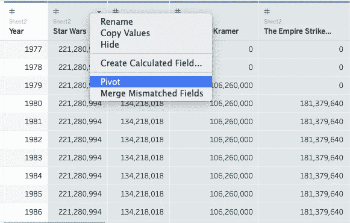
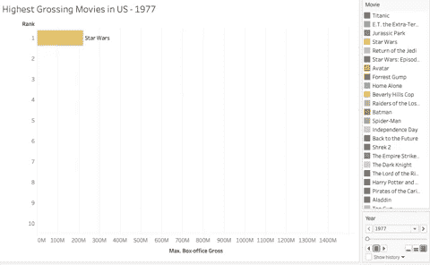
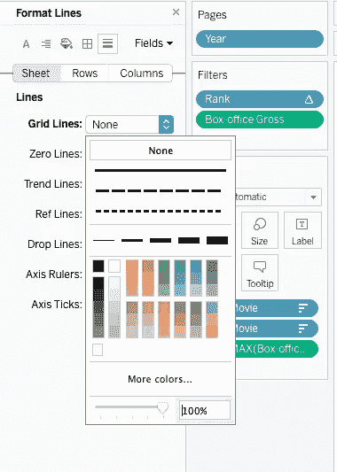

# 使用 Google Sheets 和 Tableau 将一个简单的数据集变成一个动画条形图(无需代码)

> 原文：<https://medium.com/analytics-vidhya/turn-a-simple-dataset-into-an-animated-bar-chart-using-google-sheets-and-tableau-without-code-d28907638267?source=collection_archive---------6----------------------->

大家好！

在这篇文章中，我将指导你如何使用 Google Sheets 来制作一个动画条形图或“条形图比赛”,以存储和操作数据和 Tableau，还可以做一些简单的数据操作和数据的实际绘图和动画，不需要任何代码。

动画条形图或“条形图竞赛”是表示随时间变化的数据的一种引人入胜的方式，特别是当值随着时间的推移而趋于超过另一个值时。

动画条形图或条形图竞赛在社交媒体中变得非常流行，因为它们以有趣的方式显示数据。

# **数据(谷歌工作表)**

要创建一个动画条形图，我们需要做的第一件事是确保我们的数据具有适合 Tableau 的格式(或形状),以便按照我们需要的方式绘制图表。

具体来说，我们需要长格式的数据，这意味着该表只包含允许标识每个主题(或条形)、时间段和要绘制的变量值的列。还需要注意的是，我们需要的东西看起来像这样:

用于构建最快汽车记录动画条形图的数据

不幸的是，大多数数据通常要么是宽格式(每个主题一列，每个值)，要么是整齐格式(每个指标一列，每个观察一行)。

整齐格式的数据(摘自维基百科上美国年度票房最高的电影列表)

现在，我将快速描述将如上所示的格式整齐的数据表转换为包含 0 的长数据的过程。为此，我将使用维基百科上的[美国年度票房最高电影列表](https://en.wikipedia.org/wiki/List_of_highest-grossing_films_in_the_United_States_by_year)中的数据表。

首先，你需要将原始数据放入一个 Google Sheet，通常是复制和粘贴原始表格。

接下来，你要选择你的“主题”的所有列，在这种情况下，电影列(B:B)和粘贴它在一个转置的方式消除了重复。

您可以通过选择整个列(最好是原始列的副本)并单击菜单功能区上的数据，然后选择删除重复项来消除重复项。

要以转置方式粘贴，您需要选择一列值，复制它，右键单击空白单元格，然后选择选择性粘贴->转置粘贴

完成此操作后，您应该会得到一个如下所示的表格:

在第一个新列下面编写一个=sumif 公式，该公式返回该行对应年份中该电影的值。在我的例子中，D2 单元格的公式是这样的:=sumif($B2 特区$1，$C2)。因为我在公式中锁定了一些行和列，所以我可以将它复制到我新创建的列中的所有行。

在进入 Tableau 之前，我们需要做的最后一件事是填写每部电影在电影上映后的价值。我的做法是从单元格 A47 开始复制表格，并创建一个=SUM 函数，该函数将整个电影列的总和计算到该行中相应的年份。在我的例子中，公式看起来像这样=sum(D$2:D2 ),但是任何达到预期结果的方法都可以。所需的最终表如下所示(每部电影和年份的值，即使是 0，表示电影上映前的年份)以及每部电影上映后所有年份的常数值。请随意移除

# **最后一次数据接触(Tableau)**

在一个新的 tableau 工作簿上连接到您的 Google Sheets 连接器，这将在您的浏览器中打开一个窗口或标签，要求您进行身份验证，完成后返回 Tableau。

选择要连接到 tableau 的 Google Sheets 文件，然后单击 connect。

一旦 Tableau 中有了数据，在 Data Source 选项卡上，您可以隐藏原始的 movie 和 gross 列(或者在连接到文件之前直接从 Google Sheets 中删除它，由您决定)。

接下来，选择您在 Google Sheets 中创建的所有列，右键单击其中任何一列并选择 Pivot

你应该以这样的表格结束。您可以随意将“Pivot 字段名称”和“Pivot 字段值”列重命名为您喜欢的任何名称，在我的例子中，我将使用“电影”和“票房总额”

# **可视化**

首先，用公式 RANK _ UNIQUE(MAX([票房总收入]))创建一个计算字段，这将允许动画栏总是被排序并相互“比赛”。

接下来，将这个新的等级度量用于 rows 字段，将电影维度用于 Label 和 Color 字段

然后右键单击 Rows 字段上的 Rank pill，选择 Discrete，再次右键单击并选择 Compute using -> Movie

接下来，将票房总收入拖到列字段，并确保它选择了最大聚集方法

在完成前面的所有步骤后，您应该有一个这样的图表。

将“年”维度拖到“页”字段，并将“等级”药丸从“行”字段拖到“过滤器”字段，同时按住 cmd (mac)或 ctrl (windows)。以便也将它保存在行字段中。当过滤器对话框显示时，选择数字 1 到 10，以便在任何给定时刻只显示前 10 部电影。

接下来，进入格式->动画

在动画面板上，将工作簿默认设置为“开”，持续时间设置为“1.00 秒(慢)”

将 MAX(票房总收入)药丸拖到“过滤器”栏(按住 ctrl 或 cmd，以便拷贝它，而不要从“栏”栏中移除它。在过滤器对话框中选择“所有值”，使过滤器在“至少”模式下工作，并在滑块上方的框中输入 1。这将防止尚未发布的电影在可视化中显示。

当您将 Year 维度拖到 Pages 字段时，一个新的面板应该出现在动画的右侧，可能在标识每部电影颜色的面板的下方或上方。使用此面板，您可以控制动画的流动(或“页面”的翻转)。选择堆叠了三条粗线的按钮，这样动画会以最快的速度播放，当你准备好了，点击方块/停止按钮旁边的右箭头按钮。

如果上述所有步骤都正确完成，您应该已经能够看到如下内容:

最后，对于一些美学调整，您可以:

1.  把票房总值加到每部电影的标签上

2.用较短的格式将票房总值度量格式化为货币

3.隐藏行和列字段中度量的轴和标题

4.从图表中删除网格线

5.更改工作表的标题

6.添加一条参考线(按窗格级别),该参考线会自动移动以标记最高的条

7.创建一个区域标注，这样年份(或任何其他您想要的值)也可以在可视化中动态显示。

瞧，在遵循所有这些指示之后，你应该有这样的视觉化。

我希望这篇文章能帮助你提高你的可视化水平，并让你学会如何创建一个动画条形图或“条形图竞赛”。如果你有任何问题，请随时评论或发邮件给我，我会尽快回复你。

祝你新年愉快！